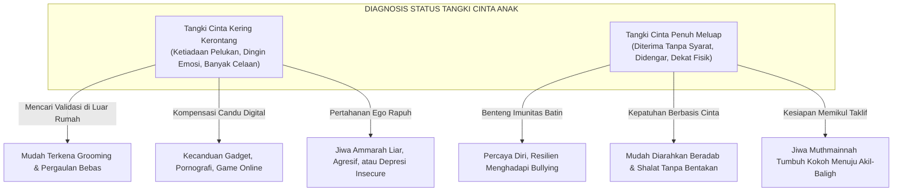

# Tangki Cinta: Prasyarat Emosional Penanaman Karakter Nabawiyah

Dalam psikologi pengasuhan Pendidikan Karakter Nabawiyah (PKN), **Tangki Cinta** (*Emotional Love Tank*) adalah metafora wadah batin penampung rasa aman, kasih sayang, dan penghargaan tanpa syarat yang mutlak dibutuhkan oleh setiap anak untuk tumbuh secara sehat. Sebagaimana kendaraan bermotor tidak akan pernah bisa melaju tanpa bahan bakar, demikian pula jiwa seorang anak tidak akan pernah mampu menapaki jalan taklif syariat, mematuhi adab, dan mengasah bakatnya jika tangki emosionalnya berada dalam kondisi kosong (*empty tank*).

Rasulullah ﷺ adalah figur pendidik agung yang senantiasa memastikan tangki cinta para sahabat ciliknya terisi penuh meluap. Beliau memeluk, mencium, memangku, membonceng, mendengarkan curahan hati, hingga bermain kuda-kudaan bersama anak-anak. PKN meletakkan kaidah fundamental: **"Koneksi Sebelum Koreksi"** (*Connection before Correction*). Orang tua tidak akan pernah memiliki otoritas wibawa untuk mendidik dan menegur perilaku anak tatkala saluran koneksi cinta antara hati orang tua dan hati anak mengalami kebuntuan.

> [!quote] Dalil & Rujukan Nabawiyah: Kasih Sayang Syarat Curahan Rahmat
> **Teks Hadits Shahih:**  
> « أَنَّ أَبَا هُرَيْرَةَ رَضِيَ اللَّهُ عَنْهُ قَالَ: قَبَّلَ رَسُولُ اللَّهِ صَلَّى اللَّهُ عَلَيْهِ وَسَلَّمَ الْحَسَنَ بْنَ عَلِيٍّ، وَعِنْدَهُ الْأَقْرَعُ بْنُ حَابِسٍ التَّمِيمِيُّ جَالِسًا، فَقَالَ الْأَقْرَعُ: إِنَّ لِي عَشَرَةً مِنَ الْوَلَدِ مَا قَبَّلْتُ مِنْهُمْ أَحَدًا! فَنَظَرَ إِلَيْهِ رَسُولُ اللَّهِ صَلَّى اللَّهُ عَلَيْهِ وَسَلَّمَ ثُمَّ قَالَ: مَنْ لَا يَرْحَمُ لَا يُرْحَمُ »  
> *"Dari Abu Hurairah radhiyallahu 'anhu, ia berkata: Rasulullah ﷺ mencium Al-Hasan bin Ali, sementara di dekat beliau duduk Al-Aqra' bin Habis At-Tamimi. Maka Al-Aqra' berkata: 'Sesungguhnya aku memiliki sepuluh orang anak, namun aku tidak pernah mencium seorang pun di antara mereka!' Maka Rasulullah ﷺ memandangnya lalu bersabda: 'Barang siapa yang tidak menyayangi, niscaya ia tidak akan disayangi'."*  
> — **HR. Bukhari (No. 5997) & Muslim (No. 2318)**  
>  
> 📚 **Syarah Al-Imam An-Nawawi dalam Syarah Shahih Muslim (Juz 15 Hal. 75):**  
> *"Hadits ini merupakan anjuran agung untuk mencium anak-anak, mengusap kepala mereka, dan memperlakukan mereka dengan kelemahlembutan serta kasih sayang yang mendalam. Sikap kaku dan kasar kepada anak bukanlah tanda ketegasan kepemimpinan, melainkan tanda kekerasan hati yang dijauhkan dari curahan rahmat Allah. Kasih sayang yang ditampakkan secara fisik merupakan hak dasar fitrah anak yang wajib dipenuhi oleh para orang tua."*

---

## 1. Patologi Tangki Cinta Kosong: Pintu Masuk Kehancuran Karakter

Anak yang dibesarkan dalam keluarga dengan tangki cinta kering kerontang—meskipun berlimpah fasilitas materi—akan mengalami fenomena **Kelaparan Emosional (*Emotional Hunger*)** dan krisis ketiadaan ayah (*Father Hunger*). Kondisi ini melahirkan kerentanan psikososial yang sangat fatal:

Jika tangki cinta anak kosong:
1. Anak menjadi sasaran empuk predator seksual dan doktrin menyimpang di luar rumah, karena siapa pun orang asing yang memberi sedikit perhatian palsu akan dianggap sebagai pahlawan penyelamat.
2. Anak melarikan dahaga jiwanya pada dopamin instan layar gawai, pornografi, dan rokok/narkoba untuk menumpulkan rasa hampa di dadanya.
3. Nasihat agama dan perintah shalat dari orang tua dirasakan sebagai siksaan dan beban tirani, bukan sebagai kebaikan.

---

## 2. Lima Bahasa Cinta Nabawiyah (*The 5 Prophetic Love Languages*)

Pendidikan Karakter Nabawiyah mengontekstualisasikan lima saluran bahasa cinta ke dalam teladan interaksi Rasulullah ﷺ:

| Bahasa Cinta | Landasan Sunnah Nabawiyah | Bentuk Aksi Konkret bagi Orang Tua |
|---|---|---|
| **1. Sentuhan Fisik (*Al-Lams al-Jasadi*)** | Rasulullah ﷺ mencium cucu-cucunya, mengusap kepala anak yatim, memangku Usamah bin Zaid, dan menepuk bahu Ibnu Abbas. | Memeluk anak minimal 8 kali sehari, mencium keningnya saat bangun dan tidur, mengusap punggung saat ia sedih. |
| **2. Kata-kata Pengakuan (*Kalimatut Tasyji'*)** | Pujian Nabi ﷺ kepada para sahabat cilik: *"Sebaik-baik hamba adalah Abdullah (bin Umar) andai ia rajin shalat malam"* (HR. Bukhari). | Memuji proses usaha dan karakternya (*"Bunda bangga kamu jujur"* alih-alih sekadar memuji nilai angka), mendoakan dengan suara terdengar. |
| **3. Waktu Berkualitas (*Al-Waqtul Khas*)** | Nabi ﷺ mengajak Anas bin Malik dan para pemuda berjalan bersama, mendengarkan kisah Abu 'Umair tentang burung pipitnya yang mati. | Meluangkan *one-on-one time* (15–30 menit sehari) tanpa diselingi memegang gawai, mendengarkan celoteh anak dengan kontak mata penuh. |
| **4. Hadiah & Kejutan (*Al-Hadiyyah*)** | Sabda Nabi ﷺ: *"Tahaaduu tahaabbuu"* (Saling memberilah hadiah, niscaya kalian akan saling mencintai - HR. Bukhari dalam Al-Adab Al-Mufrad). | Memberikan bingkisan kecil yang bermakna saat anak berhasil menaklukkan tantangan adab atau menyelesaikan proyek bakatnya. |
| **5. Pelayanan Penuh Kasih (*Al-Khidmah bi Rahmah*)** | Nabi ﷺ membantu pekerjaan rumah tangga istrinya, menjahit sandalnya sendiri, dan melayani kebutuhan para sahabat cilik. | Menyiapkan makanan favorit anak saat ia lelah, merawat dengan penuh kelembutan saat sakit, mendampingi proses belajarnya. |

---

## 3. Setiap Anak Memiliki "Dialek Cinta" yang Berbeda

Sebagaimana setiap anak memiliki keunikan 40 pilar [[Bakat]], setiap anak juga memiliki dialek bahasa cinta primer yang paling dominan:
- Anak dengan bahasa cinta **Sentuhan Fisik** akan sangat terluka jika dipukul atau ditolak saat ingin memeluk.
- Anak dengan bahasa cinta **Kata-kata Pengakuan** akan mengalami trauma batin yang parah jika dihina atau dicap "bodoh/pemalas" di depan orang lain.
- Anak dengan bahasa cinta **Waktu Berkualitas** akan merasa diabaikan jika orang tua hanya memberinya mainan mahal namun tidak pernah menemaninya bermain secara hadir utuh.

Orang tua wajib mengobservasi dan mengenali dialek cinta utama masing-masing anak agar curahan kasih sayang yang diberikan tepat sasaran dan langsung mengisi tangki batinnya.

---

## 4. Panduan Aplikatif bagi Ayah dan Bunda

1. **Ritual "Pelukan Pengisian Baterai" Harian:** Terapkan rutinitas pelukan hangat di waktu-waktu krusial: saat anak baru bangun tidur, saat berpisah hendak sekolah, saat pulang sekolah, dan menjelang tidur malam.
2. **Dengarkan Tanpa Memotong (*Active Listening*):** Tatkala anak bercerita tentang harinya, letakkan ponsel Anda, condongkan badan, tatap matanya, dan dengarkan dengan empati. Jangan langsung menghakimi atau memberi solusi sebelum emosinya tervalidasi.
3. **Minta Maaf Tatkala Berbuat Salah:** Orang tua yang berani meminta maaf dengan tulus tatkala khilaf membentak anak tidak akan jatuh wibawanya di mata anak; sebaliknya, hal itu menambal retakan tangki cinta dan mencontohkan adab ketawadhu'an yang luar biasa.

> [!reflection] Refleksi Pendidik: Memeriksa Isi Tangki Ananda
> - Jika hari ini anak kita ditanya: *"Seberapa besar kamu merasa dicintai dan diterima oleh Ayah dan Bunda apa adanya?",* angka berapakah yang akan ia sebutkan (skala 1–10)?
> - Apakah kita menuntut kepatuhan anak sebelum kita sendiri menuntaskan hak tangki cintanya secara penuh?

---

## Tautan Rujukan Terkait

* [[Iman]] — Buah manis dari tangki cinta yang terisi penuh.
* [[Bahasa Hati]] — Seni berkomunikasi melalui getaran cinta dan kelembutan batin.
* [[Luka dan Hutang Pengasuhan]] — Mengidentifikasi kebocoran tangki cinta akibat trauma masa lalu.
* [[Peran Ayah dan Bunda]] — Sinergi qawwamah ayah dan rahimah bunda dalam mengisi tangki anak.
* [[Thufulah]] — Fase emas pengisian tangki cinta tanpa syarat (0–7 tahun).
