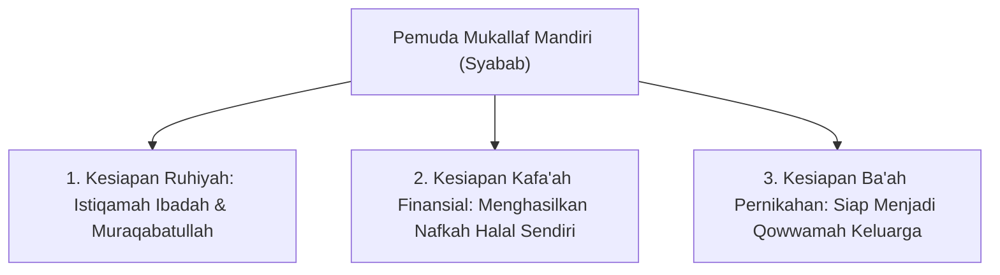
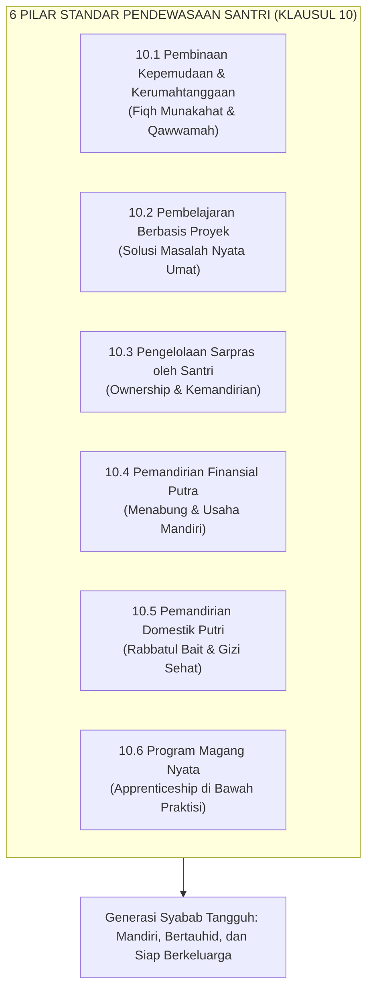

# Fase Syabab (15+ Tahun / Pasca-Baligh): Etape Sahabat, Mukallaf Mandiri, & Pencetak Peradaban

> [!quote] Dalil & Rujukan Nabawiyah Utama
> **Naskah:**  
> « سَبْعَةٌ يُظِلُّهُمُ اللَّهُ فِي ظِلِّهِ يَوْمَ لَا ظِلَّ إِلَّا ظِلُّهُ: ... وَشَابٌّ نَشَأَ فِي عِبَادَةِ رَبِّهِ »
>
> *"Tujuh golongan yang akan dinaungi oleh Allah di bawah naungan 'Arsy-Nya pada hari kiamat di mana tiada naungan selain naungan-Nya: ... dan seorang Pemuda (Syabbun) yang tumbuh besar dalam beribadah kepada Rabbnya..."*
>
> 📚 **Sumber Rujukan OpenBayan:** HR. Al-Bukhari No. 660 & Muslim No. 1031; Kitab Al-Adzan & Kitab Az-Zakah; Syarah Shahih Muslim Imam An-Nawawi (Juz 7 Hal. 120).  
> 💡 **Relevansi PKN:** Fase Syabab adalah etape kemandirian mukallaf penuh. Hubungan orang tua dan anak bertransformasi menjadi "Sahabat Seperjuangan". Pemuda muslim tidak lagi menjadi beban tanggungan keluarga, melainkan menjadi penopang dakwah, penggerak ekonomi halal, dan benteng peradaban umat.

---

## 1. Hakikat Fase Syabab dalam Arsitektur PKN

Begitu seorang anak mengalami tanda baligh (mimpi basah bagi laki-laki, haidh bagi perempuan, atau genap usia 15 tahun), status hukumnya dalam syariat Islam berubah secara radikal:
* **Beralih dari 'Ashab (Keluarga) ke Mukallaf Mandiri:** Setiap detik catatan amalnya dipertanggungjawabkan sendiri di hadapan Allah SWT.
* **Transformasi Relasi Menjadi "Sahabat" (*Al-Mushahabah*):** Orang tua tidak lagi mendikte dengan instruksi sepihak, melainkan menjadi penasihat bijak, kawan diskusi, dan mitra dalam memperjuangkan misi dakwah.
* **Tuntutan Tiga Kemandirian Nabawiyah:**
  1. **Kemandirian Aqidah & Ibadah:** Shalat, puasa, dan penjagaan kehormatan ditegakkan atas dasar muraqabatullah batin, bukan karena takut diawasi orang tua.
  2. **Kemandirian Finansial (*Iffah Nafkah*):** Mampu berwirausaha atau bekerja mencari nafkah halal sehingga tidak menjadi beban parasit bagi orang tua.
  3. **Kemandirian Sosial & Peradaban:** Mampu berkontribusi memecahkan masalah umat dan siap membangun mahligai rumah tangga sakinah.

---

## 2. Teladan Kepemimpinan Para Pemuda (Syabab) di Zaman Rasulullah ﷺ

Sejarah peradaban Islam ditopang di atas pundak para pemuda usia belasan tahun yang diamanahi tugas-tugas raksasa kenegaraan:

### A. Mush'ab bin Umair: Duta Diplomatik Peradaban di Usia Muda
Rasulullah ﷺ memilih Mush'ab bin Umair (pemuda berusia awal 20-an) untuk memegang misi paling strategis: menjadi duta diplomatik pertama Islam ke Yatsrib (Madinah). Dengan kefasihan lisan, keanggunan adab, dan keteguhan iman, Mush'ab berhasil mengislamkan para pemimpin suku besar Aus dan Khazraj (seperti Sa'ad bin Mu'adz dan Usaid bin Hudhair), hingga tidak ada satu rumah pun di Madinah melainkan telah dimasuki cahaya Islam sebelum Nabi ﷺ hijrah!

### B. Usamah bin Zaid: Panglima Perang Melawan Imperium Romawi di Usia 18 Tahun
Menjelang wafatnya Rasulullah ﷺ, beliau menunjuk Usamah bin Zaid—pemuda berusia 18 tahun—menjadi Panglima Tertinggi pasukan ekspedisi Syam untuk menghadapi superpower militer Romawi. Pasukan yang dipimpin Usamah beranggotakan para sahabat agung senior seperti Abu Bakar Ash-Shiddiq, Umar bin Al-Khattab, dan Sa'ad bin Abi Waqqash! Ketika sebagian orang meragukan usianya, Rasulullah ﷺ bersabda dengan tegas:
> « إِنْ تَطْعَنُوا فِي إِمَارَتِهِ فَقَدْ كُنْتُمْ تَطْعَنُونَ فِي إِمَارَةِ أَبِيهِ مِنْ قَبْلِهِ، وَايْمُ اللَّهِ إِنْ كَانَ لَخَلِيقًا لِلْإِمَارَةِ، وَإِنْ كَانَ لَمِنْ أَحَبِّ النَّاسِ إِلَيَّ بَعْدَهُ »  
> *"Jika kalian mencela kepemimpinannya, sungguh kalian dahulu telah mencela kepemimpinan ayahnya (Zaid bin Haritsah). Demi Allah, sungguh ayahnya sangat layak memegang kepemimpinan, dan sungguh anak ini (Usamah) adalah termasuk orang yang paling aku cintai setelahnya!"*  
> 📚 *(HR. Al-Bukhari No. 3730 & Muslim No. 2426)*

Khalifah Abu Bakar Ash-Shiddiq kemudian tetap memberangkatkan pasukan Usamah dan berjalan kaki menuntun kuda yang ditunggangi Usamah seraya berkata: *"Demi Allah, jangan engkau turun, dan demi Allah aku tidak akan naik kuda! Mengapa aku tidak boleh mengotori kedua kakiku sejenak di jalan Allah?!"*

### C. Zaid bin Tsabit: Ketua Dewan Kodifikasi Al-Qur'an
Di usia awal 20-an, Zaid bin Tsabit dipilih oleh Khalifah Abu Bakar dan Umar untuk memimpin proyek paling agung bagi peradaban manusia: menghimpun lembaran-lembaran wahyu menjadi satu Mushaf Al-Qur'an. Abu Bakar berkata kepadanya: *"Sesungguhnya engkau adalah pemuda yang cerdas, kami tidak meragukan integritasmu, dan engkau dahulu senantiasa mencatat wahyu untuk Rasulullah ﷺ!"* (HR. Bukhari No. 4986).

---

## 3. Keterangan Para Ulama Otoritatif

### 1. Syaikhul Islam Ibnu Taimiyyah (Wafat 728 H)
Dalam *Majmu' Al-Fatawa* (Juz 15 Hal. 328):
> *"Pemuda yang telah baligh adalah rijal (lelaki sejati) yang wajib memikul tanggung jawab amar ma'ruf nahi munkar. Pemisahan antara kedewasaan biologis dan kedewasaan sosial adalah kebatilan yang diada-adakan oleh orang-orang kafir yang ingin melalaikan generasi muda dari jihad dan penegakan agama."*

### 2. Imam Asy-Syathibi dalam Al-Muwafaqat
> *"Taklif syariat ditujukan kepada orang yang telah baligh berakal untuk menjaga lima kebutuhan pokok peradaban (adh-dharuriyyat al-khams): Agama, Jiwa, Akal, Kehormatan/Keturunan, dan Harta. Maka mendidik pemuda syabab adalah melatih mereka menjadi penjaga kelima benteng peradaban ini."*

---

## 4. Tiga Pilar Kemandirian Pemuda Mukallaf PKN

Keluarga dan sekolah Islam harus mendesain kurikulum Syabab berbasis **Tiga Kesiapan Mukallaf**:

1. **Kesiapan Ruhiyah (Ibadah Tanpa Paksaan):**
   * Shalat malam (*qiyamullail*), tilawah harian, shaum sunnah, dan menundukkan pandangan (*ghaddhul bashar*) menjadi kebutuhan batinnya sendiri.
2. **Kesiapan Finansial (*Economic Self-Reliance*):**
   * Pemuda syabab dilatih magang bisnis, bertani, menjadi teknisi, atau membangun usaha rintisan. Rasulullah ﷺ bersabda: *"Sebaik-baik makanan yang dimakan seseorang adalah hasil kerja tangannya sendiri."* (HR. Bukhari No. 2072).
3. **Kesiapan Membangun Rumah Tangga (*Ba'ah Syar'iyyah*):**
   * Mampu memimpin, memiliki kematangan emosi, memahami fiqih munakahat, dan siap menjadi pelindung bagi keluarganya.

---

## 5. Tautan Konseptual Terkait
* [[Perkembangan]] — Rangkaian Lengkap Pentahapan Usia Nabawiyah.
* [[Murahaqah]] — Etape Transisi Menjelang Baligh.
* [[Bakat]] — Aktualisasi 40 Karakter Menjadi Karya Peradaban.
* [[Tujuan Hidup Manusia]] — Menjadi Khalifah fil Ardh yang Bertauhid.
---

## 4. Standar Pendewasaan Kelembagaan (Klausul 10 Standar PKN 11/2024)

Dokumen resmi *Panduan Implementasi Standar PKN* menetapkan prosedur penjaminan mutu pendewasaan bagi santri yang telah menginjak usia baligh. Tujuan utamanya adalah memastikan santri tidak sekadar bertambah umur biologisnya, melainkan matang status mukallafnya (*Baligh sekaligus 'Aqil*):

### 1. Pembinaan Kepemudaan dan Kerumahtanggaan (Klausul 10.1)
Santri mukallaf dibekali kurikulum kerumahtanggaan syar'i yang mencakup:
- Pengenalan hakikat fitrah lawan jenis dan adab pergaulan islami (*Ghadhdhul Bashar*).
- Pengenalan tugas dan tanggung jawab kepala keluarga (*Qawwamah*) dan istri shalihah.
- Bimbingan kriteria memilih pasangan hidup dan adab khitbah/pernikahan nabawi.
- Keterampilan komunikasi intrapersonal dan resolusi konflik rumah tangga.

### 2. Pengelolaan Fasilitas Ma'had oleh Santri (Klausul 10.3)
Untuk memutus ketergantungan manja, lembaga mempercayakan pemeliharaan sarana prasarana ma'had kepada dewan santri:
- Piket instalasi kelistrikan, pertukangan sederhana, pertamanan, dan logistik dapur.
- Santri belajar menyelesaikan kendala teknis nyata tanpa harus selalu memanggil tukang luar.

### 3. Pemandirian Finansial Santri Putra (Klausul 10.4)
Santri putra dilatih mandiri secara ekonomi secara bertahap:
- Membiasakan disiplin menabung uang saku pribadi.
- Menjalankan unit usaha komersial halal di dalam ma'had (kantin kejujuran, *laundry* mandiri, percetakan, jasa perbaikan komputer, budidaya ikan/unggas).
- Memahami fikih muamalah jual-beli, akad syirkah, dan menjauhi transaksi gharar atau riba.

### 4. Pemandirian Kerumahtanggaan Santriwati (Klausul 10.5)
Santriwati dibekali ilmu aplikatif kepengurusan rumah tangga (*Rabbatul Bait*):
- Manajemen anggaran belanja keluarga dan tata ruang rumah islami.
- Keterampilan kuliner sehat berbasis bahan alami (*Halalan Thayyiban*) tanpa pengawet sintetik berbahaya.
- Keterampilan menjahit, tata busana muslimah syar'i, dan pertolongan pertama kesehatan keluarga (P3K).
- Psikologi pengasuhan anak usia dini berbasis fitrah.

### 5. Program Magang Lapangan / *Apprenticeship* (Klausul 10.6)
Santri tidak hanya belajar teori di dalam kelas ma'had, melainkan diterjunkan magang ke dunia kerja riil:
- Magang diselaraskan secara presisi dengan 5 pilar bakat dominan hasil tes TB-40 ([[Panduan Asesmen dan Observasi TB40]]).
- Santri dibimbing langsung oleh mentor atau *coach* praktisi yang ahli di bidangnya.
- Santri menyusun laporan refleksi karya portofolio sebagai syarat kelulusan fase syabab.

---

## 5. Tiga Pilar Kesiapan Mukallaf Mandiri

Keluarga dan sekolah Islam harus mendesain kurikulum Syabab berbasis **Tiga Kesiapan Mukallaf**:

1. **Kesiapan Ruhiyah (Ibadah Tanpa Paksaan):**
   - Shalat malam (*qiyamullail*), tilawah harian, shaum sunnah, dan menundukkan pandangan (*ghaddhul bashar*) menjadi kebutuhan batinnya sendiri.
2. **Kesiapan Finansial (*Economic Self-Reliance*):**
   - Pemuda syabab dilatih magang bisnis, bertani, menjadi teknisi, atau membangun usaha rintisan. Rasulullah ﷺ bersabda: *"Sebaik-baik makanan yang dimakan seseorang adalah hasil kerja tangannya sendiri."* (HR. Bukhari No. 2072).
3. **Kesiapan Membangun Rumah Tangga (*Ba'ah Syar'iyyah*):**
   - Mampu memimpin, memiliki kematangan emosi, memahami fiqih munakahat, dan siap menjadi pelindung bagi keluarganya.

---

## 6. Kritik Krisis Remaja Modern: Bahaya Sindrom Infantilisme

Dalam kajian *Pendidikan Lestari*, Prof. Dr. Iman Harymawan mengkritik sistem persekolahan sekuler modern yang kerap memperpanjang masa kanak-kanak secara semu (*prolonged childhood* atau **sindrom infantilisme**):
- **Kesenjangan Akil dan Baligh:** Di era modern, anak mengalami baligh biologis semakin dini (usia 11–13 tahun akibat nutrisi dan paparan gawai), namun kematangan akilnya (kemandirian mental, finansial, dan tanggung jawab sosial) tertunda hingga usia 25 tahun atau lebih!
- **Kerapuhan Mental Remaja:** Remaja usia 17–20 tahun masih diperlakukan seperti anak kecil yang hanya disuruh menghafal soal ujian dan meminta uang saku kepada orang tua. Ketiadaan peran peradaban nyata ini memicu krisis eksistensial, kekosongan jiwa, depresi, hingga tingginya angka gangguan kesehatan mental remaja.
- **Solusi Nabawi:** Islam menolak konsep "remaja galau (*adolescence*)". Begitu baligh, anak langsung diakui sebagai **Rijal** (lelaki dewasa) atau **Mar'ah** (wanita dewasa) yang memikul beban hukum syariat dan siap mencetak peradaban mulia.

---

## 7. Tautan Konseptual Terkait

* [[Perkembangan]] — Rangkaian Lengkap Pentahapan Usia Nabawiyah.
* [[Murahaqah]] — Etape Transisi Menjelang Baligh.
* [[8 Standar Implementasi PKN]] — Standar Manajemen Penjaminan Mutu Lembaga dan Klausul 10 Pendewasaan.
* [[Panduan Asesmen dan Observasi TB40]] — Pemetaan Bakat untuk Penjurusan Studi dan Pilihan Karir Santri.
* [[Panduan RPP dan Observasi Lapangan]] — Instrumen Perencanaan Proyek dan Observasi Pertumbuhan Karakter.
* [[Tujuan Hidup Manusia]] — Menjadi Khalifah fil Ardh yang Bertauhid.

