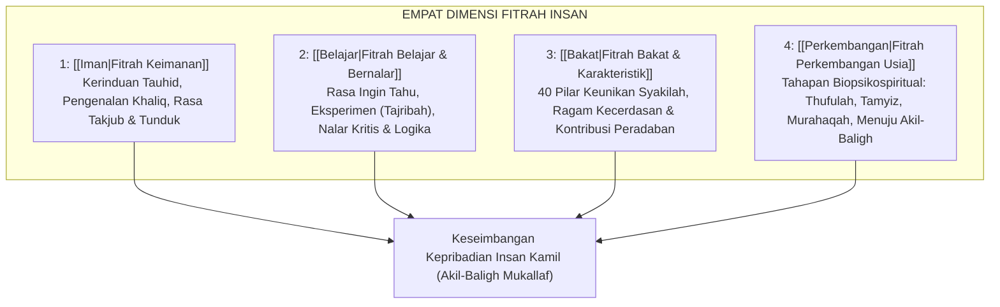

![[assets/banners/banner_hub_fitrah.webp]]
*Gambar: Fitrah Insan: Menjaga dan Membina Potensi Suci Bawaan Ilahi*

> [!info] Refleksi Lapangan: Polusi Lingkungan Pengasuhan terhadap Fitrah Anak
> **Kondisi Faktual:** Banyak anak lahir dari keluarga muslim yang baik, namun saat menginjak remaja justru kehilangan rasa malu (*haya'*), mengabaikan shalat, dan memuja budaya hedonistik.  
> **Akar Masalah PKN:** Sebagaimana sabda Nabi ﷺ bahwa setiap anak lahir di atas fitrah suci, namun kedua orang tuanyalah yang membelokkannya. Rumah tangga modern kerap menjadi produsen polusi fitrah melalui tontonan vulgar, pertengkaran suami-istri tanpa adab, dan ketiadaan keteladanan ibadah.  
> **Langkah Penanganan Nabawiyah:**  
> 1. Bersihkan ekosistem rumah dari kontaminasi visual dan audio yang merusak kesucian batin anak.  
> 2. Orang tua wajib melakukan *Taubat Nasuha* atas kelalaian pola asuh masa lalu.  
> 3. Bangun kembali atmosfer dzikir dan munajat di sepertiga malam agar rahmat Allah menaungi rumah tangga.

> [!warning] Peringatan Risiko Pengasuhan: Merusak Benih Fitrah dengan Doktrin Kekerasan
> * **Bentuk Kesalahan:** Menganggap fitrah anak seperti "kertas kosong" (*tabula rasa*) yang harus dicorat-coret dengan paksaan, atau menganggapnya "berdosa asal" yang harus ditekan dengan intimidasi.
> * **Dampak Terhadap Jiwa:** Merusak poros kepercayaan dasar (*basic trust*), menumbuhkan kebencian tersembunyi pada agama, dan memadamkan lentera ruhani anak.
> * **Pencegahan Nabawiyah:** Perlakukan anak sebagai benih pohon kurma yang mulia. Tugas pendidik hanyalah memupuk, menyiram dengan air cinta, dan melindunginya dari hama, bukan memaksanya menjadi pohon lain.

> [!tip] Tips Praktis Pengasuhan Hari Ini
> * **Aksi Sederhana:** Tatap mata anak Anda pagi ini dengan senyuman penuh keteduhan, lalu ucapkan dalam hati dengan penuh keyakinan: *"Anakku ini diciptakan Allah suci dan mulia dengan potensi takdir kebaikan yang agung."*
> * **Tujuan:** Memancarkan persepsi positif (*husnuzhan*) yang menjadi pupuk terkuat bagi mekarnya fitrah anak.

# Konsepsi Fitrah dalam Pendidikan Karakter Nabawiyah

> [!note] Catatan Metodologi & Sumber Penyusunan Dokumen
> Dokumen ini merupakan hasil rangkuman dan rekonstruksi berbantuan kecerdasan buatan (AI) dari berbagai materi presentasi, modul kurikulum, dokumen standar lembaga, dan rekaman kajian **Pendidikan Karakter Nabawiyah (PKN)** yang diampu oleh **Ustadz Abdul Kholiq**.  
> 
> Naskah ini telah melalui verifikasi dan pengayaan ulang dalil-dalil Al-Qur'an dan Hadits shahih dari korpus **OpenBayan** (60 kitab klasik), serta diperkaya dengan sintesis intisari dan masukan berharga dari kawan-kawan **Himmatul Ummah**, **Insan Taqwa / Mustaqbal**, dan **Tim SOTAB HEBAT**.

Dalam paradigma Pendidikan Karakter Nabawiyah (PKN), istilah **Fitrah** menempati kedudukan paling mendasar sebagai cetak biru (*master blueprint*) penciptaan manusia. Kata *fitrah* berakar dari kata bahasa Arab *fathara* yang bermakna "membelah", "mengeluarkan", atau "menciptakan sesuatu pertama kali dalam bentuk aslinya yang murni". Fitrah adalah potensi bawaan lahir, kecenderungan alami yang hanif (*al-mail ilal haq*), serta kesiapan spiritual dan intelektual yang ditanamkan langsung oleh Allah Subhanahu wa Ta'ala ke dalam setiap jiwa manusia tatkala ditiupkan ke alam rahim.

Pendidikan Karakter Nabawiyah menolak secara tegas teori sekuler Barat seperti doktrin *Tabula Rasa* (John Locke) yang memandang anak lahir bagaikan kertas putih kosong tanpa potensi apa pun yang pasif dibentuk oleh lingkungan. PKN juga menolak doktrin *Original Sin* (Dosa Asal) yang memandang anak lahir dengan warisan noda kutukan. Dalam Islam, setiap anak terlahir suci, mulia, berdaya, dan membawa potensi kebaikan tauhid yang sempurna. Tugas pendidikan bukan "membuat karakter dari nol", melainkan **menjaga, menumbuhsuburkan, dan memandu fitrah (*ri'ayatul fitrah*)** agar tidak tercemar oleh polusi peradaban jahiliyah.

> [!quote] Dalil & Rujukan Nabawiyah: Kesucian Fitrah Lahiriah
> **Teks Al-Qur'an & Hadits Shahih:**  
> « فَأَقِمْ وَجْهَكَ لِلدِّينِ حَنِيفًا ۚ فِطْرَتَ اللَّهِ الَّتِي فَطَرَ النَّاسَ عَلَيْهَا ۚ لَا تَبْدِيلَ لِخَلْقِ اللَّهِ ۚ ذَٰلِكَ الدِّينُ الْقَيِّمُ وَلَٰكِنَّ أَكْثَرَ النَّاسِ لَا يَعْلَمُونَ »  
> *"Maka hadapkanlah wajahmu dengan lurus kepada agama (Islam); (sesuai) fitrah Allah disebabkan Dia telah menciptakan manusia menurut (fitrah) itu. Tidak ada perubahan pada ciptaan Allah. (Itulah) agama yang lurus, tetapi kebanyakan manusia tidak mengetahui."*  
> — **QS. Ar-Rum: 30**  
>  
> « كُلُّ مَوْلُودٍ يُولَدُ عَلَى الْفِطْرَةِ، فَأَبَوَاهُ يُهَوِّدَانِهِ أَوْ يُنَصِّرَانِهِ أَوْ يُمَجِّسَانِهِ، كَمَا تُنْتَجُ الْبَهِيمَةُ بَهِيمَةً جَمْعَاءَ، هَلْ تُحِسُّونَ فِيهَا مِنْ جَدْعَاءَ »  
> *"Setiap anak dilahirkan di atas fitrah (kesucian tauhid). Maka kedua orang tuanyalah yang menjadikannya Yahudi, Nasrani, atau Majusi. Sebagaimana binatang ternak melahirkan anaknya dalam keadaan utuh sempurna, apakah kalian melihat ada cacat padanya?"*  
> — **HR. Bukhari (No. 1385) & Muslim (No. 2658)**  
>  
> 📚 **Syarah Al-Hafizh Ibnu Abdil Barr dalam At-Tamhid (Juz 18 Hal. 57):**  
> *"Fitrah yang dimaksud dalam hadits ini adalah keselamatan penciptaan, pengakuan primordial terhadap rububiyah Allah, dan kesiapan batin untuk menerima kebenaran. Anak terlahir dalam keadaan mencintai kebaikan dan membenci keburukan. Penyimpangan aqidah dan moral yang terjadi kelak pada diri anak bukanlah cacat bawaan lahir, melainkan distorsi eksternal yang diakibatkan oleh kelalaian orang tua dalam mengasuh dan menjaga lingkungan pergaulannya."*

---

## 1. Empat Dimensi Fitrah Utama dalam PKN

Pendidikan Karakter Nabawiyah memetakan fitrah anak ke dalam empat rumpun dimensi yang saling terintegrasi:

### A. [[Iman|Fitrah Keimanan (Fitratul Iman)]]
- Merupakan akar dari seluruh fitrah. Setiap jiwa anak telah bersaksi di alam ruh bahwa Allah adalah Rabb-nya (*QS. Al-A'raf: 172*).
- Anak secara alami memiliki ketertarikan pada hal-hal transenden: bertanya tentang siapa yang menciptakan bintang, ke mana orang mati pergi, dan bagaimana Allah melihat kita.
- Tugas orang tua: Memenuhi [[Tangki Cinta]] ilahiyah anak dengan mengenalkan sifat kasih sayang Allah (*Ar-Rahman Ar-Rahim*) sebelum menuntut beban hukum yang rumit.

### B. [[Belajar|Fitrah Belajar dan Bernalar (Fitratut Ta'allum)]]
- Anak lahir sebagai pembelajar tangguh yang tak kenal lelah. Mereka belajar berjalan meski jatuh beratus kali tanpa merasa terhina.
- Rasa ingin tahu (*curiosity*) dan dorongan bertanya tanpa henti adalah instrumen bawaan lahir untuk mengeksplorasi ayat-ayat kauniyah Allah.
- Tugas pendidik: Menyediakan lingkungan yang kaya pengalaman indrawi, tidak membungkam pertanyaan anak, dan menghindari pemaksaan kurikulum mekanis yang memadamkan api kecintaan belajar.

### C. [[Bakat|Fitrah Bakat dan Keunikan Diri (Fitratul Mauhibah)]]
- Setiap insan diciptakan dengan kombinasi kekuatan unik yang disebut dalam Al-Qur'an sebagai *Syakilah* (*QS. Al-Isra': 84*).
- Ada anak yang menonjol dalam keberanian memimpin (*Memerintah*), ketajaman logika (*Berpikir*), kelembutan empati (*Berperasaan*), stamina aksi (*Bekerja Keras*), keramahan sosial (*Bekerja Sama*), atau kesetiaan mengabdi (*Melayani*).
- Tugas pendidik: Mengobservasi 40 pilar bakat nabawiyah dan mengasahnya melalui proyek nyata berbasis **Rukun 3A: Suka, Bisa, dan Berguna**.

### D. [[Perkembangan|Fitrah Perkembangan dan Seksualitas (Fitratun Numuw)]]
- Pertumbuhan anak tunduk pada sunnatullah fase usia yang bertahap:
  - **Usia 0–7 tahun ([[Thufulah]]):** Etape penanaman cinta kasih tanpa syarat, masa bermain, dipimpin dengan [[Bahasa Hati]].
  - **Usia 7–10 tahun ([[Tamyiz]]):** Etape pemilahan baik-buruk, pengasahan nalar, dipimpin dengan [[Bahasa Lisan]].
  - **Usia 10–Baligh ([[Murahaqah]]):** Etape penegasan tanggung jawab, disiplin syariat, dipimpin dengan [[Bahasa Tangan]].
  - **Pasca Baligh ([[Syabab]]):** Fase kematangan penuh sebagai pribadi mukallaf yang mandiri secara moral dan finansial.

---

## 2. Dekonstruksi Tabula Rasa vs Paradigma Fitrah

*Taksonomi 40 Pilar Karakter Nabawiyah (Akhlaq Mulia Rasulullah ﷺ)*

Pola asuh modern yang mengadopsi filsafat sekuler sering kali merusak fitrah tanpa disadari. Perhatikan perbandingan mendasar berikut:

| Parameter Evaluasi | Doktrin Tabula Rasa (Sekuler) | Paradigma Fitrah Nabawiyah |
|---|---|---|
| **Pandangan Awal Anak** | Kertas putih kosong tanpa potensi bawaan; pasif dibentuk. | Benih pohon agung yang sudah memiliki cetak biru kebaikan utuh. |
| **Peran Orang Tua/Guru** | Pemahat yang memaksakan kehendak (*sculptor/molder*). | Petani bijak yang merawat tanah, menyiram, dan menjaga hama (*gardener*). |
| **Metodologi Pengajaran** | Standardisasi massal, hafalan mekanis kognitif, drill ujian. | Pendekatan personal (*fardiyah*), dialog hikmah, proyek karya nyata. |
| **Indikator Sukses** | Nilai angka rapor, kepatuhan buta, ijazah formal. | Kematangan Akil-Baligh, adab luhur, kemandirian amal peradaban. |

---

## 3. Bahaya Kerusakan Fitrah (*Inhiraf al-Fitrah*)

Al-Hafizh Ibnul Qayyim dalam *Tuhfatul Maudud bi Ahkamil Maulud* menegaskan bahwa sebagian besar penyimpangan karakter pada remaja dan orang dewasa berakar dari kelalaian orang tua pada masa kecil:
> *"Betapa banyak orang tua yang mencelakakan anak kandungnya sendiri, buah hatinya, tatkala ia mengabaikan pendidikannya, tidak mengajarkan adab fardhu agama dan sunnah-sunnahnya. Mereka menyia-nyiakan anak di masa kecil, sehingga saat dewasa anak itu tidak memberi manfaat sedikit pun bagi dirinya maupun bagi kedua orang tuanya."*

Bentuk-bentuk distorsi fitrah yang kerap terjadi di era kontemporer:
1. **Fitrah Keimanan Rusak:** Akibat anak dicekoki doktrin ancaman neraka sejak balita atau melihat hipokrisi orang tua yang rajin menuntut anak shalat namun orang tuanya asyik bermain gadget.
2. **Fitrah Belajar Padam:** Akibat dipaksa calistung (baca-tulis-hitung) terlalu dini secara kaku di usia TK, sehingga saat usia SD anak sudah mengalami kejenuhan belajar (*academic burnout*).
3. **Fitrah Bakat Terpasung:** Akibat pemaksaan jurusan sekolah semata-mata demi gengsi keluarga atau prospek gaji korporat, mengabaikan syakilah bawaan lahir anak.

---

## 4. Panduan Praktis Merawat Fitrah di Rumah

1. **Jaga Lingkungan Rumah dari Polusi Sensori:** Lindungi mata dan telinga anak dari pornografi, bahasa kotor, kekerasan verbal, dan tontonan nirfaedah. Fitrah anak sangat higienis; ia menyerap energi lingkungan secara cepat.
2. **Berikan Kebebasan Eksplorasi dalam Bingkai Adab:** Jangan mengekang rasa ingin tahu anak dengan kata "Jangan!" tanpa solusi alternatif. Berikan ruang untuk bermain tanah, memanjat pohon, mengamati semut, dan merangkai karya.
3. **Senantiasa Menghubungkan Pengalaman Sehari-hari dengan Khaliq:** Tatkala turun hujan, jangan hanya katakan "nanti becek", tetapi katakan: *"Alhamdulillah, Allah turunkan air rahmat dari langit agar pohon-pohon bisa minum dan tumbuh subur."* Ini mengkristalkan fitrah iman dalam realitas hidup.

> [!reflection] Refleksi Pendidik: Menghormati Benih Suci
> - Apakah selama ini kita memperlakukan anak bagaikan bejana kosong yang bebas kita jejali dengan impian masa lalu kita yang gagal tercapai?
> - Sudahkah kita mengenali dan mensyukuri cetak biru fitrah unik yang telah Allah tanamkan pada diri masing-masing anak kita?

---

---

## Diagnosis Penyimpangan: Tafrith vs Ifrath dalam Merawat Fitrah Insani

| Sikap Pengasuhan | Gejala Lapangan yang Muncul | Dampak pada Eksistensi Fitrah Anak |
| :--- | :--- | :--- |
| **Tafrith (Pembiaran Liar / Permisif)** | Membiarkan anak tumbuh liar tanpa batas moral, tidak mengenalkan batas halal-haram, dan mengabaikan pendampingan akidah. | Fitrah tertutup oleh karat syahwat (*al-hawa*), anak kehilangan kompas moral, dan mudah terseret arus dekadensi zaman. |
| **Ifrath (Kekerasan Dogmatis / Otoriter)** | Memaksakan target ibadah tanpa menumbuhkan cinta, menghukum kesalahan kecil dengan kekerasan, dan menuntut anak bersikap sempurna seperti malaikat. | Fitrah mengalami mutilasi kejiwaan; anak menjadi hipokrit (tampak saleh di depan orang tua namun bermaksiat di belakang), atau memberontak total. |
| **Al-Wasathiyah (Tarbiyah Fitrah Nabawiyah)** | Mengasuh dengan kelembutan kasih sayang seraya menegakkan batas syariat secara adil, konsisten, dan penuh keteladanan nyata. | Fitrah tumbuh mekar secara alami (*salimul fitrah*), melahirkan kepribadian muslim yang kokoh, tangguh, dan berakhlak mulia. |

---

## Studi Kasus Nyata & Solusi Kuratif Tadarruj

### Skenario Permasalahan
> **Kasus:** Zahra (11 tahun) tumbuh di keluarga yang sangat religius namun kaku. Sejak usia 5 tahun Zahra dituntut menghafal Al-Qur'an 1 juz per bulan dengan ancaman dikurung di kamar jika tidak mencapai target. Menginjak usia 11 tahun, Zahra mogok menghafal, sering berbohong, dan diam-diam mencopot jilbabnya saat berada di luar rumah.

### Tahapan Solusi Kuratif Langkah-demi-Langkah (Manhaj Tadarruj)
1. **Fase 1: Dekonstruksi Obsesi Orang Tua (Hari 1–7)**  
   Orang tua berkonsultasi dengan asatidzah PKN. Disadarkan bahwa ambisi mencetak anak hafidz jangan sampai mengorbankan iman dan kesehatan mental anak. Target hafalan dihentikan total sementara waktu.
2. **Fase 2: Pemulihan Luka Hubungan (*Restorasi Tangki Cinta*) (Bulan 1)**  
   Ibu menghentikan seluruh ceramah nasihat. Ibu fokus memasakkan makanan kesukaan Zahra, menemaninya menggambar, memeluknya setiap malam, dan meminta maaf dengan tulus atas kekerasan verbal masa lalu.
3. **Fase 3: Menemukan Kembali Manisnya Iman (*Dialog Fitrah*) (Bulan 2)**  
   Ayah mengajak Zahra tadabbur alam ke perkebunan teh. Menikmati gemercik air dan semilir angin sambil membaca satu ayat Al-Qur'an tentang penciptaan alam dengan tilawah merdu. Zahra merasakan bahwa Al-Qur'an adalah penyejuk kalbu, bukan beban siksaan.
4. **Fase 4: Penataan Kembali Ibadah Berdasarkan Inisiatif Mandiri (Bulan 3 dst)**  
   Zahra secara sukarela meminta kembali memakai jilbab dan menghafal 3 baris per hari karena dorongan cinta kepada Allah, bukan karena takut hukuman kurung.

---

## Instrumen Observasi Terapan & Lembar Evaluasi Diri (Self-Assessment)

### 1. Rubrik Audit Kemurnian Fitrah Anak
| No | Pilar Fitrah yang Diobservasi | Terdistorsi / Tertekan | Mengembang Alami | Mekar Paripurna |
| :-: | :--- | :-: | :-: | :-: |
| 1 | Fitrah Keimanan: Antusiasme mendengar kisah kebesaran Allah | [ ] | [ ] | [ ] |
| 2 | Fitrah Belajar & Nalar: Rasa ingin tahu tinggi dan banyak bertanya | [ ] | [ ] | [ ] |
| 3 | Fitrah Bakat: Keunikan sifat dan gaya kerja alami yang khas | [ ] | [ ] | [ ] |
| 4 | Fitrah Seksualitas: Kejelasan identitas peran gender (maskulinitas/feminitas) | [ ] | [ ] | [ ] |

### 2. Tiga Pertanyaan Reflektif Malam Hari
1. Bagian fitrah anak mana yang hari ini paling sering saya interupsi atau saya paksakan?
2. Apakah saya mendidik anak sesuai cetak biru fitrahnya atau sekadar menuruti ambisi pribadi?
3. Sudahkah saya mensyukuri keunikan anak yang berbeda dari saudara-saudaranya?

### 3. Aksi Cepat (*Quick Win*) Hari Ini
* Amati satu rasa ingin tahu anak hari ini, luangkan waktu untuk menjawab pertanyaannya secara ilmiah dan mendalam.

---

## Tautan Rujukan Terkait

* [[Iman]] — Penanaman tauhid dan cinta Allah sebelum teks Al-Qur'an.
* [[Belajar]] — Mengembangkan fitrah rasa ingin tahu dan nalar kritis nabawiyah.
* [[Bakat]] — Pemetaan 40 pilar bakat berbasis syakilah unik insan.
* [[Perkembangan]] — Menyelaraskan pengasuhan dengan tahapan usia fitrah.
* [[Luka dan Hutang Pengasuhan]] — Diagnosis dan pemulihan fitrah yang terluka (*recovery*).

---

<!-- START_OFFICE_PPTX_EMBED -->

---

### 📽️ Media Presentasi & Slide Interaktif (Office Web Apps)

> [!info] Pratinjau Interaktif Microsoft Office
> Anda dapat menavigasi slide secara langsung melalui penampil di bawah ini, atau membuka layar penuh dan mengunduh berkas aslinya.

  <h4 style="margin-bottom: 0.5rem; display: flex; align-items: center; gap: 0.5rem;">📊 Pratinjau Materi Presentasi: Beda Adab & Akhlaq + Kualitas Hidup</h4>
  

    <iframe 
      src="https://view.officeapps.live.com/op/embed.aspx?src=https%3A%2F%2Fwikipkn.insanmustaqbal.or.id%2Fpresentations%2F38-beda-adab-akhlaq-kualitas-hidup.pptx" 
      style="position: absolute; top:0; left: 0; width: 100%; height: 100%; border: 0;" 
      frameborder="0" 
      allowfullscreen="true"
      title="Beda Adab & Akhlaq + Kualitas Hidup">
    </iframe>
  

  

    <a href="https://wikipkn.insanmustaqbal.or.id/presentations/38-beda-adab-akhlaq-kualitas-hidup.pptx" download style="display: inline-flex; align-items: center; gap: 0.35rem; padding: 0.4rem 0.8rem; background: var(--light); border: 1px solid var(--lightgray); border-radius: 6px; text-decoration: none; color: var(--dark); font-weight: 500;">📥 Unduh Slide PPTX (0.07 MB)</a>
    <a href="https://view.officeapps.live.com/op/view.aspx?src=https%3A%2F%2Fwikipkn.insanmustaqbal.or.id%2Fpresentations%2F38-beda-adab-akhlaq-kualitas-hidup.pptx" target="_blank" rel="noopener" style="display: inline-flex; align-items: center; gap: 0.35rem; padding: 0.4rem 0.8rem; background: var(--light); border: 1px solid var(--lightgray); border-radius: 6px; text-decoration: none; color: var(--dark); font-weight: 500;">🖥️ Buka Layar Penuh (Office Online)</a>
    <a href="https://1drv.ms/f/c/3efe4d3cd3a3788a/IgDcc7tk4xrzRLl5cAMnNZRfAZnQHlpC2x6T2PpXeL_jTzg" target="_blank" rel="noopener" style="display: inline-flex; align-items: center; gap: 0.35rem; padding: 0.4rem 0.8rem; background: var(--light); border: 1px solid var(--lightgray); border-radius: 6px; text-decoration: none; color: var(--dark); font-weight: 500;">☁️ Folder OneDrive Resmi</a>
  

  <h4 style="margin-bottom: 0.5rem; display: flex; align-items: center; gap: 0.5rem;">📊 Pratinjau Materi Presentasi: 1. Pendidikan Akhlaq (Materi 1)</h4>
  

    <iframe 
      src="https://view.officeapps.live.com/op/embed.aspx?src=https%3A%2F%2Fwikipkn.insanmustaqbal.or.id%2Fpresentations%2F02-pendidikan-akhlaq-materi-1.pptx" 
      style="position: absolute; top:0; left: 0; width: 100%; height: 100%; border: 0;" 
      frameborder="0" 
      allowfullscreen="true"
      title="1. Pendidikan Akhlaq (Materi 1)">
    </iframe>
  

  

    <a href="https://wikipkn.insanmustaqbal.or.id/presentations/02-pendidikan-akhlaq-materi-1.pptx" download style="display: inline-flex; align-items: center; gap: 0.35rem; padding: 0.4rem 0.8rem; background: var(--light); border: 1px solid var(--lightgray); border-radius: 6px; text-decoration: none; color: var(--dark); font-weight: 500;">📥 Unduh Slide PPTX (30.39 MB)</a>
    <a href="https://view.officeapps.live.com/op/view.aspx?src=https%3A%2F%2Fwikipkn.insanmustaqbal.or.id%2Fpresentations%2F02-pendidikan-akhlaq-materi-1.pptx" target="_blank" rel="noopener" style="display: inline-flex; align-items: center; gap: 0.35rem; padding: 0.4rem 0.8rem; background: var(--light); border: 1px solid var(--lightgray); border-radius: 6px; text-decoration: none; color: var(--dark); font-weight: 500;">🖥️ Buka Layar Penuh (Office Online)</a>
    <a href="https://1drv.ms/f/c/3efe4d3cd3a3788a/IgDcc7tk4xrzRLl5cAMnNZRfAZnQHlpC2x6T2PpXeL_jTzg" target="_blank" rel="noopener" style="display: inline-flex; align-items: center; gap: 0.35rem; padding: 0.4rem 0.8rem; background: var(--light); border: 1px solid var(--lightgray); border-radius: 6px; text-decoration: none; color: var(--dark); font-weight: 500;">☁️ Folder OneDrive Resmi</a>
  
  
💡 <strong>Catatan:</strong> Berkas tayang ini berukuran cukup besar (30.39 MB). Jika pratinjau Office Online lambat memuat, disarankan mengklik <strong>Unduh Slide PPTX</strong> untuk membuka di aplikasi PowerPoint lokal.

<!-- END_OFFICE_PPTX_EMBED -->

> [!quote] Dokumen & Slide Presentasi Rujukan Resmi PKN
> Pembahasan dalam artikel ini bersumber langsung dari materi tayang pelatihan dan dokumen kurikulum resmi PKN oleh **Ustadz Abdul Kholiq**:
>
> - **Materi:** *BAKAT - TB - 40 (Tafsir Bakat 40 Karakter Nabawiyah)*
>   - 📖 **Rujukan Slide:** Slide Hal. 20–85 (Konsep Al-Mauhibah, Silsilah 6 Rumpun Bakat, 18 Sub-Kelompok, & Taksonomi 40 Sifat)
>   - 🔗 **Akses Berkas:** [📥 Unduh PDF (11.2 MB)](https://www.dropbox.com/scl/fi/ws2rfs4dlnhiv4zfzg4bg/2.-BAKAT-TB-40.pdf?rlkey=tw82umdj2dljhrc1h4fb0gtgt&dl=1) • [📊 Unduh PPTX Asli (8.0 MB)](https://www.dropbox.com/scl/fi/9xroycr8405dd7a0bwpi0/2.-BAKAT-TB-40.pptx?rlkey=1du37yttvbovjte96quzez1b7&dl=1) • [👁️ Buka di Dropbox](https://www.dropbox.com/scl/fi/ws2rfs4dlnhiv4zfzg4bg/2.-BAKAT-TB-40.pdf?rlkey=tw82umdj2dljhrc1h4fb0gtgt&dl=0)
>
> - **Materi:** *Materi Seminar 2: Kupas Tuntas Tafsir Bakat TB-40*
>   - 📖 **Rujukan Slide:** Slide Hal. 30–120 (Formula Asesmen, Analisis Tafrith vs Ifrath, Rukun 3A, dan Pemetaan Karir Peradaban)
>   - 🔗 **Akses Berkas:** [📥 Unduh PDF (24.6 MB)](https://www.dropbox.com/scl/fi/of5hkad2jl8evdbx86o2y/Materi-Seminar-2_-Tafsir-Bakat-TB-40.pdf?rlkey=m1qcgt0bmcwsjsmtvuw58m3q0&dl=1) • [👁️ Buka di Dropbox](https://www.dropbox.com/scl/fi/of5hkad2jl8evdbx86o2y/Materi-Seminar-2_-Tafsir-Bakat-TB-40.pdf?rlkey=m1qcgt0bmcwsjsmtvuw58m3q0&dl=0)
>
> - **Materi:** *1. 40 PILAR KARAKTER diurai dalam KURIKULUM*
>   - 📖 **Rujukan Slide:** Slide Hal. 12–48 (Operasionalisasi Bakat ke dalam RPP & Pembelajaran Berbasis Proyek Siswa)
>   - 🔗 **Akses Berkas:** [📥 Unduh PDF (7.9 MB)](https://www.dropbox.com/scl/fi/64vqc29u401ei6qhemuru/1.-40-PILAR-KARAKTER-diurai-dalam-KURIKULUM.pdf?rlkey=absjy37qzld7hq6ross1pryzm&dl=1) • [📊 Unduh PPTX Asli (8.8 MB)](https://www.dropbox.com/scl/fi/r8imh9ciuosapo7sghuno/1.-40-PILAR-KARAKTER-diurai-dalam-KURIKULUM.pptx?rlkey=yky4b5dptr6v9fzszc4qvxwyd&dl=1) • [👁️ Buka di Dropbox](https://www.dropbox.com/scl/fi/64vqc29u401ei6qhemuru/1.-40-PILAR-KARAKTER-diurai-dalam-KURIKULUM.pdf?rlkey=absjy37qzld7hq6ross1pryzm&dl=0)
