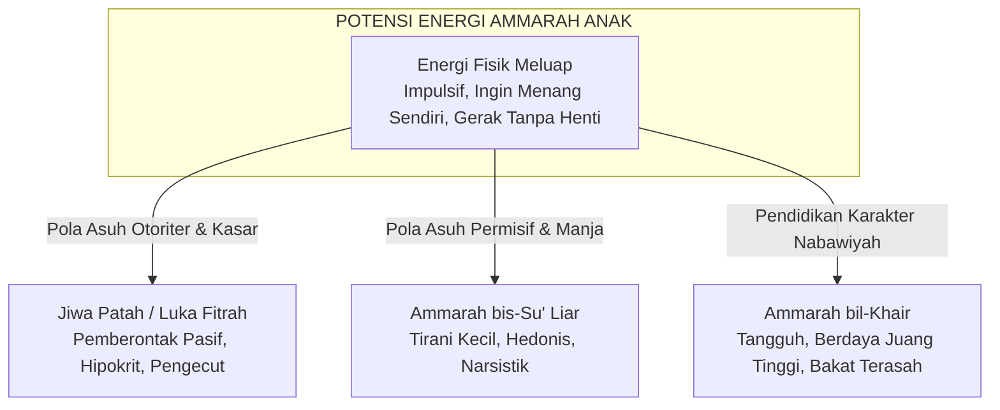

# Nafsul Ammarah: Hakikat, Dinamika, dan Penaklukannya

Dalam khazanah psikospiritual Islam dan Pendidikan Karakter Nabawiyah (PKN), **Nafsul Ammarah** (*an-nafs al-ammarah bis-su'*) adalah manifestasi jiwa yang paling dekat dengan natur biologis jasad. Kata *ammarah* merupakan bentuk *shighah mubalaghah* dalam bahasa Arab yang berarti "sangat banyak memerintah" atau "senantiasa mendesakkan kehendak". Karakteristik dasar jiwa ammarah adalah impulsif, menuntut pemenuhan kepuasan seketika (*instant gratification*), menghindari rasa sakit, dan condong pada kelezatan ragawi.

Dalam pendidikan sekuler atau mistisisme ekstrem, ammarah sering kali dipandang sebagai "musuh jahat" yang harus dimatikan atau dibungkam sepenuhnya. PKN menolak pandangan ini. Ammarah adalah **energi penggerak kehidupan (*al-quwwah al-muharrikah*)**. Tanpa ammarah, manusia tidak memiliki nafsu makan, tidak memiliki dorongan mempertahankan diri, tidak memiliki gairah berkarya, dan tidak memiliki energi juang (*grit*). Misi PKN bukanlah membunuh ammarah, melainkan menjinakkan, mendisiplinkan, dan mengarahkannya dari *Ammarah bis-Su'* (pendorong keburukan) menjadi **Ammarah bil-Khair** (pendorong amal saleh peradaban).

> [!quote] Dalil & Rujukan Nabawiyah: Watak Dasar Ammarah
> **Teks Al-Qur'an:**  
> « وَمَا أُبَرِّئُ نَفْسِي ۚ إِنَّ النَّفْسَ لَأَمَّارَةٌ بِالسُّوءِ إِلَّا مَا رَحِمَ رَبِّي ۚ إِنَّ رَبِّي غَفُورٌ رَّحِيمٌ »  
> *"Dan aku tidak menyatakan diriku bebas (dari kesalahan), karena sesungguhnya nafsu itu selalu menyuruh kepada kejahatan, kecuali nafsu yang diberi rahmat oleh Tuhanku. Sesungguhnya Tuhanku Maha Pengampun lagi Maha Penyayang."*  
> — **QS. Yusuf: 53**  
>  
> 📚 **Takhrij & Analisis Syaikhul Islam Ibnu Taimiyah dalam Majmu' Al-Fatawa (Juz 10 Hal. 568):**  
> *"Nafs pada asalnya diciptakan dalam keadaan jahil dan zhalim, yang menyuruh manusia pada kesenangan syahwatnya tanpa mempedulikan akibat buruk di akhirat. Namun jika Allah merahmati seorang hamba dengan menganugerahkannya ilmu yang bermanfaat dan petunjuk iman, jiwa tersebut akan tunduk pada syariat, sehingga dorongan syahwatnya berbalik menjadi penolong ketaatan kepada Allah."*

---

## 1. Ammarah dalam Perkembangan Anak: Bukan Jahat, tapi Mentah

Pada anak-anak, khususnya di bawah usia 10 tahun, dominasi nafsul ammarah tampak sangat kentara. Orang tua wajib memahami bahwa ammarah anak adalah **potensi mentah (*raw energy*)**, bukan niat jahat terencana:

### A. Manifestasi Alami Ammarah Anak
1. **Tantrum & Ledakan Emosi:** Saat keinginannya tertunda atau tidak terpenuhi, ammarah bereaksi secara reaktif karena belum matangnya regulasi emosi di otak prefrontal.
2. **Egosentrisme Kepemilikan:** Anak usia 2–5 tahun merasa semua benda di sekitarnya adalah miliknya. Ini adalah fondasi naluri pertahanan diri yang kelak akan berevolusi menjadi sifat menjaga amanah dan kehormatan (*'iffah*).
3. **Keengganan Mengantre dan Menunggu:** Jiwa ammarah tidak mengenal konsep waktu masa depan; ia hanya hidup di saat ini (*here and now*) dan menuntut pemenuhan instan.

---

## 2. Hak Jiwa Ammarah: Edukasi Gerak & Pembiasaan Fisik

Dalam konsep Trilogi Jiwa PKN, jiwa ammarah memiliki hak perkembangan yang harus dipenuhi:
- **Hak untuk "Dibiasakan" (*Edukasi Gerak*):** Ammarah anak membutuhkan penyaluran gerak fisik yang intensif. Mengurung anak di dalam ruangan sempit berjam-jam sambil memaksanya duduk tenang mendengarkan ceramah adalah bentuk pelanggaran hak ammarah anak.
- **Hak Mengasah Kehebatan Unik ([[Bakat]]):** Pada usia menjelang akil-baligh (10 tahun ke atas), energi ammarah harus disalurkan ke dalam 40 pilar bakat nabawiyah melalui Pembelajaran Berbasis Proyek (*Project-Based Learning*) atau magang kerja nyata yang memenuhi **Rukun 3A: Suka, Bisa, dan Berguna**.
- **Bahasa Utama yang Digunakan: [[Bahasa Tangan]]**: Bahasa tangan bukan pemukulan yang mencederai, melainkan **ketegasan fisik, penetapan batas (*boundaries*), rutinitas yang konsisten, dan konsekuensi logis**.

---

## 3. Strategi Menundukkan Ammarah: Dari Bis-Su' Menuju Bil-Khair

Imam Ibnul Qayyim dalam *Madarijus Salikin* menguraikan tiga pilar strategis dalam menundukkan nafsu ammarah:

| Pilar Terapi | Metode Implementasi dalam Pengasuhan | Dampak Pedagogis pada Anak |
|---|---|---|
| **1. Al-Hamiyyah (Proteksi Batas)** | Membatasi paparan racun lingkungan (pornografi, kekerasan tontonan, makanan haram, game adiktif). | Mencegah terstimulasinya syahwat ammarah sebelum anak memiliki benteng akal yang matang. |
| **2. Ash-Shabr 'anit-Thab'i (Melatih Penundaan Kepuasan)** | Membiasakan puasa sunnah, menabung sebelum membeli mainan, menyelesaikan tugas sebelum bermain. | Mengikis watak manja dan melatih daya tahan (*resilience*) menghadapi kesulitan hidup. |
| **3. At-Ta'widz bil-Harakah (Pengalihan Energi)** | Melibatkan anak dalam kerja bakti, olahraga bela diri, memanah, berkuda, dan memikul beban rumah tangga. | Mengubah ammarah yang destruktif menjadi keringat amal saleh yang menyehatkan raga. |

---

## 4. Studi Kasus Nabawiyah: Menjinakkan Syahwat Pemuda Zina

Salah satu teladan agung Rasulullah ﷺ dalam mentransformasi energi ammarah yang membara menjadi ketundukan mutlak adalah kisah pemuda yang datang meminta izin untuk berzina (HR. Ahmad No. 22211, sanad shahih):

> Pemuda itu datang dengan dorongan ammarah biologis yang meluap: *"Wahai Rasulullah, izinkanlah aku berzina!"*  
> Para sahabat geram dan membentaknya, namun Rasulullah ﷺ justru mendekatkannya: *"Mendekatlah."*  
> Beliau tidak menghukum fisiknya, melainkan menyentuh dadanya (meredakan ammarah dengan Bahasa Hati), lalu mendialogkan logika akalnya (mengaktifkan Lawwamah): *"Apakah engkau rela jika hal itu terjadi pada ibumu? Pada saudara perempuanmu? Pada bibimu?"*  
> Pemuda itu menjawab: *"Demi Allah, tidak wahai Rasulullah."*  
> Rasulullah ﷺ lalu mendoakannya: *“Ya Allah, ampunilah dosanya, sucikanlah hatinya, dan bentengilah kemaluannya.”*  
> Setelah peristiwa itu, tidak ada hal yang paling dibenci oleh pemuda tersebut selain zina.

Rasulullah ﷺ tidak memotong energi biologis pemuda itu, melainkan mengalirkannya melalui penyadaran akal dan sentuhan doa ilahiyah.

---

## 5. Panduan Praktis Menghadapi Ammarah Anak di Rumah

1. **Jangan Berdebat saat Ammarah Anak Sedang Meledak:** Ketika anak sedang tantrum, bagian otak logikanya lumpuh. Jangan menasihati panjang lebar. Amankan fisiknya, peluk dengan tenang (*Bahasa Hati*), dan tunggu hingga badai ammarahnya reda.
2. **Terapkan Konsekuensi, Bukan Hukuman:** Jika anak merusak mainan adiknya karena marah, jangan memukulnya. Terapkan konsekuensi: ia harus memperbaiki mainan tersebut atau mengorbankan uang sakunya untuk menggantinya. Ini melatih ammarah bertanggung jawab atas kerusakan yang dibuatnya.
3. **Bangun Rutinitas Fisik yang Kokoh:** Jadwalkan waktu bangun pagi, shalat berjamaah, merapikan tempat tidur, dan olahraga harian. Keteraturan fisik adalah obat paling mujarab untuk menjinakkan keliaran nafsu ammarah.

> [!reflection] Refleksi Pendidik: Menilik Reaksi Kemarahan Kita
> - Ketika anak membangkang, apakah kita meresponsnya dengan kejernihan akal (Lawwamah) dan kasih sayang ruh (Muthmainnah), ataukah kita justru meladeni anak dengan letupan Nafsul Ammarah kita sendiri yang penuh harga diri dan gengsi?
> - Apakah kita sudah menyediakan wadah amal nyata bagi energi fisik anak kita hari ini?

---

## Tautan Rujukan Terkait

* [[Pembagian Jiwa]] — Konsep utuh trilogi jiwa dalam PKN.
* [[Lawwamah]] — Tahap berikutnya: nalar kritis dan penyesalan moral.
* [[Muthmainnah]] — Muara akhir: ketenangan batin dalam ridha Allah.
* [[Bahasa Tangan]] — Instrumen ketegasan dan pembiasaan fisik tanpa kekerasan.
* [[Bakat]] — Penyaluran energi ammarah menuju 40 pilar amal peradaban.
