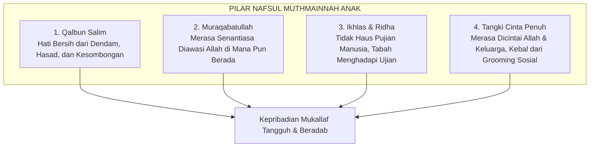

# Nafsul Muthmainnah: Puncak Kedamaian Jiwa dan Kematangan Iman

> [!note] Catatan Metodologi & Sumber Penyusunan Dokumen
> Dokumen ini merupakan hasil rangkuman dan rekonstruksi berbantuan kecerdasan buatan (AI) dari berbagai materi presentasi, modul kurikulum, dokumen standar lembaga, dan rekaman kajian **Pendidikan Karakter Nabawiyah (PKN)** yang diampu oleh **Ustadz Abdul Kholiq**.  
> 
> Naskah ini telah melalui verifikasi dan pengayaan ulang dalil-dalil Al-Qur'an dan Hadits shahih dari korpus **OpenBayan** (60 kitab klasik), serta diperkaya dengan sintesis intisari dan masukan berharga dari kawan-kawan **Himmatul Ummah**, **Insan Taqwa / Mustaqbal**, dan **Tim SOTAB HEBAT**.

Dalam hierarki psikospiritual Pendidikan Karakter Nabawiyah (PKN), **Nafsul Muthmainnah** merupakan puncak kesempurnaan karakter dan stasiun tertinggi (*maqam*) yang dapat dicapai oleh jiwa manusia di dunia. Berakar dari kata *thuma'ninah*, kata ini menggambarkan kondisi batin yang mantap, tenang, tidak bergoncang oleh badai fitnah, dan selamat dari keraguan (*syubhat*) maupun jeratan hawa nafsu (*syahwat*). Nafsul Muthmainnah adalah kondisi jiwa yang telah disucikan (*tazkiyatun nafs*), di mana nurani ruh memimpin seluruh anggota jasad dan nalar akal dengan penuh harmoni di bawah naungan wahyu Ilahi.

Pendidikan Karakter Nabawiyah menegaskan bahwa kepribadian anak yang tangguh, berakhlak mulia, dan siap memikul beban syariat (*mukallaf*) hanya dapat lahir dari jiwa yang telah merasakan manisnya ketenangan iman (*thuma'ninatul iman*). Inilah jiwa yang disapa secara mesra oleh Allah Subhanahu wa Ta'ala tatkala sakaratul maut tiba untuk memasuki surga-Nya dalam keadaan ridha dan diridhai.

> [!quote] Dalil & Rujukan Nabawiyah: Seruan Mesra kepada Jiwa yang Tenang
> **Teks Al-Qur'an:**  
> « يَا أَيَّتُهَا النَّفْسُ الْمُطْمَئِنَّةُ ۝ ارْجِعِي إِلَىٰ رَبِّكِ رَاضِيَةً مَّرْضِيَّةً ۝ فَادْخُلِي فِي عِبَادِي ۝ وَادْخُلِي جَنَّتِي »  
> *"Wahai jiwa yang tenang! Kembalilah kepada Tuhanmu dengan hati yang ridha dan diridhai-Nya. Maka masuklah ke dalam golongan hamba-hamba-Ku, dan masuklah ke dalam surga-Ku."*  
> — **QS. Al-Fajr: 27–30**  
>  
> 📚 **Takhrij & Analisis Ibnul Qayyim dalam Madarijus Salikin (Juz 1 Hal. 302):**  
> *"Nafs tidak akan mencapai thuma'ninah yang hakiki melainkan dengan tiga perkara: (1) Thuma'ninah dalam tauhid dan keikhlasan, sehingga ia tidak menyekutukan Allah dengan apa pun; (2) Thuma'ninah dalam asma' wa shifat-Nya, sehingga hatinya tenang bersandar pada takdir dan ketetapan-Nya; serta (3) Thuma'ninah dalam hukum dan syariat-Nya, sehingga dadanya lapang menerima segala perintah dan larangan tanpa ada rasa keberatan sedikit pun. Jiwa inilah yang selamat dari siksa dan berhak dipanggil pulang dengan kemuliaan."*

---

## 1. Karakteristik Nafsul Muthmainnah dalam Diri Anak

Membentuk Nafsul Muthmainnah pada anak bukanlah menunggu hingga mereka tua, melainkan menyemai benih-benihnya sejak usia dini. Tanda-tanda mekarnya jiwa muthmainnah pada generasi muda meliputi:

1. **Memiliki Ketahanan Moral (*Moral Resilience*):** Anak tidak mudah hanyut oleh arus pergaulan bebas atau tekanan teman sebaya (*peer pressure*), karena identitas batinnya telah kokoh tertambat kepada Allah.
2. **Ikhlas dalam Berbuat Baik:** Ia menolong sesama bukan demi mendapatkan bintang penghargaan guru atau konten media sosial orang tua, melainkan semata-mata mencari ridha Allah.
3. **Kedamaian dalam Beribadah:** Shalat dan membaca Al-Qur'an bukan lagi beban paksaan yang memberatkan fisiknya, melainkan menjadi oase peristirahatan batin, sebagaimana sabda Nabi ﷺ kepada Bilal: *“Arihna bish-shalah ya Bilal”* (Istirahatkanlah kami dengan shalat, wahai Bilal).

---

## 2. Hak Jiwa Muthmainnah: Edukasi Rasa & Tangki Cinta Penuh

Dalam kurikulum PKN, Nafsul Muthmainnah berkedudukan di dalam **Kalbu / Batin (*Al-Qalb*)** dan memiliki hak-hak pengasuhan yang sangat sakral:
- **Hak untuk "Disenangkan" (*Edukasi Rasa*):** Jiwa muthmainnah anak membutuhkan rasa aman psikologis (*psychological safety*). Hal ini diwujudkan melalui pemenuhan [[Tangki Cinta]] anak secara utuh tanpa syarat (*unconditional love*). Anak harus yakin bahwa cinta orang tuanya tidak bersyarat pada ranking sekolah atau kesempurnaan fisik semata.
- **Hak Penanaman Iman Tanpa Teror Mental:** Khususnya pada fase [[Thufulah]] (0–7 tahun), penanaman tauhid harus dipenuhi dengan gambaran kasih sayang Allah, keindahan surga, dan kemuliaan akhlak Nabi ﷺ. Jangan menakut-nakuti anak usia dini dengan siksa api neraka secara berlebihan yang merusak fitrah thuma'ninahnya menjadi jiwa yang paranoid dan trauma.
- **Bahasa Utama yang Digunakan: [[Bahasa Hati]]**: Sentuhan fisik, tatapan mata penuh kasih, pelukan hangat, doa tulus di hadapan anak, dan kelemahlembutan (*ar-rifq*).

---

## 3. Matriks Komparatif Perjalanan Tiga Jiwa Menuju Kematangan

Untuk memahami alur orkestrasi ketiga jiwa dalam diri ananda, perhatikan matriks komparatif berikut:

| Parameter | Nafsul Ammarah | Nafsul Lawwamah | Nafsul Muthmainnah |
|---|---|---|---|
| **Pusat Organ** | Jasad / Fisik / Otot | Otak / Nalar / Pikiran | Qalbu / Batin / Nurani |
| **Sifat Dasar** | Impulsif & Menuntut | Kritis & Evaluatif | Tenang & Pasrah Beradab |
| **Pemicu Utama** | Kebutuhan Syahwat / Biologis | Logika Sebab-Akibat & Dosa | Cinta Tauhid & Ridha Ilahi |
| **Peran Edukasi** | Harus Didisiplinkan ([[Bahasa Tangan]]) | Harus Dipahamkan ([[Bahasa Lisan]]) | Harus Disenangkan ([[Bahasa Hati]]) |
| **Bahaya Jika Salah Asuh** | Menjadi Agresif / Tirani | Menjadi Insecure / Sinis | Rapuh / Naif jika tanpa nalar |

---

## 4. Teladan Nabawiyah: Menanamkan Ketenangan Batin pada Ibnu Abbas

Ketenangan Nafsul Muthmainnah diteladankan secara gemilang tatkala Rasulullah ﷺ membonceng sepupunya yang masih belia, Abdullah bin Abbas radhiyallahu 'anhuma:

> Beliau bersabda:  
> « يَا غُلَامُ إِنِّي أُعَلِّمُكَ كَلِمَاتٍ: احْفَظِ اللَّهَ يَحْفَظْكَ، احْفَظِ اللَّهَ تَجِدْهُ تُجَاهَكَ، إِذَا سَأَلْتَ فَاسْأَلِ اللَّهَ، وَإِذَا اسْتَعَنْتَ فَاسْتَعِنْ بِاللَّهِ، وَاعْلَمْ أَنَّ الْأُمَّةَ لَوْ اجْتَمَعَتْ عَلَى أَنْ يَنْفَعُوكَ بِشَيْءٍ لَمْ يَنْفَعُوكَ إِلَّا بِشَيْءٍ قَدْ كَتَبَهُ اللَّهُ لَكَ، وَلَوْ اجْتَمَعُوا عَلَى أَنْ يَضُرُّوكَ بِشَيْءٍ لَمْ يَضُرُّوكَ إِلَّا بِشَيْءٍ قَدْ كَتَبَهُ اللَّهُ عَلَيْكَ، رُفِعَتِ الْأَقْلَامُ وَجَفَّتِ الصُّحُفُ »  
> *"Wahai anak muda! Maukah aku ajarkan kepadamu beberapa kalimat yang sangat berharga? Jagalah Allah, niscaya Dia akan menjagamu. Jagalah Allah, niscaya engkau mendapati-Nya di hadapanmu. Jika engkau meminta, mintalah kepada Allah. Jika engkau memohon pertolongan, mohonlah kepada Allah. Dan ketahuilah, andaikata seluruh umat bersatu padu untuk memberimu manfaat, mereka tidak akan mampu memberimu manfaat melainkan apa yang telah Allah tetapkan bagimu. Dan andaikata mereka bersatu padu untuk mencelakakanmu, mereka tidak akan mampu mencelakakanmu melainkan apa yang telah Allah tetapkan atasmu. Pena telah diangkat dan lembaran telah kering."*  
> (HR. Tirmidzi No. 2516, hadits hasan shahih).

Nasihat ini tidak diberikan dalam suasana kelas formal yang kaku, melainkan di atas punggung tunggangan dengan kedekatan fisik yang intim. Kalimat-kalimat tauhid ini menanamkan thuma'ninah mutlak di hati Ibnu Abbas kecil, menjadikannya ulama besar (*Hibrul Ummah*) yang tak gentar menghadapi pergolakan zaman.

---

## 5. Panduan Praktis Ayah dan Bunda Menyemai Jiwa Muthmainnah

1. **Jadikan Rumah sebagai Baitul Amn (Rumah yang Memberi Rasa Aman):** Anak tidak akan bisa memiliki jiwa muthmainnah jika rumahnya dipenuhi teriakan kemarahan, pertengkaran suami-istri, atau ancaman pengusiran. Hadirkan sakinah lahir dan batin di dalam rumah tangga.
2. **Rutinkan Majelis Dzikir dan Doa Bersama:** Duduk melingkar bersama anak ba'da Maghrib atau Shubuh untuk membaca Al-Ma'tsurat, mentadabburi kisah para Nabi, dan saling mendoakan. Getaran dzikir adalah makanan pokok bagi pertumbuhan jiwa muthmainnah.
3. **Teladankan Penerimaan Takdir (*Qadha' dan Qadar*):** Ketika keluarga menghadapi musibah (kehilangan harta, sakit, rencana gagal), tunjukkan reaksi ketenangan di depan anak: ucapan *Inna lillahi wa inna ilaihi raji'un* dan prasangka baik kepada Allah. Anak meniru ketenangan orang tuanya jauh lebih cepat daripada mendengarkan seribu nasihat lisan.

> [!reflection] Refleksi Pendidik: Meraba Kedamaian Batin Kita
> - Apakah diri kita sendiri sudah memiliki ketenangan jiwa muthmainnah saat mendidik anak, ataukah kita masih mendidik mereka dengan kecemasan berlebihan terhadap masa depan finansial mereka di dunia?
> - Apakah ananda merasa damai dan nyaman tatkala berada di dekat kita, ataukah mereka merasa tegang dan terancam oleh kehadiran kita?

---

## Tautan Rujukan Terkait

* [[Pembagian Jiwa]] — Induk pembahasan trilogi jiwa PKN.
* [[Ammarah]] — Pondasi jasad yang harus ditundukkan.
* [[Lawwamah]] — Nalar kritis yang menghantarkan menuju thuma'ninah.
* [[Tangki Cinta]] — Wadah emosional pengasuhan pemenuh jiwa muthmainnah.
* [[Bahasa Hati]] — Seni koneksi batin dan bahasa kelembutan nabawiyah.

---

*Kondisi Jiwa dalam Sholat: Sholat Sebagai Barometer Kematangan Batin Anak*

> [!quote] Dokumen & Slide Presentasi Rujukan Resmi PKN
> Pembahasan dalam artikel ini bersumber langsung dari materi tayang pelatihan dan dokumen kurikulum resmi PKN oleh **Ustadz Abdul Kholiq**:
>
> - **Materi:** *Materi Seminar 1: Kondisi Jiwa Anak*
>   - 📖 **Rujukan Slide:** Slide Hal. 18–45 (Persenyawaan Ruh & Jasad, Dinamika 3 Tingkat Jiwa: Ammarah, Lawwamah, Muthmainnah)
>   - 🔗 **Akses Berkas:** [📥 Unduh PDF (19.3 MB)](https://www.dropbox.com/scl/fi/zlkox52wnhorr3gdcurh1/Materi-Seminar-1_-Kondisi-Jiwa-Anak.pdf?rlkey=dga9nc3450lfs3qbfkwzid5pw&dl=1) • [👁️ Buka di Dropbox](https://www.dropbox.com/scl/fi/zlkox52wnhorr3gdcurh1/Materi-Seminar-1_-Kondisi-Jiwa-Anak.pdf?rlkey=dga9nc3450lfs3qbfkwzid5pw&dl=0)
>
> - **Materi:** *1. Jiwa dan Metode Mendidiknya*
>   - 📖 **Rujukan Slide:** Slide Hal. 35–82 (Diagnosis Tingkatan Jiwa Sehat vs Jiwa Terluka)
>   - 🔗 **Akses Berkas:** [📊 Unduh PPTX Asli (22.7 MB)](https://www.dropbox.com/scl/fi/jc3yplk9c37449g8mncw0/1.-Jiwa-dan-Metode-Mendidiknya.pptx?rlkey=ero2pmf0x64q28g0atyedidqg&dl=1) • [👁️ Buka di Dropbox](https://www.dropbox.com/scl/fi/jc3yplk9c37449g8mncw0/1.-Jiwa-dan-Metode-Mendidiknya.pptx?rlkey=ero2pmf0x64q28g0atyedidqg&dl=0)

