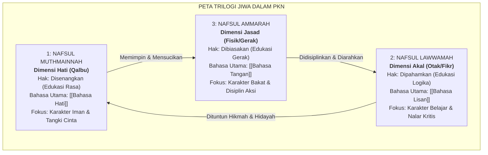

![[assets/banners/banner_hub_pembagian_jiwa.webp]]
*Gambar: Karakteristik Jiwa: Dinamika Ammarah, Lawwamah, dan Muthmainnah*

> [!info] Refleksi Lapangan: Menjaga Kemurnian Batin dalam Dinamika Pembagian Jiwa
> **Kondisi Faktual:** Sering kali pengasuhan terjebak pada tuntutan perilaku luar (*zhahir*) sementara kondisi ruhani dan dinamika batiniah (*bathin*) anak terabaikan, melahirkan kegersangan jiwa.  
> **Akar Masalah PKN:** Mereduksi manusia menjadi makhluk materialistis tanpa menghidupkan sambungan fitrah ketuhanan (*shibghatullah*) yang menjadi sumber kedamaian sejati.  
> **Langkah Penanganan Nabawiyah:**  
> 1. Hidupkan suasana ibadah yang khusyuk dan penuh penghayatan di lingkungan rumah.  
> 2. Bantu anak mengenali gejolak emosi dan bisikan jiwanya dengan bimbingan wahyu.  
> 3. Tanamkan orientasi akhirat sebagai kompas penentu seluruh cita-cita duniawi.

> [!warning] Peringatan Risiko Pengasuhan: Mengabaikan Aspek Ruhani Pembagian Jiwa
> * **Bentuk Kesalahan:** Mengabaikan doa, meremehkan tazkiyatun nafs, atau membebani jiwa anak dengan ekspektasi duniawi yang melampaui batas fitrah.
> * **Dampak Terhadap Jiwa:** Lahirnya penyakit hati (hasad, riya', ujub, putus asa), kehampaan makna hidup, dan kerapuhan mental saat menghadapi ujian takdir.
> * **Pencegahan Nabawiyah:** Rasulullah ﷺ senantiasa berdoa: *"Ya Allah, karuniakanlah ketakwaan pada jiwaku dan sucikanlah ia, Engkaulah sebaik-baik yang mensucikannya"* (HR. Muslim).

> [!tip] Tips Praktis Pengasuhan Hari Ini
> * **Aksi Sederhana:** Duduklah bersama anak di waktu fajar atau senja, tataplah pergantian warna langit bersama-sama, dan ajak bertafakkur: *"Siapakah yang menggerakkan matahari dan melukis awan seindah ini setiap hari tanpa lelah?"*
> * **Tujuan:** Menghidupkan kesadaran tauhid rububiyah dan menyejukkan kalbu anak dengan keagungan Allah SWT.

# Pembagian Jiwa dalam Pendidikan Karakter Nabawiyah

> [!note] Catatan Metodologi & Sumber Penyusunan Dokumen
> Dokumen ini merupakan hasil rangkuman dan rekonstruksi berbantuan kecerdasan buatan (AI) dari berbagai materi presentasi, modul kurikulum, dokumen standar lembaga, dan rekaman kajian **Pendidikan Karakter Nabawiyah (PKN)** yang diampu oleh **Ustadz Abdul Kholiq**.  
> 
> Naskah ini telah melalui verifikasi dan pengayaan ulang dalil-dalil Al-Qur'an dan Hadits shahih dari korpus **OpenBayan** (60 kitab klasik), serta diperkaya dengan sintesis intisari dan masukan berharga dari kawan-kawan **Himmatul Ummah**, **Insan Taqwa / Mustaqbal**, dan **Tim SOTAB HEBAT**.

Dalam konsepsi Pendidikan Karakter Nabawiyah (PKN), jiwa manusia (*an-nafs*) bukanlah entitas statis yang kaku, melainkan medan gerak dinamis yang senantiasa berfluktuasi antara tarikan luhur malaikat (*lammatul malak*) dan bisikan nista setan (*lammatus syaithan*). Al-Qur'an Al-Karim secara eksplisit memetakan dinamika psikologis manusia ke dalam **Trilogi Jiwa**: **Nafsul Ammarah**, **Nafsul Lawwamah**, dan **Nafsul Muthmainnah**.

Ketiga istilah ini bukanlah tiga jiwa yang terpisah di dalam satu tubuh, melainkan **tiga keadaan/fase kualitas (*ahwal*)** yang silih berganti menguasai satu jiwa yang sama. Sasaran agung dari tarbiyah nabawiyah adalah membimbing anak melalui proses penyucian bertahap (*tazkiyatun nafs*), mentransformasi dominasi dorongan liar jasad (*Ammarah*) menuju kesadaran nalar moral yang kritis (*Lawwamah*), hingga akhirnya mencapai ketenangan spiritual yang kokoh (*Muthmainnah*).

> [!quote] Dalil & Rujukan Nabawiyah: Sumpah Allah atas Dinamika Jiwa
> **Teks Al-Qur'an:**  
> « وَنَفْسٍ وَمَا سَوَّاهَا ۝ فَأَلْهَمَهَا فُجُورَهَا وَتَقْوَاهَا ۝ قَدْ أَفْلَحَ مَن زَكَّاهَا ۝ وَقَدْ خَابَ مَن دَسَّاهَا »  
> *"Dan demi jiwa serta penyempurnaan (ciptaan)-nya, maka Allah mengilhamkan kepada jiwa itu (jalan) kefasikan dan ketakwaannya. Sungguh beruntunglah orang yang menyucikan jiwa itu, dan sungguh merugilah orang yang mengotorinya."*  
> — **QS. Asy-Syams: 7–10**  
>  
> 📚 **Takhrij & Analisis Ibnul Qayyim dalam Kitab ar-Ruh (Hal. 226):**  
> *"Nafs pada hakikatnya adalah satu dzat, namun memiliki tiga sifat yang berbeda sesuai dengan kecenderungan dominannya. Tatkala ia tunduk pada dorongan hawa nafsu dan syahwat, ia dinamakan Ammarah bis-Su'. Tatkala ia sadar, mencela kelalaian dirinya, dan berusaha menimbang kebaikan, ia dinamakan Lawwamah. Dan tatkala ia telah tenang bersama Allah, mencintai syariat-Nya, dan ridha atas takdir-Nya, ia dinamakan Muthmainnah. Pendidikan adalah sarana tazkiyah untuk mengangkat nafs dari lembah Ammarah menuju puncak Muthmainnah."*

---

## 1. Anatomi Tiga Keadaan Jiwa dalam PKN

*Tabel Tiga Tingkatan Nafsu Jiwa (Muthmainnah, Lawwamah, Ammarah)*

Berikut adalah matriks komparatif tiga dimensi jiwa, hubungannya dengan anatomi manusia, instrumen pendidikan, dan target perkembangannya:

---

## 2. Hak dan Kewajiban Masing-Masing Dimensi Jiwa

Pendidikan Karakter Nabawiyah merumuskan bahwa keseimbangan kepribadian anak tercapai apabila **Hak Perkembangan** masing-masing dimensi jiwa dipenuhi sebelum menuntut **Kewajiban Syariat** padanya:

### A. Dimensi Hati: [[Muthmainnah]]
* **Hak Anak:** Berhak untuk **"Disenangkan" (*Edukasi Rasa*)**. Tangki cintanya harus penuh melalui pelukan hangat, tutur kata lembut, tatapan kasih sayang, dan rasa aman emosional. Pada fase [[Thufulah]] (0–7 tahun), anak tidak boleh diancam neraka secara menakutkan, melainkan dikenalkan kepada Allah Yang Maha Pengasih (*Ar-Rahman Ar-Rahim*).
* **Kewajiban Anak:** Menumbuhkan ketundukan ikhlas (*taslim*), cinta ibadah, kejujuran batin (*shidq*), dan kebersihan hati dari rasa dengki (*hasad*) maupun kesombongan (*kibir*).

### B. Dimensi Akal: [[Lawwamah]]
* **Hak Anak:** Berhak untuk **"Dipahamkan" (*Edukasi Logika*)**. Anak berhak mendapatkan penjelasan logis mengenai alasan di balik perintah dan larangan. Di fase [[Tamyiz]] (7–10 tahun), anak berhak menuntaskan rasa ingin tahunya melalui eksperimen (*tajribah*) dan uji coba (*trial and error*) tanpa takut dicap bodoh saat keliru.
* **Kewajiban Anak:** Menuntut ilmu dasar syariat (*fardhu 'ain*), melatih nalar berpikir lurus (*aqlun salim*), mematuhi adab menuntut ilmu, dan berani mengoreksi diri (*muhasabah*) tatkala melakukan kesalahan.

### C. Dimensi Fisik: [[Ammarah]]
* **Hak Anak:** Berhak untuk **"Dibiasakan" (*Edukasi Gerak*)**. Anak berhak bergerak aktif secara motorik, berlari di alam bebas, dan menyalurkan energinya dalam proyek karya nyata berbasis Rukun 3A: Suka (*Al-Hirsh*), Bisa (*Al-Maqdari*), dan Berguna (*Al-Mufid*).
* **Kewajiban Anak:** Melatih ketahanan fisik (*jismun qawiy*), mendisiplinkan diri dalam shalat tepat waktu, membantu pekerjaan rumah tangga, dan memikul konsekuensi logis dari tindakannya tanpa mencari kambing hitam.

---

## 3. Dinamika Perjalanan Jiwa: Tazkiyah vs Tadsiyah

Al-Qur'an menggunakan dua kata kunci yang sangat kontras: **Zakkaha** (membersihkan dan menumbuhkannya) dan **Dassaha** (menyembunyikan dan mengotorinya). 

1. **Jalan Tazkiyah (Keberuntungan Pendidikan):**
   - Dimulai dengan memenuhi hak cinta anak sehingga batinnya tenang (*Muthmainnah*).
   - Mengasah akalnya dengan dialog hikmah sehingga nuraninya tajam mencela keburukan (*Lawwamah*).
   - Menyalurkan energi fisiknya ke dalam 40 pilar [[Bakat]] sehingga nafs ammarahnya sibuk dalam kebajikan (*Ammarah bil-Khair*).
2. **Jalan Tadsiyah (Kegagalan Pendidikan):**
   - Mengosongkan tangki cinta anak dengan kekerasan verbal dan fisik, melahirkan luka pengasuhan.
   - Mematikan nalar kritis anak dengan doktrinasi kaku tanpa dialog, membuat nalar lawwamahnya tumpul.
   - Membiarkan anak kecanduan syahwat instan (gadget, game berlebihan, konsumerisme), sehingga nafs ammarah liar (*Ammarah bis-Su'*) memegang kendali kepribadiannya.

---

## 4. Matriks Observasi Pendidik: Mendeteksi Dominasi Jiwa Anak

Sebagai panduan harian di rumah dan madrasah, berikut tabel observasi untuk mengenali kondisi jiwa yang sedang mendominasi anak:

| Gejala Perilaku yang Muncul | Kondisi Jiwa Dominan | Akar Kebutuhan Batin | Respon Nabawiyah yang Tepat |
|---|---|---|---|
| Mengamuk, memukul teman, menolak berbagi, malas bergerak | **Ammarah Liar** | Energi fisik berlebih, lapar, lelah, atau batas aturan belum tegas | Terapkan [[Bahasa Tangan]]: tahan fisik dengan lembut tapi kokoh, beri batasan jelas tanpa bentakan. |
| Merasa bersalah, bertanya "mengapa ini haram?", ragu-ragu | **Lawwamah Aktif** | Membutuhkan validasi logika, haus penjelasan sebab-akibat | Terapkan [[Bahasa Lisan]]: ajak berdialog dua arah (*hiwar*), dengarkan opininya, jelaskan hikmah syariat. |
| Khusyuk saat berdoa, berempati pada yang sakit, tenang | **Muthmainnah Mekar** | Jiwa terkoneksi dengan Allah, tangki cinta penuh | Terapkan [[Bahasa Hati]]: peluk, puji kebaikan karakternya, syukuri nikmat hidayah bersama anak. |

> [!reflection] Refleksi Pendidik: Menjaga Keseimbangan Jiwa Ananda
> - Apakah selama ini kita hanya sibuk menjejali akal anak (Lawwamah) dengan nilai akademis, namun membiarkan tangki batinnya (Muthmainnah) kering kerontang tanpa kasih sayang?
> - Sudahkah kita memberi ruang gerak yang cukup bagi fisik anak (Ammarah) untuk menyalurkan energinya ke dalam karya bermanfaat?

---

---

## Diagnosis Penyimpangan: Tafrith vs Ifrath dalam Pembagian Jiwa

| Dimensi Penghayatan | Gejala Sikap yang Teramati | Dampak Psikospiritual pada Anak |
| :--- | :--- | :--- |
| **Tafrith (Materialisme Kering / Sekuler)** | Mengabaikan aspek ruhani, mendidik anak tanpa orientasi akhirat, dan memandang manusia hanya sebagai entitas biologis-ekonomi. | Jiwa anak gersang, mudah cemas, mengukur kemuliaan hanya dari materi, dan rentan krisis eksistensial. |
| **Ifrath (Spiritualisme Ekstrem / Ghuluw)** | Menafikan kebutuhan fisik jasmani, melarang anak bermain secara wajar, dan memaksakan kezuhudan sebelum tiba etape kematangan akal. | Anak tertekan, memendam kebencian pada simbol agama, atau mengalami disorientasi sosial di masyarakat. |
| **Al-Wasathiyah (Keseimbangan Fitrah Nabawi)** | Memadukan pemenuhan hak jasad secara halal dengan nutrisi ruhani yang berbobot, menempatkan dunia sebagai ladang akhirat. | Terbentuk kepribadian mukmin paripurna: sehat jasmaninya, cerdas akalnya, suci jiwanya (*muthmainnah*), dan berkontribusi nyata bagi umat. |

---

## Studi Kasus Nyata & Solusi Kuratif Tadarruj

### Skenario Permasalahan
> **Kasus:** Orang tua memvonis anak yang berbuat salah sebagai 'anak jahat', tidak memahami bahwa jiwa anak sedang berada dalam fase dialektika nafs.

### Tahapan Solusi Kuratif Langkah-demi-Langkah (Manhaj Tadarruj)
1. **Fase 1: Introspeksi Spiritual Pendidik (Hari 1–3)**  
   Orang tua memperbanyak taubat, shalat malam, dan memohon hidayah bagi anak. Menyadari bahwa hati anak berada di antara dua jemari ar-Rahman.
2. **Fase 2: Pendekatan Welas Asih (*Sentuhan Ruhani*) (Hari 4–7)**  
   Menghadirkan kelembutan tanpa syarat. Menemani anak dalam keheningan, mengusap kepalanya seraya mendoakan keberkahan, dan menciptakan rasa aman di rumah.
3. **Fase 3: Dialog Makna Hidup (*Tadabbur Nalar*) (Pekan 2)**  
   Mengajak anak berdiskusi santai mengenai hakikat penciptaan manusia, kasih sayang Allah yang melimpah, dan indahnya ampunan bagi hamba yang bertaubat.
4. **Fase 4: Pembiasaan Amal & Keteladanan Nyata (Pekan 3 dst)**  
   Membangun ritme ibadah keluarga yang menyenangkan (tilawah bersama, sedekah subuh, membantu dhuafa) sebagai wujud nyata kesucian jiwa.

---

## Instrumen Observasi Terapan & Lembar Evaluasi Diri (Self-Assessment)

### 1. Rubrik Pemetaan Dinamika Tiga Jiwa (Ammarah, Lawwamah, Muthmainnah)
| No | Sinyal Dominansi Jiwa | Ammarah (Merah) | Lawwamah (Kuning) | Muthmainnah (Hijau) |
| :-: | :--- | :--- | :--- | :--- |
| 1 | Respon terhadap godaan | Larut dan menuruti hawa nafsu | Sempat tergoda lalu menyesal | Teguh menolak dengan tenang |
| 2 | Respon saat ditegur salah | Membela diri dan marah | Menunduk dan meminta maaf | Berterima kasih atas koreksi |
| 3 | Motif dalam beramal | Ingin dipuji / dipandang hebat | Khawatir tidak diterima | Tulus mengharap ridha Allah |

### 2. Tiga Pertanyaan Reflektif Malam Hari
1. Jiwa mana yang paling mendominasi perilaku anak saya dan respon saya sendiri hari ini?
2. Bagaimana cara saya menyuburkan penyesalan nurani (*Lawwamah*) tanpa membuatnya putus asa?
3. Sudahkah saya mengalirkan asupan dzikir yang memampukan jiwa anak menundukkan syahwatnya?

### 3. Aksi Cepat (*Quick Win*) Hari Ini
* Saat anak melakukan kesalahan kecil, puji keberaniannya untuk jujur mengakui sebelum membahas solusi perbaikannya.

---

## Tautan Rujukan Terkait

* [[Ammarah]] — Karakteristik dorongan jasad, syahwat, dan seni mendisiplinkannya.
* [[Lawwamah]] — Dinamika nalar kritis, akal sehat, dan penyesalan positif.
* [[Muthmainnah]] — Puncak ketenangan batin, iman kokoh, dan qalbun salim.
* [[Bersatunya Ruh dan Jasad Membentuk Jiwa]] — Fondasi antropologi penciptaan manusia.
* [[Tangki Cinta]] — Pemenuhan hak emosional dasar anak dalam PKN.

---

> [!quote] Dokumen & Slide Presentasi Rujukan Resmi PKN
> Pembahasan dalam artikel ini bersumber langsung dari materi tayang pelatihan dan dokumen kurikulum resmi PKN oleh **Ustadz Abdul Kholiq**:
>
> - **Materi:** *Materi Seminar 1: Kondisi Jiwa Anak*
>   - 📖 **Rujukan Slide:** Slide Hal. 18–45 (Persenyawaan Ruh & Jasad, Dinamika 3 Tingkat Jiwa: Ammarah, Lawwamah, Muthmainnah)
>   - 🔗 **Akses Berkas:** [📥 Unduh PDF (19.3 MB)](https://www.dropbox.com/scl/fi/zlkox52wnhorr3gdcurh1/Materi-Seminar-1_-Kondisi-Jiwa-Anak.pdf?rlkey=dga9nc3450lfs3qbfkwzid5pw&dl=1) • [👁️ Buka di Dropbox](https://www.dropbox.com/scl/fi/zlkox52wnhorr3gdcurh1/Materi-Seminar-1_-Kondisi-Jiwa-Anak.pdf?rlkey=dga9nc3450lfs3qbfkwzid5pw&dl=0)
>
> - **Materi:** *1. Jiwa dan Metode Mendidiknya*
>   - 📖 **Rujukan Slide:** Slide Hal. 35–82 (Diagnosis Tingkatan Jiwa Sehat vs Jiwa Terluka)
>   - 🔗 **Akses Berkas:** [📊 Unduh PPTX Asli (22.7 MB)](https://www.dropbox.com/scl/fi/jc3yplk9c37449g8mncw0/1.-Jiwa-dan-Metode-Mendidiknya.pptx?rlkey=ero2pmf0x64q28g0atyedidqg&dl=1) • [👁️ Buka di Dropbox](https://www.dropbox.com/scl/fi/jc3yplk9c37449g8mncw0/1.-Jiwa-dan-Metode-Mendidiknya.pptx?rlkey=ero2pmf0x64q28g0atyedidqg&dl=0)

