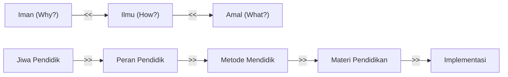
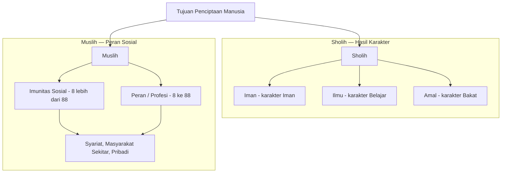
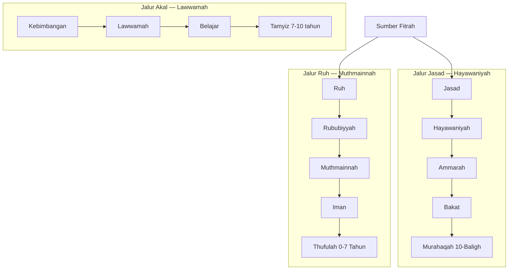
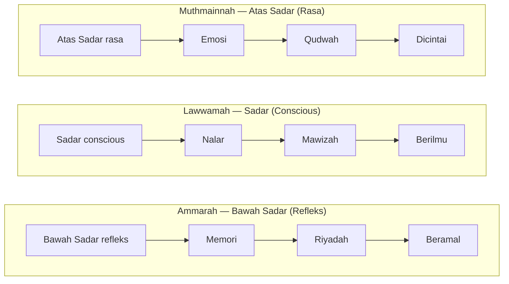
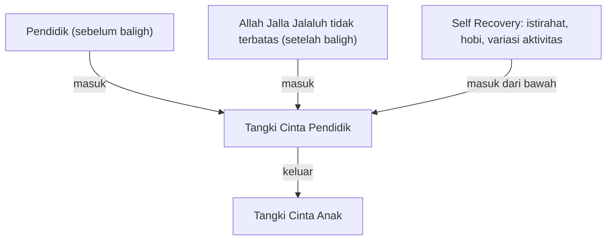
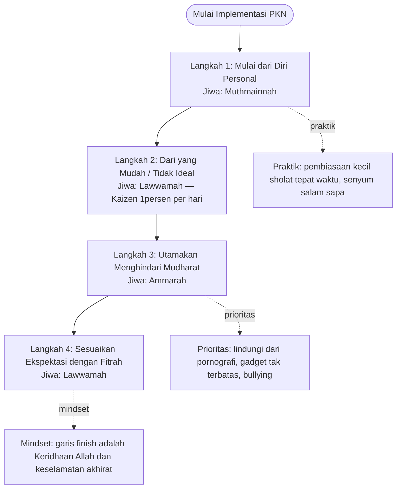
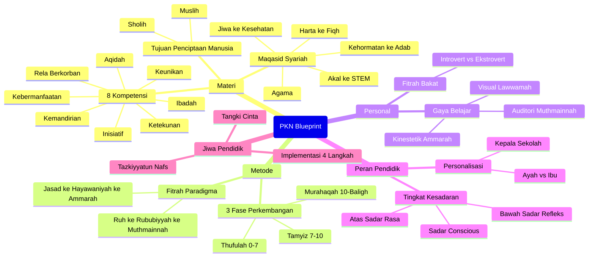

# PKN Blueprint: Arsitektur Sistem Pendidikan Karakter Nabawiyah

> **Amal** (What?) ← **Ilmu** (How?) ← **Iman** (Why?)

Kerangka pendidikan karakter berbasis Nabawiyah yang mengintegrasikan
**Jiwa Pendidik → Peran Pendidik → Metode Mendidik → Materi Pendidikan → Implementasi**.

---

## Navigasi Utama

---

## 1. Materi / Kompetensi

### 1.1 Tujuan Penciptaan Manusia

### 1.2 8 Kompetensi & Standar

| Kompetensi        | Jiwa         | Standar |
|-------------------|--------------|---------|
| Aqidah            | Iman (Hijau) | Individu |
| Ibadah            | Iman (Hijau) | Individu |
| Kemandirian       | Iman (Hijau) | Kelompok |
| Inisiatif         | Ilmu (Kuning)| Kelompok |
| Ketekunan         | Ilmu (Kuning)| Kelompok |
| Keunikan          | Amal (Merah) | Personal |
| Rela Berkorban    | Amal (Merah) | Personal |
| Kebermanfaatan    | Amal (Merah) | Personal |

> **Kesadaran akhir:** LD beretika dengan target akhirat

### 1.3 Maqasid Syariah dan Materi Kurikulum

| Maqasid       | Bidang      | Kurikulum         |
|---------------|-------------|-------------------|
| Agama (Hijau) | —           | —                 |
| Jiwa (Merah)  | Kesehatan   | Jasmani / P3K     |
| Akal (Kuning) | STEM        | Sains & Teknologi |
| Kehormatan    | Adab        | Adab & Akhlak     |
| Harta (Merah) | Fiqh        | Fiqh Muamalah     |

### 1.4 Penguasaan Skill — Skala

| Sumber       | Profil Sosial             | Level Jiwa |
|--------------|---------------------------|------------|
| cukup        | Individu/Publik           | Amal       |
| cukup        | Kolaborasi                | Ilmu       |
| cukup        | Emosi/Ibadah              | Iman       |

**Legend:** Cukup = baseline | Sesuai Bakat = optimal per jiwa

---

## 2. Metode & Perkembangan

### 2.1 Paradigma — 'Fitrah' sebagai Referensi

Analogi alam: Kucing mencari susu induk dan berlatih memburu secara alami.
Serangga langsung mencari makan dan berkembang biak tanpa diajarkan.

### 2.2 Tabel Perkembangan 3 Fase

| Fase | Kondisi | Pondasi | Aktivitas Utama | Jika Salah | Hasil |
|------|---------|---------|-----------------|------------|-------|
| **Murahaqah** (10–Baligh) | Jasad+++ Akal+++ Ruh+++ | Khouf / Ketegasan | Ta'dib → Beramal → Proyek | Dihukum | Berguna → Bakat → Amal |
| **Tamyiz** (7–10 thn)     | Jasad+ Akal++ Ruh++     | Roja' / Harapan   | Ta'allum → Pengajaran → Trial & Error | Dilatih | Bisa → Belajar → Ilmu |
| **Thufulah** (0–7 thn)    | Jasad+ Akal+ Ruh+       | Hub / Cinta       | Tazkiyyah → Membuat Kagum → Bermain | Ditoleransi | Suka → Iman → Iman |

### 2.3 Bobot Bahasa & Bobot Kesalahan per Fase

| Fase | Bobot Bahasa | Bobot Kesalahan |
|------|-------------|-----------------|
| Murahaqah (Baligh+) | **Tangan** (aksi langsung) | Harus Benar (tanggung jawab penuh) |
| Tamyiz (10 thn)     | **Lisan** (penjelasan) | Transisi — dilatih |
| Thufulah (7 thn)    | **Hati** (rasa & cinta) | **Boleh Salah** (toleransi luas) |

---

## 3. Personal — Gaya Belajar & Fitrah Bakat

### 3.1 Gaya Belajar per Jiwa

| Jiwa | Gaya Belajar | Cara Belajar | Ide Teknik |
|------|-------------|--------------|-----------|
| Ammarah | Kinestetik | Praktek / Proyek | Bergerak, Tantangan, Kedisiplinan |
| Lawwamah | Visual | Menonton / Diskusi | Media, Struktur, Reward |
| Muthmainnah | Auditori | Bercerita | Intonasi, Kelembutan, Mirroring |

### 3.2 Fitrah Bakat & Fitnah (Bahaya)

| Jiwa | Ego | Introvert | Ekstrovert | Fitnah |
|------|-----|-----------|------------|--------|
| Ammarah | Tinggi | Bekerja keras | Memerintah | Syahwat Tahta |
| Lawwamah | Sedang | Berpikir | Bekerjasama | Syubhat Harta |
| Muthmainnah | Rendah | Berperasaan | Melayani | Syahwat Pasangan |

---

## 4. Peran Pendidik & Disiplin

### 4.1 Tingkat Kesadaran & Alat Mendidik

### 4.2 Tipe Pembelajaran

#### Tidak Terencana (contoh: Sholat)

| Level | Tahap | Contoh Sholat | Kepada Orang Lain |
|-------|-------|--------------|-------------------|
| Amal | Beramal → Meniru | Membaguskan Sholat | Mengajak dalam kebaikan |
| Ilmu | Berilmu → Meniru | Inisiatif Mengikuti | Mau / Semangat menerima nasihat |
| Iman | Niat → Teladan → Kagum | Menunjukkan bagusnya sholat | Terdepan dalam kebaikan |

#### Terencana (contoh: Olahraga — Fisika Memanah)

| Level | Tahap | Contoh Memanah |
|-------|-------|----------------|
| Amal | Ujian | Membuat panah → Ujian memanah |
| Ilmu Teori | Cara memanah | Fisika: parabola, aerodinamika |
| Ilmu Praktek | Memegang → Mencoba → Membongkar panah | — |
| Iman | Inspirasi | Perang Rasul, sejarah memanah, teknologi, mentor |

### 4.3 Disiplin

| Aspek | Kondisi |
|-------|---------|
| Amal / Fisik | Mengikuti secara kondisional |
| Ilmu / Akal | Belajar ketika tidak tahu |
| Iman / Hati | Selalu dalam keadaan beriman |

### 4.4 Penyesuaian Perkembangan — Kedekatan & Peran

| Fase | Kedekatan Perempuan | Kedekatan Laki-laki | Pondasi | Peran |
|------|---------------------|---------------------|---------|-------|
| Murahaqah (10–Baligh) | Ayah | Ibu | Khouf / Ketegasan | Raja Tega |
| Tamyiz (7–10 thn) | Ibu | Ayah | Roja' / Harapan | Pengajar |
| Thufulah (0–7 thn) | Ibu (0-2) lalu Ibu & Ayah (2-7) | — | Hub / Cinta | Penyayang |

### 4.5 Personalisasi — Peran Ayah & Ibu

| Jiwa | Ego Pendidik | Membuat Kagum | Bahasa Cinta | Peran | Sifat | Jika Marah |
|------|-------------|---------------|--------------|-------|-------|-----------|
| Ammarah | Rendah | Dilayani | Pujian, Hadiah | **Ayah** → Pembersih Luka | Penyabar | Sekali marah — anak trauma |
| Lawwamah | Sedang | Diskusi (negosiasi) | Sentuhan, Kebersamaan | **Guru** | Pelaksana | — |
| Muthmainnah | Tinggi | Dimotivasi & dilindungi | Pemaafan, Pengorbanan | **Ibu** → Pelatih | Disiplin | Berkali-kali marah — anak tidak terluka |

> **Kepala Sekolah** = Konseptor (posisi strategis, bukan operasional)

---

## 5. Jiwa Pendidik & Implementasi

### 5.1 Arsitektur Tangki Cinta

### 5.2 Tazkiyyatun Nafs — Penyucian Jiwa Pendidik

| Jiwa | Kebutuhan | Dipenuhi Dengan | Amalan Hati | Praktik |
|------|-----------|-----------------|-------------|---------|
| Ammarah | Jasmani | Harta Halal | Khouf | Mujahadah, Riyadhah, Ibadah Sunnah |
| Lawwamah | Nalar | Menuntut Ilmu | Roja' | Belajar, Muraqabah |
| Muthmainnah | Ruhani | Muhasabah | Hub | Tadabbur, Tafakkur, Taubat, Berdoa |

> **Muara akhir:** Menikmati Ibadah

### 5.3 Implementasi — 4 Langkah Berurutan

#### Detail 4 Langkah Implementasi

| # | Langkah | Jiwa | Prinsip Utama |
|---|---------|------|---------------|
| 1 | Mulai dari Diri Personal | Muthmainnah | Perbaiki diri sendiri dahulu sebelum mendidik |
| 2 | Dari yang Mudah / Tidak Ideal | Lawwamah | Kaizen: perbaikan 1% konsisten lebih baik dari rencana besar tanpa aksi |
| 3 | Utamakan Menghindari Mudharat | Ammarah | Dar'ul mafaasid muqaddam 'ala jalbil mashalih (mencegah kerusakan didahulukan) |
| 4 | Sesuaikan Ekspektasi dengan Fitrah | Lawwamah | Tidak membanding-bandingkan anak; setiap anak unik dengan takdirnya |

---

## Checklist Audit Implementasi PKN

- [ ] Apakah guru mengajar dengan **kasih sayang** atau paksaan amarah?
- [ ] Apakah orang tua **hadir** mengisi tangki cinta anak setiap hari minimal 15–30 menit interaksi berkualitas tanpa distraksi gadget?
- [ ] Apakah penilaian karakter sudah berbasis **observasi perilaku nyata** (bukan sekadar hafalan teori ujian tertulis)?
- [ ] Apakah fase usia anak sudah diperlakukan sesuai kaidah:
  - **0–7 th** — dimanjakan cinta
  - **7–10 th** — dilatih nalar
  - **10–Baligh** — ditegakkan tanggung jawab

---

## Ringkasan Sistem PKN

---

## Legenda Jiwa

| Jiwa | Nama | Aspek | Domain |
|------|------|-------|--------|
| Merah | Ammarah | Fisik, Amal, Tindakan, Jasad | Ta'dib (hukum & disiplin) |
| Kuning | Lawwamah | Akal, Ilmu, Nalar, Belajar | Ta'allum (belajar & nalar) |
| Hijau | Muthmainnah | Ruh, Iman, Cinta, Ketenangan | Tazkiyyah (penyucian hati) |
| Ungu | Khusus | Peran Profesi, Tangki Cinta, Jiwa Pendidik | Implementasi |
| Biru | Sosial | Imunitas Sosial | Interaksi Kemasyarakatan |

---

## Tautan Navigasi Terkait

* [[index|Paradigma & Implementasi: Indeks Utama]]
* [[Pendidikan Ideal/Menumbuhkan Kesadaran Beramal|Menumbuhkan Kesadaran Beramal]]
* [[Insan/Tujuan Hidup Manusia|Tujuan Hidup Manusia: Sholih & Muslih]]
* [[Implementasi/Kaidah & Elemen/8 Standar Implementasi PKN|8 Standar Implementasi PKN]]
* [[Insan/Fitrah (Karakter)/Perkembangan/Thufulah|Fase Perkembangan: Thufulah (0–7 Tahun)]]
* [[Insan/Fitrah (Karakter)/Perkembangan/Tamyiz|Fase Perkembangan: Tamyiz (7–10 Tahun)]]
* [[Insan/Fitrah (Karakter)/Perkembangan/Murahaqah|Fase Perkembangan: Murahaqah (10–Baligh)]]
* [[Insan/Fitrah (Karakter)/Bakat/Panduan Asesmen dan Observasi TB40|Panduan Asesmen dan Observasi TB40]]
* [[Insan/Fitrah (Karakter)/Bakat/Kuisioner Asesmen 40 Bakat Nabawiyah|Kuisioner Asesmen 40 Bakat Nabawiyah]]
* [[Implementasi/Peran & Tanggung Jawab/Peran Ayah dan Bunda|Peran Ayah dan Bunda]]
* [[Implementasi/Internal & Eksternal/Tazkiyatun Nafs|Tazkiyatun Nafs Pendidik]]
* [[Pendidikan Ideal/Luka dan Hutang Pengasuhan/Recovery|Panduan Recovery dan Penanganan Hutang Pengasuhan]]
