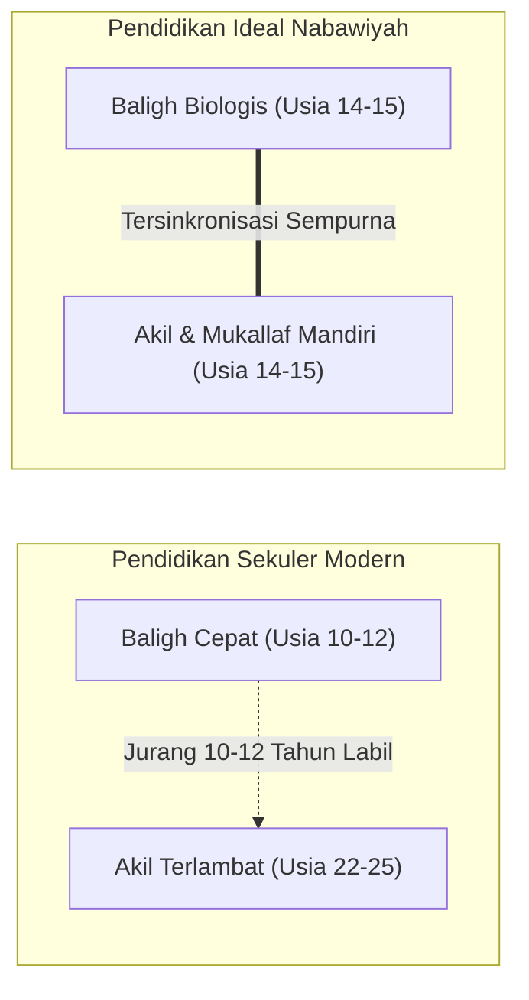

# Pendidikan Ideal Nabawiyah: Menautkan Akil dan Baligh Menuju Generasi Peradaban

> [!quote] Dalil & Rujukan Nabawiyah Utama
> **Naskah:**  
> « كُنتُمْ خَيْرَ أُمَّةٍ أُخْرِجَتْ لِلنَّاسِ تَأْمُرُونَ بِالْمَعْرُوفِ وَتَنْهَوْنَ عَنِ الْمُنكَرِ وَتُؤْمِنُونَ بِاللَّهِ »
>
> *"Kalian adalah sebaik-baik umat (khaira ummah) yang dilahirkan untuk manusia; (karena kalian) menyuruh berbuat ma'ruf, mencegah dari kemungkaran, dan beriman kepada Allah..."*
>
> 📚 **Sumber Rujukan OpenBayan:** QS. Ali 'Imran: 110; Tafsir Ibnu Katsir (Juz 2 Hal. 93); Shahih Al-Bukhari No. 4557; Syarah Riyadush Shalihin.  
> 💡 **Relevansi PKN:** Pendidikan Ideal dalam Islam bukanlah pabrikasi ijazah formal atau perlombaan skor akademis semata, melainkan ikhtiar agung mencetak generasi *Khairu Ummah* yang matang akal budinya (*Akil*) beriringan dengan kedewasaan fisiknya (*Baligh*), kokoh tauhidnya, dan berdaya guna membangun peradaban.

---

## 1. Hakikat Pendidikan Ideal: Rekonstruksi Paradigma Akil-Baligh

Pendidikan Ideal dalam Pendidikan Karakter Nabawiyah (PKN) berakar pada satu misi sentral: **Mengantarkan anak mencapai kedewasaan mental, spiritual, dan sosial (*Akil*) tepat bersamaan dengan datangnya kedewasaan biologis (*Baligh*)**.

### Kesenjangan Patologis Peradaban Modern:
Dalam sistem pendidikan modern sekuler, terjadi jurang pemisah yang sangat lebar (*gap*) antara baligh biologis dan kematangan akal:
* **Baligh Dipercepat:** Karena paparan nutrisi hewani modern berhormon dan banjir rangsangan visual digital, anak-anak mengalami pubertas biologis lebih dini (usia 10–12 tahun).
* **Akil Ditunda-tunda:** Di sisi lain, sistem persekolahan formal menunda kedewasaan mental anak hingga usia 22–25 tahun (lulus kuliah). Anak usia 17 tahun yang telah baligh selama bertahun-tahun masih diperlakukan sebagai "anak-anak" yang tidak berdaya, tidak mandiri secara finansial, dan bebas dari tanggung jawab sosial.
* **Ledakan Masalah Remaja:** Jurang pemisah 10–12 tahun antara baligh dan akil ini melahirkan fenomena kebingungan identitas, kecanduan pornografi, pergaulan bebas, apatisme, hingga depresi mental.

Pendidikan Ideal Nabawiyah menolak pengkastaan generasi "buih" (*ghutsa'*). Anak yang telah baligh adalah orang dewasa penuh (*rijal / nisa'*) yang siap memikul beban hukum syariat (*taklif*) dan memimpin umat.

---

## 2. Teladan Rasulullah ﷺ Membangun Generasi Terbaik

Rasulullah ﷺ diutus kepada bangsa Arab jahiliyah yang terpecah-belah, buta huruf, dan menyembah berhala. Dalam kurun waktu hanya 23 tahun, melalui metode pendidikan berbasis fitrah dan masjid, beliau berhasil mentransformasikan lebih dari 120.000 manusia menjadi generasi paling agung sepanjang sejarah manusia:

### A. Ekosistem Ash-Shuffah: Universitas Karakter Nabawiyah Pertama
Di serambi Masjid Nabawi, Rasulullah ﷺ membina para sahabat di *Ash-Shuffah*—sebuah lingkungan belajar yang menyatukan antara tilawah Al-Qur'an, pembersihan jiwa (*tazkiyah*), kajian fiqih praktis, dan kerja keras fisik. Di sanalah lahir para ulama besar hadits seperti Abu Hurairah radhiyallahu 'anhu yang mencurahkan siang dan malamnya menyerap ilmu langsung dari bibir kenabian.

### B. Mendidik Manusia Sesuai Keunikannya: Tidak Ada Penyeragaman Kaku
Rasulullah ﷺ tidak pernah meratakan para sahabatnya dengan satu kurikulum seragam:
* Kepada **Abu Dzar Al-Ghifari** yang berjiwa zuhud dan perasa, beliau menasihatkan agar tidak memegang jabatan kepemimpinan: *"Wahai Abu Dzar, sesungguhnya engkau lemah, dan sesungguhnya kepemimpinan itu adalah amanah yang bisa menjadi kehinaan dan penyesalan di hari kiamat!"* (HR. Muslim No. 1825).
* Kepada **Khalid bin Al-Walid** yang berjiwa ksatria dan berani memimpin, beliau tidak memaksanya menjadi penghafal hadits, melainkan mengangkatnya menjadi panglima tertinggi: *"Khalid adalah pedang di antara pedang-pedang Allah yang Dia hunus atas orang-orang kafir!"* (HR. Tirmidzi No. 3820).
* Kepada **Zaid bin Tsabit** yang memiliki kecerdasan logika dan ketelitian hafalan, beliau menugaskannya memimpin dewan pencatatan wahyu Al-Qur'an dan menguasai ilmu faraidh.

---

## 3. Keterangan Para Ulama Otoritatif

### 1. Sosiolog Muslim Ibnu Khaldun (Wafat 808 H)
Dalam kitab monumentalnya *Al-Muqaddimah* (Bab 6: Bahaya Kekerasan Guru Terhadap Murid):
> « إِنَّ الإِرْهَافَ فِي التَّعْلِيمِ مُضِرٌّ بِالمُتَعَلِّمِ، سِيَّمَا فِي أَصَاغِرِ الوَلَدِ... وَمَنْ كَانَ مَرْبَاهُ بِالعَسْفِ وَالقَهْرِ مِنَ المُتَعَلِّمِينَ، سَطَا بِهِ القَهْرُ، وَضَيَّقَ عَلَى النَّفْسِ فِي انْبِسَاطِهَا، وَذَهَبَ بِنَشَاطِهَا، وَدَعَاهُ إِلَى الكَسَلِ، وَحَمَلَ عَلَى الكَذِبِ وَالخُبْثِ... فَتَفْسُدُ مَعَانِي الإِنْسَانِيَّةِ الَّتِي فِي فِطْرَتِهِ! »  
> *"Sesungguhnya bersikap keras dan membebani dalam pengajaran sangat berbahaya bagi para penuntut ilmu, terlebih bagi anak-anak kecil... Barangsiapa yang metode pendidikannya didasarkan pada kekerasan, paksaan, dan intimidasi, maka paksaan itu akan menindas jiwanya, menyempitkan kelapangan hatinya, mematikan gairah belajarnya, menyeretnya kepada kemalasan, serta mendorongnya untuk berbohong dan bersikap licik demi menghindari hukuman... Akibatnya, nilai-nilai kemanusiaan luhur yang ada pada fitrah aslinya akan rusak binasa!"*

### 2. Imam Ibnu Qayyim Al-Jauziyyah
Dalam kitab *I'lamul Muwaqqi'in*:
> *"Syariat ini seluruhnya dibangun di atas hikmah dan kemaslahatan bagi para hamba di dunia dan akhirat. Keadilan syariat menuntut bahwa pendidikan anak harus memperhatikan watak bawaan (*syakilah*) dan kesiapan fitrahnya; tidak boleh memaksakan ikan untuk terbang atau memaksa burung untuk menyelam."*

---

## 4. Enam Pilar Ekosistem Pendidikan Ideal PKN

Untuk merealisasikan pendidikan ideal yang memerdekakan fitrah anak, PKN merumuskan **6 Pilar Ekosistem**:

1. **[[Benang Merah Pendidikan]]**: Menghubungkan seluruh cabang ilmu pengetahuan dengan tauhidullah, membongkar sekularisme kurikulum modern.
2. **[[Metode Mendidik]]**: Mengoperasikan Tiga Bahasa Nabawiyah (Bahasa Hati, Bahasa Lisan, Bahasa Tangan) secara berjenjang.
3. **[[Pembelajaran Alamiah]]**: Mengembalikan pembelajaran ke habitat kehidupan nyata (magang, observasi alam bebas, interaksi sosial nyata) tanpa terpenjara di empat dinding kelas.
4. **[[Luka dan Hutang Pengasuhan]]**: Menyediakan protokol pemulihan (*recovery*) bagi fitrah yang terdistorsi oleh kesalahan pola asuh masa lalu.
5. **[[Batas Toleransi]]**: Menentukan titik temu kapan orang tua harus melonggarkan pemaafan dan kapan harus menegakkan ketegasan sanksi syariat per fase usia.
6. **[[Imunitas Sosial]]**: Membangun benteng kekebalan karakter agar generasi muslim mampu menjadi filter mandiri di tengah tsunami informasi dan pergaulan digital.

---

## 5. Tautan Konseptual Terkait
* [[Benang Merah Pendidikan]] — Kritik Arsitektur Pendidikan Modern.
* [[Metode Mendidik]] — Tiga Bahasa Pengasuhan Nabawiyah.
* [[Pembelajaran Alamiah]] — Metode Belajar Berbasis Ekosistem Nyata.
* [[Perkembangan]] — Pentahapan Usia Menuju Akil-Baligh.
* [[Tujuan Hidup Manusia]] — Orientasi Penciptaan Khalifah fil Ardh.
