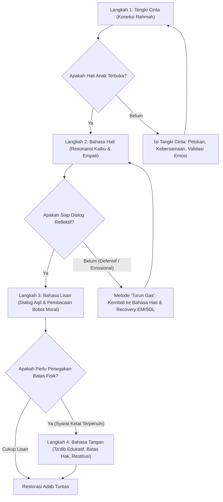

# Bank Studi Kasus Kurikulum Berbasis Peristiwa: Panduan Restorasi Adab & Karakter Anak

> [!note] Catatan Metodologi & Sumber Penyusunan Dokumen
> Dokumen ini merupakan hasil rangkuman dan rekonstruksi berbantuan kecerdasan buatan (AI) dari berbagai materi presentasi, modul kurikulum, dokumen standar lembaga, dan rekaman kajian **Pendidikan Karakter Nabawiyah (PKN)** yang diampu oleh **Ustadz Abdul Kholiq**.  
> 
> Naskah ini telah melalui verifikasi dan pengayaan ulang dalil-dalil Al-Qur'an dan Hadits shahih dari korpus **OpenBayan** (60 kitab klasik), serta diperkaya dengan sintesis intisari dan masukan berharga dari kawan-kawan **Himmatul Ummah**, **Insan Taqwa / Mustaqbal**, dan **Tim SOTAB HEBAT**.

> [!quote] Dalil & Rujukan Nabawiyah
> **Naskah:**  
> « إِنَّ اللَّهَ رَفِيقٌ يُحِبُّ الرِّفْقَ، وَيُعْطِي عَلَى الرِّفْقِ مَا لَا يُعْطِي عَلَى الْعُنْفِ وَمَا لَا يُعْطِي عَلَى مَا سِوَاهُ »
>
> *"Sesungguhnya Allah itu Maha Lembut dan mencintai kelemahlembutan. Dia memberikan pada kelemahlembutan apa yang tidak Dia berikan pada kekerasan, dan apa yang tidak Dia berikan pada selainnya."*
>
> 📚 **Sumber Rujukan OpenBayan:** HR. Muslim (Shahih Muslim No. 2593) & Syarah Riyadush Shalihin (Juz 49 Hal. 7)  
> 💡 **Relevansi PKN:** Penanganan setiap studi kasus penyimpangan anak harus diawali dengan pendinginan emosi, pengisian tangki cinta, dan pendekatan bertahap berbasis kelembutan.

---

## 1. Landasan Filosofis: Mengatasi Kesenjangan Aqil-Baligh melalui Peristiwa

Dalam lanskap pendidikan kontemporer, kita menghadapi krisis arsitektural yang fundamental: fenomena di mana **"Baligh datang lebih cepat, namun Aqil datang lebih lambat"**. Generasi digital hari ini mengalami akselerasi kematangan biologis akibat paparan gizi dan informasi visual, namun sering kali mengalami keterlambatan dalam kematangan akal, kemandirian mental, dan tanggung jawab spiritual (*mukallaf*). Ketimpangan ini bukan sekadar tren sosial, melainkan sebuah kegagalan sistemik yang memerlukan **Restorasi Karakter (*Character Recovery*)** sebagai prioritas strategis.

Kurikulum Berbasis Peristiwa adalah instrumen utama untuk melakukan pemulihan tersebut. Peristiwa harian—baik berupa konflik anak, pelanggaran aturan, kemalasan ibadah, maupun hambatan emosi—bukanlah gangguan bagi proses pendidikan, melainkan **pintu masuk utama (*entry point*)** bagi penanaman adab yang paling organik. Jika peristiwa ini diabaikan atau diselesaikan dengan kemarahan reaktif, kita berisiko melahirkan *"dewasa biologis namun anak-anak secara fungsional"*.

Setiap konflik adalah ruang bagi seorang anak untuk bertransformasi menjadi seorang *Muta'allim* (pembelajar) sejati. Untuk mengelola peristiwa secara terarah, diterapkan kerangka kerja arsitektural empat langkah: **Tangki Cinta**, **Bahasa Hati**, **Bahasa Lisan**, dan **Bahasa Tangan**.

---

## 2. Kerangka Kerja Restorasi: Metode Empat Langkah (*The 4-Step Framework*)

Kerangka ini berakar pada prinsip *Adab al-Mu'allimin* (Etika Pendidik), di mana peran orang tua adalah sebagai arsitek jiwa yang memegang amanah besar (*Mas’uliyah ‘Adhimah*).

### Penjelasan 4 Langkah:

1. **Langkah 1: Tangki Cinta (Koneksi Spiritual & Emosional)**  
   Seorang pendidik (*Mu'allim*) wajib menghadirkan kasih sayang (*rahmah*) sebelum instruksi. Pendidik adalah pelindung yang menjaga anak dari pertanggungjawaban berat di hadapan Allah. Tangki cinta bukan sekadar kenyamanan emosional, melainkan pemenuhan amanah agar orang tua selamat di hari hisab kelak.
2. **Langkah 2: Bahasa Hati (Empati & Keikhlasan Niat)**  
   Restorasi bermula dari keikhlasan kalbu pendidik. Sebelum menyentuh perilaku lahiriah, pendidik harus memastikan adanya resonansi batin yang menembus fitrah anak. Tanpa keikhlasan dan koneksi hati, instruksi hanya akan dianggap paksaan yang memicu resistensi bawah sadar.
3. **Langkah 3: Bahasa Lisan (Instruksi Reflektif & Dialog Moralitas)**  
   Mengambil inspirasi dari tradisi *Kuttab* yang mendahulukan adab membaca dan memahami sebelum ilmu kompleks, pendidik membimbing anak agar mampu "membaca" bobot moral dari perbuatannya. Dialog harus bersifat reflektif untuk menyalakan nalar kesadaran (*Aqil*), bukan khutbah satu arah yang menghakimi.
4. **Langkah 4: Bahasa Tangan (Konsekuensi, Batas Hak, dan Ta'dib)**  
   Ketegasan dalam tradisi Nabawi disebut sebagai *Ta'dib*. Pendidik wajib menegakkan keadilan (*'adl*) bahkan dalam disiplin. Bahasa tangan adalah bentuk perlindungan terhadap martabat dan batasan hak anak, bukan pelampiasan amarah ego pendidik, yang bertujuan mengoreksi perilaku tanpa menghancurkan harga dirinya.

---

### Perbandingan Paradigma Pendidikan

| Tahapan | Pendekatan Reaktif (Konvensional) | Pendekatan Restorasi Nabawi (Arsitektural) |
|---|---|---|
| **Tangki Cinta** | Menghukum saat emosi memuncak; hubungan bersifat transaksional dan bersyarat. | Menjalankan amanah melalui *rahmah* tanpa syarat untuk menyelamatkan jiwa anak. |
| **Bahasa Hati** | Fokus pada kepatuhan instan demi ketenangan sesaat orang tua. | Fokus pada keikhlasan niat pendidik untuk menyentuh fitrah batin anak. |
| **Bahasa Lisan** | Menggunakan ancaman, sarkasme, label (*labeling*), atau ceramah sepihak. | Dialog reflektif; anak diajak "membaca" sebab-akibat moralitas tindakannya. |
| **Bahasa Tangan** | Hukuman fisik impulsif yang melukai fisik dan merendahkan martabat. | Penegakan *Ta'dib*, pemisahan batas hak, dan restitusi yang adil (*'adl*). |

---

## 3. Studi Kasus 1: Anak Menolak/Mogok Shalat Fardhu

Shalat adalah fondasi adab pertama dalam Islam. Kegagalan dalam menangani hal ini secara tepat akan merusak bangunan ketaatan dan spiritualitas anak di masa depan.

* **Tangki Cinta:** Bangun persepsi bahwa shalat adalah sarana hamba beristirahat dan berlindung kepada Penciptanya, bukan beban administratif rumah tangga. Cek apakah ada luka pengasuhan atau penolakan anak terhadap orang tua yang dilampiaskan melalui ibadah.
* **Bahasa Hati:** Selami hambatan internal anak dengan penuh empati. Dengarkan keluhannya tanpa langsung memotong atau mencapnya "anak durhaka".
* **Bahasa Lisan:** Terapkan penjenjangan sesuai usia:
  - Usia 0–7 tahun (*Thufulah*): Ajak dengan keteladanan visual dan suasana menggembirakan.
  - Usia 7–10 tahun (*Tamyiz*): Bergeser dari sekadar mengajak menjadi memerintah (*amr*) dengan cara yang ramah namun disiplin.
  - Usia 10+ tahun (*Murahaqah*): Tegaskan kewajiban shalat dengan dialog kedewasaan menjelang status *mukallaf*.
* **Bahasa Tangan:** Jika anak usia 10 tahun ke atas tetap menolak setelah ratusan kali diingatkan dengan cinta, terapkan ketegasan edukatif (*pukulan ghairu mubarrih* yang tidak menyakiti, tidak pada wajah, dan tanpa amarah) semata-mata sebagai sinyal ketegasan syariat.

> [!TIP]
> **Rujukan Kajian Video Ustadz Abdul Kholiq (PKN Video Database):**
> * *Contoh Nabi SAW: Shalat Sambil Bermain Bersama Cucu* — [Tonton di YouTube @ 50:17](https://youtu.be/Hsso7YcGv8c?t=3017s)
> * *Metode Bertahap Mendidik Salat Sesuai Usia: 0-7, 7-10, 10+ Tahun* — [Tonton di YouTube @ 69:35](https://www.youtube.com/live/eeyy_v54eWA?t=4175s)
> * *Metode Penuntasan Egosentris Anak Menjelang Baligh* — [Tonton di YouTube @ 05:37](https://www.youtube.com/watch?v=bViBlJGuIOU&t=337s)
> * *Bahaya Memarahi Anak Kecil di Masjid* — [Tonton di YouTube @ 02:20](https://www.youtube.com/watch?v=B-dnDt1czLI&t=140s)

> **Analisis "So What?":**  
> Penanganan yang keras dan kasar tanpa dasar cinta pada tahap ini akan menciptakan trauma spiritual (*spiritual wound*) yang menjauhkan anak dari masjid dan Tuhannya secara permanen.

---

## 4. Studi Kasus 2: Pertengkaran Hebat Antar-Saudara (*Sibling Rivalry*)

Konflik saudara adalah laboratorium keluarga untuk membangun akhlak pribadi (*syakhshiyyah*) dan kecerdasan sosial anak.

* **Tangki Cinta:** Pendidik wajib bertindak adil (*'adl*). Rasulullah ﷺ melarang orang tua melebihkan kasih sayang lahiriah pada salah satu anak di depan anak lainnya. Perlakuan diskriminatif akan merusak tangki cinta kedua belah pihak.
* **Bahasa Hati:** Validasi emosi kedua belah pihak tanpa langsung mencari siapa yang salah. Katakan: *"Bunda paham kamu marah karena mainanmu diambil, dan Bunda juga paham adik ingin ikut bermain."*
* **Bahasa Lisan:** Ajarkan bahasa resolusi konflik: bagaimana mengungkapkan keinginan dengan kata-kata, bukan dengan pukulan atau jeritan. Ajak keduanya merundingkan solusi giliran (*turn-taking*).
* **Bahasa Tangan:** Intervensi fisik dilakukan hanya untuk melerai demi keselamatan. Amankan benda yang diperebutkan sementara waktu sampai keduanya siap berdamai secara mandiri.

> [!TIP]
> **Rujukan Kajian Video Ustadz Abdul Kholiq (PKN Video Database):**
> * *Mengatasi Pertengkaran Antar Saudara Tanpa Penghakiman* — [Tonton di YouTube @ 130:41](https://www.youtube.com/live/lTrVXBUVnSM?t=7841s)
> * *Strategi Menghadapi Sibling Rivalry (Kecemburuan Kakak-Adik)* — [Tonton di YouTube @ 57:50](https://www.youtube.com/watch?v=SQrC2H38EV4&t=3470s)
> * *Cara Bijak Menangani Adik-Kakak yang Sering Bertengkar* — [Tonton di YouTube @ 89:39](https://www.youtube.com/live/eeyy_v54eWA?t=5379s)

> **Analisis "So What?":**  
> Pengelolaan konflik saudara yang adil akan melatih kematangan sosial anak saat dewasa dalam mengelola relasi publik dan persaudaraan sesama mukmin.

---

## 5. Studi Kasus 3: Adiksi Layar Gawai (*Gadget Screen Time*)

Gawai dalam konteks digital sering berfungsi sebagai *"Aqil-delayer"* (penghambat kematangan akal) karena membanjiri otak anak dengan dopamin instan tanpa proses perjuangan nyata.

* **Tangki Cinta:** Anak yang tangki cintanya kosong di rumah akan mencari pelarian dan pengakuan semu di dunia maya. Gantikan dopamin digital dengan dopamin alami melalui kehadiran fisik, kebersamaan bermain, dan dialog hangat bersama orang tua.
* **Bahasa Hati:** Pahami apa yang dicari anak di balik layar (apakah hiburan, pelarian dari rasa kesepian, atau kebutuhan diakui kehebatannya). Jangan memusuhi gawai sebagai benda, melainkan arahkan pemanfaatannya.
* **Bahasa Lisan:** Buat *aqad* (kesepakatan tertulis) bersama anak mengenai batas waktu, zona bebas layar di rumah, dan konsekuensi jika dilanggar.
* **Bahasa Tangan:** Pengaturan kata sandi, filter konten, atau penyimpanan gawai di tempat khusus orang tua adalah bentuk *"Amanah Protection"*—perlindungan orang tua terhadap fitrah jiwa anak dari polusi digital.

### 3 Prinsip Kunci Restorasi Gawai:
1. **Gawai sebagai Aqil-Delayer:** Batasi stimulasi digital berlebih untuk mempercepat kematangan akal dan daya juang (*Himmah*).
2. **Amanah Protection:** Pembatasan dan penyitaan bukan bentuk dendam atau hukuman, melainkan mandat penjagaan fitrah.
3. **Restorasi Dopamin Alami:** Hubungan nyata manusia adalah penawar utama kecanduan layar digital.

> [!TIP]
> **Rujukan Kajian Video Ustadz Abdul Kholiq (PKN Video Database):**
> * *Tangki Cinta Anak & Mengapa Anak Mencari Pelarian ke Gadget* — [Tonton di YouTube @ 105:15](https://www.youtube.com/live/6H-qENwmmcw&t=6315s)
> * *Cara Menyikapi Gadget pada Anak dengan Benar* — [Tonton di YouTube @ 70:29](https://www.youtube.com/watch?v=SemUZTg1xwo&t=4229s)
> * *Memahami Karakteristik Generasi Digital (Alfa & Beta)* — [Tonton di YouTube @ 65:23](https://www.youtube.com/watch?v=iVLk4cfj_I4&t=3923s)

---

## 6. Studi Kasus 4: Anak Tertangkap Berbohong (*Kadzib*)

Kejujuran (*Shidq*) adalah pilar mahkota adab seorang penuntut ilmu (*Muta'allim*). Dusta spontan pada anak sering kali merupakan alarm adanya rasa takut yang berlebihan terhadap amarah orang tua.

* **Tangki Cinta:** Ciptakan *"Safe Zone"* di rumah: pastikan anak tahu bahwa kejujuran selalu dihargai dan diapresiasi jauh lebih tinggi daripada kesempurnaan perbuatan.
* **Bahasa Hati:** Teliti motif di balik kebohongan: apakah ia berbohong karena takut dimarahi, malu, atau karena meniru orang dewasa yang sering berjanji palsu?
* **Bahasa Lisan:** Jangan pernah melabeli anak sebagai "pembohong". Gunakan dialog reflektif: *"Bunda tahu kamu takut Bunda marah, tapi Bunda sangat menghargai jika kamu berkata jujur. Apa yang sebenarnya terjadi?"*
* **Bahasa Tangan:** Terapkan prinsip **Restitusi**: ajak anak bertanggung jawab memperbaiki dampak kekeliruannya (misal: membersihkan barang yang pecah, meminta maaf pada pihak yang dirugikan) tanpa mempermalukannya di depan orang lain.

> [!TIP]
> **Rujukan Kajian Video Ustadz Abdul Kholiq (PKN Video Database):**
> * *Apresiasi Kejujuran Anak Ketika Mengakui Kesalahan* — [Tonton di YouTube @ 30:06](https://www.youtube.com/watch?v=hODlNvl6qcc&t=1806s)
> * *Mengambil Pelajaran Berharga dari Peristiwa Harian Anak* — [Tonton di YouTube @ 60:20](https://www.youtube.com/watch?v=q1wvV_LpnUw&t=3620s)
> * *Metode Recovery: Prinsip Naik Turun Gas Antara Lisan dan Hati* — [Tonton di YouTube @ 81:49](https://www.youtube.com/live/OJhA20R7aDA&t=4909s)

> **Analisis "So What?":**  
> Kejujuran anak adalah investasi terbesar bagi warisan kebaikan orang tua; anak yang *Shidq* akan tumbuh menjadi pribadi yang berintegritas dan senantiasa mendoakan orang tuanya dengan tulus.

---

## 7. Kaidah Emas: Prinsip "Naik Turun Gas" dalam Restorasi

Dalam mendidik dan memulihkan adab anak saat terjadi peristiwa, Ustadz Abdul Kholiq memberikan kaidah praktis yang dianalogikan dengan **"Naik Turun Gas"**:

1. Mulailah dialog menggunakan **Bahasa Lisan**.
2. Jika anak menolak, membantah, atau menunjukkan tanda-tanda emosi meninggi, **jangan langsung menginjak gas lebih dalam dengan Bahasa Tangan atau bentakan keras**.
3. Segera **turunkan gas kembali ke Bahasa Hati**: dekap anak, tenangkan emosinya, beri minum, dan dengarkan perasaannya hingga detak jantungnya kembali stabil (*Recovery EMISOL*).
4. Setelah frekuensi hati kembali tersambung dan suasana cair, barulah **naikkan gas perlahan kembali ke Bahasa Lisan** untuk membahas komitmen dan penyelesaian masalah.

---

## 8. Penutup: Menjadi Pendidik yang Memikul Amanah Besar

Keberhasilan kurikulum berbasis peristiwa tidak bergantung pada kesempurnaan teknik semata, melainkan pada kebersihan hati dan kesadaran spiritual orang tua sebagai *Mu'allim*. Sebagaimana ditekankan dalam ajaran Nabawiyah, setiap orang tua memikul **"Tanggung Jawab yang Besar" (*Mas’uliyah ‘Adhimah*)** yang terkalung di leher mereka:

$$\text{كُلُّكُمْ رَاعٍ وَكُلُّكُمْ مَسْئُولٌ عَنْ رَعِيَّتِهِ}$$

Setiap peristiwa, insiden, dan pertengkaran di rumah bukanlah beban pengganggu, melainkan **"Kuttab Nabawiyah di dalam rumah"** yang Allah gelar khusus untuk menumbuhkan akal dan adab ananda. Dengan merespons setiap peristiwa secara bertahap dan beradab, kita memastikan anak tumbuh tidak hanya baligh secara jasmani, tetapi juga paripurna kematangan akalnya (*Aqil-Baligh*) menuju hamba Allah yang bertaqwa.

---

> [!quote] Dokumen & Slide Presentasi Rujukan Resmi PKN
> Pembahasan dalam artikel ini bersumber langsung dari materi tayang pelatihan dan dokumen kurikulum resmi PKN oleh **Ustadz Abdul Kholiq**:
>
> - **Materi:** *3. PEMULIHAN KARAKTER (Materi 3)*
>   - 📖 **Rujukan Slide:** Slide Hal. 22–65 (Protokol Pemulihan Karakter, 9 Tahap Menghapus Noda Hati, Terapi Luka Batin)
>   - 🔗 **Akses Berkas:** [📊 Unduh PPTX Asli (51.7 MB)](https://www.dropbox.com/scl/fi/i4wqpb1kbveh33ln1nzkq/3.-PEMULIHAN-KARAKTER-MATERI-3.pptx?rlkey=1bauf7luniop6gjq36dtc0sh1&dl=1) • [👁️ Buka di Dropbox](https://www.dropbox.com/scl/fi/i4wqpb1kbveh33ln1nzkq/3.-PEMULIHAN-KARAKTER-MATERI-3.pptx?rlkey=1bauf7luniop6gjq36dtc0sh1&dl=0)
>
> - **Materi:** *2. Menangani Anak yang Bermasalah*
>   - 📖 **Rujukan Slide:** Slide Hal. 10–38 (Diagnosis Masalah Anak: Perilaku Permukaan vs Luka Hati Tersembunyi)
>   - 🔗 **Akses Berkas:** [📥 Unduh PDF (7.8 MB)](https://www.dropbox.com/scl/fi/0gawb637j3l5p76m037o3/2.-Menangani-anak-yang-bermasalah.pdf?rlkey=26i13l75150w0nff636p311t9&dl=1) • [📊 Unduh PPTX Asli (15.4 MB)](https://www.dropbox.com/scl/fi/1jsh6r3q0e9477q0e25q2/2.-Menangani-anak-yang-bermasalah.pptx?rlkey=1x696k9m9m1j2v2q3o0p713s5&dl=1) • [👁️ Buka di Dropbox](https://www.dropbox.com/scl/fi/0gawb637j3l5p76m037o3/2.-Menangani-anak-yang-bermasalah.pdf?rlkey=26i13l75150w0nff636p311t9&dl=0)
>
> - **Materi:** *RECOVERY KESADARAN & PENANGANAN BULLYING*
>   - 📖 **Rujukan Slide:** Slide Hal. 1–24 (Langkah Pemulihan Kesadaran Fitrah & Penanganan Korban/Pelaku Bullying)
>   - 🔗 **Akses Berkas:** [📥 Unduh PDF (2.8 MB)](https://www.dropbox.com/scl/fi/f0g93j8z45963o7s5114n/RECOVERY-KESADARAN.pdf?rlkey=q61109u516p7t2n2577q310s5&dl=1) • [📊 Unduh PPTX Asli (5.2 MB)](https://www.dropbox.com/scl/fi/2q97p16m307o245u88963/RECOVERY-KESADARAN.pptx?rlkey=p6108u45903o7s26104n982p3&dl=1) • [👁️ Buka di Dropbox](https://www.dropbox.com/scl/fi/f0g93j8z45963o7s5114n/RECOVERY-KESADARAN.pdf?rlkey=q61109u516p7t2n2577q310s5&dl=0)

