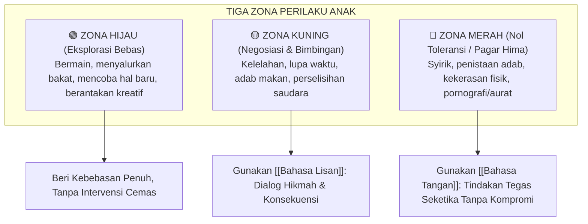

> [!info] Refleksi Lapangan: Problematika Nyata dalam Dinamika Batas Toleransi
> **Kondisi Faktual:** Banyak keluarga dan institusi pendidikan menghadapi benturan nyata saat menerapkan Batas Toleransi, di mana niat baik mendidik sering kali berujung pada perlawanan anak atau hasil yang semu.  
> **Akar Masalah PKN:** Mengabaikan kondisi kesiapan batin (*tahapan qalbiyah*) dan memaksakan instrumen lahiriah tanpa mengisi jembatan kelekatan kasih sayang terlebih dahulu.  
> **Langkah Penanganan Nabawiyah:**  
> 1. Mulai dari pemulihan keheningan kalbu pendidik (*tazkiyatun nafs*) dan doa yang tulus.  
> 2. Penuhi tangki cinta anak agar terjalin rasa aman (*trust*) yang kokoh.  
> 3. Terapkan prinsip penahapan (*tadarruj*) dan kelembutan hikmah (*rifq*) dalam menegakkan batasan syariat.

> [!warning] Peringatan Risiko Pengasuhan: Jebakan Fatal dalam Batas Toleransi
> * **Bentuk Kesalahan:** Menggunakan ancaman, amarah tanpa kendali, atau menuntut perubahan instan dalam waktu semalam.
> * **Dampak Terhadap Jiwa:** Memadamkan gairah fitrah, menimbulkan kebencian tersembunyi, dan melahirkan generasi hipokrit yang hanya patuh saat diawasi.
> * **Pencegahan Nabawiyah:** Rasulullah ﷺ menegaskan: *"Sesungguhnya kelembutan tidaklah berada pada sesuatu melainkan ia akan menghiasinya, dan tidaklah kelembutan dicabut dari sesuatu melainkan ia akan memperburuknya"* (HR. Muslim).

> [!tip] Tips Praktis Pengasuhan Hari Ini
> * **Aksi Sederhana:** Tahan diri Anda dari memberikan teguran atau nasihat apapun selama 24 jam ke depan; gantikan seluruh interaksi dengan senyuman, pelukan hangat, dan pelayanan tulus.
> * **Tujuan:** Merestorasi saluran penerimaan batin anak sehingga nasihat berikutnya akan masuk laksana air sejuk di tanah yang subur.

---
title: "Batas Toleransi"
---

# Batas Toleransi: Penegakan Hima dan Zonasi Batasan Perilaku

> [!note] Catatan Metodologi & Sumber Penyusunan Dokumen
> Dokumen ini merupakan hasil rangkuman dan rekonstruksi berbantuan kecerdasan buatan (AI) dari berbagai materi presentasi, modul kurikulum, dokumen standar lembaga, dan rekaman kajian **Pendidikan Karakter Nabawiyah (PKN)** yang diampu oleh **Ustadz Abdul Kholiq**.  
> 
> Naskah ini telah melalui verifikasi dan pengayaan ulang dalil-dalil Al-Qur'an dan Hadits shahih dari korpus **OpenBayan** (60 kitab klasik), serta diperkaya dengan sintesis intisari dan masukan berharga dari kawan-kawan **Himmatul Ummah**, **Insan Taqwa / Mustaqbal**, dan **Tim SOTAB HEBAT**.

Dalam kerangka Pendidikan Karakter Nabawiyah (PKN), **Batas Toleransi** adalah prinsip penegakan batas wilayah (*boundary setting*) yang memadukan antara kelonggaran fitrah bermain dengan ketegasan hukum syariat. Kata kunci nabawiyah yang mendasari konsep ini adalah **Al-Hima**—yakni "tanah larangan suci" yang dipagari oleh seorang penggembala agar ternaknya tidak memakan tanaman terlarang. Dalam pendidikan anak, batas toleransi berfungsi bagaikan pagar pelindung di tepi jurang: pagar itu tidak bertujuan mengekang kebebasan anak bermain di hamparan padang rumput, melainkan mencegahnya agar tidak terpeleset jatuh ke jurang kebinasaan.

Pendidikan modern sering kali terjebak dalam dua ekstrem yang merusak: **Otoritarianisme Kaku** yang tidak memiliki toleransi sama sekali sehingga mencekik fitrah anak, atau **Permisivisme Ekstrem** (*gentle parenting* tanpa batas) yang menoleransi segala keburukan hingga anak tumbuh menjadi pribadi tanpa batas moral (*entitled & undisciplined*). PKN menerapkan pendekatan *Wasathiyah* (moderat-proporsional) yang bertahap sesuai dengan kematangan nalar dan fase usia anak.

> [!quote] Dalil & Rujukan Nabawiyah: Menjaga Batas Wilayah Hima
> **Teks Hadits Shahih:**  
> « إِنَّ الْحَلَالَ بَيِّنٌ، وَإِنَّ الْحَرَامَ بَيِّنٌ، وَبَيْنَهُمَا أُمُورٌ مُشْتَبِهَاتٌ لَا يَعْلَمُهُنَّ كَثِيرٌ مِنَ النَّاسِ، فَمَنِ اتَّقَى الشُّبُهَاتِ اسْتَبْرَأَ لِدِينِهِ وَعِرْضِهِ، وَمَنْ وَقَعَ فِي الشُّبُهَاتِ وَقَعَ فِي الْحَرَامِ، كَالرَّاعِي يَرْعَى حَوْلَ الْحِمَى يُوشِكُ أَنْ يَرْتَعَ فِيهِ، أَلَا وَإِنَّ لِكُلِّ مَلِكٍ حِمًى، أَلَا وَإِنَّ حِمَى اللَّهِ مَحَارِمُهُ »  
> *"Sesungguhnya yang halal itu jelas dan yang haram itu jelas. Di antara keduanya terdapat perkara-perkara syubhat yang tidak diketahui oleh kebanyakan manusia. Maka barang siapa yang menjaga diri dari perkara syubhat, ia telah menyelamatkan agama dan kehormatannya. Dan barang siapa yang terjerumus dalam syubhat, ia akan terjerumus ke dalam perkara haram; bagaikan seorang penggembala yang menggembalakan ternaknya di sekitar hima (tanah larangan), hampir-hampir ternaknya merumput di dalamnya. Ingatlah, setiap raja memiliki hima, dan hima Allah adalah apa-apa yang diharamkan-Nya."*  
> — **HR. Bukhari (No. 52) & Muslim (No. 1599)**  
>  
> 📚 **Syarah Al-Hafizh Ibnu Rajab Al-Hanbali dalam Jami'ul 'Ulum wal Hikam (Juz 1 Hal. 198):**  
> *"Nabi ﷺ memberikan perumpamaan agung tentang proteksi moral: barang siapa yang mendekati batas pagar larangan, niscaya syahwatnya akan menyeretnya masuk ke dalamnya. Dalam pengasuhan anak, orang tua wajib menegakkan pagar pembatas ini sejak dini. Membiarkan anak bermain-main di zona syubhat tanpa batas aturan yang jelas sama saja dengan menjerumuskannya secara sengaja ke dalam kemaksiatan."*

---

## 1. Tiga Zonasi Perilaku dalam PKN: Hijau, Kuning, dan Merah

*Metode Pendidikan Usia 10–Baligh: Ketegasan Bahasa Tangan & Batas Toleransi*

Pendidikan Karakter Nabawiyah memetakan perilaku anak ke dalam tiga zona yang sangat jelas bagi orang tua maupun anak:

### A. Zona Hijau (Kelonggaran Fitrah Eksplorasi)
- Meliputi: bermain kotor dengan lumpur, memanjat pohon, membongkar mainan untuk tahu isinya, menggambar sesuka hati, melompat di kasur, memiliki preferensi warna atau pakaian (selama menutup aurat).
- **Sikap Pendidik:** Berikan ruang seluas-luasnya. Jangan membatasi anak hanya karena orang tua malas membersihkan rumah atau cemas berlebihan (*hyper-parenting*).

### B. Zona Kuning (Batas Negosiasi dan Pembelajaran)
- Meliputi: terlambat merapikan mainan, bertengkar kecil merebut mainan dengan adik, malas belajar saat lelah, lupa mengucapkan terima kasih.
- **Sikap Pendidik:** Gunakan [[Bahasa Lisan]]. Jelaskan aturan main, ingatkan kesepakatan, dan latih anak menyelesaikan konfliknya secara mandiri. Toleransi diberikan dengan syarat ada komitmen perbaikan.

### C. Zona Merah (Garis Batas Hima: Nol Toleransi)
- Meliputi empat pelanggaran fatal (*The 4 Fatal Red Lines*):
  1. **Pelanggaran Aqidah:** Menghina Allah, mencela Rasulullah ﷺ, atau melakukan kemusyrikan.
  2. **Pelanggaran Batas Seksualitas & Aurat:** Menyentuh area privat orang lain, membuka aurat di tempat umum, atau mengakses konten pornografi.
  3. **Kekerasan Fisik yang Membahayakan:** Memukul kepala, melempar benda tajam/berat kepada orang lain, menyiksa binatang.
  4. **Penistaan Adab Terang-terangan:** Memaki orang tua dengan kata-kata kotor, meludah, atau berbohong secara terencana.
- **Sikap Pendidik:** **Nol Toleransi!** Intervensi seketika menggunakan [[Bahasa Tangan]] (tahan fisiknya dengan kokoh, tatap matanya, hentikan aktivitasnya). Tidak ada tawar-menawar di zona merah.

---

## 2. Matriks Graduasi Batas Toleransi Berdasarkan Usia

Ketegasan batas toleransi diselaraskan dengan bertambahnya kematangan akal dan tanggung jawab syariat anak:

| Rentang Usia | Fase Perkembangan | Derajat Batas Toleransi | Respons Nabawiyah terhadap Pelanggaran |
|---|---|---|---|
| **0 – 7 Tahun** | [[Thufulah]] | **Paling Longgar (Penuh Pemaafan)** | Pelanggaran direspons dengan pengalihan perhatian (*redirection*), pelukan, dan keteladanan. Belum ada sanksi hukum. |
| **7 – 10 Tahun** | [[Tamyiz]] | **Moderat (Edukasi Nalar & Adab)** | Ditegakkan aturan shalat dan adab harian. Pelanggaran direspons dengan dialog sebab-akibat (*Bahasa Lisan*) dan pencabutan hak istimewa sementara. |
| **10 – Baligh** | [[Murahaqah]] | **Ketat (Disiplin Kesiapan Mukallaf)** | Mulai ditegakkan konsekuensi tegas jika sengaja meninggalkan shalat (HR. Abu Dawud No. 495), memisahkan tempat tidur, menuntut tanggung jawab ganti rugi atas kerusakan. |
| **Pasca-Baligh** | [[Syabab]] | **Nol Toleransi Syariat (Mukallaf Penuh)** | Menanggung sendiri beban hisab dosa dan pahala di hadapan Allah; orang tua beralih peran menjadi sahabat penasihat. |

---

## 3. Bahaya Inversi Batas: Keras di Zona Hijau, Lembek di Zona Merah

Kekeliruan paling umum orang tua modern adalah **membalik batas toleransi**:
- **Terlalu Keras di Zona Hijau:** Anak menumpahkan susu atau mencoret tembok dimarahi habis-habisan bagaikan penjahat besar, padahal itu hanya kesalahan motorik wajar anak usia dini.
- **Terlalu Lembek di Zona Merah:** Tatkala anak memukul wajah ibunya, menonton tontonan vulgar di gawai, atau meninggalkan shalat, orang tua hanya tersenyum dan berkata: *"Namanya juga anak-anak, maklumi saja."*

Pembalikan ini membuat radar moral anak rusak: ia menganggap menumpahkan air lebih berdosa daripada meninggalkan shalat fardhu.

---

## 4. Panduan Aplikatif bagi Ayah dan Bunda

1. **Sepakati Batas Bersama Pasangan:** Jangan biarkan terjadi fenomena *"Ayah melarang, Ibu mengizinkan"* atau sebaliknya. Inkonsistensi batas antar-orang tua membuat anak pandai memanipulasi celah.
2. **Katakan "Tidak" dengan Tenang tapi Tak Tergoyahkan:** Ketika anak menangis menjerit di kasir toko mainan meminta barang di luar kesepakatan, jangan menyerah demi meredakan malu. Peluk tubuhnya, bawa ke tempat tenang, dan katakan dengan tenang: *"Ayah tahu kamu sangat ingin mainan itu, tapi kesepakatan kita hari ini tidak membeli mainan. Kita akan pulang sekarang."* Konsistensi ini mengajarkan anak bahwa batas tidak bisa dihancurkan oleh tantrum.
3. **Puji Kepatuhan Anak di Sekitar Pagar Hima:** Tatkala anak mampu menahan diri dari godaan zona merah (misal: segera mematikan video saat muncul adegan tak senonoh), berikan apresiasi setinggi-tingginya atas kematangan integritasnya.

> [!reflection] Refleksi Pendidik: Menegakkan Pagar yang Kokoh
> - Apakah selama ini kita marah kepada anak karena ia melanggar aturan Allah, atau semata-mata karena perbuatannya mengganggu kenyamanan dan istirahat kita?
> - Sudahkah pagar batas di rumah kita berdiri kokoh dan jelas, ataukah pagar itu lentur tergantung mood dan emosi harian kita?

---

---

## Diagnosis Penyimpangan: Tafrith vs Ifrath dalam Batas Toleransi

| Dimensi Pendekatan | Gejala Sikap yang Teramati | Dampak Psikospiritual pada Anak |
| :--- | :--- | :--- |
| **Tafrith (Meremehkan / Melalaikan)** | Membiarkan tanpa arahan, permisif berlebihan, takut menegur karena khawatir anak menangis, dan tidak ada batasan moral yang jelas. | Anak tumbuh tanpa pegangan nilai (*anomi*), berjiwa rapuh, mudah terseret arus negatif lingkungan, dan tidak menghargai otoritas orang tua. |
| **Ifrath (Otoriter / Memaksa Berlebihan)** | Menuntut kesempurnaan mutlak, kaku tanpa toleransi, menghukum kesalahan dengan intimidasi, dan menafikan fitrah tahapan usia. | Jiwa anak terluka menahun (*trauma pengasuhan*), memendam dendam, mengalami krisis identitas, atau meledak memberontak saat dewasa. |
| **Al-Wasathiyah (Jalan Tengah Nabawiyah)** | Mengayomi dengan limpahan kasih sayang hakiki, menanamkan kesadaran nalar dialogis, seraya menegakkan batas toleransi secara tegas dan beradab. | Tumbuh generasi mukallaf yang merdeka jiwanya, lurus fitrahnya, ikhlas amalnya, dan memiliki imunitas moral yang kokoh di tengah peradaban modern. |

---

## Studi Kasus Nyata & Solusi Kuratif Tadarruj

### Skenario Permasalahan
> **Kasus:** Orang tua tidak memiliki batas tegas, sehingga anak bebas bermain gawai hingga larut malam dan bolos shalat subuh tanpa konsekuensi.

### Tahapan Solusi Kuratif Langkah-demi-Langkah (Manhaj Tadarruj)
1. **Fase 1: Pendinginan & Penghentian Celaan (Hari 1–3)**  
   Orang tua/guru menghentikan semua hukuman dan bentakan verbal. Mengakui bahwa ketegangan yang terjadi adalah sinyal ausnya hubungan batin yang harus diperbaiki dari pihak dewasa terlebih dahulu.
2. **Fase 2: Membuka Kembali Gerbang Jiwa (*Bahasa Hati*) (Hari 4–7)**  
   Fokus memenuhi kebutuhan afeksi dasar anak: mendampingi tanpa menggurui, menyajikan makanan kegemaran, dan memeluk hangat di waktu-waktu mustajab (sebelum tidur dan selepas subuh).
3. **Fase 3: Dialog Hikmah & Rekonstruksi Nalar (*Bahasa Lisan*) (Pekan 2)**  
   Mengajak anak berdialog santai di luar rumah (*walking & talking*). Menggunakan kalimat terbuka: *"Apa yang bisa Ayah/Bunda bantu agar kamu merasa lebih nyaman dan bersemangat?"*
4. **Fase 4: Penegasan Amanah & Adab Amal (*Bahasa Tangan*) (Pekan 3 dst)**  
   Merumuskan kesepakatan bersama yang adil dan realistis. Melatih tanggung jawab nyata dengan pendampingan penuh kasih sayang dan ketegasan tanpa kezaliman.

---

## Tautan Rujukan Terkait

* [[Imunitas Sosial]] — Memperkuat ketahanan anak saat berada di luar pagar hima keluarga.
* [[Bahasa Tangan]] — Instrumen penegakan ketegasan di zona merah tanpa kekerasan.
* [[Metode Mendidik]] — Seni memadukan kelembutan hati dengan ketegasan aturan.
* [[Luka dan Hutang Pengasuhan]] — Dampak batas yang terlalu menindas atau terlalu abai.
* [[Thufulah]] — Kebijakan kelonggaran pemaafan pada usia dini (0–7 tahun).

---

> [!quote] Dokumen & Slide Presentasi Rujukan Resmi PKN
> Pembahasan dalam artikel ini bersumber langsung dari materi tayang pelatihan dan dokumen kurikulum resmi PKN oleh **Ustadz Abdul Kholiq**:
>
> - **Materi:** *4. METODE PENDIDIKAN KARAKTER NABAWIYAH*
>   - 📖 **Rujukan Slide:** Slide Hal. 15–38 (Piramida Tiga Bahasa Mendidik, Kaidah Penegakan Batas Toleransi, & Imunitas Sosial)
>   - 🔗 **Akses Berkas:** [📥 Unduh PDF (10.8 MB)](https://www.dropbox.com/scl/fi/ek8ggskgiuxailx94rek1/4.-METODE-PENDIDIKAN-KARAKTER-NABAWIYAH.pdf?rlkey=fkmrh2p89fkebuz0bf15tyip4&dl=1) • [📊 Unduh PPTX Asli (24.9 MB)](https://www.dropbox.com/scl/fi/ev1k0fq14pjn5xd3gpazj/4.-METODE-PENDIDIKAN-KARAKTER-NABAWIYAH.pptx?rlkey=nq1anr4vj64jws4n3jio2uhlg&dl=1) • [👁️ Buka di Dropbox](https://www.dropbox.com/scl/fi/ek8ggskgiuxailx94rek1/4.-METODE-PENDIDIKAN-KARAKTER-NABAWIYAH.pdf?rlkey=fkmrh2p89fkebuz0bf15tyip4&dl=0)
>
> - **Materi:** *3. Pembelajaran Alamiyah*
>   - 📖 **Rujukan Slide:** Slide Hal. 5–25 (Matriks Pembelajaran Alamiah: Ruang Interaksi, Dialog, & Penanaman Kebiasaan Mandiri)
>   - 🔗 **Akses Berkas:** [📥 Unduh PDF (3.8 MB)](https://www.dropbox.com/scl/fi/581k390o7p264n879q312/3.-Pembelajaran-Alamiyah.pdf?rlkey=p78903o45781n263109u45892&dl=1) • [📊 Unduh PPTX Asli (6.2 MB)](https://www.dropbox.com/scl/fi/89312o45678n190p34571/3.-Pembelajaran-Alamiyah.pptx?rlkey=q4567890123n4567890123456&dl=1) • [👁️ Buka di Dropbox](https://www.dropbox.com/scl/fi/581k390o7p264n879q312/3.-Pembelajaran-Alamiyah.pdf?rlkey=p78903o45781n263109u45892&dl=0)

