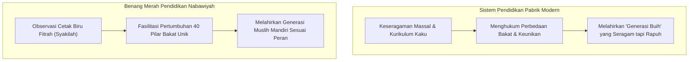

# Benang Merah Pendidikan: Kritik Sistem Pabrik Modern & Restorasi Fitrah

> [!quote] Dalil & Rujukan Nabawiyah Utama
> **Naskah:**  
> « كُلُّكُمْ يَعْمَلُ عَلَىٰ شَاكِلَتِهِ فَرَبُّكُمْ أَعْلَمُ بِمَنْ هُوَ أَهْدَىٰ سَبِيلًا »
>
> *"Katakanlah: 'Tiap-tiap orang berbuat menurut keadaannya (syakilatihi - cetak biru potensi dan fitrah bawaannya) masing-masing.' Maka Tuhanmu lebih mengetahui siapa yang lebih benar jalannya."*
>
> 📚 **Sumber Rujukan OpenBayan:** QS. Al-Isra': 84; Tafsir Ibnu Katsir (Juz 5 Hal. 112); Shahih Al-Bukhari No. 4949 (Sabda Nabi ﷺ: *"Beramallah kalian, karena setiap orang akan dimudahkan menuju apa yang ia diciptakan untuknya!"*).  
> 💡 **Relevansi PKN:** Ayat dan hadits ini adalah asas "Benang Merah Pendidikan". Allah tidak menciptakan manusia dengan cetakan seragam bagaikan bata merah. Setiap anak memiliki panggilan peran kekhalifahan unik yang wajib ditemukan dan ditumbuhkan, bukan diseragamkan secara paksa oleh kurikulum industri.

---

## 1. Kritik Paradigma Pendidikan Modern Model Pabrik (Prussian Schooling)

Sistem persekolahan massal yang mendominasi dunia hari ini lahir dari revolusi industri abad ke-19 (Model Prusia) yang didesain bukan untuk memuliakan fitrah manusia, melainkan untuk **mencetak pekerja pabrik dan birokrat yang patuh, seragam, dan mudah diatur**:
* **Standarisasi Kaku:** Jam masuk berbunyi lonceng bagaikan pabrik, murid dibagi berdasarkan usia (tahun produksi), dan dinilai dari kepatuhan duduk diam berjam-jam mendengarkan instruksi satu arah.
* **Reduksi Manusia Menjadi Angka Rapor:** Kecerdasan manusia yang mahakaya direduksi hanya pada kemampuan menghafal dan berhitung di atas kertas ujian. Anak yang memiliki kejeniusan sosial, kepemimpinan lapangan, atau keahlian mekanik dicap "kurang pintar" hanya karena nilai matematikanya rendah.
* **Perampasan Hak Fase Emas:** Anak-anak balita di usia 4–6 tahun dipaksa duduk tenang dengan tugas pekerjaan rumah (*PR*) dan drill calistung mekanis, merampas hak bermain merdeka yang dijamin fitrah dan sunnah Nabi ﷺ.



---

## 2. Teladan Rasulullah ﷺ: Pemimpin yang Memelihara Keberagaman Potensi

Rasulullah ﷺ adalah pendidik teragung yang tidak pernah memaksakan standarisasi seragam kepada para sahabatnya:

### A. Sabda Nabi ﷺ tentang Kemudahan Sesuai Panggilan Takdir
Ketika para sahabat bertanya tentang takdir dan amal perbuatan, Rasulullah ﷺ bersabda:
> « اعْمَلُوا فَكُلٌّ مُيَسَّرٌ لِمَا خُلِقَ لَهُ، أَمَّا مَنْ كَانَ مِنْ أَهْلِ السَّعَادَةِ فَيُيَسَّرُ لِعَمَلِ أَهْلِ السَّعَادَةِ، وَأَمَّا مَنْ كَانَ مِنْ أَهْلِ الشَّقَاءِ فَيُيَسَّرُ لِعَمَلِ أَهْلِ الشَّقَاوَةِ »  
> *"Beramallah kalian, karena setiap orang akan dimudahkan menuju apa yang ia diciptakan untuknya! Adapun orang yang termasuk golongan yang bahagia, niscaya ia akan dimudahkan untuk melakukan amalan orang-orang yang bahagia; dan orang yang termasuk golongan celaka akan dimudahkan menuju amalan orang-orang yang celaka."*  
> 📚 *(HR. Al-Bukhari No. 4949 & Muslim No. 2647)*

Hadits ini menjadi landasan bahwa setiap anak memiliki **bakat dan kecenderungan amal shalih yang telah diinstal oleh Allah**. Tugas orang tua bukan mendesain anak menjadi fotokopi dirinya, melainkan mengamati ke mana arah kemudahan (*muyassarun*) anak tersebut beramal.

### B. Pos-Pos Peradaban Shahabat yang Beragam
* **Khalid bin Walid** tidak dipaksa duduk menghafal ribuan hadits, melainkan disalurkan memimpin sayap kavaleri perang.
* **Abu Hurairah** tidak dipaksa menjadi saudagar atau komandan perang, melainkan difasilitasi di Ash-Shuffah menghafal dan meriwayatkan hadits.
* **Abdurrahman bin Auf** tidak dipaksa menjadi tentara garis depan permanen, melainkan didorong menguasai pasar Madinah dan mendanai logistik dakwah.
* **Bilal bin Rabah** yang memiliki suara lantang dan dada yang lapang diangkat menjadi muadzin resmi Islam.
Semua sahabat berbeda pos, namun semuanya mulia dan bersinergi membangun tegaknya peradaban Islam!

---

## 3. Keterangan Para Ulama Otoritatif

### 1. Imam Ibnu Qayyim Al-Jauziyyah
Dalam kitab *Tuhfatul Maudud bi Ahkamil Maulud* (Hal. 242):
> « وَمِمَّا يَحْتَاجُ إِلَيْهِ الطِّفْلُ غَايَةَ الِاحْتِيَاجِ: أَنْ يُعْتَنَى بِأَمْرِ خُلُقِهِ، فَإِنَّهُ يَنْشَأُ عَلَى مَا عَوَّدَهُ الْمُرَبِّي فِي صِغَرِهِ... فَإِذَا كَانَ الْوَلَدُ مُسْتَعِدًّا لِفَهْمِ العِلْمِ وَحِفْظِهِ، فَلْيُفَرَّغْ لَهُ، وَإِنْ كَانَ مُسْتَعِدًّا لِلْفُرُوسِيَّةِ وَأَسْبَابِهَا فَلْيُمَكَّنْ مِنْهَا، وَإِنْ كَانَ لَمْ يُخْلَقْ لِذَلِكَ كُلِّهِ، وَخُلِقَ لِصِنَاعَةٍ مِنْ الصَّنَائِعِ فَلْيُمَكَّنْ مِنْهَا بَعْدَ أَنْ يُعَلَّمَ مَا لَا بُدَّ مِنْهُ مِنْ أَمْرِ دِينِهِ! »  
> *"Dan di antara perkara yang sangat dibutuhkan oleh anak: hendaklah diperhatikan betul kecenderungan fitrahnya... Jika anak memiliki kesiapan bakat untuk memahami ilmu dan menghafalnya, maka fokuskanlah ia untuk ilmu. Jika ia memiliki bakat dan kecenderungan dalam keterampilan berkuda/keprajuritan (*al-furusiyyah*), maka fasilitasilah ia di bidang itu. Dan jika ia tidak diciptakan untuk kedua hal tersebut, melainkan berbakat dalam salah satu jenis perniagaan atau keahlian pertukangan (*shina'ah*), maka berikanlah ruang baginya di bidang tersebut—setelah ia terlebih dahulu diajarkan ilmu agama fardhu 'ain yang wajib baginya!"*

### 2. Imam Asy-Syathibi dalam Al-I'tisham
> *"Kesesuaian amal perbuatan dengan fitrah pembawaan adalah rahmat Allah yang memelihara kelangsungan tatanan dunia. Seandainya semua manusia dipaksa menjadi ulama fikih, niscaya runtuhlah perekonomian dan ketahanan pangan; dan seandainya semua manusia dipaksa menjadi petani, niscaya lenyaplah ilmu syariat."*

---

## 4. Benang Merah Kurikulum PKN: Menautkan Tauhid, Adab, dan Karya

PKN mengembalikan pendidikan kepada mata rantai fitrah yang lurus:

```text
[TAUHIDULLAH / IMAN]  --->  Mendasari seluruh niat hidup anak
        ↓
[ADAB & AKHLAK MULIA] --->  Membingkai cara anak berinteraksi
        ↓
[FITRAH BAKAT (TB40)] --->  Menentukan keunikan peran amal shalih
        ↓
[KARYA PERADABAN]     --->  Maslahat nyata bagi umat manusia
```

1. **Rumah Tangga sebagai Inkubator Utama:**
   * Ayah bertindak sebagai Arsitek Visi, penjaga tauhid, dan penegak hukum syariat (*Qowwamah*).
   * Bunda bertindak sebagai Madrasah Utama, sumber curahan kasih sayang, dan pembina adab keseharian (*Rahimah*).
2. **Sekolah sebagai Mitra Komplementer:**
   * Sekolah hadir bukan untuk menggantikan peran keluarga, melainkan sebagai ekosistem laboratorium sosial yang mendukung penumbuhan potensi unik anak.
3. **Bebas dari Penyakit Al-Wahn:**
   * Anak dididik memiliki cita-cita mulia akhirat, tidak takut miskin saat beramal shalih, dan bangga dengan identitas Islam di tengah peradaban global.

---

## 5. Tautan Konseptual Terkait
* [[Pendidikan Ideal]] — Menautkan Akil dan Baligh Menuju Peradaban.
* [[Bakat]] — Pemetaan 40 Sifat Karakter Nabawiyah.
* [[Pembelajaran Alamiah]] — Model Pembelajaran Alami Non-Formal.
* [[Peran Ayah dan Bunda]] — Sinergi Kepemimpinan Pengasuhan Rumah Tangga.
