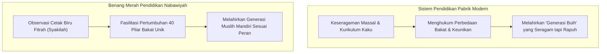
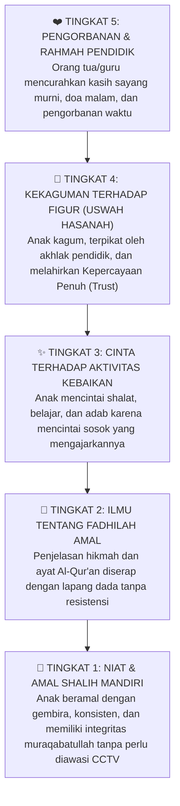

# Benang Merah Pendidikan: Kritik Sistem Pabrik Modern & Restorasi Fitrah

> [!note] Catatan Metodologi & Sumber Penyusunan Dokumen
> Dokumen ini merupakan hasil rangkuman dan rekonstruksi berbantuan kecerdasan buatan (AI) dari berbagai materi presentasi, modul kurikulum, dokumen standar lembaga, dan rekaman kajian **Pendidikan Karakter Nabawiyah (PKN)** yang diampu oleh **Ustadz Abdul Kholiq**.  
> 
> Naskah ini telah melalui verifikasi dan pengayaan ulang dalil-dalil Al-Qur'an dan Hadits shahih dari korpus **OpenBayan** (60 kitab klasik), serta diperkaya dengan sintesis intisari dan masukan berharga dari kawan-kawan **Himmatul Ummah**, **Insan Taqwa / Mustaqbal**, dan **Tim SOTAB HEBAT**.


> [!quote] Dalil & Rujukan Nabawiyah Utama
> **Naskah:**  
> « كُلُّكُمْ يَعْمَلُ عَلَىٰ شَاكِلَتِهِ فَرَبُّكُمْ أَعْلَمُ بِمَنْ هُوَ أَهْدَىٰ سَبِيلًا »
>
> *"Katakanlah: 'Tiap-tiap orang berbuat menurut keadaannya (syakilatihi - cetak biru potensi dan fitrah bawaannya) masing-masing.' Maka Tuhanmu lebih mengetahui siapa yang lebih benar jalannya."*
>
> 📚 **Sumber Rujukan OpenBayan:** QS. Al-Isra': 84; Tafsir Ibnu Katsir (Juz 5 Hal. 112); Shahih Al-Bukhari No. 4949 (Sabda Nabi ﷺ: *"Beramallah kalian, karena setiap orang akan dimudahkan menuju apa yang ia diciptakan untuknya!"*).  
> 💡 **Relevansi PKN:** Ayat dan hadits ini adalah asas "Benang Merah Pendidikan". Allah tidak menciptakan manusia dengan cetakan seragam bagaikan bata merah. Setiap anak memiliki panggilan peran kekhalifahan unik yang wajib ditemukan dan ditumbuhkan, bukan diseragamkan secara paksa oleh kurikulum industri.

---

## 1. Kritik Paradigma Pendidikan Modern Model Pabrik (Prussian Schooling)


*Filosofi Pendidikan Karakter: Mendidik Anak Seperti Bertani Merawat Benih Fitrah*


Sistem persekolahan massal yang mendominasi dunia hari ini lahir dari revolusi industri abad ke-19 (Model Prusia) yang didesain bukan untuk memuliakan fitrah manusia, melainkan untuk **mencetak pekerja pabrik dan birokrat yang patuh, seragam, dan mudah diatur**:
* **Standarisasi Kaku:** Jam masuk berbunyi lonceng bagaikan pabrik, murid dibagi berdasarkan usia (tahun produksi), dan dinilai dari kepatuhan duduk diam berjam-jam mendengarkan instruksi satu arah.
* **Reduksi Manusia Menjadi Angka Rapor:** Kecerdasan manusia yang mahakaya direduksi hanya pada kemampuan menghafal dan berhitung di atas kertas ujian. Anak yang memiliki kejeniusan sosial, kepemimpinan lapangan, atau keahlian mekanik dicap "kurang pintar" hanya karena nilai matematikanya rendah.
* **Perampasan Hak Fase Emas:** Anak-anak balita di usia 4–6 tahun dipaksa duduk tenang dengan tugas pekerjaan rumah (*PR*) dan drill calistung mekanis, merampas hak bermain merdeka yang dijamin fitrah dan sunnah Nabi ﷺ.



---

## 2. Teladan Rasulullah ﷺ: Pemimpin yang Memelihara Keberagaman Potensi

Rasulullah ﷺ adalah pendidik teragung yang tidak pernah memaksakan standarisasi seragam kepada para sahabatnya:

### A. Sabda Nabi ﷺ tentang Kemudahan Sesuai Panggilan Takdir
Ketika para sahabat bertanya tentang takdir dan amal perbuatan, Rasulullah ﷺ bersabda:
> « اعْمَلُوا فَكُلٌّ مُيَسَّرٌ لِمَا خُلِقَ لَهُ، أَمَّا مَنْ كَانَ مِنْ أَهْلِ السَّعَادَةِ فَيُيَسَّرُ لِعَمَلِ أَهْلِ السَّعَادَةِ، وَأَمَّا مَنْ كَانَ مِنْ أَهْلِ الشَّقَاءِ فَيُيَسَّرُ لِعَمَلِ أَهْلِ الشَّقَاوَةِ »  
> *"Beramallah kalian, karena setiap orang akan dimudahkan menuju apa yang ia diciptakan untuknya! Adapun orang yang termasuk golongan yang bahagia, niscaya ia akan dimudahkan untuk melakukan amalan orang-orang yang bahagia; dan orang yang termasuk golongan celaka akan dimudahkan menuju amalan orang-orang yang celaka."*  
> 📚 *(HR. Al-Bukhari No. 4949 & Muslim No. 2647)*

Hadits ini menjadi landasan bahwa setiap anak memiliki **bakat dan kecenderungan amal shalih yang telah diinstal oleh Allah**. Tugas orang tua bukan mendesain anak menjadi fotokopi dirinya, melainkan mengamati ke mana arah kemudahan (*muyassarun*) anak tersebut beramal.

### B. Pos-Pos Peradaban Shahabat yang Beragam
* **Khalid bin Walid** tidak dipaksa duduk menghafal ribuan hadits, melainkan disalurkan memimpin sayap kavaleri perang.
* **Abu Hurairah** tidak dipaksa menjadi saudagar atau komandan perang, melainkan difasilitasi di Ash-Shuffah menghafal dan meriwayatkan hadits.
* **Abdurrahman bin Auf** tidak dipaksa menjadi tentara garis depan permanen, melainkan didorong menguasai pasar Madinah dan mendanai logistik dakwah.
* **Bilal bin Rabah** yang memiliki suara lantang dan dada yang lapang diangkat menjadi muadzin resmi Islam.
Semua sahabat berbeda pos, namun semuanya mulia dan bersinergi membangun tegaknya peradaban Islam!

---

## 3. Keterangan Para Ulama Otoritatif

### 1. Imam Ibnu Qayyim Al-Jauziyyah
Dalam kitab *Tuhfatul Maudud bi Ahkamil Maulud* (Hal. 242):
> « وَمِمَّا يَحْتَاجُ إِلَيْهِ الطِّفْلُ غَايَةَ الِاحْتِيَاجِ: أَنْ يُعْتَنَى بِأَمْرِ خُلُقِهِ، فَإِنَّهُ يَنْشَأُ عَلَى مَا عَوَّدَهُ الْمُرَبِّي فِي صِغَرِهِ... فَإِذَا كَانَ الْوَلَدُ مُسْتَعِدًّا لِفَهْمِ العِلْمِ وَحِفْظِهِ، فَلْيُفَرَّغْ لَهُ، وَإِنْ كَانَ مُسْتَعِدًّا لِلْفُرُوسِيَّةِ وَأَسْبَابِهَا فَلْيُمَكَّنْ مِنْهَا، وَإِنْ كَانَ لَمْ يُخْلَقْ لِذَلِكَ كُلِّهِ، وَخُلِقَ لِصِنَاعَةٍ مِنْ الصَّنَائِعِ فَلْيُمَكَّنْ مِنْهَا بَعْدَ أَنْ يُعَلَّمَ مَا لَا بُدَّ مِنْهُ مِنْ أَمْرِ دِينِهِ! »  
> *"Dan di antara perkara yang sangat dibutuhkan oleh anak: hendaklah diperhatikan betul kecenderungan fitrahnya... Jika anak memiliki kesiapan bakat untuk memahami ilmu dan menghafalnya, maka fokuskanlah ia untuk ilmu. Jika ia memiliki bakat dan kecenderungan dalam keterampilan berkuda/keprajuritan (*al-furusiyyah*), maka fasilitasilah ia di bidang itu. Dan jika ia tidak diciptakan untuk kedua hal tersebut, melainkan berbakat dalam salah satu jenis perniagaan atau keahlian pertukangan (*shina'ah*), maka berikanlah ruang baginya di bidang tersebut—setelah ia terlebih dahulu diajarkan ilmu agama fardhu 'ain yang wajib baginya!"*

### 2. Imam Asy-Syathibi dalam Al-I'tisham
> *"Kesesuaian amal perbuatan dengan fitrah pembawaan adalah rahmat Allah yang memelihara kelangsungan tatanan dunia. Seandainya semua manusia dipaksa menjadi ulama fikih, niscaya runtuhlah perekonomian dan ketahanan pangan; dan seandainya semua manusia dipaksa menjadi petani, niscaya lenyaplah ilmu syariat."*

---

## 4. Benang Merah Kurikulum PKN: Menautkan Tauhid, Adab, dan Karya

PKN mengembalikan pendidikan kepada mata rantai fitrah yang lurus:

```text
[TAUHIDULLAH / IMAN]  --->  Mendasari seluruh niat hidup anak
        ↓
[ADAB & AKHLAK MULIA] --->  Membingkai cara anak berinteraksi
        ↓
[FITRAH BAKAT (TB40)] --->  Menentukan keunikan peran amal shalih
        ↓
[KARYA PERADABAN]     --->  Maslahat nyata bagi umat manusia
```

1. **Rumah Tangga sebagai Inkubator Utama:**
   * Ayah bertindak sebagai Arsitek Visi, penjaga tauhid, dan penegak hukum syariat (*Qowwamah*).
   * Bunda bertindak sebagai Madrasah Utama, sumber curahan kasih sayang, dan pembina adab keseharian (*Rahimah*).
2. **Sekolah sebagai Mitra Komplementer:**
   * Sekolah hadir bukan untuk menggantikan peran keluarga, melainkan sebagai ekosistem laboratorium sosial yang mendukung penumbuhan potensi unik anak.
3. **Bebas dari Penyakit Al-Wahn:**
   * Anak dididik memiliki cita-cita mulia akhirat, tidak takut miskin saat beramal shalih, dan bangga dengan identitas Islam di tengah peradaban global.

## 4. Grand Theory Kesadaran Beramal: Rantai Kausalitas 5 Tingkat

Berdasarkan naskah *Menumbuhkan Kesadaran Beramal* (Abdul Kholiq), kegagalan terbesar model schooling modern adalah **menuntut hasil akhir (Amal & Disiplin) secara instan melalui paksaan, ancaman nilai, atau iming-iming materiil**, melompati fondasi cinta dan kepercayaan batin.

Pendidikan Karakter Nabawiyah merumuskan **Pola Lima Tingkat Sebab Hadirnya Amal Sadar**:



### Metafora Agraris: Mendidik Layaknya Bertani
Rasulullah ﷺ menyabdakan perumpamaan agung tentang hati manusia dan ilmu:
> « مَثَلُ مَا بَعَثَنِي اللَّهُ بِهِ مِنَ الْهُدَى وَالْعِلْمِ كَمَثَلِ الْغَيْثِ الْكَثِيرِ أَصَابَ أَرْضًا... »  
> *"Perumpamaan petunjuk dan ilmu yang dengannya Allah mengutusku adalah bagaikan hujan lebat yang menyiram bumi..."*  
> — **HR. Bukhari (No. 79) dari Abu Musa Al-Asy'ari radhiyallahu 'anhu**

* **Tanah Subur:** Menyerap air dan menumbuhkan tanaman (analogi anak yang tangki cintanya penuh dan hatinya gembur menerima adab).
* **Tanah Keras:** Menampung air untuk kemanfaatan sesama.
* **Tanah Tandus/Batu Licin:** Menolak air dan membiarkannya mengalir sia-sia.

**Kaidah Agraris Nabawiyah:** Seorang petani bijak tidak akan pernah menabur pupuk dan benih di atas tanah yang kering berbatu. Jika anak membangkang, jangan jejali dengan ceramah panjang. Basahi dan gemburkan dahulu tanah hatinya dengan pelukan, pemaafan, dan pengorbanan kasih sayang.

---

## 5. Anatomy of Trust (Tujuh Pilar Kepercayaan Batin Anak)

Kesadaran beramal hanya akan bersemi di atas tanah **Kepercayaan Batin (*Trust*)** antara anak dan pendidik. Dokumen resmi PKN merumuskan 7 pilar pembangun kepercayaan:
1. **Boundaries (Batas yang Jelas):** Menegakkan aturan yang konsisten; anak merasa aman tatkala tahu mana zona halal dan zona haram.
2. **Reliability (Keandalan Sikap):** Orang tua menepati janji; perkataan selaras dengan perbuatan nyata.
3. **Accountability (Keberanian Mengakui Salah):** Pendidik berani meminta maaf secara ksatria tatkala keliru membentak anak.
4. **Vault (Menjaga Kerahasiaan):** Tidak menceritakan kelemahan atau aib anak kepada tetangga, keluarga besar, atau media sosial.
5. **Integrity (Integritas Nilai):** Memilih jalan kebenaran syariat daripada kenyamanan pragmatis.
6. **Non-Judgment (Tidak Menghakimi):** Mendengarkan keluh kesah anak dengan empati tanpa langsung mencap "kamu berdosa".
7. **Generosity (Kemurahan Prasangka):** Selalu berprasangka baik pada niat awal anak tatkala ia melakukan kekeliruan teknis.

---

## 6. Visi Transformasi: Mewujudkan "Sekolah Mempesona" (*Pondok Manusia*)

Penerapan benang merah pendidikan secara institusional menuntut perubahan kultur lembaga secara radikal, sebagaimana diamanatkan dalam **Klausul 7.2.3 Standar Implementasi PKN 11/2024**:
- Menghilangkan paradigma "sekolah pabrik" yang dingin dan mekanistik.
- Membangun **Sekolah Mempesona** (*Pondok Manusia*), yaitu lembaga pendidikan yang menghargai fitrah kemanusiaan santri, ramah jiwa, kaya ruang eksplorasi alam, dan menjadi oase peradaban yang dirindukan generasi muda.

---

## 7. Tautan Konseptual Terkait

* [[8 Standar Implementasi PKN]] — Panduan Manajemen Penjaminan Mutu Lembaga Resmi Standar 11/2024 Rev 04.
* [[Panduan RPP dan Observasi Lapangan]] — Format RPP Terpadu Aqidah-Ibadah-Adab dan Instrumen Observasi 19 Butir.
* [[Pendidikan Ideal]] — Menautkan Akil dan Baligh Menuju Peradaban.
* [[Bakat]] — Pemetaan 40 Sifat Karakter Nabawiyah.
* [[Pembelajaran Alamiah]] — Model Pembelajaran Alami Non-Formal.
* [[Peran Ayah dan Bunda]] — Sinergi Kepemimpinan Pengasuhan Rumah Tangga.


---

> [!quote] Dokumen & Slide Presentasi Rujukan Resmi PKN
> Pembahasan dalam artikel ini bersumber langsung dari materi tayang pelatihan dan dokumen kurikulum resmi PKN oleh **Ustadz Abdul Kholiq**:
>
> - **Materi:** *1. Mengembalikan Pendidikan ke Asalnya*
>   - 📖 **Rujukan Slide:** Slide Hal. 12–35 (Pondasi Hakiki Pendidikan, Pemakmur Bumi & 5 Rantai Kausalitas Amal)
>   - 🔗 **Akses Berkas:** [📥 Unduh PDF (16.2 MB)](https://www.dropbox.com/scl/fi/51xv1fqskyyv8pu3i6nyd/1.-Mengembalikan-Pendidikan-ke-asalnya.pdf?rlkey=uxh4fwjnaqloraoxfvsju2dkc&dl=1) • [📊 Unduh PPTX Asli (21.6 MB)](https://www.dropbox.com/scl/fi/7tr7sclrokirbdi53i1k7/1.-Mengembalikan-Pendidikan-ke-asalnya.pptx?rlkey=yvzin1fsnr1uw8chd1v7f6d8h&dl=1) • [👁️ Buka di Dropbox](https://www.dropbox.com/scl/fi/51xv1fqskyyv8pu3i6nyd/1.-Mengembalikan-Pendidikan-ke-asalnya.pdf?rlkey=uxh4fwjnaqloraoxfvsju2dkc&dl=0)
>
> - **Materi:** *5. Menyibak Pondasi Pendidikan Yang Tak Tersentuh*
>   - 📖 **Rujukan Slide:** Slide Hal. 15–30 (Orientasi Fitrah Insan & Rekonstruksi Adab Generasi)
>   - 🔗 **Akses Berkas:** [📥 Unduh PDF (6.5 MB)](https://www.dropbox.com/scl/fi/cnzll0n089p06bv5gj1za/5.-Menyibak-Pondasi-Pendidikan-Yang-Tak-Tersentuh.pdf?rlkey=1infkzxac20yfvzvzxlnl04n0&dl=1) • [📊 Unduh PPTX Asli (8.4 MB)](https://www.dropbox.com/scl/fi/8zck4e9l24cgxs96zl36p/5.-Menyibak-Pondasi-Pendidikan-Yang-Tak-Tersentuh.pptx?rlkey=502weiuge1y4fuqjrgxi71ceg&dl=1) • [👁️ Buka di Dropbox](https://www.dropbox.com/scl/fi/cnzll0n089p06bv5gj1za/5.-Menyibak-Pondasi-Pendidikan-Yang-Tak-Tersentuh.pdf?rlkey=1infkzxac20yfvzvzxlnl04n0&dl=0)

