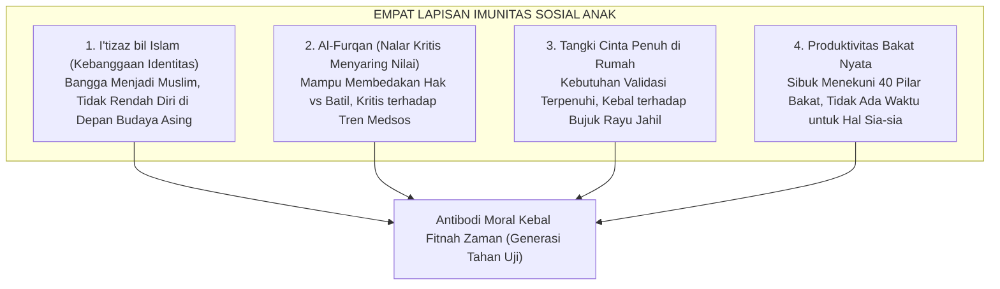

# Imunitas Sosial: Menumbuhkan Daya Tahan Fitrah Menghadapi Polusi Zaman

> [!note] Catatan Metodologi & Sumber Penyusunan Dokumen
> Dokumen ini merupakan hasil rangkuman dan rekonstruksi berbantuan kecerdasan buatan (AI) dari berbagai materi presentasi, modul kurikulum, dokumen standar lembaga, dan rekaman kajian **Pendidikan Karakter Nabawiyah (PKN)** yang diampu oleh **Ustadz Abdul Kholiq**.  
> 
> Naskah ini telah melalui verifikasi dan pengayaan ulang dalil-dalil Al-Qur'an dan Hadits shahih dari korpus **OpenBayan** (60 kitab klasik), serta diperkaya dengan sintesis intisari dan masukan berharga dari kawan-kawan **Himmatul Ummah**, **Insan Taqwa / Mustaqbal**, dan **Tim SOTAB HEBAT**.

Dalam arsitektur Pendidikan Karakter Nabawiyah (PKN), **Imunitas Sosial** (*Al-Manā'ah al-Ijtimā'iyyah*) adalah daya tahan psikospiritual internal yang dimiliki anak untuk menyaring, menolak, dan bertahan dari pengaruh destruktif lingkungan sosial yang korup tanpa harus mengisolasi diri dari dunia nyata. Konsep ini membedakan secara radikal antara metodologi nabawiyah dengan pendekatan proteksi ekstrem yang keliru. Pendekatan keliru berusaha menciptakan "ruang kaca steril" (*bubble isolation*) yang mengurung anak dari segala interaksi sosial; sementara PKN membekali anak dengan **antibodi nilai tauhid dan adab** sehingga tatkala ia terjun ke tengah masyarakat majemuk, ia tidak tertular penyakit moral, melainkan mampu menjadi agen penawar dan penyembuh (*mushlih*).

Rasulullah ﷺ secara tegas memuji seorang mukmin yang berinteraksi dengan masyarakat dan sabar menanggung gangguan mereka, jauh melebihi orang yang memilih menyendiri di puncak gunung demi menghindari fitnah. Menyiapkan anak menghadapi era akhir zaman menuntut orang tua membentuk kekebalan moral yang berakar dari dalam kalbu (*internal locus of moral control*).

> [!quote] Dalil & Rujukan Nabawiyah: Analogi Penjual Minyak Wangi dan Pandai Besi
> **Teks Hadits Shahih:**  
> « مَثَلُ الْجَلِيسِ الصَّالِحِ وَالْجَلِيسِ السَّوْءِ كَمَثَلِ صَاحِبِ الْمِسْكِ وَكِيرِ الْحَدَّادِ، لَا يَعْدَمُكَ مِنْ صَاحِبِ الْمِسْكِ إِمَّا تَشْتَرِيهِ أَوْ تَجِدُ رِيحَهُ، وَكِيرُ الْحَدَّادِ يُحْرِقُ بَدَنَكَ أَوْ ثَوْبَكَ أَوْ تَجِدُ مِنْهُ رِيحًا خَبِيثَةً »  
> *"Perumpamaan teman duduk yang saleh dan teman duduk yang buruk ibarat penjual minyak wangi dan pandai besi. Dari penjual minyak wangi engkau mungkin membelinya, atau mencium aroma harumnya. Sedangkan pandai besi, ia bisa membakar tubuh atau bajumu, atau engkau mencium bau busuk darinya."*  
> — **HR. Bukhari (No. 2101) & Muslim (No. 2628)**  
>  
> « الْمُؤْمِنُ الَّذِي يُخَالِطُ النَّاسَ وَيَصْبِرُ عَلَى أَذَاهُمْ أَعْظَمُ أَجْرًا مِنَ الَّذِي لَا يُخَالِطُ النَّاسَ وَلَا يَصْبِرُ عَلَى أَذَاهُمْ »  
> *"Seorang mukmin yang berbaur dengan manusia dan bersabar atas gangguan mereka, lebih besar pahalanya daripada orang yang tidak berbaur dengan manusia dan tidak bersabar atas gangguan mereka."*  
> — **HR. At-Tirmidzi (No. 2507) & Ibnu Majah (No. 4032), dishahihkan oleh Al-Albani**  
>  
> 📚 **Syarah Al-Hafizh Ibnu Hajar Al-Asqalani dalam Fathul Bari (Juz 4 Hal. 324):**  
> *"Hadits ini menggariskan dua pilar utama dalam pergaulan sosial: anjuran kuat untuk selektif memilih sahabat karib (al-khalil), serta peringatan keras dari bergaul rapat dengan para pelaku maksiat dan ahli bid'ah. Teman duduk memiliki pengaruh tak kasat mata (al-adwa) yang meresap ke dalam tabiat jiwa manusia. Oleh karena itu, membentengi anak dengan kemampuan menyaring pergaulan adalah fardhu kifayah bagi para wali agar agama anak mereka selamat."*

---

## 1. Dekonstruksi Isolasi Buta vs Imunitas Nabawiyah

*Metode Pendidikan Usia 10–Baligh: Ketegasan Bahasa Tangan & Batas Toleransi*

Banyak orang tua yang berniat baik tergelincir ke dalam sindrom "Sterilisasi Ekstrem". Tabel berikut menguraikan komparasi antara kedua paradigma ini:

| Parameter Evaluasi | Isolasi Buta (Sterilisasi Ekstrem) | Imunitas Sosial Nabawiyah (PKN) |
|---|---|---|
| **Metode Perlindungan** | Mengurung anak di rumah/lingkungan tertutup rapat; melarang total interaksi luar. | Mengizinkan interaksi bertahap di bawah pendampingan dan evaluasi reflektif. |
| **Karakter Anak yang Terbentuk** | Naif, gagap sosial, mudah tertipu, rentan mengalami *culture shock*. | Kritis, adaptif, memiliki integritas moral kokoh, cakap bernegosiasi adab. |
| **Daya Tahan Ujian** | Runtuh seketika saat menginjak bangku kuliah atau merantau kerja. | Tetap teguh memegang prinsip tauhid di mana pun kaki berpijak. |
| **Fungsi Peradaban** | Menjadi penonton yang pasif dan takut pada tantangan zaman. | Menjadi pelopor perbaikan masyarakat (*Mushlih Khairu Ummah*). |

---

## 2. Empat Komponen Pembentuk Antibodi Sosial Anak

Pendidikan Karakter Nabawiyah merumuskan empat lapisan imunitas batin yang wajib diinokulasikan kepada ananda sejak dini:

### A. Al-I'tizaz bil Islam (Kebanggaan Identitas Muslim)
- Anak yang memiliki *izzah* tidak akan minder mempertahankan shalat saat bepergian, tidak malu menutup aurat saat berolahraga, dan tidak merasa rendah diri tatkala tidak mengikuti tren gaya hidup teman-temannya yang melanggar syariat.
- *Izzah* ditanamkan melalui pengenalan kejayaan sejarah Islam dan kepahlawanan para sahabat Nabi ﷺ.

### B. Al-Furqan (Ketajaman Nalar Pemilah)
- Al-Qur'an diturunkan sebagai *Furqan* (pembeda). Anak dilatih untuk tidak menelan mentah-mentah apa yang viral di media sosial.
- Orang tua membiasakan diskusi kritis di meja makan: *"Menurutmu, video yang sedang viral itu bermanfaat atau merusak? Apa pandangan Islam tentang tren tersebut?"*

### C. Pemenuhan Tangki Cinta di Rumah
- Anak yang haus pengakuan (*starving for approval*) akan rela melakukan apa saja demi diterima oleh geng temannya, termasuk merokok, tawuran, atau mencoba narkoba.
- Tatkala [[Tangki Cinta]] anak terisi meluap oleh pelukan dan apresiasi ayah-bundanya, ia tidak butuh validasi murahan dari kelompok teman yang berakhlak buruk.

### D. Penyaluran Energi ke Dalam [[Bakat]]
- Kaidah salaf menegaskan: *“Jika jiwamu tidak disibukkan dengan kebenaran, niscaya ia akan disibukkan dengan kebatilan.”*
- Anak yang memiliki target karya nyata dalam 40 pilar bakat nabawiyah tidak akan memiliki celah waktu luang (*vacuum of time*) untuk nongkrong sia-sia atau terjerumus dalam pornografi digital.

---

## 3. Tahapan Pembentukan Imunitas Sosial Berbasis Usia

1. **Usia 0 – 7 Tahun ([[Thufulah]]): Fase Proteksi Maksimal**
   - Di usia ini, imunitas batin anak belum terbentuk. Lingkungan harus dijaga sangat bersih (*hima* ketat).
   - Batasi paparan gawai dan tontonan televisi. Jangan biarkan anak diasuh oleh lingkungan yang toksik.
2. **Usia 7 – 10 Tahun ([[Tamyiz]]): Fase Pengenalan Kuman Terkendali (*Vaksinasi Moral*)**
   - Anak mulai dikenalkan pada realitas luar secara bertahap. Ketika melihat pengemis, orang gila, atau orang merokok, jangan ditutup matanya secara panik, melainkan jadikan bahan tadabbur: *"Kasihan ya Nak, semoga Allah beri mereka hidayah. Mengapa kita tidak boleh merokok seperti paman itu?"*
3. **Usia 10 – Baligh ([[Murahaqah]]): Fase Pengujian Mandiri & Mentoring**
   - Anak diberi ruang berorganisasi, mengikuti kegiatan pramuka/kepanduan, berkompetisi, dan berinteraksi sosial di bawah pengawasan jarak jauh (*remote monitoring*). Orang tua menjadi tempat berlabuh yang aman untuk mengevaluasi dinamika pergaulannya.

---

## 4. Panduan Aplikatif bagi Ayah dan Bunda

1. **Jadikan Rumah sebagai "Basecamp" yang Hangat:** Buatlah rumah kita ramah bagi teman-teman anak. Izinkan anak mengundang teman-temannya bermain di rumah agar orang tua bisa mengamati secara langsung tabiat sahabat-sahabatnya.
2. **Ajarkan Teknik Menolak Ajakan Buruk (*Assertive Refusal*):** Latih anak bermain peran (*role-play*) bagaimana cara menolak ajakan bolos atau merokok dari temannya dengan tegas namun sopan tanpa takut kehilangan pertemanan.
3. **Bangun Komunitas Ekosistem Keluarga Shalih:** Carilah lingkungan tempat tinggal atau komunitas keluarga yang satu visi tarbiyah nabawiyah. Anak membutuhkan teman sebaya yang saling menguatkan kebaikan (*bi'ah shalihah*).

> [!reflection] Refleksi Pendidik: Memeriksa Daya Tahan Ananda
> - Jika esok hari anak kita harus pergi merantau jauh dari pengawasan mata kita, apakah kita yakin imunitas imannya sanggup menahan gempuran fitnah pergaulan bebas di luar sana?
> - Apakah selama ini kita hanya mendidiknya menjadi anak rumahan yang rapuh, ataukah kita telah menempanya menjadi singa peradaban yang tangguh memegang kebenaran?

---

## Tautan Rujukan Terkait

* [[Batas Toleransi]] — Menegakkan batas hima sebagai fondasi sebelum melepas anak ke medan sosial.
* [[Tangki Cinta]] — Pintu masuk utama pencegah pergaulan bebas dan degradasi moral.
* [[Internal & Eksternal]] — Harmoni benteng internal diri dan benteng eksternal masyarakat.
* [[Bakat]] — Menyalurkan energi anak ke dalam karya produktif peradaban.
* [[Murahaqah]] — Fase krusial transisi pembentukan imunitas sosial mandiri (10 tahun–baligh).

---

> [!quote] Dokumen & Slide Presentasi Rujukan Resmi PKN
> Pembahasan dalam artikel ini bersumber langsung dari materi tayang pelatihan dan dokumen kurikulum resmi PKN oleh **Ustadz Abdul Kholiq**:
>
> - **Materi:** *4. METODE PENDIDIKAN KARAKTER NABAWIYAH*
>   - 📖 **Rujukan Slide:** Slide Hal. 15–38 (Piramida Tiga Bahasa Mendidik, Kaidah Penegakan Batas Toleransi, & Imunitas Sosial)
>   - 🔗 **Akses Berkas:** [📥 Unduh PDF (10.8 MB)](https://www.dropbox.com/scl/fi/ek8ggskgiuxailx94rek1/4.-METODE-PENDIDIKAN-KARAKTER-NABAWIYAH.pdf?rlkey=fkmrh2p89fkebuz0bf15tyip4&dl=1) • [📊 Unduh PPTX Asli (24.9 MB)](https://www.dropbox.com/scl/fi/ev1k0fq14pjn5xd3gpazj/4.-METODE-PENDIDIKAN-KARAKTER-NABAWIYAH.pptx?rlkey=nq1anr4vj64jws4n3jio2uhlg&dl=1) • [👁️ Buka di Dropbox](https://www.dropbox.com/scl/fi/ek8ggskgiuxailx94rek1/4.-METODE-PENDIDIKAN-KARAKTER-NABAWIYAH.pdf?rlkey=fkmrh2p89fkebuz0bf15tyip4&dl=0)
>
> - **Materi:** *3. Pembelajaran Alamiyah*
>   - 📖 **Rujukan Slide:** Slide Hal. 5–25 (Matriks Pembelajaran Alamiah: Ruang Interaksi, Dialog, & Penanaman Kebiasaan Mandiri)
>   - 🔗 **Akses Berkas:** [📥 Unduh PDF (3.8 MB)](https://www.dropbox.com/scl/fi/581k390o7p264n879q312/3.-Pembelajaran-Alamiyah.pdf?rlkey=p78903o45781n263109u45892&dl=1) • [📊 Unduh PPTX Asli (6.2 MB)](https://www.dropbox.com/scl/fi/89312o45678n190p34571/3.-Pembelajaran-Alamiyah.pptx?rlkey=q4567890123n4567890123456&dl=1) • [👁️ Buka di Dropbox](https://www.dropbox.com/scl/fi/581k390o7p264n879q312/3.-Pembelajaran-Alamiyah.pdf?rlkey=p78903o45781n263109u45892&dl=0)

