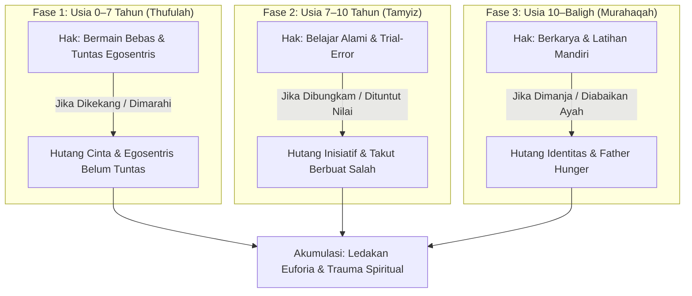

# Luka dan Hutang Pengasuhan (*Parenting Debt*)

> *"Anak terlahir suci membawa fitrah. Ketika ia tumbuh menjadi sosok yang membangkang, pemarah, atau rapuh jiwanya, jangan buru-buru menghakimi anaknya. Periksalah catatan masa lalunya: ada hak-hak fitrah yang belum tertunaikan, ada tangki cinta yang kosong, atau ada luka pengasuhan dari orang tuanya yang belum terbasuh."*  
> — **Ustadz Abdul Kholiq**

---

## 1. Hakikat & Definisi Hutang Pengasuhan

**Hutang Pengasuhan (*Parenting Debt*)** adalah akumulasi ketidaktuntasan pemenuhan hak-hak fitrah anak pada suatu fase usia perkembangan yang mengakibatkan terhambatnya kematangan emosional, mental, dan spiritual pada fase-fase berikutnya.

Sebagaimana hutang finansial yang terus berbunga jika tidak dibayar, hutang pengasuhan tidak akan hilang dengan bertambahnya usia biologis anak. Anak yang mengalami defisit hak fitrah di masa kecil akan menagihnya di masa remaja atau dewasa dalam bentuk:
- Perilaku membangkang yang ekstrem (*oppositional defiant*).
- Keterikatan adiktif pada layar gawai, pergaulan bebas, atau zat adiktif untuk mengisi kekosongan batin.
- Ledakan kemarahan yang tidak proporsional terhadap hal-hal sepele.
- Ketidakmampuan memikul tanggung jawab kedewasaan (*infantilisasi*).

---

## 2. Mekanisme Terjadinya Hutang per Fase Usia

Hutang pengasuhan terjadi ketika orang tua menerapkan metode yang melompati sunnatullah tahapan perkembangan anak:

### 1. Defisit Fase Thufulah (0–7 Tahun): Egosentris yang Belum Tuntas
Pada usia 0–7 tahun, anak adalah "Raja" yang berhak dimanjakan dengan kasih sayang tanpa syarat (*Bahasa Hati*). Hak bermain dan rasa ingin tahunya harus dituntaskan dengan 3 syarat:
- Selama orang tua mampu memfasilitasi,
- Tidak membahayakan keselamatan fisik anak, dan
- Tidak membahayakan orang lain.

Jika di fase ini anak sering dibentak di tempat shalat, dilarang bergerak aktif, atau dipaksa calistung dini dengan ancaman, anak akan mengalami **kemandekan egosentris**. Di usia remaja, ia akan bersikap kekanak-kanakan, haus perhatian, dan egosentrisnya meledak kembali (*retardasi emosional*).

### 2. Defisit Fase Tamyiz (7–10 Tahun): Inisiatif yang Padam
Usia 7–10 tahun adalah masa belajar mandiri melalui *trial and error*. Anak butuh ruang untuk mencoba, jatuh, salah, dan memperbaiki kesalahannya. Jika orang tua perfeksionis menuntut anak selalu sempurna, anak akan kehilangan keberanian (*Syajaa'ah*) dan tumbuh menjadi pribadi peragu yang takut melangkah tanpa arahan.

### 3. Defisit Fase Murahaqah (10–14 Tahun): Kehausan Figur Ayah (*Father Hunger*)
Menjelang baligh, anak memerlukan figur ayah yang hadir secara emosional untuk menanamkan akidah, visi hidup, dan keberanian sosial. Jika ayah absen (*fatherless* secara psikologis), anak laki-laki akan kehilangan orientasi maskulin dan anak perempuan akan rentan mencari validasi kasih sayang dari laki-laki asing di luar rumah.

---

## 3. Asal Mula: Luka Orang Tua yang Belum Terbasuh (*Transgenerational Trauma*)

Salah satu penemuan penting dalam khazanah SOTAB HEBAT dan kajian Ustadz Abdul Kholiq adalah bahwa **orang tua yang keras sering kali bukanlah orang tua yang jahat, melainkan anak kecil yang terluka di masa lalu yang kini memegang kendali pengasuhan**.

Orang tua yang di masa kecilnya:
- Selalu dituntut sempurna dan tidak pernah diapresiasi,
- Sering menerima kekerasan verbal atau fisik dari kakek-nenek,
- Mengalami pengabaian kasih sayang,

...secara bawah sadar akan mereplikasi pola yang sama kepada anaknya. Oleh karena itu, langkah pertama dalam memutus rantai hutang pengasuhan adalah **kesadaran orang tua untuk membasuh luka dirinya sendiri (*Tazkiyatun Nafs*)** dan berdamai dengan masa lalunya.

> [!IMPORTANT]
> **Bolehkah Orang Tua Meminta Maaf kepada Anak?**  
> Sangat dianjurkan dan bukan aib! Meminta maaf secara tulus (*"Maafkan Ayah/Bunda ya nak, waktu itu Ayah terpancing emosi..."*) adalah obat paling mujarab yang menembus pikiran bawah sadar anak, mencairkan dendam batin, dan mengajarkan keteladanan sifat *Tawaadhu'* (rendah hati).

---

## 4. Cara Membayar Hutang Pengasuhan Jarak Jauh (Anak di Pesantren / LDR)

Banyak orang tua baru menyadari adanya hutang pengasuhan ketika anak sudah terlanjur dikirim ke pondok pesantren atau tinggal terpisah. Hutang tetap dapat dicicil dan dilunasi dengan langkah-langkah strategis:

1. **Surat Cinta Tulisan Tangan:**  
   Tulisan tangan orang tua membawa resonansi emosional yang jauh melampaui pesan teks digital. Kirimkan surat yang berisi ungkapan kasih sayang tulus, kerinduan, dan doa, tanpa menyelipkan tuntutan target hafalan atau nilai ujian.
2. **Telepon Berkualitas (*Active Listening*):**  
   Ketika anak menelepon, fokuslah mendengarkan keluh kesahnya. Jangan langsung memberi kuliah moralitas. Validasi perasaannya: *"Bunda dengar kamu lelah ya nak, terima kasih ya sudah bertahan dan berjuang."*
3. **Kunjungan Penuh Kehadiran (*Quality Presence*):**  
   Saat menjenguk (*sambangan*), bawakan makanan kesukaannya, peluk dengan hangat, dan habiskan waktu bersama tanpa sibuk memeriksa gawai.

---

## 5. Rujukan Kajian Video Terkait (PKN Video Database)

* *Membayar Hutang Pengasuhan: Konsep, Sebab, dan Solusi* — [Tonton di YouTube @ 25:05](https://www.youtube.com/watch?v=hODlNvl6qcc&t=1505s)
* *Tanya Jawab: Bolehkah Orang Tua Meminta Maaf ke Anak?* — [Tonton di YouTube @ 45:12](https://www.youtube.com/watch?v=hODlNvl6qcc&t=2712s)
* *Tanya Jawab: Mengisi Tangki Cinta Anak yang Mondok Jauh (LDR)* — [Tonton di YouTube @ 275:32](https://www.youtube.com/live/6H-qENwmmcw&t=16532s)
* *Hutang Pengasuhan & Inner Child Orang Tua* — [Tonton di YouTube @ 95:10](https://www.youtube.com/live/6H-qENwmmcw&t=5710s)

---

## 6. Navigasi Bab Lanjutan

* [[Euforia]] — Memahami dinamika ledakan emosi anak saat hutang pengasuhan mulai dituntut.
* [[Recovery]] — Protokol pemulihan terstruktur (EMISOL) dan 9 tahap menghapus noda hati.
