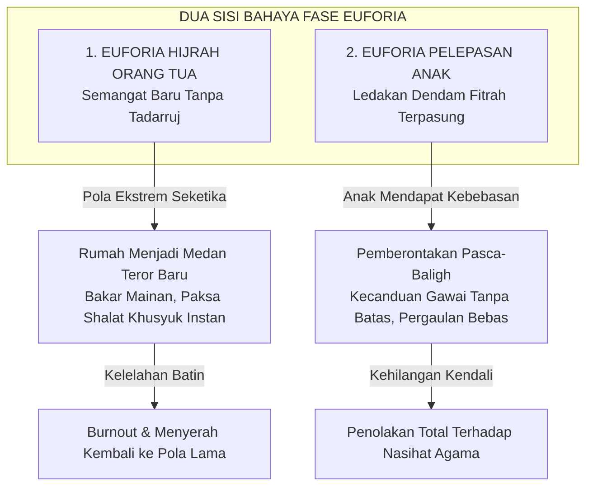

# Fase Euforia: Mengelola Ledakan Emosi dan Jebakan Faddisme Pengasuhan

Dalam peta patologi pengasuhan Pendidikan Karakter Nabawiyah (PKN), **Fase Euforia** merujuk pada dua fenomena psikososial yang sangat kritis: **(1) Sindrom Euforia Orang Tua Baru Hijrah**, yakni ledakan antusiasme emosional yang berlebihan tatkala orang tua baru mengenal konsep parenting nabawiyah lalu menerapkan perubahan drastis secara tergesa-gesa tanpa hikmah; serta **(2) Sindrom Euforia Pelepasan Remaja**, yakni ledakan keliaran perilaku yang dialami anak tatkala ia tiba-tiba terbebas dari penindasan disiplin kaku masa kecilnya (*rebound effect*).

Kedua bentuk euforia ini berakar dari pelanggaran terhadap kaidah agung sunnah nabawiyah: **At-Tadarruj (Bertahap)** dan **Al-Istiqamah (Konsistensi Berkelanjutan)**. Rasulullah ﷺ sangat mencintai amalan yang dilakukan secara berkesinambungan meskipun kuantitasnya sedikit (*adwamuha wa in qalla*). Segala bentuk perubahan karakter yang dipicu semata-mata oleh luapan emosi sesaat tanpa akar keilmuan dan kesabaran yang mendalam niscaya akan layu dengan cepat, menyisakan kelelahan mental (*burnout*), rasa bersalah, dan luka pengasuhan yang lebih parah.

> [!quote] Dalil & Rujukan Nabawiyah: Menjaga Kontinuitas dan Keseimbangan Amal
> **Teks Hadits Shahih:**  
> « أَحَبُّ الْأَعْمَالِ إِلَى اللَّهِ تَعَالَى أَدْوَمُهَا وَإِنْ قَلَّ »  
> *"Amalan yang paling dicintai oleh Allah Ta'ala adalah amalan yang paling konsisten (kontinu) meskipun jumlahnya sedikit."*  
> — **HR. Bukhari (No. 6464) & Muslim (No. 783)**  
>  
> « يَا عَبْدَ اللَّهِ بْنَ عَمْرٍو، لَا تَكُنْ مِثْلَ فُلَانٍ؛ كَانَ يَقُومُ اللَّيْلَ فَتَرَكَ قِيَامَ اللَّيْلِ »  
> *"Wahai Abdullah bin 'Amr! Janganlah engkau menjadi seperti si Fulan; dahulu ia rajin shalat malam, namun kemudian ia meninggalkan qiyamul lail."*  
> — **HR. Bukhari (No. 1152) & Muslim (No. 1159)**  
>  
> 📚 **Syarah Al-Hafizh Ibnu Hajar Al-Asqalani dalam Fathul Bari (Juz 11 Hal. 298):**  
> *"Hadits ini merupakan kaidah agung dalam melatih jiwa (riyadhatun nafs): amalan yang sedikit namun konsisten akan melahirkan keberkahan yang berlipat ganda, menjaga kesinambungan ketaatan, dan menghindarkan jiwa dari rasa jenuh (al-malal). Sebaliknya, membebani diri atau anak dengan target berlebihan di luar kesiapan fitrahnya hanya akan memicu keletihan mental, yang pada akhirnya membuat seseorang berhenti total dari beramal."*

---

## 1. Anatomi Dua Bentuk Euforia dalam Ranah Tarbiyah

Berikut adalah analisis komparatif dua sisi mata uang sindrom euforia yang wajib diwaspadai:

### A. Euforia Hijrah Orang Tua (The Zealot Parent Trap)
- Terjadi saat orang tua baru pulang dari seminar parenting atau kajian sunnah. Dengan semangat membara, dalam semalam mereka ingin mengubah rumah menjadi "pesantren mini": membuang semua mainan anak, mematikan internet total, memaksa balita duduk mengaji 2 jam, dan memarahi anak jika tidak segera khusyuk.
- **Dampak Fatal:** Anak mengalami trauma dan syok emosional. Anak memandang "hijrahnya orang tua" sebagai musibah bencana yang merenggut kebahagiaan masa kecilnya. Tatkala orang tua kehabisan energi (*burnout*), program itu bubar dan anak merasa menang.

### B. Euforia Pelepasan Anak (The Rebound Rebellion)
- Terjadi saat anak yang selama fase [[Thufulah]] dan [[Tamyiz]] ditekan secara otoriter tanpa pemenuhan [[Tangki Cinta]], tiba-tiba menginjak fase [[Murahaqah]] atau merantau kuliah.
- Begitu anak memegang gawai sendiri atau tinggal di kosan, seluruh dendam fitrahnya yang dulu terpasung meledak: ia menghabiskan waktu bermain game seharian, melanggar batas aurat, dan meninggalkan shalat sebagai bentuk balas dendam psikologis terhadap masa lalunya yang terkekang.

---

## 2. Hukum Alam Tadarruj: Mengapa Perubahan Wajib Bertahap

Al-Qur'an diturunkan secara berangsur-angsur (*tanjim*) selama 23 tahun. Pengharaman khamr tidak terjadi dalam semalam, melainkan melewati empat tahapan edukasi kesadaran. Sayyidah Aisyah radhiyallahu 'anha menjelaskan:
> *"Sesungguhnya ayat Al-Qur'an yang pertama kali turun adalah surat mufashshal yang menyebutkan tentang surga dan neraka. Hingga tatkala manusia telah mantap memeluk Islam, barulah turun ayat-ayat tentang halal dan haram. Seandainya yang pertama kali turun adalah ayat 'Janganlah kalian meminum khamr!', niscaya mereka akan menjawab: 'Kami tidak akan meninggalkan khamr selamanya!' Dan seandainya yang pertama kali turun adalah ayat 'Janganlah kalian berzina!', niscaya mereka akan menjawab: 'Kami tidak akan meninggalkan zina selamanya!'"* (HR. Bukhari No. 4993).

Jika generasi terbaik sahabat saja dididik oleh wahyu secara bertahap, bagaimana mungkin orang tua menuntut anak balitanya langsung sempurna adabnya dalam hitungan pekan?

---

## 3. Matriks Pencegahan dan Penanganan Sindrom Euforia

| Gejala yang Terdeteksi | Kategori Euforia | Protokol Terapi Nabawiyah |
|---|---|---|
| Orang tua ingin menerapkan 10 aturan baru sekaligus dalam satu pekan. | **Euforia Orang Tua** | **Pangkas Target:** Pilih satu kebiasaan kecil saja (misal: adab makan tangan kanan) selama 40 hari hingga menjadi watak alami, baru beralih ke adab berikutnya. |
| Orang tua mudah emosi tatkala anak belum menunjukkan hasil instan. | **Euforia Orang Tua** | **Luruskan Niat:** Ingat bahwa tugas kita hanyalah menanam benih, bukan memaksakan buah matang sebelum musimnya. Perbanyak [[Tawakkal dan Doa]]. |
| Remaja mulai sembunyi-sembunyi mengakses hal terlarang saat luput dari pantauan. | **Euforia Anak** | **De-eskalasi & Rekonsiliasi:** Jangan membalas dengan amarah fisik. Akui kesalahan pola asuh masa lalu, buka ruang curhat, penuhi tangki cintanya yang bocor. |
| Anak mogok shalat begitu tidak diawasi ketat oleh orang tua. | **Euforia Anak** | **Alihkan dari Pengawasan Fisik ke Pengawasan Kalbu:** Bangun konsep muraqabatullah melalui dialog hikmah, bukan ancaman kekerasan. |

---

## 4. Panduan Aplikatif bagi Ayah dan Bunda

1. **Gunakan Prinsip "Kaizen Nabawiyah" (Kemajuan 1% Berkelanjutan):** Jangan terobsesi dengan lompatan besar yang memicu stres keluarga. Kemajuan kecil yang bertahan seumur hidup jauh lebih bernilai di sisi Allah daripada ledakan amal sebulan yang kemudian ditinggalkan selamanya.
2. **Jangan Pamerkan Proses Pengasuhan di Media Sosial:** Sindrom euforia orang tua sering kali dipicu oleh dorongan ingin pamer konten di medsos. Simpan proses tarbiyah keluarga sebagai rahasia sakral antara kita dengan Allah agar terhindar dari riya' dan penyakit 'ain.
3. **Minta Maaf kepada Anak Remaja atas Kekerasan Masa Lalu:** Jika orang tua menyadari bahwa dulu pernah mendidik dengan pukulan kasar atau perampasan hak fitrah, duduklah bersimpuh di depan anak remaja kita. Katakan: *"Nak, maafkan Ayah dan Bunda yang dulu belum paham ilmu mendidik. Maafkan luka yang pernah kami goreskan."* Kerendahan hati ini akan memadamkan api pemberontakan euforia di hati anak.

> [!reflection] Refleksi Pendidik: Menakar Keikhlasan Istiqamah
> - Apakah semangat mendidik anak yang menggebu-gebu hari ini akan tetap bertahan tatkala tahun depan anak kita belum menunjukkan prestasi apa pun?
> - Apakah kita mendidik anak demi kepuasan nafsu kita melihat "hasil instan", ataukah kita bersabar merawat proses pertumbuhan fitrahnya dengan penuh keteladanan?

---

## Tautan Rujukan Terkait

* [[Luka dan Hutang Pengasuhan]] — Induk diagnosis luka psikospiritual akibat pengasuhan keliru.
* [[Recovery]] — Metodologi pemulihan jiwa anak yang terluka akibat tekanan ekstrem.
* [[4 Kaidah Implementasi]] — Prinsip Tadarruj (bertahap) dan Taisir (kemudahan).
* [[Tangki Cinta]] — Menambal kebocoran batin pencegah ledakan euforia remaja.
* [[Batas Toleransi]] — Menegakkan pagar hima yang proporsional dan tidak menindas.
