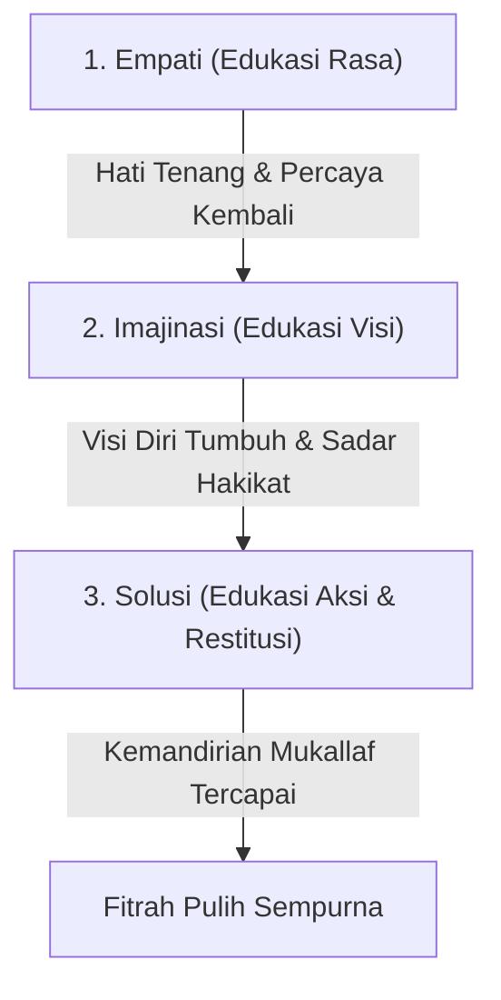
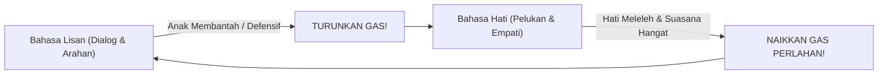

# Recovery: Metodologi Pemulihan Fitrah & Luka Hati

> [!quote] Dalil & Rujukan Nabawiyah
> **Naskah:**  
> « كُلُّ بَنِي آدَمَ خَطَّاءٌ وَخَيْرُ الْخَطَّائِينَ التَّوَّابُونَ »
>
> *"Setiap anak keturunan Adam pasti sering berbuat salah (khilaf), dan sebaik-baik orang yang berbuat salah adalah mereka yang senantiasa bertaubat."*
>
> 📚 **Sumber Rujukan OpenBayan:** HR. Tirmidzi (No. 2499) & Syarah Riyadush Shalihin Hathibah (Juz 19 Hal. 9)  
> 💡 **Relevansi PKN:** Pemulihan fitrah (*recovery*) tidak pernah terlambat; dengan taubat nasuha, permohonan maaf orang tua kepada anak, dan restorasi adab, noda hati dapat dihilangkan secara tuntas.

> *"Pemulihan jiwa tidak bisa dilakukan dengan ketergesa-gesaan. Hati yang telah retak oleh bentakan bertahun-tahun membutuhkan waktu untuk merekat kembali melalui kelembutan yang konsisten, bukan ceramah panjang yang menekan."*  
> — **Ustadz Abdul Kholiq & SOTAB HEBAT**

---

## 1. Hakikat Pemulihan (*Recovery*)

**Recovery (Pemulihan Fitrah)** adalah proses terapeutik dan edukatif yang dirancang untuk menyembuhkan luka batin anak, mencairkan dendam bawah sadar, dan melunasi hutang pengasuhan sebelum anak memasuki fase kedewasaan mandiri (*Aqil-Baligh*).

Pemulihan ini berpijak pada kaidah dasar bahwa fitrah manusia pada dasarnya condong kepada kebaikan (*hanif*). Perilaku menyimpang, pembangkangan, atau adiksi hanyalah **gejala (*symptom*)** dari hati yang terluka, bukan watak permanen anak.

---

## 2. Metode EMISOL: Tiga Pilar Pemulihan

Kerangka utama recovery dijalankan melalui tiga tahapan terstruktur yang disebut **EMISOL**:

### 1. Empati (Edukasi Rasa)
- **Tujuan:** Meruntuhkan tembok pertahanan batin anak dan membangun kembali rasa aman (*safety zone*).
- **Langkah Praktik:**
  - Orang tua mendengarkan seluruh tumpahan emosi, kemarahan, atau tangisan anak tanpa memotong, membela diri, atau mendebat.
  - Berikan validasi emosi: *"Ayah/Bunda paham betapa sakitnya perasaanmu selama ini..."*
  - Berikan pelukan fisik tanpa kata-kata (*dekapan minimal 20 detik*) untuk menstimulasi hormon penenang batin.
  - Orang tua memohon maaf secara tulus atas kelalaian pengasuhan di masa lalu.

### 2. Imajinasi (Edukasi Visi)
- **Tujuan:** Menyalakan kembali cita-cita luhur (*Himmah*) dan menyadarkan anak akan hakikat penciptaannya sebagai hamba Allah.
- **Langkah Praktik:**
  - Setelah rasa sakit mereda, ajak anak membayangkan masa depan yang mulia: *"Menurutmu, dengan potensi besar yang Allah titipkan padamu, manusia seperti apa yang ingin kamu capai di masa depan?"*
  - Kisahkan teladan para Sahabat Nabi yang pernah mengalami masa lalu kelam namun bangkit menjadi pribadi agung (seperti kisah kebangkitan Umar bin Khattab radhiyallahu 'anhu).

### 3. Solusi (Edukasi Aksi & Restitusi)
- **Tujuan:** Menyusun komitmen tindakan nyata dan melatih tanggung jawab secara mandiri tanpa paksaan represif.
- **Langkah Praktik:**
  - Rumuskan kesepakatan tertulis (*Aqad*) bersama anak.
  - Terapkan prinsip **Restitusi**: ajak anak memperbaiki sendiri dampak kekeliruannya secara terhormat, bukan dengan hukuman yang merendahkan harga dirinya.

---

## 3. Kaidah Emas: Prinsip "Naik Turun Gas"

Dalam interaksi harian selama masa pemulihan, orang tua wajib menguasai analogi **"Naik Turun Gas"** yang diajarkan oleh Ustadz Abdul Kholiq:

1. **Awali dengan Bahasa Lisan:** Bicarakan aturan atau tugas rumah tangga secara baik-baik.
2. **Deteksi Resistensi:** Jika anak mulai cemberut, membanting pintu, atau meninggikan nada bicara, ini tanda bahwa **amigdala (otak emosi) anak sedang membajak nalarnya**.
3. **Turunkan Gas Seketika:** Jangan lawan dengan bentakan atau ancaman fisik. Segera turunkan gas ke **Bahasa Hati**: diamkan sejenak, beri minum, dekap punggungnya, dan dengarkan perasaannya hingga detak jantungnya kembali normal.
4. **Naikkan Gas Setelah Tenang:** Hanya ketika frekuensi hati sudah kembali tersambung, naikkan gas kembali ke Bahasa Lisan untuk menuntaskan kesepakatan.

---

## 4. Protokol 9 Tahap SOTAB: Menghapus Noda & Luka Hati

Berdasarkan literatur serial resmi SOTAB HEBAT, pemulihan luka batin anak melalui 9 fase pembersihan:

| No | Fase Pemulihan | Tindakan Konkret Orang Tua di Rumah |
|---|---|---|
| **1** | **Penyebab Luka** | Mengidentifikasi sumber racun: apakah bentakan, pembandingan dengan saudara, atau tuntutan nilai akademik berlebih. |
| **2** | **Tanda Luka** | Membaca perubahan sikap: menarik diri dari keluarga, kecanduan gawai ekstrem, atau ledakan amarah tiba-tiba. |
| **3** | **Analisis Akar** | Menelaah kebutuhan dasar yang hilang: apakah kurangnya pelukan fisik, kehilangan hak bermain, atau hilangnya figur ayah. |
| **4** | **Penawar Luka** | Orang tua bertaubat, memperbanyak istighfar, dan membersihkan hatinya sendiri (*tazkiyatun nafs*). |
| **5** | **Menabur Obat** | Mengucapkan permohonan maaf yang tulus dan jujur di hadapan anak tanpa pembelaan diri. |
| **6** | **Membalut Luka 1 (Sentuhan)** | Memperbanyak kontak fisik kasih sayang: pelukan di dada kiri, belaian rambut, dan ciuman kening saat tidur dan bangun. |
| **7** | **Membalut Luka 2 (Kebersamaan)** | Menghabiskan waktu berdua (*one-on-one quality time*) tanpa distraksi gawai atau interupsi urusan pekerjaan. |
| **8** | **Membalut Luka 3 (Hadiah)** | Memberikan hadiah kejutan yang bermakna sesuai dengan bahasa cinta (*love language*) anak. |
| **9** | **Pemulihan Tuntas** | Mengembalikan kepercayaan diri anak, mengasah bakat fitrahnya, dan mendampinginya memasuki fase *Aqil-Baligh*. |

---

## 5. Rujukan Kajian Video Terkait (PKN Video Database)

* *Metode Recovery: Prinsip Naik Turun Gas Antara Lisan dan Hati* — [Tonton di YouTube @ 81:49](https://www.youtube.com/live/OJhA20R7aDA&t=4909s)
* *Tanya Jawab: Bolehkah Minta Maaf ke Anak?* — [Tonton di YouTube @ 45:12](https://www.youtube.com/watch?v=hODlNvl6qcc&t=2712s)
* *Memulihkan Anak yang Terlanjur Trauma Beragama* — [Tonton di YouTube @ 60:15](https://www.youtube.com/watch?v=hODlNvl6qcc&t=3615s)
* *Membasuh Luka Pengasuhan Orang Tua Sendiri* — [Tonton di YouTube @ 65:15](https://www.youtube.com/watch?v=hODlNvl6qcc&t=3915s)
---

## 4. Matriks Diagnosis Kelembagaan: Penanganan 4 Tipe Hutang Pengasuhan

Dokumen resmi *Panduan Implementasi Standar PKN* menetapkan protokol pemilahan antara **Ketidaksesuaian Proses** (faktor kompetensi guru/kurikulum) dengan **Ketidaksesuaian Perkembangan Individu** (adanya hutang pengasuhan dari masa kecil):

| Tipe Kasus | Kondisi Karakter Santri | Diagnosis Hutang Pengasuhan | Protokol Intervensi Pemulihan (*Recovery*) |
|:---:|---|---|---|
| **Tipe 1** | Iman (✅), Belajar (✅), Bakat (❌) | Bakat unik dan minat karya belum teridentifikasi. | Lakukan asesmen bakat, berikan proyek pemandirian berbasis Rukun 3A (Suka, Bisa, Berguna), libatkan dalam magang lapangan. |
| **Tipe 2** | Iman (✅), Belajar (❌), Bakat (❌) | Nalar kritis dan kegembiraan belajar mati akibat schooling kaku. | Perbesar interaksi alam terbuka (*tadabbur*), bebaskan eksperimen mandiri (*trial & error*), hapus ketakutan terhadap nilai angka. |
| **Tipe 3** | Iman (❌), Belajar (✅), Bakat (✅) | Kering spiritualitas; taat hanya jika diawasi; tangki cinta bocor. | **Fokus Penuh pada Karakter Iman:** Hentikan sementara tuntutan beban hafalan/akademis; guyur dengan Bahasa Cinta yang dominan hingga batinnya merasa aman. |
| **Tipe 4** | Iman (❌), Belajar (❌), Bakat (❌) | Kerusakan fitrah menyeluruh; apatis, memberontak, atau kecanduan gawai. | **Pemulihan Berurutan Mutlak:** Wajib dimulai dari pemulihan Iman (Bahasa Hati & cinta tanpa syarat) → kemudian Belajar (alamiah) → barulah penajaman Bakat, kendati usianya telah belia/dewasa. |

> [!important] Kaidah Emas Urutan Pemulihan Kelembagaan
> *"Merujuk pada sunnatullah pertumbuhan fitrah yang berurutan dari Iman → Belajar → Bakat, maka bila ada tahapan yang belum tuntas, proses recovery WAJIB diinteraksikan dengan urutan yang sama persis, walaupun usia anak yang bersangkutan telah melampaui fase tersebut."*  
> — **Standar Penjaminan Mutu PKN, Klausul Evaluasi & Recovery**
