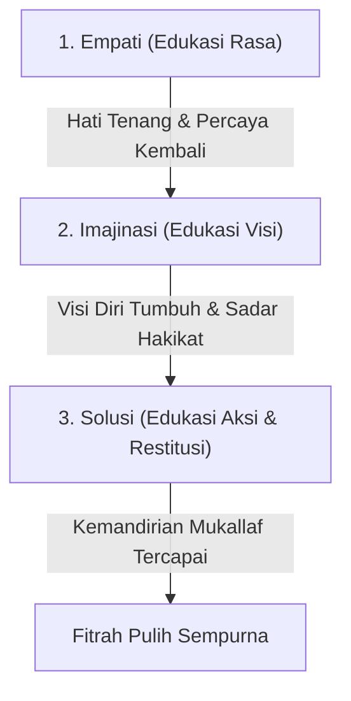
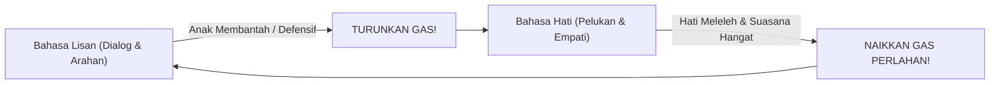

# Recovery: Metodologi Pemulihan Fitrah & Luka Hati

> [!note] Catatan Metodologi & Sumber Penyusunan Dokumen
> Dokumen ini merupakan hasil rangkuman dan rekonstruksi berbantuan kecerdasan buatan (AI) dari berbagai materi presentasi, modul kurikulum, dokumen standar lembaga, dan rekaman kajian **Pendidikan Karakter Nabawiyah (PKN)** yang diampu oleh **Ustadz Abdul Kholiq**.  
> 
> Naskah ini telah melalui verifikasi dan pengayaan ulang dalil-dalil Al-Qur'an dan Hadits shahih dari korpus **OpenBayan** (60 kitab klasik), serta diperkaya dengan sintesis intisari dan masukan berharga dari kawan-kawan **Himmatul Ummah**, **Insan Taqwa / Mustaqbal**, dan **Tim SOTAB HEBAT**.

> [!quote] Dalil & Rujukan Nabawiyah
> **Naskah:**  
> « كُلُّ بَنِي آدَمَ خَطَّاءٌ وَخَيْرُ الْخَطَّائِينَ التَّوَّابُونَ »
>
> *"Setiap anak keturunan Adam pasti sering berbuat salah (khilaf), dan sebaik-baik orang yang berbuat salah adalah mereka yang senantiasa bertaubat."*
>
> 📚 **Sumber Rujukan OpenBayan:** HR. Tirmidzi (No. 2499) & Syarah Riyadush Shalihin Hathibah (Juz 19 Hal. 9)  
> 💡 **Relevansi PKN:** Pemulihan fitrah (*recovery*) tidak pernah terlambat; dengan taubat nasuha, permohonan maaf orang tua kepada anak, dan restorasi adab, noda hati dapat dihilangkan secara tuntas.

> *"Pemulihan jiwa tidak bisa dilakukan dengan ketergesa-gesaan. Hati yang telah retak oleh bentakan bertahun-tahun membutuhkan waktu untuk merekat kembali melalui kelembutan yang konsisten, bukan ceramah panjang yang menekan."*  
> — **Ustadz Abdul Kholiq & SOTAB HEBAT**

---

## 1. Hakikat Pemulihan (*Recovery*)

**Recovery (Pemulihan Fitrah)** adalah proses terapeutik dan edukatif yang dirancang untuk menyembuhkan luka batin anak, mencairkan dendam bawah sadar, dan melunasi hutang pengasuhan sebelum anak memasuki fase kedewasaan mandiri (*Aqil-Baligh*).

Pemulihan ini berpijak pada kaidah dasar bahwa fitrah manusia pada dasarnya condong kepada kebaikan (*hanif*). Perilaku menyimpang, pembangkangan, atau adiksi hanyalah **gejala (*symptom*)** dari hati yang terluka, bukan watak permanen anak.

---

## 2. Metode EMISOL: Tiga Pilar Pemulihan

Kerangka utama recovery dijalankan melalui tiga tahapan terstruktur yang disebut **EMISOL**:

### 1. Empati (Edukasi Rasa)
- **Tujuan:** Meruntuhkan tembok pertahanan batin anak dan membangun kembali rasa aman (*safety zone*).
- **Langkah Praktik:**
  - Orang tua mendengarkan seluruh tumpahan emosi, kemarahan, atau tangisan anak tanpa memotong, membela diri, atau mendebat.
  - Berikan validasi emosi: *"Ayah/Bunda paham betapa sakitnya perasaanmu selama ini..."*
  - Berikan pelukan fisik tanpa kata-kata (*dekapan minimal 20 detik*) untuk menstimulasi hormon penenang batin.
  - Orang tua memohon maaf secara tulus atas kelalaian pengasuhan di masa lalu.

### 2. Imajinasi (Edukasi Visi)
- **Tujuan:** Menyalakan kembali cita-cita luhur (*Himmah*) dan menyadarkan anak akan hakikat penciptaannya sebagai hamba Allah.
- **Langkah Praktik:**
  - Setelah rasa sakit mereda, ajak anak membayangkan masa depan yang mulia: *"Menurutmu, dengan potensi besar yang Allah titipkan padamu, manusia seperti apa yang ingin kamu capai di masa depan?"*
  - Kisahkan teladan para Sahabat Nabi yang pernah mengalami masa lalu kelam namun bangkit menjadi pribadi agung (seperti kisah kebangkitan Umar bin Khattab radhiyallahu 'anhu).

### 3. Solusi (Edukasi Aksi & Restitusi)
- **Tujuan:** Menyusun komitmen tindakan nyata dan melatih tanggung jawab secara mandiri tanpa paksaan represif.
- **Langkah Praktik:**
  - Rumuskan kesepakatan tertulis (*Aqad*) bersama anak.
  - Terapkan prinsip **Restitusi**: ajak anak memperbaiki sendiri dampak kekeliruannya secara terhormat, bukan dengan hukuman yang merendahkan harga dirinya.

---

## 3. Kaidah Emas: Prinsip "Naik Turun Gas"

Dalam interaksi harian selama masa pemulihan, orang tua wajib menguasai analogi **"Naik Turun Gas"** yang diajarkan oleh Ustadz Abdul Kholiq:

1. **Awali dengan Bahasa Lisan:** Bicarakan aturan atau tugas rumah tangga secara baik-baik.
2. **Deteksi Resistensi:** Jika anak mulai cemberut, membanting pintu, atau meninggikan nada bicara, ini tanda bahwa **amigdala (otak emosi) anak sedang membajak nalarnya**.
3. **Turunkan Gas Seketika:** Jangan lawan dengan bentakan atau ancaman fisik. Segera turunkan gas ke **Bahasa Hati**: diamkan sejenak, beri minum, dekap punggungnya, dan dengarkan perasaannya hingga detak jantungnya kembali normal.
4. **Naikkan Gas Setelah Tenang:** Hanya ketika frekuensi hati sudah kembali tersambung, naikkan gas kembali ke Bahasa Lisan untuk menuntaskan kesepakatan.

---

## 4. Protokol 9 Tahap SOTAB: Menghapus Noda & Luka Hati

Berdasarkan literatur serial resmi SOTAB HEBAT, pemulihan luka batin anak melalui 9 fase pembersihan:

| No | Fase Pemulihan | Tindakan Konkret Orang Tua di Rumah |
|---|---|---|
| **1** | **Penyebab Luka** | Mengidentifikasi sumber racun: apakah bentakan, pembandingan dengan saudara, atau tuntutan nilai akademik berlebih. |
| **2** | **Tanda Luka** | Membaca perubahan sikap: menarik diri dari keluarga, kecanduan gawai ekstrem, atau ledakan amarah tiba-tiba. |
| **3** | **Analisis Akar** | Menelaah kebutuhan dasar yang hilang: apakah kurangnya pelukan fisik, kehilangan hak bermain, atau hilangnya figur ayah. |
| **4** | **Penawar Luka** | Orang tua bertaubat, memperbanyak istighfar, dan membersihkan hatinya sendiri (*tazkiyatun nafs*). |
| **5** | **Menabur Obat** | Mengucapkan permohonan maaf yang tulus dan jujur di hadapan anak tanpa pembelaan diri. |
| **6** | **Membalut Luka 1 (Sentuhan)** | Memperbanyak kontak fisik kasih sayang: pelukan di dada kiri, belaian rambut, dan ciuman kening saat tidur dan bangun. |
| **7** | **Membalut Luka 2 (Kebersamaan)** | Menghabiskan waktu berdua (*one-on-one quality time*) tanpa distraksi gawai atau interupsi urusan pekerjaan. |
| **8** | **Membalut Luka 3 (Hadiah)** | Memberikan hadiah kejutan yang bermakna sesuai dengan bahasa cinta (*love language*) anak. |
| **9** | **Pemulihan Tuntas** | Mengembalikan kepercayaan diri anak, mengasah bakat fitrahnya, dan mendampinginya memasuki fase *Aqil-Baligh*. |

---

## 5. Matriks Penanganan Deviasi & Terapi Kelembagaan (Klausul 12 Standar PKN)

Berdasarkan **Panduan Implementasi Standar PKN (A4) Revisi Agustus 2025 (Klausul 12 & Tabel 4)**, evaluasi kelembagaan memilah ketidaksesuaian menjadi dua kategori pokok:
1. **Ketidaksesuaian Proses Pembelajaran:** Diakibatkan oleh kekurangtepatan rencana pembelajaran, kompetensi pendidik, atau kendala fasilitas lingkungan. Penanganannya dilakukan melalui perbaikan manajerial dan *coaching* guru.
2. **Ketidaksesuaian Perkembangan Individu (Hutang Pengasuhan):** Terjadi ketika perkembangan santri tidak menunjukkan kematangan fitrah yang semestinya pada fase usianya. Kondisi ini menuntut pelaksanaan **Program Recovery Terstruktur**.

### Matriks 5 Kondisi Recovery & Protokol Intervensi Baku (Tabel 4)

| No | Penumbuhan Karakter (Iman / Belajar / Bakat) | Diagnosis Kondisi Perkembangan | Bentuk Intervensi & Protokol Recovery Resmi |
|:---:|---|---|---|
| **1** | Iman (✅), Belajar (✅), Bakat (✅) | **Telah Sesuai Tahapan Perkembangan** | Tidak memerlukan program recovery. Akselerasi peran peradaban dan delegasikan kepemimpinan proyek mandiri (*Qiyadah*). |
| **2** | Iman (✅), Belajar (✅), **Bakat (❌)** | **Bakat Belum Tumbuh** | **Mengasah bakat menggunakan Standar Pendewasaan (Klausul 11):** Berikan variasi aktivitas magang kerja, eksplorasi peran profesi, dan uji coba portofolio karya nyata. |
| **3** | Iman (✅), **Belajar (❌)**, **Bakat (❌)** | **Karakter Belajar dan Bakat Belum Tumbuh** | **Menumbuhkan karakter belajar dengan memperbesar interaksi alam dan proyek:** Bebaskan dari hafalan teoritis kaku, bawa ke alam terbuka (*outdoor*), stimulasi rasa ingin tahu lewat eksperimen *trial & error*. |
| **4** | **Iman (❌)**, Belajar (✅), Bakat (✅/❌) | **Hutang Pengasuhan karena Karakter Iman Belum Tumbuh** | **Menumbuhkan karakter iman dengan salah satu bahasa cinta yang sesuai:** Penuhi tangki cinta melalui ketulusan, pendampingan personal (*mushahabah*), tanpa ancaman hukuman fisik. |
| **5** | **Iman (❌)**, **Belajar (❌)**, **Bakat (❌)** | **Hutang Pengasuhan Ganda (Iman & Belajar Belum Tumbuh)** | **Pemulihan Berjenjang Penuh:** Sirami karakter iman terlebih dahulu dengan bahasa cinta hingga tangki cinta penuh dan qolbu melunak, lalu secara bertahap lanjutkan dengan penumbuhan karakter belajar. |

> [!IMPORTANT]
> **Kaidah Emas Urutan Pemulihan Kelembagaan:**  
> *"Merujuk pada sunnatullah pertumbuhan fitrah yang berurutan dari Iman $	o$ Belajar $	o$ Bakat, maka bila ada tahapan yang belum tuntas, proses recovery WAJIB diinteraksikan dengan urutan yang sama persis, walaupun usia ananda yang bersangkutan telah melampaui fase tersebut."*  
> — **Panduan Implementasi Standar PKN (A4), Klausul 12.2**

Lihat landasan filosofis dan tadabbur ekologi qolbunya pada dokumen [[Pendidikan Ideal/Menumbuhkan Kesadaran Beramal|Menumbuhkan Kesadaran Beramal]] serta peta utuhnya di [[PKN Blueprint Arsitektur Sistem|PKN Blueprint]].

---

## 6. Prinsip Mutlak: "Tidak Menambah Luka" (*Ad-Dhararu Yuzal*)

Berdasarkan Klausul 11.2.3 Standar Penjaminan Mutu PKN, setiap upaya pemulihan anak wajib mematuhi kaidah fikih nabawi:
$$\text{الضَّرَرُ يُزَالُ}$$
*"Kemudharatan (bahaya/luka) harus dihilangkan."*

Pendidik dan orang tua **dilarang keras** melakukan tindakan perbaikan yang justru menorehkan luka baru di jiwa anak, seperti:
1. **Mempermalukan Santri di Depan Umum:** Menghukum anak berdiri di tengah lapangan atau membacakan kesalahannya di hadapan teman-temannya. Hal ini mematikan sifat *'Izzah* (harga diri) dan menumbuhkan bibit kemunafikan.
2. **Memberikan Julukan Buruk (*Al-Alqab al-Madzmumah*):** Mencap anak sebagai "pemalas", "pembangkang", "bodoh", atau "anak nakal", yang diharamkan dalam QS. Al-Hujurat: 11.
3. **Menggunakan Hukuman Fisik Represif:** Menghukum fisik saat emosi memuncak hanya akan melatih anak menjadi pribadi yang dendam atau pengecut.

### Metode Menyikapi Anak "Bermasalah" (Kajian Seminar 1)
Ketika anak yang biasanya berbuat baik tiba-tiba melakukan pelanggaran syariat tanpa udzur:
1. **Tunda Reaksi (*Cooling Down*):** Jangan merespon saat marah. Tundukkan pandangan dan baca ta'awwudz.
2. **Tabayyun Empatik:** Ajak anak bicara empat mata di tempat yang nyaman (*Mushahabah*). Tanyakan kondisinya: *"Apa yang sedang terjadi padamu nak? Ayah/Ustadz tahu kamu anak baik, apa yang membuatmu melakukan hal ini?"*
3. **Restitusi Terhormat:** Ajak anak memikirkan sendiri cara memperbaiki dampak perbuatannya kepada pihak yang dirugikan, sehingga harga diri dan tanggung jawabnya (*Amaanah*) tetap terjaga.

---

## 7. Rujukan Kajian Video Terkait (PKN Video Database)

* *Metode Recovery: Prinsip Naik Turun Gas Antara Lisan dan Hati* — [Tonton di YouTube @ 81:49](https://www.youtube.com/live/OJhA20R7aDA&t=4909s)
* *Tanya Jawab: Bolehkah Minta Maaf ke Anak?* — [Tonton di YouTube @ 45:12](https://www.youtube.com/watch?v=hODlNvl6qcc&t=2712s)
* *Memulihkan Anak yang Terlanjur Trauma Beragama* — [Tonton di YouTube @ 60:15](https://www.youtube.com/watch?v=hODlNvl6qcc&t=3615s)
* *Membasuh Luka Pengasuhan Orang Tua Sendiri* — [Tonton di YouTube @ 65:15](https://www.youtube.com/watch?v=hODlNvl6qcc&t=3915s)

---

## 8. Navigasi Bab Lanjutan

* [[Euforia]] — Memahami dinamika ledakan emosi anak saat hutang pengasuhan mulai dicairkan.
* [[8 Standar Implementasi PKN]] — Kerangka sistem penjaminan mutu kelembagaan dan audit berkala.
* [[Panduan RPP dan Observasi Lapangan]] — Instrumen kuisioner penilaian pertumbuhan karakter dan formula indeks.

---

> [!quote] Dokumen & Slide Presentasi Rujukan Resmi PKN
> Pembahasan dalam artikel ini bersumber langsung dari materi tayang pelatihan dan dokumen kurikulum resmi PKN oleh **Ustadz Abdul Kholiq**:
>
> - **Materi:** *3. PEMULIHAN KARAKTER (Materi 3)*
>   - 📖 **Rujukan Slide:** Slide Hal. 22–65 (Protokol Pemulihan Karakter, 9 Tahap Menghapus Noda Hati, Terapi Luka Batin)
>   - 🔗 **Akses Berkas:** [📊 Unduh PPTX Asli (51.7 MB)](https://www.dropbox.com/scl/fi/i4wqpb1kbveh33ln1nzkq/3.-PEMULIHAN-KARAKTER-MATERI-3.pptx?rlkey=1bauf7luniop6gjq36dtc0sh1&dl=1) • [👁️ Buka di Dropbox](https://www.dropbox.com/scl/fi/i4wqpb1kbveh33ln1nzkq/3.-PEMULIHAN-KARAKTER-MATERI-3.pptx?rlkey=1bauf7luniop6gjq36dtc0sh1&dl=0)
>
> - **Materi:** *2. Menangani Anak yang Bermasalah*
>   - 📖 **Rujukan Slide:** Slide Hal. 10–38 (Diagnosis Masalah Anak: Perilaku Permukaan vs Luka Hati Tersembunyi)
>   - 🔗 **Akses Berkas:** [📥 Unduh PDF (7.8 MB)](https://www.dropbox.com/scl/fi/0gawb637j3l5p76m037o3/2.-Menangani-anak-yang-bermasalah.pdf?rlkey=26i13l75150w0nff636p311t9&dl=1) • [📊 Unduh PPTX Asli (15.4 MB)](https://www.dropbox.com/scl/fi/1jsh6r3q0e9477q0e25q2/2.-Menangani-anak-yang-bermasalah.pptx?rlkey=1x696k9m9m1j2v2q3o0p713s5&dl=1) • [👁️ Buka di Dropbox](https://www.dropbox.com/scl/fi/0gawb637j3l5p76m037o3/2.-Menangani-anak-yang-bermasalah.pdf?rlkey=26i13l75150w0nff636p311t9&dl=0)
>
> - **Materi:** *RECOVERY KESADARAN & PENANGANAN BULLYING*
>   - 📖 **Rujukan Slide:** Slide Hal. 1–24 (Langkah Pemulihan Kesadaran Fitrah & Penanganan Korban/Pelaku Bullying)
>   - 🔗 **Akses Berkas:** [📥 Unduh PDF (2.8 MB)](https://www.dropbox.com/scl/fi/f0g93j8z45963o7s5114n/RECOVERY-KESADARAN.pdf?rlkey=q61109u516p7t2n2577q310s5&dl=1) • [📊 Unduh PPTX Asli (5.2 MB)](https://www.dropbox.com/scl/fi/2q97p16m307o245u88963/RECOVERY-KESADARAN.pptx?rlkey=p6108u45903o7s26104n982p3&dl=1) • [👁️ Buka di Dropbox](https://www.dropbox.com/scl/fi/f0g93j8z45963o7s5114n/RECOVERY-KESADARAN.pdf?rlkey=q61109u516p7t2n2577q310s5&dl=0)

