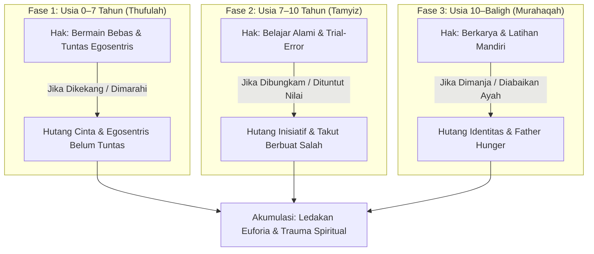
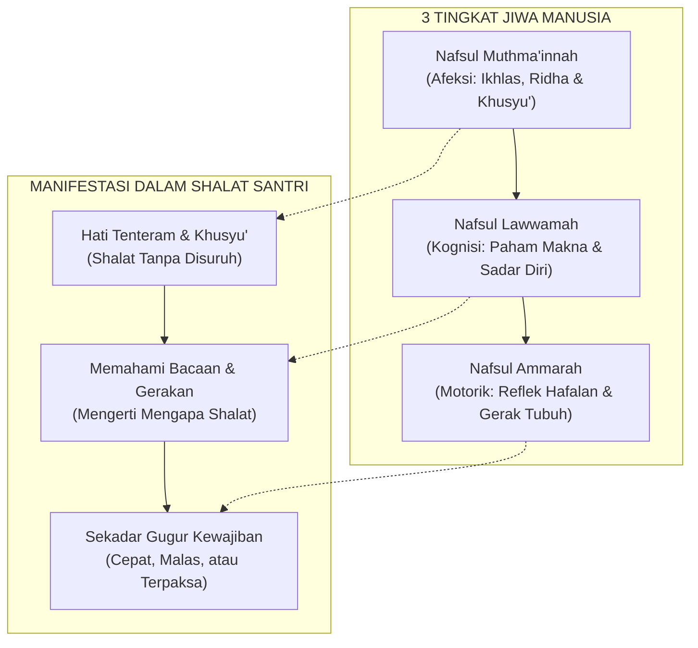
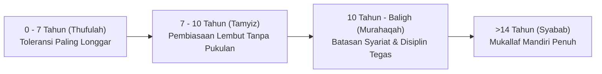

# Luka dan Hutang Pengasuhan (*Parenting Debt*)

> [!note] Catatan Metodologi & Sumber Penyusunan Dokumen
> Dokumen ini merupakan hasil rangkuman dan rekonstruksi berbantuan kecerdasan buatan (AI) dari berbagai materi presentasi, modul kurikulum, dokumen standar lembaga, dan rekaman kajian **Pendidikan Karakter Nabawiyah (PKN)** yang diampu oleh **Ustadz Abdul Kholiq**.  
> 
> Naskah ini telah melalui verifikasi dan pengayaan ulang dalil-dalil Al-Qur'an dan Hadits shahih dari korpus **OpenBayan** (60 kitab klasik), serta diperkaya dengan sintesis intisari dan masukan berharga dari kawan-kawan **Himmatul Ummah**, **Insan Taqwa / Mustaqbal**, dan **Tim SOTAB HEBAT**.

> [!quote] Dalil & Rujukan Nabawiyah
> **Naskah:**  
> « كَفَى بِالْمَرْءِ إِثْمًا أَنْ يُضَيِّعَ مَنْ يَقُوتُ »
>
> *"Cukuplah seseorang dikatakan berdosa besar jika ia menelantarkan dan menyia-nyiakan orang-orang yang berada di bawah tanggung jawab nafkah dan pengasuhannya."*
>
> 📚 **Sumber Rujukan OpenBayan:** HR. Abu Dawud (No. 1692) & Riyadush Shalihin (Tahqiq Ar-Risalah II, Hal. 124)  
> 💡 **Relevansi PKN:** Hutang pengasuhan terjadi saat orang tua abai mencurahkan kehadiran jiwa, kasih sayang, dan pendampingan karakter, yang kelak melahirkan luka batin menahun pada anak.

> *"Anak terlahir suci membawa fitrah. Ketika ia tumbuh menjadi sosok yang membangkang, pemarah, atau rapuh jiwanya, jangan buru-buru menghakimi anaknya. Periksalah catatan masa lalunya: ada hak-hak fitrah yang belum tertunaikan, ada tangki cinta yang kosong, atau ada luka pengasuhan dari orang tuanya yang belum terbasuh."*  
> — **Ustadz Abdul Kholiq**

---

## 1. Hakikat & Definisi Hutang Pengasuhan

**Hutang Pengasuhan (*Parenting Debt*)** adalah akumulasi ketidaktuntasan pemenuhan hak-hak fitrah anak pada suatu fase usia perkembangan yang mengakibatkan terhambatnya kematangan emosional, mental, dan spiritual pada fase-fase berikutnya.

Sebagaimana hutang finansial yang terus berbunga jika tidak dibayar, hutang pengasuhan tidak akan hilang dengan bertambahnya usia biologis anak. Anak yang mengalami defisit hak fitrah di masa kecil akan menagihnya di masa remaja atau dewasa dalam bentuk:
- Perilaku membangkang yang ekstrem (*oppositional defiant*).
- Keterikatan adiktif pada layar gawai, pergaulan bebas, atau zat adiktif untuk mengisi kekosongan batin.
- Ledakan kemarahan yang tidak proporsional terhadap hal-hal sepele.
- Ketidakmampuan memikul tanggung jawab kedewasaan (*infantilisasi*).

---

## 2. Mekanisme Terjadinya Hutang per Fase Usia

*Akar Akhlak Tercela dari Luka dan Hutang Pengasuhan Masa Lalu*

Hutang pengasuhan terjadi ketika orang tua menerapkan metode yang melompati sunnatullah tahapan perkembangan anak:

### 1. Defisit Fase Thufulah (0–7 Tahun): Egosentris yang Belum Tuntas
Pada usia 0–7 tahun, anak adalah "Raja" yang berhak dimanjakan dengan kasih sayang tanpa syarat (*Bahasa Hati*). Hak bermain dan rasa ingin tahunya harus dituntaskan dengan 3 syarat:
- Selama orang tua mampu memfasilitasi,
- Tidak membahayakan keselamatan fisik anak, dan
- Tidak membahayakan orang lain.

Jika di fase ini anak sering dibentak di tempat shalat, dilarang bergerak aktif, atau dipaksa calistung dini dengan ancaman, anak akan mengalami **kemandekan egosentris**. Di usia remaja, ia akan bersikap kekanak-kanakan, haus perhatian, dan egosentrisnya meledak kembali (*retardasi emosional*).

### 2. Defisit Fase Tamyiz (7–10 Tahun): Inisiatif yang Padam
Usia 7–10 tahun adalah masa belajar mandiri melalui *trial and error*. Anak butuh ruang untuk mencoba, jatuh, salah, dan memperbaiki kesalahannya. Jika orang tua perfeksionis menuntut anak selalu sempurna, anak akan kehilangan keberanian (*Syajaa'ah*) dan tumbuh menjadi pribadi peragu yang takut melangkah tanpa arahan.

### 3. Defisit Fase Murahaqah (10–14 Tahun): Kehausan Figur Ayah (*Father Hunger*)
Menjelang baligh, anak memerlukan figur ayah yang hadir secara emosional untuk menanamkan akidah, visi hidup, dan keberanian sosial. Jika ayah absen (*fatherless* secara psikologis), anak laki-laki akan kehilangan orientasi maskulin dan anak perempuan akan rentan mencari validasi kasih sayang dari laki-laki asing di luar rumah.

---

## 3. Dinamika Psikospiritual: Tiga Tingkat Jiwa & Barometer Ibadah Shalat

Kajian resmi *Kondisi Jiwa Anak* membedah bahwa hutang pengasuhan secara langsung mendistorsi keseimbangan tiga tingkatan jiwa manusia yang diuraikan dalam Al-Qur'an:
1. **Nafsul Ammarah (النَّفْسُ الْأَمَّارَةُ بِالسُّوءِ):** Jiwa yang tunduk pada dorongan impulsif, syahwat jasadiah, dan emosi liar tanpa kendali akal (QS. Yusuf: 53).
2. **Nafsul Lawwamah (النَّفْسُ اللَّوَّامَةُ):** Jiwa yang mulai memiliki kesadaran nalar, mencela diri sendiri saat bersalah, dan menimbang kaidah hukum syariat (QS. Al-Qiyamah: 2).
3. **Nafsul Muthma'innah (النَّفْسُ الْمُطْمَئِنَّةُ):** Jiwa yang tenang, ikhlas, tunduk dengan penuh kerinduan kepada Allah, dan merasakan lezatnya ibadah (QS. Al-Fajr: 27-28).

### Barometer Shalat bagi Kesehatan Jiwa Anak
Ketika anak mengalami penumpukan hutang pengasuhan dan defisit tangki cinta, kondisi jiwanya merosot ke level *Ammarah*. Akibatnya, ibadah shalat anak hanya sebatas **pengguguran kewajiban mekanik** (motorik belaka):
- Anak shalat tergesa-gesa seperti ayam mematuk makanan (*Naqrul Ghurab*).
- Shalat hanya dilakukan jika ada bentakan atau ancaman orang tua.
- Tidak ada keikhlasan (*Afeksi*) maupun pemahaman makna (*Kognisi*).

Sebaliknya, anak yang tangki cintanya penuh dan terbebas dari luka pengasuhan akan mengalami akselerasi ruhani: shalatnya dipimpin oleh *Nafsul Muthma'innah*, menghadirkan kekhusyukan dan rasa butuh bermunajat kepada Allah secara sukarela.

---

## 4. Kaidah Komunikasi Fitrah: "Bahasa Akal vs Bahasa Hati"

Salah satu aksioma tarbiyah paling fundamental dalam PKN menyatakan:
> **"Selembut-lembutnya bahasa akal untuk mendidik hati, akan dapat melukainya!"**

Banyak orang tua dan pendidik merasa telah menasihati anak dengan sangat lembut, sopan, dan runtut secara logika. Namun, mengapa anak justru menangis, membanting pintu, atau menjadi defensif?
- **Bahasa Akal** berbicara tentang dalil hukum, logika benar-salah, kaidah kewajiban, dan perbandingan prestasi. Bahasa akal ditujukan untuk otak kiri (*Nafsul Lawwamah*).
- **Hati yang Terluka** tidak membutuhkan ceramah logika. Ketika hati anak sedang lapar cinta atau menampung luka masa lalu, menyodorkan logika aturan hanya akan dirasakan sebagai penghakiman dingin yang menambah perih batinnya.
- Oleh karena itu, pintu masuk perbaikan selalu diawali dengan **Bahasa Hati** ([[Bahasa Hati]]): dekapan hangat, sentuhan lembut, pandangan mata yang penuh welas asih (*'Ainur Rahmah*), dan validasi emosi tanpa bantahan.

---

## 5. Kurva Toleransi vs Batasan Syariat: Hubungan Tekanan dan Akhlaq Tercela

Berdasarkan naskah *Seminar 1: Kondisi Jiwa Anak*, akumulasi akhlaq tercela pada anak adalah fungsi dari **ketidaksesuaian perlakuan orang tua terhadap kurva perkembangan fitrah**:

### Distorsi Pengasuhan Modern
1. **Terlalu Keras di Usia Dini (0–7 Tahun):**
   - Menuntut anak duduk diam berjam-jam, melarang anak mengeksplorasi fisik, dan memarahi tumpahan air/makanan.
   - Dampak: Anak mengalami **Hutang Pengasuhan Dini** (*Early Childhood Debt*), egosentrisnya macet, dan dendam batin tersimpan rapi di alam bawah sadar.
2. **Terlalu Longgar di Usia Remaja (10–Baligh):**
   - Ketika anak sudah berusia 10–14 tahun, orang tua justru tidak tega menegakkan batasan syariat (membiarkan anak meninggalkan shalat, bebas bergaul tanpa batas, tidak ada tanggung jawab mandiri).
   - Akibat: Ledakan **Tekanan Eksternal & Akhlaq Tercela** saat anak memasuki fase *Syabab*, memicu kemandekan aqil baligh (*Infantilisasi*).

---

## 6. Tipologi Anak Berkehebatan Khusus (*Gifted & Sensitive Children*)

Dokumen resmi *Kondisi Jiwa Anak* mengidentifikasi bahwa anak-anak yang kerap dicap "bermasalah", "nakal", atau "sulit diatur" di sekolah konvensional sebenarnya adalah **anak berkehebatan khusus** yang fitrah unggulnya tersumbat oleh sistem yang seragam:

| Tipologi Anak | Ciri Perilaku yang Tampak | Potensi Bakat TB-40 Tersembunyi | Kesalahan Fatal Penanganan | Solusi Tepat Berbasis Fitrah |
|---|---|---|---|---|
| **Anak Kuat yang Cerdas** | Tidak bisa diam, banyak bergerak, suka tantangan fisik ekstrem, menentang aturan kaku | *Syaja'ah* (Berani), *Nasyath* (Enerjik), *'Aziimah* (Tekad Baja), *Qiyadah* (Pemimpin) | Mengurung di kelas, memaksa duduk diam, mencapnya hiperaktif/ADHD | Berikan peran lapangan nyata, salurkan ke olahraga bela diri, pandu memimpin proyek fisik |
| **Anak Super Perasa (*Highly Sensitive*)** | Mudah menangis, tersinggung oleh nada bicara tinggi, sangat peka perasaan orang lain | *Rahmah* (Belas Kasih), *Shafqah* (Peduli), *Riqqahtul Qalb* (Lembut Hati), *Khidmah* | Membentak, menyindir sebagai "cengeng", memaksanya bersikap cuek | Gunakan bisikan lembut (*Bahasa Hati*), beri ruang jeda emosi, jadikan duta konseling teman |
| **Anak Super Cerdas (*Jenius/Logis*)** | Suka membantah argumen guru, mempertanyakan aturan, cepat bosan dengan pelajaran rutin | *Fathanah* (Cerdik), *Hikmah* (Kebijaksanaan), *Tafakkur* (Nalar Kritis), *Dzaka'* | Menuduh anak tidak sopan, membungkam pertanyaannya dengan ancaman nilai | Berikan bahan bacaan tingkat tinggi, beri tantangan riset mandiri, dialogkan hikmah syariat |

---

## 7. Asal Mula: Luka Orang Tua yang Belum Terbasuh (*Transgenerational Trauma*)

Salah satu penemuan penting dalam khazanah SOTAB HEBAT dan kajian Ustadz Abdul Kholiq adalah bahwa **orang tua yang keras sering kali bukanlah orang tua yang jahat, melainkan anak kecil yang terluka di masa lalu yang kini memegang kendali pengasuhan**.

Orang tua yang di masa kecilnya:
- Selalu dituntut sempurna dan tidak pernah diapresiasi,
- Sering menerima kekerasan verbal atau fisik dari kakek-nenek,
- Mengalami pengabaian kasih sayang,

...secara bawah sadar akan mereplikasi pola yang sama kepada anaknya. Oleh karena itu, langkah pertama dalam memutus rantai hutang pengasuhan adalah **kesadaran orang tua untuk membasuh luka dirinya sendiri (*Tazkiyatun Nafs*)** dan berdamai dengan masa lalunya.

> [!IMPORTANT]
> **Bolehkah Orang Tua Meminta Maaf kepada Anak?**  
> Sangat dianjurkan dan bukan aib! Meminta maaf secara tulus (*"Maafkan Ayah/Bunda ya nak, waktu itu Ayah terpancing emosi..."*) adalah obat paling mujarab yang menembus pikiran bawah sadar anak, mencairkan dendam batin, dan mengajarkan keteladanan sifat *Tawaadhu'* (rendah hati).

---

## 8. Cara Membayar Hutang Pengasuhan Jarak Jauh (Anak di Pesantren / LDR)

Banyak orang tua baru menyadari adanya hutang pengasuhan ketika anak sudah terlanjur dikirim ke pondok pesantren atau tinggal terpisah. Hutang tetap dapat dicicil dan dilunasi dengan langkah-langkah strategis:

1. **Surat Cinta Tulisan Tangan:**  
   Tulisan tangan orang tua membawa resonansi emosional yang jauh melampaui pesan teks digital. Kirimkan surat yang berisi ungkapan kasih sayang tulus, kerinduan, dan doa, tanpa menyelipkan tuntutan target hafalan atau nilai ujian.
2. **Telepon Berkualitas (*Active Listening*):**  
   Ketika anak menelepon, fokuslah mendengarkan keluh kesahnya. Jangan langsung memberi kuliah moralitas. Validasi perasaannya: *"Bunda dengar kamu lelah ya nak, terima kasih ya sudah bertahan dan berjuang."*
3. **Kunjungan Penuh Kehadiran (*Quality Presence*):**  
   Saat menjenguk (*sambangan*), bawakan makanan kesukaannya, peluk dengan hangat, dan habiskan waktu bersama tanpa sibuk memeriksa gawai.

---

## 9. Rujukan Kajian Video Terkait (PKN Video Database)

* *Membayar Hutang Pengasuhan: Konsep, Sebab, dan Solusi* — [Tonton di YouTube @ 25:05](https://www.youtube.com/watch?v=hODlNvl6qcc&t=1505s)
* *Tanya Jawab: Bolehkah Orang Tua Meminta Maaf ke Anak?* — [Tonton di YouTube @ 45:12](https://www.youtube.com/watch?v=hODlNvl6qcc&t=2712s)
* *Tanya Jawab: Mengisi Tangki Cinta Anak yang Mondok Jauh (LDR)* — [Tonton di YouTube @ 275:32](https://www.youtube.com/live/6H-qENwmmcw&t=16532s)
* *Hutang Pengasuhan & Inner Child Orang Tua* — [Tonton di YouTube @ 95:10](https://www.youtube.com/live/6H-qENwmmcw&t=5710s)

---

## 10. Navigasi Bab Lanjutan

* [[Euforia]] — Memahami dinamika ledakan emosi anak saat hutang pengasuhan mulai dituntut.
* [[Recovery]] — Protokol pemulihan terstruktur (EMISOL) dan 9 tahap menghapus noda hati.
* [[8 Standar Implementasi PKN]] — Standar manajemen penjaminan mutu lembaga dan matriks recovery.

---

> [!quote] Dokumen & Slide Presentasi Rujukan Resmi PKN
> Pembahasan dalam artikel ini bersumber langsung dari materi tayang pelatihan dan dokumen kurikulum resmi PKN oleh **Ustadz Abdul Kholiq**:
>
> - **Materi:** *3. PEMULIHAN KARAKTER (Materi 3)*
>   - 📖 **Rujukan Slide:** Slide Hal. 22–65 (Protokol Pemulihan Karakter, 9 Tahap Menghapus Noda Hati, Terapi Luka Batin)
>   - 🔗 **Akses Berkas:** [📊 Unduh PPTX Asli (51.7 MB)](https://www.dropbox.com/scl/fi/i4wqpb1kbveh33ln1nzkq/3.-PEMULIHAN-KARAKTER-MATERI-3.pptx?rlkey=1bauf7luniop6gjq36dtc0sh1&dl=1) • [👁️ Buka di Dropbox](https://www.dropbox.com/scl/fi/i4wqpb1kbveh33ln1nzkq/3.-PEMULIHAN-KARAKTER-MATERI-3.pptx?rlkey=1bauf7luniop6gjq36dtc0sh1&dl=0)
>
> - **Materi:** *2. Menangani Anak yang Bermasalah*
>   - 📖 **Rujukan Slide:** Slide Hal. 10–38 (Diagnosis Masalah Anak: Perilaku Permukaan vs Luka Hati Tersembunyi)
>   - 🔗 **Akses Berkas:** [📥 Unduh PDF (7.8 MB)](https://www.dropbox.com/scl/fi/0gawb637j3l5p76m037o3/2.-Menangani-anak-yang-bermasalah.pdf?rlkey=26i13l75150w0nff636p311t9&dl=1) • [📊 Unduh PPTX Asli (15.4 MB)](https://www.dropbox.com/scl/fi/1jsh6r3q0e9477q0e25q2/2.-Menangani-anak-yang-bermasalah.pptx?rlkey=1x696k9m9m1j2v2q3o0p713s5&dl=1) • [👁️ Buka di Dropbox](https://www.dropbox.com/scl/fi/0gawb637j3l5p76m037o3/2.-Menangani-anak-yang-bermasalah.pdf?rlkey=26i13l75150w0nff636p311t9&dl=0)
>
> - **Materi:** *RECOVERY KESADARAN & PENANGANAN BULLYING*
>   - 📖 **Rujukan Slide:** Slide Hal. 1–24 (Langkah Pemulihan Kesadaran Fitrah & Penanganan Korban/Pelaku Bullying)
>   - 🔗 **Akses Berkas:** [📥 Unduh PDF (2.8 MB)](https://www.dropbox.com/scl/fi/f0g93j8z45963o7s5114n/RECOVERY-KESADARAN.pdf?rlkey=q61109u516p7t2n2577q310s5&dl=1) • [📊 Unduh PPTX Asli (5.2 MB)](https://www.dropbox.com/scl/fi/2q97p16m307o245u88963/RECOVERY-KESADARAN.pptx?rlkey=p6108u45903o7s26104n982p3&dl=1) • [👁️ Buka di Dropbox](https://www.dropbox.com/scl/fi/f0g93j8z45963o7s5114n/RECOVERY-KESADARAN.pdf?rlkey=q61109u516p7t2n2577q310s5&dl=0)

