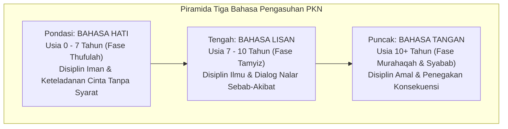

# Metode Mendidik Nabawiyah: Tiga Bahasa Pengasuhan

> [!quote] Dalil & Rujukan Nabawiyah Utama
> **Naskah:**  
> « ادْعُ إِلَىٰ سَبِيلِ رَبِّكَ بِالْحِكْمَةِ وَالْمَوْعِظَةِ الْحَسَنَةِ ۖ وَجَادِلْهُم بِالَّتِي هِيَ أَحْسَنُ »
>
> *"Serulah (manusia) kepada jalan Tuhanmu dengan hikmah (kebijaksanaan mendalam), pengajaran yang baik (mau'izhah hasanah), dan bantahlah mereka dengan cara yang terbaik (mujadalah bil-lati hiya ahsan)..."*
>
> 📚 **Sumber Rujukan OpenBayan:** QS. An-Nahl: 125; Tafsir Ibnu Katsir (Juz 4 Hal. 613); Syarah Riyadush Shalihin Ibnu Utsaimin (Juz 2 Hal. 347).  
> 💡 **Relevansi PKN:** Ayat ini meletakkan tripartite metodologi pengasuhan Islam: *Al-Hikmah* (Bahasa Hati), *Al-Mau'izhah Al-Hasanah* (Bahasa Lisan), dan ketegasan beradab yang proporsional (*Bahasa Tangan*).

---

## 1. Hakikat Metodologi Pendidikan Karakter Nabawiyah

Metode mendidik dalam Pendidikan Karakter Nabawiyah (PKN) bukanlah sekumpulan teknik mekanistis atau rekayasa perilaku (*behavioral conditioning*) seperti dalam psikologi sekuler Barat. Metode Nabawiyah adalah **penyelarasan interaksi pendidik dengan hukum fitrah insani yang telah ditetapkan Allah SWT**. 

Inti dari metodologi ini bersandar pada kaidah agung **At-Tadarruj (Pentahapan Alami)**:
1. **Tidak Melompatkan Tahapan:** Setiap anak melewati etape pembentukan jiwa yang berurutan. Jiwa tidak dapat menerima beban fisik sebelum akalnya paham, dan akal tidak akan menerima pemahaman sebelum hatinya terpaut cinta.
2. **Kesesuaian Instrumen Bahasa:** Menyampaikan nasihat lisan kepada anak usia 2 tahun yang menangis adalah inefisiensi, sebagaimana memukul anak usia 6 tahun karena belum shalat adalah kezaliman yang diharamkan syariat.
3. **Pendidik sebagai Mu'alliman Muyassiran (Pendidik yang Memudahkan):** Rasulullah ﷺ menegaskan misi pengutusannya: *"Sesungguhnya Allah tidak mengutusku sebagai orang yang kaku dan mempersulit, melainkan sebagai pendidik yang memudahkan."* (HR. Muslim No. 1478).

---

## 2. Arsitektur Piramida Tiga Bahasa Pengasuhan

PKN merumuskan instrumen komunikasi pendidikan ke dalam **Tiga Bahasa Nabawiyah** yang diterapkan secara hierarkis:

### Matriks Komparasi Tiga Bahasa Pendidikan:
| Aspek Pembeda | [[Bahasa Hati]] | [[Bahasa Lisan]] | [[Bahasa Tangan]] |
| :--- | :--- | :--- | :--- |
| **Fase Usia Dominan** | 0 – 7 Tahun (*Thufulah*) | 7 – 10 Tahun (*Tamyiz*) | 10 Tahun ke atas (*Murahaqah*) |
| **Dimensi Jiwa** | Hati / Rasa (*Al-Qalb* / Muthmainnah) | Akal / Cipta (*Al-'Aql* / Lawwamah) | Fisik / Karsa (*Al-Jasad* / Ammarah) |
| **Karakter Sasaran** | Fitrah Iman (*Mahabbah*) | Fitrah Belajar (*Nalar & Adab*) | Fitrah Bakat (*Tanggung Jawab Amal*) |
| **Bentuk Aksi** | Pelukan, tatapan kasih, teladan visual | Dialog dua arah, tanya jawab, kisah | Penugasan, sanksi tegas, konsekuensi |
| **Toleransi Kesalahan**| Paling Longgar (Dimaafkan penuh) | Menengah (Diberi tahu & dibimbing) | Ketat (Tuntutan tuntas sebelum baligh) |

---

## 3. Teladan Interaksi Dakwah & Tarbiyah Rasulullah ﷺ

Keagungan metode mendidik Rasulullah ﷺ terbukti dari bagaimana beliau memperlakukan para shahabatnya sesuai dengan kesiapan kondisi kejiwaan masing-masing:

### A. Kisah Mu'awiyah bin Al-Hakam As-Sulami: Mendidik Tanpa Menghardik
Ketika Mu'awiyah bin Al-Hakam berbicara di dalam shalat karena mendoakan orang yang bersin, para shahabat memukul paha mereka untuk memperingatkannya. Mu'awiyah merasa tertekan dan ketakutan. Namun perhatikan bagaimana Rasulullah ﷺ memperlakukannya seusai shalat:
> « فَبِأَبِي هُوَ وَأُمِّي، مَا رَأَيْتُ مُعَلِّمًا قَبْلَهُ وَلَا بَعْدَهُ أَحْسَنَ تَعْلِيمًا مِنْهُ، فَوَاللَّهِ مَا كَهَرَنِي، وَلَا ضَرَبَنِي، وَلَا شَتَمَنِي، قَالَ: إِنَّ هَذِهِ الصَّلَاةَ لَا يَصْلُحُ فِيهَا شَيْءٌ مِنْ كَلَامِ النَّاسِ، إِنَّمَا هُوَ التَّسْبِيحُ وَالتَّكْبِيرُ وَقِرَاءَةُ الْقُرْآنِ »  
> *"Demi ayah dan ibuku sebagai tebusannya, aku belum pernah melihat seorang pendidik pun sebelum maupun sesudahnya yang lebih baik cara mendidiknya daripada Rasulullah ﷺ! Demi Allah, beliau tidak membentakku, tidak memukulku, dan tidak mencelaku. Beliau hanya bersabda: 'Sesungguhnya shalat ini tidak boleh ada di dalamnya perkataan manusia biasa; shalat itu hanyalah tasbih, takbir, dan membaca Al-Qur'an.'"*  
> 📚 *(HR. Muslim No. 537, Kitab Al-Masajid wa Mawadhi' Ash-Shalah)*

### B. Kisah Pemuda yang Meminta Izin Berzina: Dialog Mengikis Syahwat
Seorang pemuda mendatangi majelis Nabi ﷺ dengan lancang meminta izin berzina. Para shahabat marah dan hendak memukulnya. Namun Rasulullah ﷺ menahannya dan menerapkan tiga bahasa sekaligus:
1. **Bahasa Hati:** Memanggilnya mendekat (*"Udnih"*), memintanya duduk tepat di hadapan beliau, dan meletakkan tangan mulia beliau di dada pemuda tersebut.
2. **Bahasa Lisan:** Mengajak nalar pemuda itu berdialog: *"Apakah engkau suka jika perzinaan itu terjadi pada ibumu?... putrimu?... saudara perempuanmu?"* Pemuda itu menjawab: *"Demi Allah tidak, wahai Rasulullah!"* Nabi menjawab: *"Demikian pula orang lain tidak menyukainya bagi keluarga mereka."*
3. **Doa Penyucian Jiwa:** Rasulullah ﷺ berdoa: *"Ya Allah, ampunilah dosanya, bersihkanlah hatinya, dan bentengilah kemaluannya!"* Pemuda itu keluar dari majelis sebagai orang yang paling membenci zina seumur hidupnya (HR. Ahmad No. 22211, sanad shahih).

---

## 4. Keterangan & Fatwa Para Ulama Otoritatif

Para ulama salaf dan khalaf telah merumuskan kaidah emas dalam metode mendidik Islam:

### 1. Imam Ibnu Qayyim Al-Jauziyyah (Wafat 751 H)
Dalam kitab monumentalnya *Tuhfatul Maudud bi Ahkamil Maulud* (Hal. 229), beliau menegaskan bahaya kesalahan metode dan kelalaian orang tua:
> « وَكَمْ مِمَّنْ أَشْقَى وَلَدَهُ وَفِلْذَةَ كَبِدِهِ فِي الدُّنْيَا وَالْآخِرَةِ بِإِهْمَالِهِ وَتَرْكِ تَأْدِيبِهِ، وَإِعَانَتِهِ لَهُ عَلَى شَهَوَاتِهِ، وَيَزْعُمُ أَنَّهُ يُكْرِمُهُ وَقَدْ أَهَانَهُ، وَأَنَّهُ يَرْحَمُهُ وَقَدْ ظَلَمَهُ، فَفَاتَهُ انْتِفَاعُهُ بِوَلَدِهِ، وَفَوَّتَ عَلَيْهِ حَظَّهُ فِي الدُّنْيَا وَالْآخِرَةِ. وَإِذَا اعْتَبَرْتَ الْفَسَادَ فِي الْأَوْلَادِ رَأَيْتَ عَامَّتَهُ مِنْ قِبَلِ الْآبَاءِ! »  
> *"Betapa banyak orang yang mencelakakan anaknya—belahan jantungnya sendiri—di dunia dan akhirat karena kelalaiannya, tidak mendidiknya (*tarku ta'dibihi*), serta menuruti hawa nafsunya. Ia menyangka sedang memuliakan anaknya padahal ia sedang menghinakannya; ia mengira sedang menyayanginya padahal ia sedang menzaliminya!... Dan apabila engkau perhatikan kerusakan pada anak-anak, niscaya engkau akan mendapati mayoritasnya bersumber dari kelalaian para ayah!"*

### 2. Imam Al-Ghazali (Wafat 505 H)
Dalam kitab *Ihya' 'Ulumiddin* (Juz 3 Hal. 72), beliau menguraikan fitrah anak yang plastis dan pentingnya keteladanan visual:
> « الصَّبِيُّ أَمَانَةٌ عِنْدَ وَالِدَيْهِ، وَقَلْبُهُ الطَّاهِرُ جَوْهَرَةٌ نَفِيسَةٌ سَاذَجَةٌ خَالِيَةٌ عَنْ كُلِّ نَقْشٍ وَصُورَةٍ، وَهُوَ قَابِلٌ لِكُلِّ مَا نُقِشَ، وَمَائِلٌ إِلَى كُلِّ مَا يُمَالُ بِهِ إِلَيْهِ، فَإِنْ عُوِّدَ الْخَيْرَ وَعُلِّمَهُ نَشَأَ عَلَيْهِ وَسَعِدَ فِي الدُّنْيَا وَالْآخِرَةِ »  
> *"Anak kecil adalah amanah di sisi kedua orang tuanya. Hatinya yang suci laksana permata berharga yang masih polos, bersih dari segala ukiran dan gambar. Ia siap menerima setiap ukiran yang digoreskan dan cenderung kepada arah ke mana saja ia dipalingkan. Jika ia dibiasakan dengan kebaikan dan diajarkan kebajikan, niscaya ia akan tumbuh di atas kebaikan itu dan bahagia di dunia dan akhirat."*

### 3. Al-Qadhi Abu Bakar Ibn Al-Arabi Al-Maliki (Wafat 543 H)
Beliau mengingatkan agar tidak membebani nalar anak secara terburu-buru:
> *"Hendaklah anak tidak dibebani dengan logika abstrak sebelum adab keseharian dan keindahan Al-Qur'an meresap ke dalam sanubarinya, agar ilmu tidak menjadi beban yang dimusuhi oleh jiwanya."*

---

## 5. Bahaya Pelompatan Tahapan (Penyebab Luka Pengasuhan)

Dalam PKN, penyimpangan metodologis akan melahirkan **Hutang Pengasuhan (*Debt of Parenting*)** yang merusak fitrah:

1. **Bahasa Lisan Tanpa Bahasa Hati (Logika Kering Tanpa Cinta):**
   * *Gejala:* Anak dijejali hafalan, target skor akademis, dan doktrin dalil sejak balita tanpa kehangatan pelukan.
   * *Akibat Fatal:* Anak tumbuh cerdas secara hafalan namun memiliki jiwa yang gersang (*nifaq tersembunyi*). Saat beranjak remaja (*syabab*), ia rentan mengalami kegoncangan iman atau menjadi pembangkang intelektual.
2. **Bahasa Tangan Tanpa Bahasa Hati & Lisan (Kekerasan Fisik Otoriter):**
   * *Gejala:* Membentak, memukul, atau menghukum anak di usia dini (0–7 th) atau memukul tanpa terlebih dahulu memahamkan aturan di usia tamyiz.
   * *Akibat Fatal:* Menghancurkan fitrah kemuliaan anak (*'Izzah*), menumbuhkan sifat pengecut, pendendam, atau melahirkan generasi bermuka dua—taat saat di depan orang tua karena takut dihukum, namun berbuat maksiat liar saat di luar pengawasan.

---

## 6. Protokol Pemulihan (Recovery) Metodologis

Bila orang tua menyadari telah terjadi salah asuh (menggunakan bahasa tangan sebelum waktunya atau menelantarkan bahasa hati), lakukan **Langkah Restorasi Fitrah**:
1. **Turunkan Eskalasi ke Bahasa Hati (Re-Parenting):** Hentikan segala bentuk bentakan dan sanksi fisik. Mulai kembali dengan memeluk anak, meminta maaf atas kekhilafan orang tua di masa lalu, dan mendengarkan keluh kesahnya.
2. **Isi Penuh Tangki Cinta:** Luangkan *Quality Time* minimal 15–30 menit sehari tanpa gangguan gawai untuk bermain dan berdialog intim dengan anak.
3. **Longgarkan Toleransi Sambil Membina Nalar:** Berikan kelonggaran batas toleransi dalam perkara non-prinsipil seraya membangun kembali argumentasi nalar (*Bahasa Lisan*) secara sabar.

---

## 7. Tautan Konseptual Terkait
* [[Bahasa Hati]] — Fondasi Cinta dan Keteladanan Usia 0–7 Tahun.
* [[Bahasa Lisan]] — Seni Dialog Dua Arah Usia 7–10 Tahun.
* [[Bahasa Tangan]] — Batasan Syar'i Ketegasan Usia 10 Tahun ke Atas.
* [[Pendidikan Ideal]] — Paradigma Pendidikan Berbasis Ekosistem Nyata.
* [[Luka dan Hutang Pengasuhan]] — Diagnosis Kerusakan Jiwa Akibat Salah Asuh.
