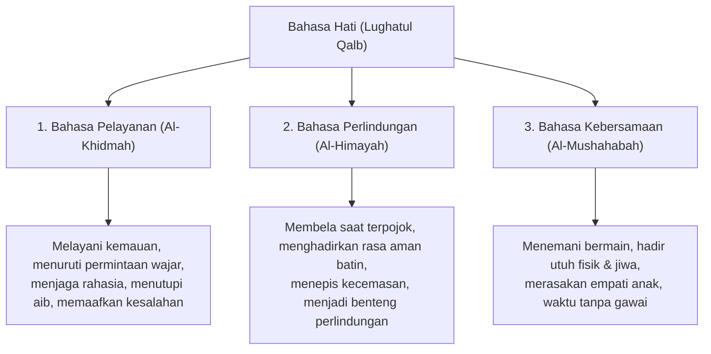

# Bahasa Hati: Seni Tarbiyah Bil-Qalb & Kelembutan Nabawiyah

> [!note] Catatan Metodologi & Sumber Penyusunan Dokumen
> Dokumen ini merupakan hasil rangkuman dan rekonstruksi berbantuan kecerdasan buatan (AI) dari berbagai materi presentasi, modul kurikulum, dokumen standar lembaga, dan rekaman kajian **Pendidikan Karakter Nabawiyah (PKN)** yang diampu oleh **Ustadz Abdul Kholiq**.  
> 
> Naskah ini telah melalui verifikasi dan pengayaan ulang dalil-dalil Al-Qur'an dan Hadits shahih dari korpus **OpenBayan** (60 kitab klasik), serta diperkaya dengan sintesis intisari dan masukan berharga dari kawan-kawan **Himmatul Ummah**, **Insan Taqwa / Mustaqbal**, dan **Tim SOTAB HEBAT**.

> [!quote] Dalil & Rujukan Nabawiyah Utama
> **Naskah:**  
> « إِنَّ الرِّفْقَ لَا يَكُونُ فِي شَيْءٍ إِلَّا زَانَهُ، وَلَا يُنْزَعُ مِنْ شَيْءٍ إِلَّا شَانَهُ »
>
> *"Sesungguhnya kelemahlembutan (ar-rifq) tidaklah berada pada sesuatu melainkan ia akan memperindahnya (menjadikannya mulia), dan tidaklah kelemahlembutan itu dicabut dari sesuatu melainkan pasti akan memperburuknya (menjadikannya hina)."*
>
> 📚 **Sumber Rujukan OpenBayan:** HR. Muslim No. 2594, Kitab Al-Birr wash-Shilah wal-Adab; Syarah Shahih Muslim Imam An-Nawawi (Juz 16 Hal. 146); Riyadush Shalihin Tahqiq Al-Fahl No. 633.  
> 💡 **Relevansi PKN:** Bahasa Hati adalah pondasi utama dari seluruh bangunan Pendidikan Karakter Nabawiyah. Tanpa getaran cinta batiniah dan kelembutan, seluruh doktrin syariat dan nasihat lisan akan memantul membentur benteng penolakan jiwa anak.

---

## 1. Hakikat Bahasa Hati dalam Arsitektur PKN

*Metode Pendidikan Usia 0–7 Tahun: Pengisian Penuh Bahasa Hati*

Dalam disiplin Pendidikan Karakter Nabawiyah, **Bahasa Hati (*Lughatul Qalb*)** adalah modalitas pengasuhan berbasis getaran rasa (*Al-Qalb* pada jiwa muthmainnah), keteladanan visual tanpa kata-kata (*lisanul hal*), sentuhan fisik penuh kasih, dan doa tulus di keheningan malam.

Bahasa Hati menjadi **instrumen utama pada Fase Thufulah (0–7 Tahun)**, namun tetap menjadi **ruh penyerta** pada seluruh fase usia berikutnya hingga dewasa. 

### Tiga Pilar Fondasi Bahasa Hati:
1. **Penerimaan Tanpa Syarat (*Unconditional Acceptance*):** Anak diyakinkan bahwa dirinya dicintai bukan karena prestasinya, bukan karena ranking kelasnya, melainkan karena ia adalah amanah suci yang dianugerahkan Allah SWT kepada orang tuanya.
2. **Keteladanan Nyata (*Qudwah Hasanah*):** Jiwa anak kecil belajar melalui pantulan cermin visual (*mirror neurons*). Sebelum anak mendengar perintah shalat, matanya harus terlebih dahulu terbiasa melihat punggung ayah dan bundanya bersujud khusyuk.
3. **Pengisian Penuh Tangki Cinta (*The Emotional Tank*):** Jiwa anak yang lapar cinta bagaikan bejana bocor; ia akan mencari pemenuhan cinta dari luar rumah melalui validasi semu media sosial, pergaulan bebas, atau kecanduan digital.

---

## 2. Teladan Kasih Sayang & Interaksi Tarbiyah Rasulullah ﷺ

Rasulullah ﷺ adalah suri teladan agung dalam memenangkan hati para sahabatnya melalui Bahasa Hati yang meluluhkan jiwa:

### A. Kisah Al-Aqra' bin Habis: Hati Kering yang Menolak Mencium Anak
Al-Bukhari meriwayatkan pemandangan agung di kota Madinah:
> « قَبَّلَ رَسُولُ اللَّهِ ﷺ الحَسَنَ بْنَ عَلِيٍّ وَعِنْدَهُ الأَقْرَعُ بْنُ حَابِسٍ التَّمِيمِيُّ جَالِسًا، فَقَالَ الأَقْرَعُ: إِنَّ لِي عَشَرَةً مِنَ الوَلَدِ مَا قَبَّلْتُ مِنْهُمْ أَحَدًا، فَنَظَرَ إِلَيْهِ رَسُولُ اللَّهِ ﷺ ثُمَّ قَالَ: مَنْ لاَ يَرْحَمُ لاَ يُرْحَمُ »  
> *"Rasulullah ﷺ mencium cucu beliau, Al-Hasan bin Ali, sementara di dekat beliau duduk Al-Aqra' bin Habis At-Tamimi. Al-Aqra' berkata dengan nada heran: 'Sesungguhnya aku memiliki sepuluh orang anak, namun tak seorang pun dari mereka yang pernah kucium!' Maka Rasulullah ﷺ memandangnya seraya bersabda: 'Barangsiapa tidak menyayangi, niscaya ia tidak akan disayangi!'"*  
> 📚 *(HR. Al-Bukhari No. 5997 & Muslim No. 2318)*

Dalam riwayat lain, seorang Arab Badui datang dan berkata: *"Apakah kalian menciumi anak-anak kecil kalian? Demi Allah kami tidak pernah mencium mereka!"* Maka Rasulullah ﷺ bersabda:
> « أَوَأَمْلِكُ لَكَ أَنْ نَزَعَ اللَّهُ مِنْ قَلْبِكَ الرَّحْمَةَ! »  
> *"Lalu apa dayaku jika Allah telah mencabut rasa kasih sayang dari dalam hatimu?!"* (HR. Al-Bukhari No. 5998).

### B. Menggandeng Tangan Mu'adz bin Jabal Sebelum Memberikan Nasihat
Perhatikan bagaimana Rasulullah ﷺ membuka pintu hati Mu'adz sebelum membisikkan doa wirid harian:
> « يَا مُعَاذُ، وَاللَّهِ إِنِّي لَأُحِبُّكَ، وَاللَّهِ إِنِّي لَأُحِبُّكَ، فَقَالَ: أُوصِيكَ يَا مُعَاذُ لَا تَدَعَنَّ فِي دُبُرِ كُلِّ صَلَاةٍ تَقُولُ: اللَّهُمَّ أَعِنِّي عَلَى ذِكْرِكَ، وَشُكْرِكَ، وَحُسْنِ عِبَادَتِكَ »  
> *"Wahai Mu'adz, demi Allah sesungguhnya aku benar-benar mencintaimu! Demi Allah sesungguhnya aku benar-benar mencintaimu! Lalu beliau bersabda: Aku wasiatkan kepadamu wahai Mu'adz, jangan sekali-kali engkau tinggalkan di setiap akhir shalatmu untuk membaca: 'Ya Allah, tolonglah aku untuk senantiasa mengingat-Mu, bersyukur kepada-Mu, dan memperbaiki ibadah kepada-Mu!'"*  
> 📚 *(HR. Abu Dawud No. 1522 & An-Nasa'i No. 1303, Shahih)*

Rasulullah ﷺ mengucapkan ikrar cinta dua kali berturut-turut, menggenggam jemari Mu'adz, mengisi tangki cintanya hingga meluap, barulah mengalirkan wasiat syariat. Wasiat ini terukir abadi di jiwa Mu'adz hingga akhir hayatnya.

### C. Anas bin Malik: Sepuluh Tahun dalam Naungan Bahasa Hati
Anas bin Malik radhiyallahu 'anhu mengisahkan pengalamannya melayani Rasulullah ﷺ sejak usia 10 tahun:
> « خَدَمْتُ رَسُولَ اللَّهِ ﷺ عَشْرَ سِنِينَ، فَمَا قَالَ لِي أُفٍّ قَطُّ، وَمَا قَالَ لِشَيْءٍ صَنَعْتُهُ: لِمَ صَنَعْتَهُ؟ وَلَا لِشَيْءٍ تَرَكْتُهُ: لِمَ تَرَكْتَهُ؟ »  
> *"Aku melayani Rasulullah ﷺ selama sepuluh tahun. Demi Allah, beliau tidak pernah sekalipun berkata kepadaku 'Ah/Cih!' dan beliau tidak pernah mencela perbuatanku: 'Mengapa engkau lakukan ini?' atau pada sesuatu yang kutinggalkan: 'Mengapa engkau tidak lakukan ini?'"*  
> 📚 *(HR. Al-Bukhari No. 6038 & Muslim No. 2309)*

---

## 3. Keterangan & Fatwa Para Ulama Rabbani

### 1. Syaikhul Islam Ibnu Qayyim Al-Jauziyyah
Dalam kitab *I'lamul Muwaqqi'in* (Juz 4 Hal. 157) dan *Tuhfatul Maudud*:
> *"Ketahuilah bahwa mendidik hati anak mendahului mendidik lisannya. Jika orang tua mampu menanamkan kecintaan kepada Allah di dalam hati anak melalui perlakuan kasih sayang, niscaya anak akan menjalankan syariat dengan kerinduan batin (*syauq*), bukan dengan keterpaksaan raga (*ikrah*)."*

### 2. Imam An-Nawawi dalam Syarah Shahih Muslim
Mengomentari hadits tentang mencium anak kecil:
> *"Hadits ini merupakan anjuran agung untuk mencium anak-anak kecil, membelai mereka, memangku mereka dengan penuh rahmah dan kelembutan. Sikap keras dan kaku terhadap anak kecil bukanlah tanda ketegasan wibawa, melainkan tanda kekeringan hati dari rahmat Allah."*

### 3. Ibn Sahnun Al-Qayrawani dalam Adab al-Mu'allimin
Beliau menetapkan bahwa seorang guru di Kuttab tidak boleh memulai pengajaran hafalan sebelum murid merasa aman dan nyaman:
> *"Pendidik wajib bersikap adil, sabar menghadapi anak-anak, dan tidak boleh menampakkan kebencian atau muka masam yang membuat hati murid lari dari ilmu."*

---

## 4. Lima Dialek Operasional Bahasa Hati dalam Pengasuhan Keluarga

Bagaimana orang tua membumikan Bahasa Hati setiap hari di rumah tangga? Terapkan **5 Dialek Bahasa Hati PKN**:

1. **Sentuhan Fisik Penuh Berkah (*Physical Touch*):**
   * Memeluk anak minimal 8 kali sehari (sebagaimana sunnah membelai kepala anak yatim dan mencium kening anak).
   * Memegang pundak anak saat berbicara, menatap matanya sejajar dengan ketinggian tubuhnya.
2. **Kata-Kata Afirmasi Iman (*Words of Affirmation*):**
   * Panggilan kesayangan Nabawiyah (seperti panggilan Rasulullah kepada Aisyah: *"Ya 'Aisy"* / *"Ya Humaira"*).
   * Memuji proses dan kesungguhan anak (*"Bunda bangga melihat abang berusaha keras merapikan buku"*), bukan memuji hasil semata.
3. **Waktu Berkualitas Tanpa Gawai (*Quality Time*):**
   * Menyediakan waktu khusus 20 menit sehari mendengarkan celoteh anak tanpa memegang ponsel.
   * Berjalan-jalan melihat ciptaan Allah di alam bebas sambil bercerita tentang kebesaran Allah.
4. **Pelayanan Kasih Sayang (*Acts of Service*):**
   * Menyiapkan makanan favorit anak dengan senyuman tulus.
   * Merawat anak saat sakit dengan membacakan doa ruqyah syar'iyyah seraya membelai keningnya.
5. **Hadiah Kejutan yang Mengikat Hati (*Receiving Gifts*):**
   * Memberikan hadiah kecil tanpa harus menunggu momen ranking sekolah (*"Ini hadiah untuk adik karena adik anak shalih kesayangan ayah"*).
   * Sabda Nabi ﷺ: *« تَهَادَوْا تَحَابُّوا »* (*"Saling memberilah hadiah, niscaya kalian akan saling mencintai!"* HR. Bukhari dalam Al-Adab Al-Mufrad No. 594).

---

## 5. Tiga Modalitas Operasional Bahasa Hati dalam Evaluasi Santri (Manhaj SKIS)

Dalam instrumen evaluasi **Laporan Perkembangan Karakter Santri (SKIS Semarang)**, Bahasa Hati dioperasionalkan ke dalam **Tiga Modalitas Fungsional Utama**. Setiap anak memiliki satu atau kombinasi modalitas yang paling cepat meresap dan meluluhkan hatinya:

| Modalitas Bahasa Hati | Bentuk Tindakan Pengasuhan Nyata | Tipe Anak yang Paling Responsif |
|---|---|---|
| **1. Bahasa Pelayanan (*Al-Khidmah*)** | Melayani kebutuhannya secara tulus, menuruti permintaan wajarnya dengan gembira, memegang rahasia pribadinya (*kitmanus sirr*), menutupi aib dan kekhilafannya dari orang lain (*satr*), lekas memaafkan saat ia bersalah, serta bersabar menahan amarah atas perilakunya. | Anak yang berwatak perasa (*Al-Masyhur*), anak yang memikul beban tugas berat, atau anak yang sedang mengalami kelelahan batin (*burnout*). |
| **2. Bahasa Perlindungan (*Al-Himayah*)** | Membela martabat anak tatkala ia merasa terpojok oleh intimidasi luar, menghadirkan jaminan rasa aman batin (*al-amnu wan-najwah*), menjadi tempat berlindung pertama saat ia ketakutan, dan tidak pernah membanding-bandingkannya dengan orang lain. | Anak bertipe pencemas (*anxious*), anak yang menjadi korban perundungan (*bullying*), atau anak yang sedang krisis kepercayaan diri. |
| **3. Bahasa Kebersamaan (*Al-Mushahabah*)** | Hadir utuh secara raga dan jiwa (*being there*), ikut bermain bersama dalam dunianya (menyusun balok, bersepeda, memasak), mendengarkan celotehnya dengan tatapan mata sejajar, dan merasakan apa yang dirasakan anak tanpa tergesa memotong pembicaraannya. | Anak yang sangat aktif bergerak (*Al-Fu'ad*), anak bertipe sosial ekstrovert (*Al-'Alaniyyah*), atau anak yang tangki cintanya kosong akibat ditinggal kerja orang tua. |

---

## 6. Tanda-Tanda Anak yang Mengalami Kelaparan Bahasa Hati

Orang tua wajib waspada jika mendapati indikator patologis berikut pada diri anak:
* **Tantrum Kronis & Agresif:** Sering memukul adik, membanting mainan, atau berteriak mencari perhatian (*attention seeking*).
* **Minder & Takut Salah:** Tidak berani mencoba hal baru, gemetar saat diajak berbicara orang dewasa karena trauma bentakan masa lalu.
* **Kecanduan Gawai Parah:** Anak melarikan dahaga jiwanya ke dunia virtual karena layar gadget tidak pernah memarahi atau membentaknya.

### Solusi Kuratif Segera:
Hentikan perdebatan lisan. Ambil anak, dekap erat dalam pelukan hangat selama minimal 3 menit, bisikkan kalimat istighfar dan permohonan maaf, lalu penuhi kembali bejana hatinya dengan cinta ilahiah.

---

## 6. Tautan Konseptual Terkait
* [[Metode Mendidik]] — Arsitektur Induk Tiga Bahasa Pengasuhan.
* [[Bahasa Lisan]] — Tahap Lanjutan Pengajaran Nalar Usia 7–10 Tahun.
* [[Thufulah]] — Etape Emas Masa Bermain dan Kasih Sayang.
* [[Tangki Cinta]] — Mekanisme Psikospiritual Ketahanan Jiwa Anak.

---

> [!quote] Dokumen & Slide Presentasi Rujukan Resmi PKN
> Pembahasan dalam artikel ini bersumber langsung dari materi tayang pelatihan dan dokumen kurikulum resmi PKN oleh **Ustadz Abdul Kholiq**:
>
> - **Materi:** *4. METODE PENDIDIKAN KARAKTER NABAWIYAH*
>   - 📖 **Rujukan Slide:** Slide Hal. 15–38 (Piramida Tiga Bahasa Mendidik, Kaidah Penegakan Batas Toleransi, & Imunitas Sosial)
>   - 🔗 **Akses Berkas:** [📥 Unduh PDF (10.8 MB)](https://www.dropbox.com/scl/fi/ek8ggskgiuxailx94rek1/4.-METODE-PENDIDIKAN-KARAKTER-NABAWIYAH.pdf?rlkey=fkmrh2p89fkebuz0bf15tyip4&dl=1) • [📊 Unduh PPTX Asli (24.9 MB)](https://www.dropbox.com/scl/fi/ev1k0fq14pjn5xd3gpazj/4.-METODE-PENDIDIKAN-KARAKTER-NABAWIYAH.pptx?rlkey=nq1anr4vj64jws4n3jio2uhlg&dl=1) • [👁️ Buka di Dropbox](https://www.dropbox.com/scl/fi/ek8ggskgiuxailx94rek1/4.-METODE-PENDIDIKAN-KARAKTER-NABAWIYAH.pdf?rlkey=fkmrh2p89fkebuz0bf15tyip4&dl=0)
>
> - **Materi:** *3. Pembelajaran Alamiyah*
>   - 📖 **Rujukan Slide:** Slide Hal. 5–25 (Matriks Pembelajaran Alamiah: Ruang Interaksi, Dialog, & Penanaman Kebiasaan Mandiri)
>   - 🔗 **Akses Berkas:** [📥 Unduh PDF (3.8 MB)](https://www.dropbox.com/scl/fi/581k390o7p264n879q312/3.-Pembelajaran-Alamiyah.pdf?rlkey=p78903o45781n263109u45892&dl=1) • [📊 Unduh PPTX Asli (6.2 MB)](https://www.dropbox.com/scl/fi/89312o45678n190p34571/3.-Pembelajaran-Alamiyah.pptx?rlkey=q4567890123n4567890123456&dl=1) • [👁️ Buka di Dropbox](https://www.dropbox.com/scl/fi/581k390o7p264n879q312/3.-Pembelajaran-Alamiyah.pdf?rlkey=p78903o45781n263109u45892&dl=0)

