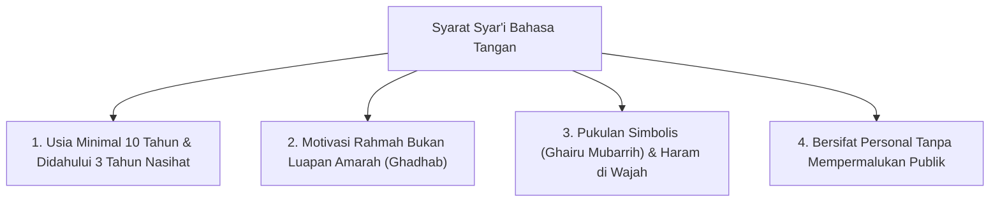

# Bahasa Tangan: Batasan Syar'i Ketegasan & Ta'dib Nabawiyah

> [!quote] Dalil & Rujukan Nabawiyah Utama
> **Naskah:**  
> « مُرُوا أَوْلَادَكُمْ بِالصَّلَاةِ وَهُمْ أَبْنَاءُ سَبْعِ سِنِينَ، وَاضْرِبُوهُمْ عَلَيْهَا وَهُمْ أَبْنَاءُ عَشْرِ سِنِينَ، وَفَرِّقُوا بَيْنَهُمْ فِي الْمَضَاجِعِ »
>
> *"Perintahkanlah anak-anak kalian untuk mengerjakan shalat ketika mereka berusia tujuh tahun, dan pukullah mereka (dengan pukulan mendidik jika meninggalkan shalat) ketika mereka berusia sepuluh tahun, serta pisahkanlah tempat tidur mereka!"*
>
> 📚 **Sumber Rujukan OpenBayan:** HR. Abu Dawud No. 495 & Ahmad (Juz 2 Hal. 187); Dinyatakan Shahih oleh Syaikh Al-Albani dalam *Shahih Sunan Abi Dawud*; Syarah As-Sunnah Imam Al-Baghawi (Juz 2 Hal. 407).  
> 💡 **Relevansi PKN:** Hadits ini adalah payung hukum syar'i peletakan *Bahasa Tangan* (*At-Ta'dib*). Sanksi fisik hanya dilegalkan pada usia 10 tahun (fase Murahaqah) setelah melewati 3 tahun penuh pembinaan Bahasa Hati dan Bahasa Lisan (sekitar 5.000 kali ajakan shalat tanpa kekerasan).

---

## 1. Hakikat Bahasa Tangan dalam Arsitektur PKN

Dalam disiplin Pendidikan Karakter Nabawiyah, **Bahasa Tangan (*Lughatul Yad / At-Ta'dib*)** adalah instrumen penegakan aturan (*enforcement*), ketegasan disiplin, dan penetapan konsekuensi nyata.

Bahasa Tangan **baru diizinkan penggunaannya pada anak usia 10 tahun ke atas (Fase Murahaqah)** saat anak mulai mendekati pintu taklif baligh. Tujuannya adalah mendisiplinkan **Fitrah Bakat & Tanggung Jawab Fisik (*Dimensi Karsa / Jasad*)** agar anak siap memikul konsekuensi hukum syariat (*mukallaf*) secara mandiri.

> [!CAUTION] Peringatan Keras Syariat
> Menghukum fisik atau memukul anak di bawah usia 10 tahun (fase Thufulah dan awal Tamyiz) adalah **penyimpangan metode dan kezaliman yang diharamkan para ulama**, karena melompati tahapan fitrah yang telah digariskan Rasulullah ﷺ.

---

## 2. Empat Syarat Syar'i Mutlak Penggunaan Bahasa Tangan

Para fukaha dan ulama tarbiyah menetapkan **4 Syarat Ketat** yang tidak boleh dilanggar dalam menjatuhkan sanksi fisik:

### 1. Telah Melewati Fase Bahasa Hati (0–7 th) & Lisan (7–10 th)
Sanksi pukulan di usia 10 tahun adalah hak syariat yang sah hanya jika orang tua telah tuntas mengisi tangki cinta anak selama 7 tahun pertama dan telah konsisten mengajak shalat dengan lisan santun selama 3 tahun penuh (usia 7–10 tahun). Jika orang tua tidak pernah mengajari shalat di usia 7 tahun lalu tiba-tiba memukul di usia 10 tahun, maka orang tualah yang berdosa.

### 2. Dilarang Memukul Saat Marah
Rasulullah ﷺ melarang seorang hakim memutuskan perkara saat marah, demikian pula orang tua/pendidik diharamkan mengeksekusi sanksi fisik saat darah mendidih oleh emosi. Sanksi harus dijatuhkan dalam keadaan tenang dengan niat menyelamatkan anak dari adzab akhirat.

### 3. Pukulan Tidak Melukai (*Dharbun Ghairu Mubarrih*) & Haram Menyentuh Wajah
> « إِذَا ضَرَبَ أَحَدُكُمْ فَلْيَجْتَنِبِ الْوَجْهَ »  
> *"Jika salah seorang di antara kalian terpaksa memukul, maka jauhilah memukul wajah!"*  
> 📚 *(HR. Al-Bukhari No. 2559 & Muslim No. 2612)*
Pukulan ta'dib adalah pukulan simbolis ketegasan (misal menggunakan siwak atau kibasan kain pada betis/pantat), tidak boleh mematahkan tulang, tidak meninggalkan lebam merah apalagi luka berdarah, dan diharamkan keras mengenai kepala, wajah, dada, atau kemaluan.

### 4. Tidak Menghukum Secara Kolektif
Hukuman harus bersifat personal kepada anak yang melanggar. Menghukum satu kelas atau seluruh anak di rumah karena kesalahan satu orang adalah bentuk kezaliman (*zhulm*) yang menimbulkan trauma kebencian pada anak-anak yang tidak bersalah.

---

## 3. Teladan Ketegasan & Keadilan Rasulullah ﷺ

### A. Seleksi Ketat Pasukan Uhud: Ketegasan Berbasis Kematangan Fisik
Ketika para pemuda usia 14–15 tahun seperti Rafi' bin Khadij, Samurah bin Jundub, dan Usamah bin Zaid ingin ikut berperang di Uhud, Rasulullah ﷺ tidak berkompromi dalam hal kesiapan taklif. Beliau memeriksa barisan mereka secara langsung:
* Beliau menolak pemuda yang belum genap baligh demi keselamatan mereka.
* Ketika Rafi' bin Khadij diizinkan karena kepandaiannya memanah, Samurah bin Jundub menangis seraya berkata: *"Wahai Rasulullah, engkau mengizinkan Rafi' padahal aku bisa membantingnya dalam gulat!"* Maka Rasulullah ﷺ menyuruh keduanya bergulat di depan beliau. Ketika Samurah berhasil membanting Rafi', beliau pun mengizinkan keduanya ikut (HR. Ath-Thabrani dalam *Al-Kabir* No. 6710; *Fathul Bari* 7/394).
Ketegasan Rasulullah ﷺ adalah ketegasan yang objektif, memberi ruang unjuk kompetensi, bukan kesewenang-wenangan.

### B. Penolakan Syafa'at dalam Hukum Had: Usamah bin Zaid & Wanita Makhzumiyah
Ketika wanita bangsawan dari Bani Makhzum mencuri, para shahabat meminta Usamah bin Zaid (anak kesayangan Rasulullah ﷺ) untuk meminta keringanan hukuman kepada Nabi ﷺ. Perhatikan reaksi tegas Rasulullah ﷺ:
> « أَتَشْفَعُ فِي حَدٍّ مِنْ حُدُودِ اللَّهِ؟! ثُمَّ قَامَ فَاخْتَطَبَ فَقَالَ: إِنَّمَا أَهْلَكَ الَّذِينَ قَبْلَكُمْ أَنَّهُمْ كَانُوا إِذَا سَرَقَ فِيهِمُ الشَّرِيفُ تَرَكُوهُ، وَإِذَا سَرَقَ فِيهِمُ الضَّعِيفُ أَقَامُوا عَلَيْهِ الحَدَّ، وَايْمُ اللَّهِ! لَوْ أَنَّ فَاطِمَةَ بِنْتَ مُحَمَّدٍ سَرَقَتْ لَقَطَعْتُ يَدَهَا »  
> *"Apakah engkau hendak meminta syafa'at (keringanan) dalam penegakan salah satu hukum batas dari batas-batas Allah?! Kemudian beliau berdiri berkhutbah dan bersabda: Sesungguhnya yang membinasakan umat-umat sebelum kalian adalah apabila ada orang terpandang mencuri mereka membiarkannya, namun jika orang lemah mencuri mereka menegakkan hukuman atasnya! Demi Allah, andai Fathimah putri Muhammad mencuri, niscaya aku sendiri yang akan memotong tangannya!"*  
> 📚 *(HR. Al-Bukhari No. 3475 & Muslim No. 1688)*

Ketegasan Bahasa Tangan harus tegak di atas asas keadilan tanpa pandang bulu, bahkan kepada anak kandung sendiri.

---

## 4. Fatwa & Keterangan Para Ulama Otoritatif

### 1. Ibn Sahnun Al-Qayrawani (Wafat 256 H)
Dalam kitab *Adab al-Mu'allimin*—kitab rujukan pedagogi Islam tertua di dunia:
> *"Seorang guru tidak boleh memukul murid lebih dari tiga kali pukulan ringan dalam urusan adab. Jika pelanggaran berkaitan dengan Al-Qur'an dan shalat pada anak usia 10 tahun, maksimal pukulan tidak boleh melebihi sepuluh kali, dan wajib menggunakan alat pemukul yang tidak melukai kulit dan tidak meninggalkan bekas memar."*

### 2. Imam Al-Qabisi (Wafat 403 H)
Dalam kitab *Ar-Risalah Al-Mufashshalah li Ahwal Al-Mu'allimin*:
> *"Hukuman fisik adalah obat terakhir (*ad-dawa'ul akhir*). Apabila pendidik masih bisa mendisiplinkan dengan pandangan mata yang tegas, teguran lisan, atau pembatasan hak main, maka haram baginya beralih ke hukuman fisik."*

### 3. Imam Ibnu Qayyim Al-Jauziyyah
Dalam *Zadul Ma'ad fi Hadyi Khairil 'Ibad* (Juz 4 Hal. 98):
> *"Pukulan yang diizinkan syariat adalah pukulan rahmat dan ta'dib, sebagaimana ayah memukul anaknya yang tergelincir atau dokter membedah bisul yang bernanah; tujuannya menyembuhkan bukan membinasakan."*

---

## 5. Instrumen Konsekuensi Non-Fisik dalam Bahasa Tangan

Bahasa Tangan dalam dunia modern tidak harus selalu bermakna pukulan fisik. Para pendidik PKN merekomendasikan **Hierarki Konsekuensi Tegas Beradab**:

1. **Pemberian Tugas Tambahan Berkelanjutan:**
   * Anak yang melalaikan tugas merapikan rumah diberikan kewajiban membersihkan halaman atau fasilitas masjid.
2. **Pencabutan Hak Sementara (*Deprivation of Privileges*):**
   * Membatasi waktu bermain di luar rumah, menunda pembelian barang yang diinginkan, atau menyita gawai selama sepekan.
3. **Konsekuensi Pemulihan Kerusakan (*Restitusi*):**
   * Jika anak merusak barang milik orang lain atau melukai hati saudaranya, ia wajib memperbaiki barang tersebut dengan uang sakunya sendiri dan mendatangi korban untuk meminta maaf secara langsung.

---

## 6. Tautan Konseptual Terkait
* [[Metode Mendidik]] — Peta Lengkap Tiga Bahasa Pengasuhan.
* [[Murahaqah]] — Etape Usia 10–15 Tahun dan Batas Taklif Baligh.
* [[Batas Toleransi]] — Kapan Toleransi Diberikan dan Kapan Ketegasan Ditegakkan.
* [[Disiplin Positif PKN]] — Arsip Induk Pedoman Disiplin Nabawiyah.
