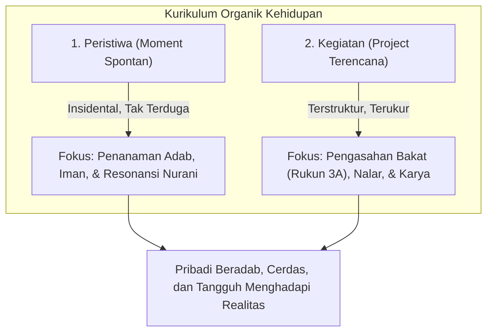

# Pembelajaran Alamiah: Menyelaraskan Pendidikan dengan Sunnatullah Kehidupan

> [!quote] Dalil & Rujukan Nabawiyah
> **Naskah:**  
> « يَا بُنَيَّ إِنَّهَا إِن تَكُ مِثْقَالَ حَبَّةٍ مِّنْ خَرْدَلٍ فَتَكُن فِي صَخْرَةٍ أَوْ فِي السَّمَاوَاتِ أَوْ فِي الْأَرْضِ يَأْتِ بِهَا اللَّهُ ۚ إِنَّ اللَّهَ لَطِيفٌ خَبِيرٌ »
>
> *"(Luqman berkata): 'Wahai anakku! Sesungguhnya jika ada (sesuatu perbuatan) seberat biji sawi, dan berada dalam batu atau di langit atau di dalam bumi, niscaya Allah akan mendatangkannya (membalasnya)...'"*
>
> 📚 **Sumber Rujukan OpenBayan:** QS. Luqman: 16 & Syarah Tafsir Ibnu Katsir Ar-Rajhi (Juz 115 Hal. 4)  
> 💡 **Relevansi PKN:** Tarbiyah alamiah memanfaatkan fenomena nyata di alam semesta dan peristiwa keseharian untuk menancapkan kesadaran muraqabatullah (keagungan Allah).

> *"Sekolah modern sering kali memenjarakan anak di balik empat dinding beton selama belasan tahun, menghafal definisi tentang pohon tanpa pernah menanam pohon, dan membaca teori tentang kejujuran tanpa pernah diuji dalam pergaulan nyata. Pendidikan sejati terjadi di alam terbuka kehidupan, di mana setiap peristiwa adalah ruang kelas dan semesta adalah laboratoriumnya."*  
> — **Ustadz Abdul Kholiq & SOTAB HEBAT**

---

## 1. Hakikat Pembelajaran Alamiah

**Pembelajaran Alamiah (*Natural Learning*)** adalah paradigma pendidikan yang membebaskan anak dari jeratan pemesinan kurikulum artifisial, lalu mengembalikan mereka kepada ekosistem belajar yang otentik dan selaras dengan sunnatullah fitrah manusia.

Dalam paradigma ini, proses belajar dibagi secara tegas ke dalam dua instrumen utama: **Peristiwa (*Moment*)** dan **Kegiatan (*Project*)**:

### A. Peristiwa (*Moment Spontan*): Pintu Masuk Adab
- **Karakteristik:** Terjadi secara insidental di rumah dan lingkungan harian (anak menumpahkan makanan, bertengkar memperebutkan mainan, melihat orang miskin di jalan, atau mengalami kekalahan dalam perlombaan).
- **Fokus Edukasi:** Menumbuhkan *Fitrah Keimanan* dan *Adab*.
- **Kaidah:** Harus ditangkap secara hangat (*teachable moment*) menggunakan **Bahasa Hati** dan dialog reflektif. Jangan ditunda sampai besok dan jangan ditanggapi dengan amarah reaktif.

### B. Kegiatan (*Project Terencana*): Laboratorium Bakat
- **Karakteristik:** Dirancang secara sadar bersama anak berbasis minat dan tantangan nyata (membuat kebun hidroponik keluarga, merakit perangkat elektronik, magang di bengkel paman, atau membuat karya buku).
- **Fokus Edukasi:** Menajamkan *Fitrah Belajar* dan *Fitrah Bakat* melalui **Rukun 3A (Suka, Bisa, Berguna)**.
- **Kaidah:** Anak dilatih menetapkan tujuan, menghadapi kesulitan teknis (*trial and error*), bekerja sama, dan merasakan kepuasan berkontribusi bagi masyarakat.

---

## 2. Kritik Mendalam terhadap Industri Sekolah Modern

Berdasarkan artikel reflektif di SOTAB HEBAT (*Menggugat Sistem Sekolah*, *Sekolah Alamiah vs Sekolah Modern*, dan *Benalu Pendidikan*), sistem sekolah konvensional warisan era revolusi industri mengalami disorientasi parah:

| Aspek | Sekolah Modern (Pabrik) | Pembelajaran Alamiah (Nabawiyah) |
|---|---|---|
| **Paradigma Anak** | Anak dipandang sebagai **bata** yang harus dicetak seragam. | Anak dipandang sebagai **benih** hidup yang harus dirawat tanah fitrahnya. |
| **Pola Kurikulum** | Satu kurikulum masal dipaksakan untuk ribuan anak berbeda. | **Satu Anak Satu Kurikulum** berbasis keunikan potensi fitrah (TB40). |
| **Metode Belajar** | Duduk diam, mendengarkan pasif, menghafal teks abstrak di lembar kertas. | Eksplorasi aktif di alam, interaksi sosial nyata, dan proyek karya aplikatif. |
| **Alat Evaluasi** | Ujian tertulis dan angka ranking yang memicu persaingan ego & kecemasan. | Portofolio proses, kematangan adab, dan kemanfaatan karya bagi sesama. |
| **Dampak Mental** | Anak cerdas menghafal tetapi rapuh batinnya, gagap sosial, dan takut salah. | Anak tangguh jiwanya, peka nuraninya, kreatif, dan mandiri memecahkan masalah. |

---

## 3. Dekonstruksi Paradigma Pesantren: "Pesantren adalah SMK Jurusan Agama"

Salah satu wawasan paling mencerahkan dari **Ustadz Abdul Kholiq** adalah pelurusan cara pandang umat terhadap lembaga pesantren:

Banyak orang tua muslim merasa berdosa jika tidak mengirimkan anak-anaknya ke pondok pesantren sejak usia belia. Ustadz Abdul Kholiq menjelaskan pembedaan krusial antara **Fardhu 'Ain** dan **Fardhu Kifayah**:

1. **Ilmu Agama Dasar (Fardhu 'Ain):**  
   Penanaman akidah tauhid, tata cara wudhu, shalat fardhu, membaca Al-Qur'an dengan benar, dan adab keseharian ibarat **"keterampilan menanak nasi dan memasak sayur"**. Ini adalah kewajiban mutlak setiap orang tua muslim yang harus tuntas diajarkan di dalam rumah sebelum anak menginjak usia baligh.
2. **Pesantren Spesialis (Fardhu Kifayah):**  
   Pesantren klasik yang mengajarkan gramatika bahasa Arab tingkat tinggi (*Nahwu, Sharaf, Balaghah, Ushul Fiqh* mendalam) sesungguhnya adalah **"SMK Jurusan Agama"** yang mencetak koki ahli keilmuan Islam (*para ulama dan mufti*).
3. **Bahaya Penyeragaman:**  
   Memaksakan anak yang bakat alaminya di bidang kinestetik (mesin, pertukangan, pertanian) atau perniagaan (*Juud*, *Nasyaath*, *Himmah*) untuk menghafal kaidah nahwu teoritis berjam-jam sering kali melahirkan kejenuhan batin, rasa rendah diri, hingga trauma terhadap ilmu agama. Pesantren sangat tepat bagi anak yang memang memiliki bakat berpikir mendalam (*Dzakaa'*, *Hikmah*, *Nubl*). Untuk anak berbakat lain, kuatkan agama dasarnya di rumah dan asah keahlian dunianya di bidang masing-masing untuk kejayaan umat Islam.

---

## 4. Pembelajaran di Era Disrupsi Kecerdasan Buatan (AI)

Kehadiran *Artificial Intelligence* (AI) membuktikan rapuhnya kurikulum hafalan teks sekolah konvensional. Segala hal yang berbasis hafalan rumus dan data kini dapat digantikan oleh mesin dalam hitungan detik.

Namun, **tiga hal yang tidak akan pernah bisa digantikan oleh kecerdasan buatan:**
1. **Kalbu yang Bertaqwa (*Al-Qalb Al-Salim*):** Kepekaan nurani, takut kepada Allah, dan keikhlasan niat.
2. **Karakter Akhlak Mulia (*Adab & Akhlak*):** Kejujuran (*Shidq*), keberanian membela kebenaran (*Syajaa'ah*), dan kerendahan hati (*Tawaadhu'*).
3. **Resonansi Kasih Sayang Manusiawi (*Rahmah*):** Kemampuan berempati, melayani sesama, dan menghibur yang berduka.

Pembelajaran Alamiah berfokus menumbuhkan tiga dimensi abadi ini sejak dini, sehingga anak tidak akan tergilas oleh kemajuan teknologi, melainkan mampu mengendalikan teknologi sebagai sarana dakwah dan kemaslahatan umat.

---

## 5. Rujukan Kajian Video Terkait (PKN Video Database)

* *Tanya Jawab: Apakah Pesantren Sama dengan SMK Jurusan Agama?* — [Tonton di YouTube @ 151:22](https://www.youtube.com/watch?v=w04OJijPmQk&t=9082s)
* *Keterampilan Dasar vs Keterampilan Ahli dalam Pendidikan Agama* — [Tonton di YouTube @ 156:27](https://www.youtube.com/watch?v=w04OJijPmQk&t=9387s)
* *Analogi SMK Tata Boga & Pesantren: Menakar Bakat Anak secara Adil* — [Tonton di YouTube @ 161:27](https://www.youtube.com/watch?v=w04OJijPmQk&t=9687s)
* *Mengambil Faedah dan Hikmah dari Peristiwa Keseharian Anak* — [Tonton di YouTube @ 60:20](https://www.youtube.com/watch?v=q1wvV_LpnUw&t=3620s)
