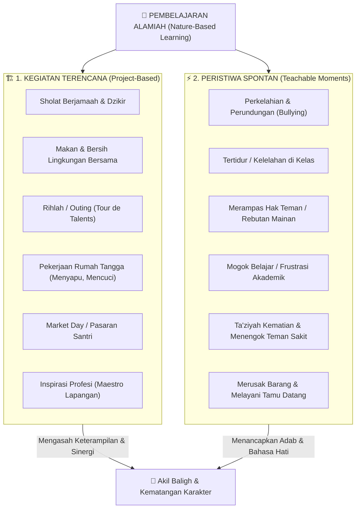

<!-- ========================================================================== -->
<!-- ZONA 1: HEADER, ACTION BAR & METADATA                                      -->
<!-- ========================================================================== -->

# Pembelajaran Alamiah

  📖 Baca
  <a href="https://github.com/decaller/wiki-pkn/discussions" class="wiki-action-item" target="_blank" rel="noopener">💬 Diskusi</a>
  <a href="https://github.com/decaller/wiki-pkn/edit/main/content/Paradigma - Implementasi PKN/Dokumen Pendidikan Karakter Nabawiyah/Paradigma & Implementasi/Pendidikan Ideal/Pembelajaran Alamiah.md" class="wiki-action-item" target="_blank" rel="noopener">✏️ Sunting</a>
  <a href="https://github.com/decaller/wiki-pkn/commits/main/content/Paradigma - Implementasi PKN/Dokumen Pendidikan Karakter Nabawiyah/Paradigma & Implementasi/Pendidikan Ideal/Pembelajaran Alamiah.md" class="wiki-action-item" target="_blank" rel="noopener">📜 Riwayat</a>
  Otoritas: Tier 1 (Active Truth) • [[Paradigma & Implementasi]]

<!-- ========================================================================== -->
<!-- ZONA 2: AREA KONTEN UTAMA, INFOBOX, LEAD SECTION & BATANG TUBUH            -->
<!-- ========================================================================== -->

  
Pembelajaran Alamiah

  

    

      
🏛️ PKN

      
Pendidikan Ideal

    

    
Manhaj Pendidikan Karakter Nabawiyah

  

  <table class="wiki-infobox-table">
    <tr>
      <th>Topik Inti</th>
      <td><b>Pembelajaran Alamiah</b></td>
    </tr>
    <tr>
      <th>Tingkat Otoritas</th>
      <td><b>Tier 1: Active Truth</b> (Buku Utama PKN)</td>
    </tr>
    <tr>
      <th>Kluster Manhaj</th>
      <td>[[Paradigma & Implementasi]]</td>
    </tr>
    <tr>
      <th>Bagan Konsep</th>
      <td>[[canvas/Arsitektur PKN/03 - Peran Pembelajaran & Model.canvas]]</td>
    </tr>
    <tr>
      <th>Kaidah Asas</th>
      <td>Koneksi Sebelum Koreksi</td>
    </tr>
  </table>

> [!SUMMARY] Ringkasan Eksekutif (TL;DR Lead Section)
> **Hakikat Konsep:** **Pembelajaran Alamiah** adalah pilar fundamental dalam Manhaj Pendidikan Karakter Nabawiyah yang mengarahkan proses tarbiyah dari penegakan tauhid batin menuju pembiasaan amal shalih lahiriah.
> * **Prinsip Utama:** Mengutamakan pengisian tangki cinta (*Koneksi Sebelum Koreksi*) dan menghormati tahapan fitrah anak (*Tadarruj*).
> * **Orientasi Akhir:** Menghantarkan santri menjadi pribadi yang *Sholih* (selamat akidah & ibadahnya) dan *Muslih* (pelopor peradaban yang bermanfaat bagi ummah).

> [!quote] Dalil & Rujukan Nabawiyah
> **Naskah:**  
> « يَا بُنَيَّ إِنَّهَا إِن تَكُ مِثْقَالَ حَبَّةٍ مِّنْ خَرْدَلٍ فَتَكُن فِي صَخْرَةٍ أَوْ فِي السَّمَاوَاتِ أَوْ فِي الْأَرْضِ يَأْتِ بِهَا اللَّهُ ۚ إِنَّ اللَّهَ لَطِيفٌ خَبِيرٌ »
>
> *"(Luqman berkata): 'Wahai anakku! Sesungguhnya jika ada (sesuatu perbuatan) seberat biji sawi, dan berada dalam batu atau di langit atau di dalam bumi, niscaya Allah akan mendatangkannya (membalasnya)...'"*
>
> 📚 **Sumber Rujukan OpenBayan:** QS. Luqman: 16 & Syarah Tafsir Ibnu Katsir Ar-Rajhi (Juz 115 Hal. 4)  
> 💡 **Relevansi PKN:** Tarbiyah alamiah memanfaatkan fenomena nyata di alam semesta dan peristiwa keseharian untuk menancapkan kesadaran muraqabatullah (keagungan Allah).
> 🔍 **Telusuri di OpenBayan:** [🔍 Telusuri di OpenBayan ↗](https://openbayan.insanmustaqbal.or.id/search?q=%D9%8A%D9%8E%D8%A7%20%D8%A8%D9%8F%D9%86%D9%8E%D9%8A%D9%8E%D9%91%20%D8%A5%D9%90%D9%86%D9%8E%D9%91%D9%87%D9%8E%D8%A7%20%D8%A5%D9%90%D9%86%20%D8%AA%D9%8E%D9%83%D9%8F%20%D9%85%D9%90%D8%AB%D9%92%D9%82%D9%8E%D8%A7%D9%84%D9%8E%20%D8%AD%D9%8E%D8%A8%D9%8E%D9%91%D8%A9%D9%8D%20%D9%85%D9%90%D9%91%D9%86%D9%92%20%D8%AE%D9%8E%D8%B1%D9%92%D8%AF%D9%8E%D9%84%D9%8D%20%D9%81%D9%8E%D8%AA%D9%8E%D9%83%D9%8F%D9%86%20%D9%81%D9%90%D9%8A&lang=id)

> *"Sekolah modern sering kali memenjarakan anak di balik empat dinding beton selama belasan tahun, menghafal definisi tentang pohon tanpa pernah menanam pohon, dan membaca teori tentang kejujuran tanpa pernah diuji dalam pergaulan nyata. Pendidikan sejati terjadi di alam terbuka kehidupan, di mana setiap peristiwa adalah ruang kelas dan semesta adalah laboratoriumnya."*  
> — **Ustadz Abdul Kholiq & SOTAB HEBAT**

---

## 1. Hakikat Pembelajaran Alamiah

*Perbandingan Paradigma: Kertas Kosong (Tabula Rasa) vs Fitrah Qur'ani*

**Pembelajaran Alamiah (*Natural Learning*)** adalah paradigma pendidikan yang membebaskan anak dari jeratan pemesinan kurikulum artifisial, lalu mengembalikan mereka kepada ekosistem belajar yang otentik dan selaras dengan sunnatullah fitrah manusia.

Dalam paradigma ini, proses belajar dibagi secara tegas ke dalam dua instrumen utama: **Peristiwa (*Moment*)** dan **Kegiatan (*Project*)**:

![[canvas/Pembelajaran Alamiah - Hakikat Pembelajaran Alamiah.canvas]]

### A. Peristiwa (*Moment Spontan*): Pintu Masuk Adab
- **Karakteristik:** Terjadi secara insidental di rumah dan lingkungan harian (anak menumpahkan makanan, bertengkar memperebutkan mainan, melihat orang miskin di jalan, atau mengalami kekalahan dalam perlombaan).
- **Fokus Edukasi:** Menumbuhkan *Fitrah Keimanan* dan *Adab*.
- **Kaidah:** Harus ditangkap secara hangat (*teachable moment*) menggunakan **Bahasa Hati** dan dialog reflektif. Jangan ditunda sampai besok dan jangan ditanggapi dengan amarah reaktif.

### B. Kegiatan (*Project Terencana*): Laboratorium Bakat
- **Karakteristik:** Dirancang secara sadar bersama anak berbasis minat dan tantangan nyata (membuat kebun hidroponik keluarga, merakit perangkat elektronik, magang di bengkel paman, atau membuat karya buku).
- **Fokus Edukasi:** Menajamkan *Fitrah Belajar* dan *Fitrah Bakat* melalui **Rukun 3A (Suka, Bisa, Berguna)**.
- **Kaidah:** Anak dilatih menetapkan tujuan, menghadapi kesulitan teknis (*trial and error*), bekerja sama, dan merasakan kepuasan berkontribusi bagi masyarakat.

---

## 2. Matriks 25 Aktivitas & Insiden Keseharian x 40 Pilar Karakter (Manhaj Temu Lembaga PKN)

Berdasarkan dokumen operasional **Program Pembelajaran 40 Pilar Karakter Nabawiyah (Temu Lembaga Batch 4 & Akademi Guru Batch 3)**, kurikulum pembelajaran alamiah memetakan seluruh ragam kegiatan rutin, proyek sosial, hingga insiden penyimpangan perilaku anak ke dalam **40 Pilar Karakter Terstimulasi**. 

Tabel ini menjadi panduan observasi bagi guru dan orang tua untuk melihat nilai tarbiyah di balik setiap dinamika keseharian:

| No | Nama Aktivitas / Peristiwa Keseharian | Kategori Ekosistem | Jumlah Pilar Terstimulasi | Fokus Pilar Karakter Utama yang Ditumbuhkan |
|:---:|---|---|:---:|---|
| 1 | **Sholat Berjamaah** | Ibadah Induk Ritual | **40 Pilar (100%)** | Seluruh 40 pilar karakter nabawiyah terasah secara serentak (keteraturan saf, disiplin waktu, khusyuk batin, kepemimpinan imam, kesetaraan sosial, adab wudhu). |
| 2 | **Rihlah / Outing (*Tour de Talents*)** | Proyek Eksplorasi Alam | **27 Pilar** | Daya tahan fisik, orientasi arah, adaptabilitas lingkungan, kebersamaan (*Ulfah*), tolong-menolong (*Ta'aawun*), dan tadabbur kebesaran ciptaan Allah. |
| 3 | **Market Day / Pasaran Siswa** | Proyek Muamalah Nyata | **23 Pilar** | Kelancaran komunikasi (*Fashaahah*), kejujuran timbangan (*Shidq*), integritas amanah (*Amaanah*), kompetisi sehat (*Munaafasah*), dan etos pelayanan (*Itsaar*). |
| 4 | **Perkelahian & Bullying (0–7 Tahun)** | Insiden Spontan | **16 Pilar** | Momen diagnosis regulasi emosi: melatih menahan amarah (*Hilm*), kelemahlembutan (*Rifq*), keadilan sikap (*'Adaalah*), dan kebesaran hati meminta maaf. |
| 5 | **Tertidur Saat Sesi Belajar** | Insiden Fisik | **14 Pilar** | Evaluasi daya tahan fisik (*Nasyaath*), kelelahan batin (*Irhāq*), kepekaan guru melihat kapasitas anak tanpa menghakimi (*Rahmah*). |
| 6 | **Makan Bersama** | Rutinitas Sosial | **13 Pilar** | Adab makan sunnah, mendahulukan teman (*Itsaar*), rasa syukur (*Qanaa'ah*), menjaga kebersihan bersama, dan menahan kerakusan nafsu. |
| 7 | **Ramai / Gaduh di Kelas** | Insiden Kelas | **13 Pilar** | Momen menguji wibawa guru (*Waqaar*), ketepatan bahasa nalar (*Bahasa Lisan*), dan mengalirkan kelebihan energi anak ke aktivitas fisik yang bermakna. |
| 8 | **Bermain Bersama** | Dinamika Sosial Anak | **12 Pilar** | Kesepakatan aturan main, sportifitas, keceriaan (*Basyaasyah*, *Muzaah*), toleransi kekalahan (*Shabr*), dan empati teman. |
| 9 | **Pekerjaan Rumah (Menyapu, Mencuci)** | Tanggung Jawab Domestik | **12 Pilar** | Kemandirian karsa, ketelitian kerja (*Ihsaan*), membantu orang tua (*Khidmah*), dan membuang sifat malas (*Kasal*). |
| 10 | **Merampas Hak / Mainan Teman** | Insiden Kepemilikan | **12 Pilar** | Edukasi batasan hak (*'Iffah*), rasa malu berbuat dzalim (*Hayaa'*), keadilan (*'Adaalah*), dan menahan hawa nafsu kepemilikan. |
| 11 | **Membuat Prakarya / Kerajinan** | Proyek Karsa Mandiri | **11 Pilar** | Kreativitas daya cipta (*Nubl*), ketekunan menyelesaikan proyek (*Himmah*, *Nasyaath*), dan kerapian hasil (*Ihsaan*). |
| 12 | **Ta'ziyah / Melayat Kematian** | Peristiwa Sosial Keimanan | **11 Pilar** | Mengingat kematian (*Zikrul Maut*), melembutkan hati yang keras, berempati pada keluarga yang berduka (*Rahmah*), dan mendoakan jenazah. |
| 13 | **Melayani Tamu yang Berkunjung** | Adab Memuliakan Tamu | **11 Pilar** | Keramahan wajah (*Basyaasyah*), kedermawanan menjamu (*Juud*), adab menyapa, dan mendahulukan kenyamanan orang lain (*Itsaar*). |
| 14 | **Menengok Teman / Tetangga Sakit** | Khidmah Kemanusiaan | **10 Pilar** | Empati mendalam (*Ra'fah*), mendoakan kesembuhan, bersyukur atas nikmat sehat, dan adab menjenguk orang sakit. |
| 15 | **Membersihkan Lingkungan Sekolah** | Amal Jama'i Peduli Alam | **9 Pilar** | Menyingkirkan duri dari jalan, gotong royong (*Ta'aawun*), tanggung jawab kebersihan, dan keikhlasan beramal tanpa upah. |
| 16 | **Bermain Saat Jam Istirahat** | Pelepasan Energi Fisik | **9 Pilar** | Manajemen waktu, memulihkan stamina otak (*refreshment*), dan interaksi lintas usia secara alamiah. |
| 17 | **Mengunjungi Tokoh / Sesepuh** | Silaturahim Keilmuan | **8 Pilar** | Adab takzim kepada orang berilmu, menyimak nasihat hikmah, dan menjaga ketersambungan adab lintas generasi. |
| 18 | **Inspirasi Profesi (Datang Maestro)** | Mentorship Lapangan | **8 Pilar** | Membuka wawasan cita-cita peradaban (*Himmah*), melihat keteladanan ahli (*Itqan*), dan memantik rasa ingin tahu karir masa depan. |
| 19 | **Ziarah Kubur** | Tadabbur Akhirat | **6 Pilar** | Menumbuhkan rasa zuhud terhadap gemerlap duniawi (*Qanaa'ah*), mengikis keangkuhan, dan melembutkan nurani. |
| 20 | **Menggambar / Melukis Alam** | Ekspresi Jiwa Spasial | **6 Pilar** | Mengamati keindahan pola ciptaan Allah (*Tafakkur*), ketelitian detail, dan kehalusan rasa seni batiniah. |
| 21 | **Mogok Belajar / Menolak Tugas** | Insiden Mental Anak | **6 Pilar** | Diagnosis penyebab keengganan: apakah tangki cinta kosong, tugas terlalu sulit (*frustrasi*), atau gaya belajar tidak cocok (*Al-Fu'ad* dipaksa diam). |
| 22 | **Tertinggal Materi Pelajaran** | Insiden Akademik | **6 Pilar** | Menguji kesabaran pendidik (*Shabr*), menolak labelisasi bodoh, dan mencari pendekatan tutor sebaya (*peer tutoring*). |
| 23 | **Pembelajaran Ceramah di Kelas** | Sesi Klasikal Terbatas | **5 Pilar** | Melatih adab menyimak (*Shamt*), daya konsentrasi pendengaran (*As-Sam'u*), dan mencatat poin penting. |
| 24 | **Merusak Barang / Fasilitas** | Insiden Tanggung Jawab | **5 Pilar** | Melatih konsekuensi logis: belajar memperbaiki barang yang rusak atau mengganti secara adil (*Amaanah*). |
| 25 | **Membeli Jajanan Tidak Sehat** | Edukasi Makanan Thayyib | **3 Pilar** | Menahan dorongan hawa nafsu konsumtif (*'Iffah*), membedakan halal-thayyib, dan menyayangi tubuh karunia Allah. |

> [!important] Kaidah Emas: Momen Insiden adalah "Kurikulum Emas"
> Dalam sekolah modern, ketika anak berkelahi atau mogok belajar, respon pertama adalah hukuman (*punishment*) atau skorsing. Dalam PKN, peristiwa insidental ini dipandang sebagai **kurikulum emas (*teachable moments*)**. Guru dan orang tua tidak merespons dengan amarah, melainkan merangkul anak, mendinginkan amarahnya dengan **Bahasa Hati**, mendiagnosis pilar karakter apa yang sedang tertekan, lalu menuntunnya kembali ke fitrah keshalihan.

---

## 3. Integrasi Pembelajaran Alamiah dan Berbasis Proyek (*Project-Based Learning*)

Berdasarkan **Modul Pembelajaran Alamiyah Resmi (v0.5)**, metode pembelajaran alamiah Rasulullah ﷺ bersinergi secara organik dengan pembelajaran berbasis proyek (*project-based learning*). Rasulullah ﷺ tidak mendirikan ruang kelas bersekat dinding kaku bagi sahabat-sahabat belia seperti Abdullah bin Abbas, Anas bin Malik, atau Mu'adz bin Jabal *radhiyallahu 'anhum*, melainkan mendidik mereka langsung dalam ritme kehidupan nyata (di atas tunggangan unta, di kebun kurma, di pasar, dan di medan ekspedisi).

### A. Mindset Pokok: "Semua Anak Hebat"
Paradigma alamiah menolak keras generalisasi kemampuan anak:
1. **Keunikan Fitrah:** Setiap anak terlahir membawa rancangan keistimewaan Ilahiah. Anak yang lambat menghafal deret angka matematika mungkin memiliki kecerdasan spasial tinggi dalam merakit pertukangan kayu atau kepekaan hati yang luar biasa dalam melayani orang lain (*Khidmah*).
2. **Lingkungan sebagai Kurikulum Hidup:** Alam ciptaan Allah adalah laboratorium tanpa batas yang merangsang seluruh indera (visual, auditori, kinestetik, dan taktil) secara simultan, mencegah kejenuhan mental yang lazim terjadi di kelas formal.
3. **Menerima Kegagalan sebagai Guru:** Dalam proyek alamiah, kegagalan eksperimen (tanaman layu, rakitan kayu roboh, adonan kue bantat) dirayakan sebagai proses pembelajaran berharga (*trial and error*) untuk mengasah kesabaran (*Shabr*) dan ketekunan (*'Aziimah*).

### B. 4 Siklus Pelaksanaan Proyek Alamiah
Pembelajaran proyek dijalankan melalui empat tahapan terstruktur:

![[canvas/Pembelajaran Alamiah - B. 4 Siklus Pelaksanaan Proyek Alamiah.canvas]]

1. **Investigasi & Observasi Lapangan:** Mengamati fenomena ciptaan Allah dan menemukan permasalahan riil di lingkungan sekitar (misal: penanganan sampah organik, tata kelola air wudhu, perawatan hewan ternak).
2. **Perencanaan & Kolaborasi Tim:** Berdiskusi merumuskan hipotesis, membagi peran kerja berdasarkan kecenderungan bakat masing-masing anak, dan menyusun kebutuhan bahan.
3. **Eksekusi & Eksperimen Lapangan:** Beraksi nyata memotong, merakit, menanam, menguji coba, dan menghadapi kendala teknis secara langsung.
4. **Refleksi & Kemanfaatan Nyata (*Output Sholih-Muslih*):** Mengevaluasi proses, mempresentasikan hasil karya kepada orang tua dan komunitas, serta mendonasikan atau memanfaatkan karya tersebut untuk kebaikan publik.

### C. Diferensiasi Proyek Berdasarkan 3 Fase Perkembangan

| Fase Usia | Karakteristik Proyek Alamiah | Contoh Proyek Nyata | Indikator Karakter Utama yang Tumbuh |
|:---|:---|:---|:---|
| **Thufulah** (0–7 Tahun) | **Proyek Sensori & Eksplorasi Bebas** Fokus pada rasa takjub (*ta'zhim*), kecintaan pada makhluk ciptaan Allah, bermain lumpur, air, pasir, dan batu tanpa target produk kaku. | Menanam kecambah di kapas, memelihara kelinci/ikan, membuat istana pasir, mengumpulkan dedaunan aneka bentuk. | - Rasa syukur & cinta ciptaan Allah - Keberanian menyentuh alam - Kematangan motorik kasar & halus |
| **Tamyiz** (7–10 Tahun) | **Proyek Investigasi & Eksplorasi Sains Sederhana** Mulai melatih sebab-akibat, observasi terukur, dan pembuatan benda fungsional melalui *trial and error*. | Membuat kincir air sederhana, memilah kompos daun, proyek memasak mandiri, merakit kandang ayam dari bambu bekas. | - Inisiatif & kemandirian (*Ta'allum*) - Daya analisis logis (*Dzakaa'* & *Hikmah*) - Tanggung jawab menyelesaikan tugas |
| **Murahaqah** (10–Baligh+) | **Proyek Solutif & Pengabdian Masyarakat (*Muslih*)** Pemecahan masalah riil berstandar mutu, berkolaborasi dalam divisi profesional, hingga rintisan usaha mandiri. | Sistem penjernihan air mandiri di musholla, rintisan hidroponik bernilai jual, pembuatan video dokumenter dakwah sosial. | - Kepemimpinan & kerja tim (*Qiyadah*) - Ketahanan banting menghadapi kendala - Kemanfaatan sosial & kesiapan *mukallaf* |

---

## 4. Kritik Mendalam terhadap Industri Sekolah Modern

Berdasarkan artikel reflektif di SOTAB HEBAT (*Menggugat Sistem Sekolah*, *Sekolah Alamiah vs Sekolah Modern*, dan *Benalu Pendidikan*), sistem sekolah konvensional warisan era revolusi industri mengalami disorientasi parah:

| Aspek | Sekolah Modern (Pabrik) | Pembelajaran Alamiah (Nabawiyah) |
|---|---|---|
| **Paradigma Anak** | Anak dipandang sebagai **bata** yang harus dicetak seragam. | Anak dipandang sebagai **benih** hidup yang harus dirawat tanah fitrahnya. |
| **Pola Kurikulum** | Satu kurikulum masal dipaksakan untuk ribuan anak berbeda. | **Satu Anak Satu Kurikulum** berbasis keunikan potensi fitrah (TB40). |
| **Metode Belajar** | Duduk diam, mendengarkan pasif, menghafal teks abstrak di lembar kertas. | Eksplorasi aktif di alam, interaksi sosial nyata, dan proyek karya aplikatif. |
| **Alat Evaluasi** | Ujian tertulis dan angka ranking yang memicu persaingan ego & kecemasan. | Portofolio proses, kematangan adab, dan kemanfaatan karya bagi sesama. |
| **Dampak Mental** | Anak cerdas menghafal tetapi rapuh batinnya, gagap sosial, dan takut salah. | Anak tangguh jiwanya, peka nuraninya, kreatif, dan mandiri memecahkan masalah. |

---

## 5. Dekonstruksi Paradigma Pesantren: "Pesantren adalah SMK Jurusan Agama"

Salah satu wawasan paling mencerahkan dari **Ustadz Abdul Kholiq** adalah pelurusan cara pandang umat terhadap lembaga pesantren:

Banyak orang tua muslim merasa berdosa jika tidak mengirimkan anak-anaknya ke pondok pesantren sejak usia belia. Ustadz Abdul Kholiq menjelaskan pembedaan krusial antara **Fardhu 'Ain** dan **Fardhu Kifayah**:

1. **Ilmu Agama Dasar (Fardhu 'Ain):**  
   Penanaman akidah tauhid, tata cara wudhu, shalat fardhu, membaca Al-Qur'an dengan benar, dan adab keseharian ibarat **"keterampilan menanak nasi dan memasak sayur"**. Ini adalah kewajiban mutlak setiap orang tua muslim yang harus tuntas diajarkan di dalam rumah sebelum anak menginjak usia baligh.
2. **Pesantren Spesialis (Fardhu Kifayah):**  
   Pesantren klasik yang mengajarkan gramatika bahasa Arab tingkat tinggi (*Nahwu, Sharaf, Balaghah, Ushul Fiqh* mendalam) sesungguhnya adalah **"SMK Jurusan Agama"** yang mencetak koki ahli keilmuan Islam (*para ulama dan mufti*).
3. **Bahaya Penyeragaman:**  
   Memaksakan anak yang bakat alaminya di bidang kinestetik (mesin, pertukangan, pertanian) atau perniagaan (*Juud*, *Nasyaath*, *Himmah*) untuk menghafal kaidah nahwu teoritis berjam-jam sering kali melahirkan kejenuhan batin, rasa rendah diri, hingga trauma terhadap ilmu agama. Pesantren sangat tepat bagi anak yang memang memiliki bakat berpikir mendalam (*Dzakaa'*, *Hikmah*, *Nubl*). Untuk anak berbakat lain, kuatkan agama dasarnya di rumah dan asah keahlian dunianya di bidang masing-masing untuk kejayaan umat Islam.

---

## 6. Pembelajaran di Era Disrupsi Kecerdasan Buatan (AI)

Kehadiran *Artificial Intelligence* (AI) membuktikan rapuhnya kurikulum hafalan teks sekolah konvensional. Segala hal yang berbasis hafalan rumus dan data kini dapat digantikan oleh mesin dalam hitungan detik.

Namun, **tiga hal yang tidak akan pernah bisa digantikan oleh kecerdasan buatan:**
1. **Kalbu yang Bertaqwa (*Al-Qalb Al-Salim*):** Kepekaan nurani, takut kepada Allah, dan keikhlasan niat.
2. **Karakter Akhlak Mulia (*Adab & Akhlak*):** Kejujuran (*Shidq*), keberanian membela kebenaran (*Syajaa'ah*), dan kerendahan hati (*Tawaadhu'*).
3. **Resonansi Kasih Sayang Manusiawi (*Rahmah*):** Kemampuan berempati, melayani sesama, dan menghibur yang berduka.

Pembelajaran Alamiah berfokus menumbuhkan tiga dimensi abadi ini sejak dini, sehingga anak tidak akan tergilas oleh kemajuan teknologi, melainkan mampu mengendalikan teknologi sebagai sarana dakwah dan kemaslahatan umat.

---

## 7. Rujukan Kajian Video Terkait (PKN Video Database)

* *Tanya Jawab: Apakah Pesantren Sama dengan SMK Jurusan Agama?* — [Tonton di YouTube @ 151:22](https://www.youtube.com/watch?v=w04OJijPmQk&t=9082s)
* *Keterampilan Dasar vs Keterampilan Ahli dalam Pendidikan Agama* — [Tonton di YouTube @ 156:27](https://www.youtube.com/watch?v=w04OJijPmQk&t=9387s)
* *Analogi SMK Tata Boga & Pesantren: Menakar Bakat Anak secara Adil* — [Tonton di YouTube @ 161:27](https://www.youtube.com/watch?v=w04OJijPmQk&t=9687s)
* *Mengambil Faedah dan Hikmah dari Peristiwa Keseharian Anak* — [Tonton di YouTube @ 60:20](https://www.youtube.com/watch?v=q1wvV_LpnUw&t=3620s)

---

## Diagnosis Penyimpangan: Tafrith vs Ifrath dalam Pembelajaran Alamiah

| Dimensi Pendekatan | Gejala Sikap yang Teramati | Dampak Psikospiritual pada Anak |
| :--- | :--- | :--- |
| **Tafrith (Meremehkan / Melalaikan)** | Membiarkan tanpa arahan, permisif berlebihan, takut menegur karena khawatir anak menangis, dan tidak ada batasan moral yang jelas. | Anak tumbuh tanpa pegangan nilai (*anomi*), berjiwa rapuh, mudah terseret arus negatif lingkungan, dan tidak menghargai otoritas orang tua. |
| **Ifrath (Otoriter / Memaksa Berlebihan)** | Menuntut kesempurnaan mutlak, kaku tanpa toleransi, menghukum kesalahan dengan intimidasi, dan menafikan fitrah tahapan usia. | Jiwa anak terluka menahun (*trauma pengasuhan*), memendam dendam, mengalami krisis identitas, atau meledak memberontak saat dewasa. |
| **Al-Wasathiyah (Jalan Tengah Nabawiyah)** | Mengayomi dengan limpahan kasih sayang hakiki, menanamkan kesadaran nalar dialogis, seraya menegakkan batas toleransi secara tegas dan beradab. | Tumbuh generasi mukallaf yang merdeka jiwanya, lurus fitrahnya, ikhlas amalnya, dan memiliki imunitas moral yang kokoh di tengah peradaban modern. |

---

## Studi Kasus Nyata & Solusi Kuratif Tadarruj

### Skenario Permasalahan
> **Kasus:** Anak usia SD tidak mengenal nama-nama pohon di halamannya dan tidak tahu dari mana beras berasal karena terkurung dalam dinding kelas bertembok tebal.

### Tahapan Solusi Kuratif Langkah-demi-Langkah (Manhaj Tadarruj)
1. **Fase 1: Pendinginan & Penghentian Celaan (Hari 1–3)**  
   Orang tua/guru menghentikan semua hukuman dan bentakan verbal. Mengakui bahwa ketegangan yang terjadi adalah sinyal ausnya hubungan batin yang harus diperbaiki dari pihak dewasa terlebih dahulu.
2. **Fase 2: Membuka Kembali Gerbang Jiwa (*Bahasa Hati*) (Hari 4–7)**  
   Fokus memenuhi kebutuhan afeksi dasar anak: mendampingi tanpa menggurui, menyajikan makanan kegemaran, dan memeluk hangat di waktu-waktu mustajab (sebelum tidur dan selepas subuh).
3. **Fase 3: Dialog Hikmah & Rekonstruksi Nalar (*Bahasa Lisan*) (Pekan 2)**  
   Mengajak anak berdialog santai di luar rumah (*walking & talking*). Menggunakan kalimat terbuka: *"Apa yang bisa Ayah/Bunda bantu agar kamu merasa lebih nyaman dan bersemangat?"*
4. **Fase 4: Penegasan Amanah & Adab Amal (*Bahasa Tangan*) (Pekan 3 dst)**  
   Merumuskan kesepakatan bersama yang adil dan realistis. Melatih tanggung jawab nyata dengan pendampingan penuh kasih sayang dan ketegasan tanpa kezaliman.

---

> [!info] Refleksi Lapangan: Problematika Nyata dalam Dinamika Pembelajaran Alamiah
> **Kondisi Faktual:** Banyak keluarga dan institusi pendidikan menghadapi benturan nyata saat menerapkan Pembelajaran Alamiah, di mana niat baik mendidik sering kali berujung pada perlawanan anak atau hasil yang semu.  
> **Akar Masalah PKN:** Mengabaikan kondisi kesiapan batin (*tahapan qalbiyah*) dan memaksakan instrumen lahiriah tanpa mengisi jembatan kelekatan kasih sayang terlebih dahulu.  
> **Langkah Penanganan Nabawiyah:**  
> 1. Mulai dari pemulihan keheningan kalbu pendidik (*tazkiyatun nafs*) dan doa yang tulus.  
> 2. Penuhi tangki cinta anak agar terjalin rasa aman (*trust*) yang kokoh.  
> 3. Terapkan prinsip penahapan (*tadarruj*) dan kelembutan hikmah (*rifq*) dalam menegakkan batasan syariat.

> [!warning] Peringatan Risiko Pengasuhan: Jebakan Fatal dalam Pembelajaran Alamiah
> * **Bentuk Kesalahan:** Menggunakan ancaman, amarah tanpa kendali, atau menuntut perubahan instan dalam waktu semalam.
> * **Dampak Terhadap Jiwa:** Memadamkan gairah fitrah, menimbulkan kebencian tersembunyi, dan melahirkan generasi hipokrit yang hanya patuh saat diawasi.
> * **Pencegahan Nabawiyah:** Rasulullah ﷺ menegaskan: *"Sesungguhnya kelembutan tidaklah berada pada sesuatu melainkan ia akan menghiasinya, dan tidaklah kelembutan dicabut dari sesuatu melainkan ia akan memperburuknya"* (HR. Muslim).

> [!tip] Tips Praktis Pengasuhan Hari Ini
> * **Aksi Sederhana:** Tahan diri Anda dari memberikan teguran atau nasihat apapun selama 24 jam ke depan; gantikan seluruh interaksi dengan senyuman, pelukan hangat, dan pelayanan tulus.
> * **Tujuan:** Merestorasi saluran penerimaan batin anak sehingga nasihat berikutnya akan masuk laksana air sejuk di tanah yang subur.

---

> [!quote] Dokumen & Slide Presentasi Rujukan Resmi PKN
> Pembahasan dalam artikel ini bersumber langsung dari materi tayang pelatihan dan dokumen kurikulum resmi PKN oleh **Ustadz Abdul Kholiq**:
>
> - **Materi:** *4. METODE PENDIDIKAN KARAKTER NABAWIYAH*
>   - 📖 **Rujukan Slide:** Slide Hal. 15–38 (Piramida Tiga Bahasa Mendidik, Kaidah Penegakan Batas Toleransi, & Imunitas Sosial)
>   - 🔗 **Akses Berkas:** [📥 Unduh PDF (10.8 MB)](https://www.dropbox.com/scl/fi/ek8ggskgiuxailx94rek1/4.-METODE-PENDIDIKAN-KARAKTER-NABAWIYAH.pdf?rlkey=fkmrh2p89fkebuz0bf15tyip4&dl=1) • [📊 Unduh PPTX Asli (24.9 MB)](https://www.dropbox.com/scl/fi/ev1k0fq14pjn5xd3gpazj/4.-METODE-PENDIDIKAN-KARAKTER-NABAWIYAH.pptx?rlkey=nq1anr4vj64jws4n3jio2uhlg&dl=1) • [👁️ Buka di Dropbox](https://www.dropbox.com/scl/fi/ek8ggskgiuxailx94rek1/4.-METODE-PENDIDIKAN-KARAKTER-NABAWIYAH.pdf?rlkey=fkmrh2p89fkebuz0bf15tyip4&dl=0)
>
> - **Materi:** *3. Pembelajaran Alamiyah*
>   - 📖 **Rujukan Slide:** Slide Hal. 5–25 (Matriks Pembelajaran Alamiah: Ruang Interaksi, Dialog, & Penanaman Kebiasaan Mandiri)
>   - 🔗 **Akses Berkas:** [📥 Unduh PDF (3.8 MB)](https://www.dropbox.com/scl/fi/581k390o7p264n879q312/3.-Pembelajaran-Alamiyah.pdf?rlkey=p78903o45781n263109u45892&dl=1) • [📊 Unduh PPTX Asli (6.2 MB)](https://www.dropbox.com/scl/fi/89312o45678n190p34571/3.-Pembelajaran-Alamiyah.pptx?rlkey=q4567890123n4567890123456&dl=1) • [👁️ Buka di Dropbox](https://www.dropbox.com/scl/fi/581k390o7p264n879q312/3.-Pembelajaran-Alamiyah.pdf?rlkey=p78903o45781n263109u45892&dl=0)

---

## 3. 21 Metode Pembelajaran Alamiah Rasulullah ﷺ Terhadap Anak

Berdasarkan silabus pelatihan narasumber *Materi Temu Lembaga PKN 6: Pembelajaran Alamiah (Tarbiyah Thabi'iyyah)*, Rasulullah ﷺ dalam mendidik generasi tidak mengandalkan kelas kaku serba formal, melainkan melibatkan anak secara langsung dengan aktivitas dan peristiwa nyata sepanjang rentang kehidupannya:

| No | Fase & Metode Pembelajaran Nabawiyah | Bentuk Peristiwa & Tindakan Nyata Sunnah | Nilai Karakter Utama |
| :---: | :--- | :--- | :--- |
| **1** | **Mendoakan Sejak di Sulbi Ayah** | Permohonan keturunan yang shalih dan penyejuk mata sebelum proses konsepsi terjadi (*QS. Al-Furqan: 74*). | Tauhid & Visi Luhur (*Himmah*) |
| **2** | **Mendoakan di Rahim Ibu** | Doa saat berupa *nuthfah*, *'alaqah*, dan *mudghah* agar dijauhkan dari gangguan setan. | Penjagaan (*'Iffah*) |
| **3** | **Kabar Gembira Janin Gugur** | Penghiburan dan janji syafaat bagi orang tua yang tabah kehilangan janinnya. | Ridha & Sabar (*Shabr*) |
| **4** | **Penyambutan Kelahiran** | Menyuarakan kalimat tauhid ke telinga bayi yang baru menghirup udara dunia. | Fitrah Keimanan |
| **5** | **Tahnik & Doa Berkah** | Mengunyah kurma lembut dan mengoleskannya ke langit-langit mulut bayi disertai doa *barakah*. | Keberkahan & Adab |
| **6** | **Penetapan Hak Waris Bayi** | Pengakuan hak sipil dan kepemilikan harta sejak tangisan pertama kelahiran. | Keadilan (*'Adaalah*) |
| **7** | **Zakat Fitrah bagi Bayi** | Menyucikan jiwa anak dengan penyertaan zakat fitrah sejak dini oleh orang tua. | Kedermawanan (*Juud*) |
| **8** | **Menyayangi Tanpa Stigma** | Kasih sayang tulus kepada setiap anak tanpa membeda-bedakan latar belakang nasab. | Kasih Sayang (*Rahmah*) |
| **9** | **Perayaan Aqiqah** | Menyembelih kambing dan mencukur rambut sebagai wujud syukur dan deklarasi sosial. | Syukur & Berbagi |
| **10** | **Penyusuan Purna 2 Tahun** | Ikatan batin (*bonding*) fisik dan ruhani terdalam antara ibu dan bayi (*QS. Al-Baqarah: 233*). | Kehangatan Jiwa (*Mahabbah*) |
| **11** | **Pemberian Nama yang Baik** | Menetapkan identitas tauhid (*Tasmiyah*) yang memotivasi cita-cita hidup anak. | Martabat Diri (*'Izzah*) |
| **12** | **Bercengkerama & Bercanda** | Mengajak anak tertawa dengan humor yang jujur tanpa dusta, membangun kedekatan hati. | Keceriaan (*Muzaah*) |
| **13** | **Pemberian Kunyah Ayah** | Memanggil orang tua dengan sebutan *"Abu [Nama Anak]"* untuk memuliakan eksistensi anak. | Kehormatan Keluarga |
| **14** | **Khitan Anak** | Menegakkan fitrah kebersihan fisik dan kesucian syiar Islam sejak belia. | Kebersihan & Fitrah |
| **15** | **Memaklumi Anak Mengompol** | Tidak membentak atau melempar anak ketika ia mengompol di pangkuan, melainkan membersihkannya dengan tenang. | Kelembutan (*Rifq*) |
| **16** | **Menghibur Saat Anak Wafat** | Meneteskan air mata rahmah tanpa meratap (*niyahah*), mendidik keikhlasan menghadapi takdir. | Ketundukan Batin |
| **17** | **Meringankan Shalat Jamaah** | Mempercepat tempo bacaan shalat ketika mendengar tangisan anak agar ibunya tidak cemas. | Kepekaan Sosial (*Firaasah*) |
| **18** | **Menggembirakan Hati Anak Saat Shalat** | Memanjangkan sujud karena cucu (Hasan/Husain) naik ke punggung Nabi ﷺ tanpa menepisnya. | Toleransi Kasih (*Hilm*) |
| **19** | **Menyambut Anak dari Mimbar** | Menghentikan khutbah Jumat sejenak dan turun dari mimbar untuk mendekap cucu yang tersandung. | Memuliakan Anak |
| **20** | **Tersenyum & Menciumi Anak** | Mengungkapkan ekspresi kasih fisik secara nyata; menegur sahabat yang tidak pernah mencium anaknya. | Kehangatan Fitrah |
| **21** | **Menjaga Kerapian Penampilan** | Memperhatikan potongan rambut, kebersihan pakaian, dan adab kepantasan lahiriah anak. | Kerapian (*Ihsaan*) |

---

## 4. Tipologi Pembelajaran Alamiah: Proyek Terencana (*Kegiatan*) vs Respons Momen (*Peristiwa*)

Dalam implementasi sekolah dan pesantren nabawiyah, kurikulum alamiah (*Tarbiyah Thabi'iyyah*) bertumpu pada dua pilar aksi yang saling menguatkan:

### A. Komparasi Karakteristik Pembelajaran

| Dimensi Pembeda | Kegiatan Terencana (*Project*) | Peristiwa Spontan (*Teachable Moment*) |
|---|---|---|
| **Sifat Waktu** | Terjadwal, terstruktur dalam kalender mingguan/bulanan lembaga. | Insidental, muncul tiba-tiba tanpa prediksi manusia. |
| **Fokus Sasaran** | Melatih inisiatif kerja keras, daya nalar, dan kerja sama tim. | Menanamkan adab batin, introspeksi jiwa, empati, dan taubat nasuha. |
| **Peran Pendidik** | Fasilitator sumber daya, pendamping keselamatan (*safety supervisor*). | Teladan adab (*Uswah*), penyampai **Bahasa Hati**, dan penegak batas toleransi. |
| **Instrumen Evaluasi** | Portofolio karya, jurnal proyek, dan ketercapaian target fungsional. | Catatan mutaba'ah adab, dialog refleksi mendalam, dan resolusi damai. |

---

## 5. Instrumen Evaluasi: Lembar Observasi Pemetaan 40 Pilar Karakter (Manhaj Temu Lembaga PKN)

Berdasarkan lembar instrumen kerja resmi narasumber (*Dokumen Observasi Pemetaan Karakter Temu Lembaga PKN*), evaluasi santri tidak menggunakan rapor angka atau peringkat kelas, melainkan menghitung **frekuensi keterlibatan perilaku alami** ($\checkmark$) dalam satu semester:

| No | Pilar Karakter Nabawiyah | Teks Arab & Istilah Syar'i | Polaritas Sikap | Kluster Rumpun | Tingkatan Ego | Indikator Observasi Lapangan |
|:---:|:---|:---|:---:|:---:|:---:|:---|
| **1** | **Himmah** | الِهمَّة | Introvert (*As-Sirr*) | Bekerja Keras | Ego Tinggi | Menunjukkan cita-cita tinggi, pantang puas dengan hasil biasa. |
| **2** | **Ihsaan** | الإحْسَان | Introvert (*As-Sirr*) | Bekerja Keras | Ego Tinggi | Mengerjakan tugas dengan standar kerapian dan mutu tertinggi (*perfeksionis*). |
| **3** | **'Izzah** | العِزَّة | Introvert (*As-Sirr*) | Bekerja Keras | Ego Tinggi | Menjaga harga diri mukmin, tidak mengemis bantuan bila mampu sendiri. |
| **4** | **Waqaar** | الوَقَار | Introvert (*As-Sirr*) | Bekerja Keras | Ego Sedang | Bersikap tenang, berwibawa, dan tidak bertingkah konyol mencari perhatian. |
| **5** | **'Aziimah** | العَزِيمَة | Introvert (*As-Sirr*) | Bekerja Keras | Ego Sedang | Memiliki tekad membaja dan daya tahan menghadapi hambatan tugas. |
| **6** | **Nasyaath** | النَّشَاط | Extrovert (*Al-'Alaniyyah*) | Bekerja Keras | Ego Sedang | Gesit, lincah bergerak, dan selalu bersemangat menyambut tugas lapangan. |
| **7** | **Syajaa'ah** | الشَّجَاعَة | Extrovert (*Al-'Alaniyyah*) | Mempengaruhi | Ego Tinggi | Berani tampil ke depan membela kebenaran dan teman yang dizalimi. |
| **8** | **Ghairah** | الغَيْرَة | Extrovert (*Al-'Alaniyyah*) | Mempengaruhi | Ego Tinggi | Cemburu membela syariat Allah, terusik bila melihat kemaksiatan. |
| **9** | **Munaafasah** | المُنَافَسَة | Extrovert (*Al-'Alaniyyah*) | Mempengaruhi | Ego Tinggi | Tertantang dalam kompetisi kebaikan (*Fastabiqul Khairat*). |
| **10** | **Nashiihah** | النَّصِيحَة | Extrovert (*Al-'Alaniyyah*) | Mempengaruhi | Ego Sedang | Spontan mengingatkan kawan yang keliru dengan kata-kata tulus. |
| **11** | **Fashaahah** | الفَصَاحَة | Extrovert (*Al-'Alaniyyah*) | Mempengaruhi | Ego Sedang | Fasih bertutur kata, artikulatif, dan percaya diri berbicara di hadapan umum. |
| **12** | **Nushrah** | النُّصْرَة | Extrovert (*Al-'Alaniyyah*) | Mempengaruhi | Ego Sedang | Cepat pasang badan menolong kawan yang terjatuh atau tertindas. |
| **13** | **Juud** | الجُود | Extrovert (*Al-'Alaniyyah*) | Mempengaruhi | Ego Rendah | Ringan tangan membagikan bekal makanan dan harta miliknya kepada orang lain. |
| **14** | **Firaasah** | الفِرَاسَة | Introvert (*As-Sirr*) | Berpikir | Ego Tinggi | Peka membaca situasi yang tersirat sebelum suatu peristiwa meledak. |
| **15** | **Nubl** | النُّبْل | Introvert (*As-Sirr*) | Berpikir | Ego Tinggi | Cerdik menemukan jalan keluar alternatif dalam kebuntuan masalah. |
| **16** | **Husnuzhan** | حُسْنُ الظَّنِّ | Introvert (*As-Sirr*) | Berpikir | Ego Rendah | Selalu mendahulukan prasangka baik dan mencari udzur bagi saudaranya. |
| **17** | **Dzakaa'** | الذَّكَاء | Introvert (*As-Sirr*) | Berpikir | Ego Sedang | Cepat menyerap pemahaman baru dan tangkas menghubungkan sebab-akibat. |
| **18** | **Hikmah** | الحِكْمَة | Introvert (*As-Sirr*) | Berpikir | Ego Sedang | Menempatkan perkataan dan perbuatan tepat pada porsi dan situasinya. |
| **19** | **Ta'aawun** | التَّعَاوُن | Extrovert (*Al-'Alaniyyah*) | Kerja Sama | Ego Sedang | Mudah berbaur dan bahu-membahu dalam proyek kerja kelompok. |
| **20** | **Ulfah** | الأُلْفَة | Extrovert (*Al-'Alaniyyah*) | Kerja Sama | Ego Sedang | Menjadi perekat ukhuwah yang menyatukan kelompok terpecah. |
| **21** | **'Adaalah** | العَدَالَة | Introvert (*As-Sirr*) | Kerja Sama | Ego Sedang | Objektif menilai masalah, tidak memihak kawan dekat bila ia salah. |
| **22** | **Wafaa'** | الوَفَاء | Introvert (*As-Sirr*) | Kerja Sama | Ego Sedang | Setia menepati janji dan amanah yang telah disepakati bersama. |
| **23** | **Muzaah** | المِزَاح | Extrovert (*Al-'Alaniyyah*) | Kerja Sama | Ego Rendah | Hangat, suka bercanda sehat yang menghidupkan suasana belajar. |
| **24** | **Basyaasyah**| البَشَاشَة | Extrovert (*Al-'Alaniyyah*) | Kerja Sama | Ego Rendah | Wajahnya selalu berseri-seri, murah senyum, dan menyegarkan pandangan. |
| **25** | **Rifq** | الرِّفْق | Extrovert (*Al-'Alaniyyah*) | Berperasaan | Ego Rendah | Lemah lembut dalam perlakuan, tidak kasar menyentuh benda atau makhluk. |
| **26** | **Rahmah** | الرَّحْمَة | Extrovert (*Al-'Alaniyyah*) | Berperasaan | Ego Rendah | Penuh belas kasih terhadap binatang, tumbuhan, dan orang lemah. |
| **27** | **Shidq** | الصِّدْق | Introvert (*As-Sirr*) | Berperasaan | Ego Sedang | Selalu berkata jujur walau dalam situasi sulit yang merugikan dirinya. |
| **28** | **'Iffah** | العِفَّة | Introvert (*As-Sirr*) | Berperasaan | Ego Tinggi | Menahan diri dari pandangan terlarang dan hal-hal yang tidak halal. |
| **29** | **Shamt** | الصَّمْت | Introvert (*As-Sirr*) | Berperasaan | Ego Rendah | Gemar diam merenung, tidak gemar bergunjing atau bicara sia-sia (*laghwu*). |
| **30** | **Hayaa'** | الحَيَاء | Introvert (*As-Sirr*) | Berperasaan | Ego Rendah | Memiliki rasa malu yang kuat ketika melanggar adab atau syariat. |
| **31** | **Qanaa'ah** | القَنَاعَة | Introvert (*As-Sirr*) | Berperasaan | Ego Rendah | Qana'ah, merasa cukup dan mensyukuri apa yang ada tanpa iri hati. |
| **32** | **Shabr** | الصَّبْر | Introvert (*As-Sirr*) | Berperasaan | Ego Sedang | Sabar menahan emosi saat disakiti dan tekun menjalani proses lama. |
| **33** | **Mahabbah** | المَحَبَّة | Extrovert (*Al-'Alaniyyah*) | Melayani | Ego Rendah | Menyayangi saudara karena Allah, mencintai kebaikan bagi sesama. |
| **34** | **Itsaar** | الإِيثَار | Extrovert (*Al-'Alaniyyah*) | Melayani | Ego Rendah | Mendahulukan kepentingan dan kenyamanan kawan di atas diri sendiri. |
| **35** | **Kitmanus Sirr**| كِتْمَانُ السِّرِّ| Introvert (*As-Sirr*) | Melayani | Ego Rendah | Amanah menjaga rahasia kawan dan aib keluarga dengan rapat. |
| **36** | **Satr** | السَّتْر | Introvert (*As-Sirr*) | Melayani | Ego Rendah | Menutupi kekurangan saudaranya, tidak suka menyebarkan kabar buruk. |
| **37** | **Amaanah** | الأَمَانَة | Introvert (*As-Sirr*) | Melayani | Ego Sedang | Bertanggung jawab penuh terhadap barang pinjaman atau tugas yang diemban. |
| **38** | **Anaah** | الأَنَاة | Introvert (*As-Sirr*) | Melayani | Ego Rendah | Tenang, tidak tergesa-gesa mengambil kesimpulan sebelum bukti jelas. |
| **39** | **Hilm** | الحِلْم | Extrovert (*Al-'Alaniyyah*) | Melayani | Ego Rendah | Berlapang dada memaafkan kesalahan orang lain tanpa mendendam. |
| **40** | **Tawaadhu'** | التَّوَاضُع | Extrovert (*Al-'Alaniyyah*) | Melayani | Ego Rendah | Rendah hati, tidak sombong atas kepandaian atau prestasinya. |

---

## 6. Instrumen Observasi Terapan & Lembar Evaluasi Diri (Self-Assessment)

### 1. Rubrik Pemenuhan Siklus Belajar Alami Anak
| No | Tahapan Belajar Alami | Terbelenggu Ruang Kaku | Cukup Terfasilitasi | Bebas Bereksplorasi |
| :-: | :--- | :-: | :-: | :-: |
| 1 | Mengamati fenomena alam ciptaan Allah secara langsung | [ ] | [ ] | [ ] |
| 2 | Bertanya kritis dan mendiskusikan sebab-akibat | [ ] | [ ] | [ ] |
| 3 | Mencoba langsung lewat tangan dan alat (*hands-on learning*) | [ ] | [ ] | [ ] |
| 4 | Mengambil hikmah dan mensyukuri kebesaran Sang Pencipta | [ ] | [ ] | [ ] |

### 2. Tiga Pertanyaan Reflektif
1. Berapa jam anak saya menghabiskan waktu di alam terbuka pekan ini dibandingkan di depan layar?
2. Apakah saya terlalu cepat mematikan rasa penasaran anak dengan jawaban singkat yang tidak memancing nalar?
3. Bagaimana kita mengubah lingkungan rumah menjadi laboratorium kehidupan yang menakjubkan?

### 3. Aksi Cepat (*Quick Win*) Hari Ini
* Bawa sehelai daun atau sebiji batu ke meja makan, amati guratan seratnya bersama anak menggunakan kaca pembesar dan tadabburi keteraturannya.

---

> [!quote] Naskah Sumber Asli & Khazanah Artikel Terkait
> Materi dalam artikel ini memiliki keterkaitan sanad keilmuan dan disintesis dari naskah/tulisan asli narasumber pada situs resmi berikut:
>
> - 🌐 **[PKN] Ga Perlu Membuat Pembelajaran**  
>   🔗 Sumber Asli: [https://karakternabawiyah.com/ga-perlu-membuat-pembelajaran/](https://karakternabawiyah.com/ga-perlu-membuat-pembelajaran/)  
>   *Menjadikan seluruh denyut keseharian hidup sebagai laboratorium belajar alami.*  
>
> - 🌐 **[PKN] Pembelajaran Kemandirian**  
>   🔗 Sumber Asli: [https://karakternabawiyah.com/pembelajaran-kemandirian/](https://karakternabawiyah.com/pembelajaran-kemandirian/)  
>   *Membiasakan anak mengurus diri sendiri dan bertanggung jawab atas amalnya.*  
>
> - 🌐 **[PKN] Pembelajaran Agribisnis**  
>   🔗 Sumber Asli: [https://karakternabawiyah.com/pembelajaran-agribisnis/](https://karakternabawiyah.com/pembelajaran-agribisnis/)  
>   *Menghidupkan jiwa kewirausahaan dan keakraban dengan alam sejak belia.*  
>
> - 🌐 **[PKN] Pembelajaran Kepedulian Lingkungan**  
>   🔗 Sumber Asli: [https://karakternabawiyah.com/pembelajaran-kepedulian-lingkungan/](https://karakternabawiyah.com/pembelajaran-kepedulian-lingkungan/)  
>   *Mendidik santri beradab menjaga kebersihan dan ekosistem bumi.*  

<!-- START_OFFICE_PPTX_EMBED -->

---

### 📽️ Media Presentasi & Slide Interaktif (Office Web Apps)

> [!info] Pratinjau Interaktif Microsoft Office
> Anda dapat menavigasi slide secara langsung melalui penampil di bawah ini, atau membuka layar penuh dan mengunduh berkas aslinya.

  <h4 style="margin-bottom: 0.5rem; display: flex; align-items: center; gap: 0.5rem;">📊 Pratinjau Materi Presentasi: 4. Pembelajaran Alamiah</h4>
  

    <iframe 
      src="https://1drv.ms/p/c/3efe4d3cd3a3788a/IQQAx-CBTisGQqKci1SZwQNXAaIV8xuCych5ApUK9M3giDU?em=2&amp;wdAr=1.7777777777777777" 
      style="position: absolute; top:0; left: 0; width: 100%; height: 100%; border: 0;" 
      frameborder="0" 
      allowfullscreen="true"
      title="4. Pembelajaran Alamiah">
    </iframe>
  

  

    <a href="https://wikipkn.insanmustaqbal.or.id/presentations/11-pembelajaran-alamiah.pptx" download style="display: inline-flex; align-items: center; gap: 0.35rem; padding: 0.4rem 0.8rem; background: var(--light); border: 1px solid var(--lightgray); border-radius: 6px; text-decoration: none; color: var(--dark); font-weight: 500;">📥 Unduh Slide PPTX (15.68 MB)</a>
    <a href="https://1drv.ms/p/c/3efe4d3cd3a3788a/IQQAx-CBTisGQqKci1SZwQNXAaIV8xuCych5ApUK9M3giDU?em=2" target="_blank" rel="noopener" style="display: inline-flex; align-items: center; gap: 0.35rem; padding: 0.4rem 0.8rem; background: var(--light); border: 1px solid var(--lightgray); border-radius: 6px; text-decoration: none; color: var(--dark); font-weight: 500;">🖥️ Buka Layar Penuh (PowerPoint Online)</a>
    <a href="https://1drv.ms/f/c/3efe4d3cd3a3788a/IgDcc7tk4xrzRLl5cAMnNZRfAZnQHlpC2x6T2PpXeL_jTzg" target="_blank" rel="noopener" style="display: inline-flex; align-items: center; gap: 0.35rem; padding: 0.4rem 0.8rem; background: var(--light); border: 1px solid var(--lightgray); border-radius: 6px; text-decoration: none; color: var(--dark); font-weight: 500;">☁️ Folder OneDrive Resmi</a>
  

  <h4 style="margin-bottom: 0.5rem; display: flex; align-items: center; gap: 0.5rem;">📊 Pratinjau Materi Presentasi: 6. Tambal Sulam Pembelajaran</h4>
  

    <iframe 
      src="https://1drv.ms/p/c/3efe4d3cd3a3788a/IQT7A5tjy9AdSaKLOF5MyiPDAS4WWG4XG7PSRxjPGSufcE0?em=2&amp;wdAr=1.7777777777777777" 
      style="position: absolute; top:0; left: 0; width: 100%; height: 100%; border: 0;" 
      frameborder="0" 
      allowfullscreen="true"
      title="6. Tambal Sulam Pembelajaran">
    </iframe>
  

  

    <a href="https://wikipkn.insanmustaqbal.or.id/presentations/12-tambal-sulam-pembelajaran.pptx" download style="display: inline-flex; align-items: center; gap: 0.35rem; padding: 0.4rem 0.8rem; background: var(--light); border: 1px solid var(--lightgray); border-radius: 6px; text-decoration: none; color: var(--dark); font-weight: 500;">📥 Unduh Slide PPTX (1.35 MB)</a>
    <a href="https://1drv.ms/p/c/3efe4d3cd3a3788a/IQT7A5tjy9AdSaKLOF5MyiPDAS4WWG4XG7PSRxjPGSufcE0?em=2" target="_blank" rel="noopener" style="display: inline-flex; align-items: center; gap: 0.35rem; padding: 0.4rem 0.8rem; background: var(--light); border: 1px solid var(--lightgray); border-radius: 6px; text-decoration: none; color: var(--dark); font-weight: 500;">🖥️ Buka Layar Penuh (PowerPoint Online)</a>
    <a href="https://1drv.ms/f/c/3efe4d3cd3a3788a/IgDcc7tk4xrzRLl5cAMnNZRfAZnQHlpC2x6T2PpXeL_jTzg" target="_blank" rel="noopener" style="display: inline-flex; align-items: center; gap: 0.35rem; padding: 0.4rem 0.8rem; background: var(--light); border: 1px solid var(--lightgray); border-radius: 6px; text-decoration: none; color: var(--dark); font-weight: 500;">☁️ Folder OneDrive Resmi</a>
  

<!-- END_OFFICE_PPTX_EMBED -->

---

<!-- ========================================================================== -->
<!-- ZONA 3: NAVBOX & JEJARING TOPIK TERKAIT                                    -->
<!-- ========================================================================== -->

  

    Hierarki Manhaj Pendidikan Karakter Nabawiyah
    [ <a href="/content_flow/">Peta Navigasi</a> ]
  

  

    
Fondasi Manhaj

    

      <a href="/content/index">Beranda</a> •
      <a href="/content/Arsitektur PKN/00 - Master Arsitektur PKN">Master Arsitektur</a> •
      <a href="/content/Tujuan Hidup Manusia">Tujuan Hidup</a> •
      <a href="/content/Koneksi Sebelum Koreksi">Koneksi Sebelum Koreksi</a> •
      <a href="/content/Tangki Cinta">Tangki Cinta</a>
    

  

---

<!-- ========================================================================== -->
<!-- ZONA 4: FOOTNOTES, CATATAN TAKHRIJ & EDITORIAL METADATA                     -->
<!-- ========================================================================== -->

## Lihat Pula
* [[00 - Master Arsitektur PKN]] — Peta makro arsitektur sistem tarbiyah nabawiyah.
* [[Koneksi Sebelum Koreksi]] — Kaidah emas komunikasi hati pendidik.
* [[Tangki Cinta]] — Pemenuhan afeksi jiwa sebelum penegakan taklif syariat.
* [[4 Fase Usia Nabawiyah]] — Pentahapan tarbiyah dari Thufulah hingga Syabab.

---

## Referensi dan Catatan Kaki

[^1]: **Ustadz Abdul Kholiq**, *Buku Utama Pendidikan Karakter Nabawiyah*, SOTAB HEBAT & Himmatul Ummah.
[^2]: Korpus Takhrij Hadits Nabawi & Atsar Salaf, terverifikasi melalui OpenBayan Qdrant ID `shamela_11m`.

---

**Kategori Direktori:** [[Kategori:Manhaj Pendidikan Karakter Nabawiyah]] • [[Kategori:Pendidikan Ideal]]
