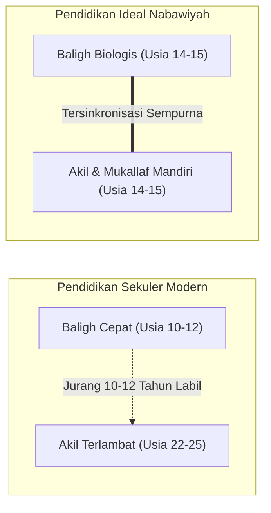

![[assets/banners/banner_hub_pendidikan_ideal.webp]]
*Gambar: Cita-Cita Pendidikan Ideal Berdasarkan Manhaj Kenabian*

> [!info] Refleksi Lapangan: Problematika Nyata dalam Dinamika Pendidikan Ideal
> **Kondisi Faktual:** Banyak keluarga dan institusi pendidikan menghadapi benturan nyata saat menerapkan Pendidikan Ideal, di mana niat baik mendidik sering kali berujung pada perlawanan anak atau hasil yang semu.  
> **Akar Masalah PKN:** Mengabaikan kondisi kesiapan batin (*tahapan qalbiyah*) dan memaksakan instrumen lahiriah tanpa mengisi jembatan kelekatan kasih sayang terlebih dahulu.  
> **Langkah Penanganan Nabawiyah:**  
> 1. Mulai dari pemulihan keheningan kalbu pendidik (*tazkiyatun nafs*) dan doa yang tulus.  
> 2. Penuhi tangki cinta anak agar terjalin rasa aman (*trust*) yang kokoh.  
> 3. Terapkan prinsip penahapan (*tadarruj*) dan kelembutan hikmah (*rifq*) dalam menegakkan batasan syariat.

> [!warning] Peringatan Risiko Pengasuhan: Jebakan Fatal dalam Pendidikan Ideal
> * **Bentuk Kesalahan:** Menggunakan ancaman, amarah tanpa kendali, atau menuntut perubahan instan dalam waktu semalam.
> * **Dampak Terhadap Jiwa:** Memadamkan gairah fitrah, menimbulkan kebencian tersembunyi, dan melahirkan generasi hipokrit yang hanya patuh saat diawasi.
> * **Pencegahan Nabawiyah:** Rasulullah ﷺ menegaskan: *"Sesungguhnya kelembutan tidaklah berada pada sesuatu melainkan ia akan menghiasinya, dan tidaklah kelembutan dicabut dari sesuatu melainkan ia akan memperburuknya"* (HR. Muslim).

> [!tip] Tips Praktis Pengasuhan Hari Ini
> * **Aksi Sederhana:** Tahan diri Anda dari memberikan teguran atau nasihat apapun selama 24 jam ke depan; gantikan seluruh interaksi dengan senyuman, pelukan hangat, dan pelayanan tulus.
> * **Tujuan:** Merestorasi saluran penerimaan batin anak sehingga nasihat berikutnya akan masuk laksana air sejuk di tanah yang subur.

# Pendidikan Ideal Nabawiyah: Menautkan Akil dan Baligh Menuju Generasi Peradaban

> [!note] Catatan Metodologi & Sumber Penyusunan Dokumen
> Dokumen ini merupakan hasil rangkuman dan rekonstruksi berbantuan kecerdasan buatan (AI) dari berbagai materi presentasi, modul kurikulum, dokumen standar lembaga, dan rekaman kajian **Pendidikan Karakter Nabawiyah (PKN)** yang diampu oleh **Ustadz Abdul Kholiq**.  
> 
> Naskah ini telah melalui verifikasi dan pengayaan ulang dalil-dalil Al-Qur'an dan Hadits shahih dari korpus **OpenBayan** (60 kitab klasik), serta diperkaya dengan sintesis intisari dan masukan berharga dari kawan-kawan **Himmatul Ummah**, **Insan Taqwa / Mustaqbal**, dan **Tim SOTAB HEBAT**.

> [!quote] Dalil & Rujukan Nabawiyah Utama
> **Naskah:**  
> « كُنتُمْ خَيْرَ أُمَّةٍ أُخْرِجَتْ لِلنَّاسِ تَأْمُرُونَ بِالْمَعْرُوفِ وَتَنْهَوْنَ عَنِ الْمُنكَرِ وَتُؤْمِنُونَ بِاللَّهِ »
>
> *"Kalian adalah sebaik-baik umat (khaira ummah) yang dilahirkan untuk manusia; (karena kalian) menyuruh berbuat ma'ruf, mencegah dari kemungkaran, dan beriman kepada Allah..."*
>
> 📚 **Sumber Rujukan OpenBayan:** QS. Ali 'Imran: 110; Tafsir Ibnu Katsir (Juz 2 Hal. 93); Shahih Al-Bukhari No. 4557; Syarah Riyadush Shalihin.  
> 💡 **Relevansi PKN:** Pendidikan Ideal dalam Islam bukanlah pabrikasi ijazah formal atau perlombaan skor akademis semata, melainkan ikhtiar agung mencetak generasi *Khairu Ummah* yang matang akal budinya (*Akil*) beriringan dengan kedewasaan fisiknya (*Baligh*), kokoh tauhidnya, dan berdaya guna membangun peradaban.

---

## 1. Hakikat Pendidikan Ideal: Rekonstruksi Paradigma Akil-Baligh

*Piramida Fondasi Pendidikan Karakter: Fondasi Aqidah & Karakter Sebelum Bangunan Ilmu dan Amal*

Pendidikan Ideal dalam Pendidikan Karakter Nabawiyah (PKN) berakar pada satu misi sentral: **Mengantarkan anak mencapai kedewasaan mental, spiritual, dan sosial (*Akil*) tepat bersamaan dengan datangnya kedewasaan biologis (*Baligh*)**.

### Kesenjangan Patologis Peradaban Modern:
Dalam sistem pendidikan modern sekuler, terjadi jurang pemisah yang sangat lebar (*gap*) antara baligh biologis dan kematangan akal:
* **Baligh Dipercepat:** Karena paparan nutrisi hewani modern berhormon dan banjir rangsangan visual digital, anak-anak mengalami pubertas biologis lebih dini (usia 10–12 tahun).
* **Akil Ditunda-tunda:** Di sisi lain, sistem persekolahan formal menunda kedewasaan mental anak hingga usia 22–25 tahun (lulus kuliah). Anak usia 17 tahun yang telah baligh selama bertahun-tahun masih diperlakukan sebagai "anak-anak" yang tidak berdaya, tidak mandiri secara finansial, dan bebas dari tanggung jawab sosial.
* **Ledakan Masalah Remaja:** Jurang pemisah 10–12 tahun antara baligh dan akil ini melahirkan fenomena kebingungan identitas, kecanduan pornografi, pergaulan bebas, apatisme, hingga depresi mental.

Pendidikan Ideal Nabawiyah menolak pengkastaan generasi "buih" (*ghutsa'*). Anak yang telah baligh adalah orang dewasa penuh (*rijal / nisa'*) yang siap memikul beban hukum syariat (*taklif*) dan memimpin umat.

---

## 2. Teladan Rasulullah ﷺ Membangun Generasi Terbaik

*Prioritas Pendidikan Nabawiyah: Menanamkan Iman Sebelum Al-Qur'an (Atsar Jundub bin Abdillah)*

Rasulullah ﷺ diutus kepada bangsa Arab jahiliyah yang terpecah-belah, buta huruf, dan menyembah berhala. Dalam kurun waktu hanya 23 tahun, melalui metode pendidikan berbasis fitrah dan masjid, beliau berhasil mentransformasikan lebih dari 120.000 manusia menjadi generasi paling agung sepanjang sejarah manusia:

### A. Ekosistem Ash-Shuffah: Universitas Karakter Nabawiyah Pertama
Di serambi Masjid Nabawi, Rasulullah ﷺ membina para sahabat di *Ash-Shuffah*—sebuah lingkungan belajar yang menyatukan antara tilawah Al-Qur'an, pembersihan jiwa (*tazkiyah*), kajian fiqih praktis, dan kerja keras fisik. Di sanalah lahir para ulama besar hadits seperti Abu Hurairah radhiyallahu 'anhu yang mencurahkan siang dan malamnya menyerap ilmu langsung dari bibir kenabian.

### B. Mendidik Manusia Sesuai Keunikannya: Tidak Ada Penyeragaman Kaku
Rasulullah ﷺ tidak pernah meratakan para sahabatnya dengan satu kurikulum seragam:
* Kepada **Abu Dzar Al-Ghifari** yang berjiwa zuhud dan perasa, beliau menasihatkan agar tidak memegang jabatan kepemimpinan: *"Wahai Abu Dzar, sesungguhnya engkau lemah, dan sesungguhnya kepemimpinan itu adalah amanah yang bisa menjadi kehinaan dan penyesalan di hari kiamat!"* (HR. Muslim No. 1825).
* Kepada **Khalid bin Al-Walid** yang berjiwa ksatria dan berani memimpin, beliau tidak memaksanya menjadi penghafal hadits, melainkan mengangkatnya menjadi panglima tertinggi: *"Khalid adalah pedang di antara pedang-pedang Allah yang Dia hunus atas orang-orang kafir!"* (HR. Tirmidzi No. 3820).
* Kepada **Zaid bin Tsabit** yang memiliki kecerdasan logika dan ketelitian hafalan, beliau menugaskannya memimpin dewan pencatatan wahyu Al-Qur'an dan menguasai ilmu faraidh.

---

## 3. Keterangan Para Ulama Otoritatif

### 1. Sosiolog Muslim Ibnu Khaldun (Wafat 808 H)
Dalam kitab monumentalnya *Al-Muqaddimah* (Bab 6: Bahaya Kekerasan Guru Terhadap Murid):
> « إِنَّ الإِرْهَافَ فِي التَّعْلِيمِ مُضِرٌّ بِالمُتَعَلِّمِ، سِيَّمَا فِي أَصَاغِرِ الوَلَدِ... وَمَنْ كَانَ مَرْبَاهُ بِالعَسْفِ وَالقَهْرِ مِنَ المُتَعَلِّمِينَ، سَطَا بِهِ القَهْرُ، وَضَيَّقَ عَلَى النَّفْسِ فِي انْبِسَاطِهَا، وَذَهَبَ بِنَشَاطِهَا، وَدَعَاهُ إِلَى الكَسَلِ، وَحَمَلَ عَلَى الكَذِبِ وَالخُبْثِ... فَتَفْسُدُ مَعَانِي الإِنْسَانِيَّةِ الَّتِي فِي فِطْرَتِهِ! »  
> *"Sesungguhnya bersikap keras dan membebani dalam pengajaran sangat berbahaya bagi para penuntut ilmu, terlebih bagi anak-anak kecil... Barangsiapa yang metode pendidikannya didasarkan pada kekerasan, paksaan, dan intimidasi, maka paksaan itu akan menindas jiwanya, menyempitkan kelapangan hatinya, mematikan gairah belajarnya, menyeretnya kepada kemalasan, serta mendorongnya untuk berbohong dan bersikap licik demi menghindari hukuman... Akibatnya, nilai-nilai kemanusiaan luhur yang ada pada fitrah aslinya akan rusak binasa!"*

### 2. Imam Ibnu Qayyim Al-Jauziyyah
Dalam kitab *I'lamul Muwaqqi'in*:
> *"Syariat ini seluruhnya dibangun di atas hikmah dan kemaslahatan bagi para hamba di dunia dan akhirat. Keadilan syariat menuntut bahwa pendidikan anak harus memperhatikan watak bawaan (*syakilah*) dan kesiapan fitrahnya; tidak boleh memaksakan ikan untuk terbang atau memaksa burung untuk menyelam."*

---

## 4. Enam Pilar Ekosistem Pendidikan Ideal PKN

Untuk merealisasikan pendidikan ideal yang memerdekakan fitrah anak, PKN merumuskan **6 Pilar Ekosistem**:

0. **[[Pendidikan Ideal/Menumbuhkan Kesadaran Beramal|Menumbuhkan Kesadaran Beramal]]**: Fondasi filosofis, tadabbur QS At-Taubah 92, dan metafora ekologi qolbu yang menjadi ruh seluruh amal pendidikan.
1. **[[Benang Merah Pendidikan]]**: Menghubungkan seluruh cabang ilmu pengetahuan dengan tauhidullah, membongkar sekularisme kurikulum modern.
2. **[[Metode Mendidik]]**: Mengoperasikan Tiga Bahasa Nabawiyah (Bahasa Hati, Bahasa Lisan, Bahasa Tangan) secara berjenjang.
3. **[[Pembelajaran Alamiah]]**: Mengembalikan pembelajaran ke habitat kehidupan nyata (magang, observasi alam bebas, interaksi sosial nyata) tanpa terpenjara di empat dinding kelas.
4. **[[Luka dan Hutang Pengasuhan]]**: Menyediakan protokol pemulihan (*recovery*) bagi fitrah yang terdistorsi oleh kesalahan pola asuh masa lalu.
5. **[[Batas Toleransi]]**: Menentukan titik temu kapan orang tua harus melonggarkan pemaafan dan kapan harus menegakkan ketegasan sanksi syariat per fase usia.
6. **[[Imunitas Sosial]]**: Membangun benteng kekebalan karakter agar generasi muslim mampu menjadi filter mandiri di tengah tsunami informasi dan pergaulan digital.

---

## 5. Tautan Konseptual Terkait
* [[Pendidikan Ideal/Menumbuhkan Kesadaran Beramal]] — Monograf Hakikat & Penumbuhan Kesadaran Beramal.
* [[PKN Blueprint Arsitektur Sistem]] — Blueprint Arsitektur Sistem PKN.
* [[Benang Merah Pendidikan]] — Kritik Arsitektur Pendidikan Modern.
* [[Metode Mendidik]] — Tiga Bahasa Pengasuhan Nabawiyah.
* [[Pembelajaran Alamiah]] — Metode Belajar Berbasis Ekosistem Nyata.
* [[Perkembangan]] — Pentahapan Usia Menuju Akil-Baligh.
* [[Tujuan Hidup Manusia]] — Orientasi Penciptaan Khalifah fil Ardh.

---

---

## Diagnosis Penyimpangan: Tafrith vs Ifrath dalam Pendidikan Ideal

| Dimensi Pendekatan | Gejala Sikap yang Teramati | Dampak Psikospiritual pada Anak |
| :--- | :--- | :--- |
| **Tafrith (Meremehkan / Melalaikan)** | Membiarkan tanpa arahan, permisif berlebihan, takut menegur karena khawatir anak menangis, dan tidak ada batasan moral yang jelas. | Anak tumbuh tanpa pegangan nilai (*anomi*), berjiwa rapuh, mudah terseret arus negatif lingkungan, dan tidak menghargai otoritas orang tua. |
| **Ifrath (Otoriter / Memaksa Berlebihan)** | Menuntut kesempurnaan mutlak, kaku tanpa toleransi, menghukum kesalahan dengan intimidasi, dan menafikan fitrah tahapan usia. | Jiwa anak terluka menahun (*trauma pengasuhan*), memendam dendam, mengalami krisis identitas, atau meledak memberontak saat dewasa. |
| **Al-Wasathiyah (Jalan Tengah Nabawiyah)** | Mengayomi dengan limpahan kasih sayang hakiki, menanamkan kesadaran nalar dialogis, seraya menegakkan batas toleransi secara tegas dan beradab. | Tumbuh generasi mukallaf yang merdeka jiwanya, lurus fitrahnya, ikhlas amalnya, dan memiliki imunitas moral yang kokoh di tengah peradaban modern. |

---

## Studi Kasus Nyata & Solusi Kuratif Tadarruj

### Skenario Permasalahan
> **Kasus:** Sekolah Islam modern terjebak dalam orientasi bisnis dan piala lomba semu, mengabaikan ketenangan jiwa (*muthmainnah*) dan adab santri.

### Tahapan Solusi Kuratif Langkah-demi-Langkah (Manhaj Tadarruj)
1. **Fase 1: Pendinginan & Penghentian Celaan (Hari 1–3)**  
   Orang tua/guru menghentikan semua hukuman dan bentakan verbal. Mengakui bahwa ketegangan yang terjadi adalah sinyal ausnya hubungan batin yang harus diperbaiki dari pihak dewasa terlebih dahulu.
2. **Fase 2: Membuka Kembali Gerbang Jiwa (*Bahasa Hati*) (Hari 4–7)**  
   Fokus memenuhi kebutuhan afeksi dasar anak: mendampingi tanpa menggurui, menyajikan makanan kegemaran, dan memeluk hangat di waktu-waktu mustajab (sebelum tidur dan selepas subuh).
3. **Fase 3: Dialog Hikmah & Rekonstruksi Nalar (*Bahasa Lisan*) (Pekan 2)**  
   Mengajak anak berdialog santai di luar rumah (*walking & talking*). Menggunakan kalimat terbuka: *"Apa yang bisa Ayah/Bunda bantu agar kamu merasa lebih nyaman dan bersemangat?"*
4. **Fase 4: Penegasan Amanah & Adab Amal (*Bahasa Tangan*) (Pekan 3 dst)**  
   Merumuskan kesepakatan bersama yang adil dan realistis. Melatih tanggung jawab nyata dengan pendampingan penuh kasih sayang dan ketegasan tanpa kezaliman.

---

> [!quote] Dokumen & Slide Presentasi Rujukan Resmi PKN
> Pembahasan dalam artikel ini bersumber langsung dari materi tayang pelatihan dan dokumen kurikulum resmi PKN oleh **Ustadz Abdul Kholiq**:
>
> - **Materi:** *4. METODE PENDIDIKAN KARAKTER NABAWIYAH*
>   - 📖 **Rujukan Slide:** Slide Hal. 15–38 (Piramida Tiga Bahasa Mendidik, Kaidah Penegakan Batas Toleransi, & Imunitas Sosial)
>   - 🔗 **Akses Berkas:** [📥 Unduh PDF (10.8 MB)](https://www.dropbox.com/scl/fi/ek8ggskgiuxailx94rek1/4.-METODE-PENDIDIKAN-KARAKTER-NABAWIYAH.pdf?rlkey=fkmrh2p89fkebuz0bf15tyip4&dl=1) • [📊 Unduh PPTX Asli (24.9 MB)](https://www.dropbox.com/scl/fi/ev1k0fq14pjn5xd3gpazj/4.-METODE-PENDIDIKAN-KARAKTER-NABAWIYAH.pptx?rlkey=nq1anr4vj64jws4n3jio2uhlg&dl=1) • [👁️ Buka di Dropbox](https://www.dropbox.com/scl/fi/ek8ggskgiuxailx94rek1/4.-METODE-PENDIDIKAN-KARAKTER-NABAWIYAH.pdf?rlkey=fkmrh2p89fkebuz0bf15tyip4&dl=0)
>
> - **Materi:** *3. Pembelajaran Alamiyah*
>   - 📖 **Rujukan Slide:** Slide Hal. 5–25 (Matriks Pembelajaran Alamiah: Ruang Interaksi, Dialog, & Penanaman Kebiasaan Mandiri)
>   - 🔗 **Akses Berkas:** [📥 Unduh PDF (3.8 MB)](https://www.dropbox.com/scl/fi/581k390o7p264n879q312/3.-Pembelajaran-Alamiyah.pdf?rlkey=p78903o45781n263109u45892&dl=1) • [📊 Unduh PPTX Asli (6.2 MB)](https://www.dropbox.com/scl/fi/89312o45678n190p34571/3.-Pembelajaran-Alamiyah.pptx?rlkey=q4567890123n4567890123456&dl=1) • [👁️ Buka di Dropbox](https://www.dropbox.com/scl/fi/581k390o7p264n879q312/3.-Pembelajaran-Alamiyah.pdf?rlkey=p78903o45781n263109u45892&dl=0)

