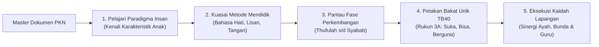

# Dokumen Master Pendidikan Karakter Nabawiyah

> [!note] Catatan Metodologi & Sumber Penyusunan Dokumen
> Dokumen ini merupakan hasil rangkuman dan rekonstruksi berbantuan kecerdasan buatan (AI) dari berbagai materi presentasi, modul kurikulum, dokumen standar lembaga, dan rekaman kajian **Pendidikan Karakter Nabawiyah (PKN)** yang diampu oleh **Ustadz Abdul Kholiq**.  
> 
> Naskah ini telah melalui verifikasi dan pengayaan ulang dalil-dalil Al-Qur'an dan Hadits shahih dari korpus **OpenBayan** (60 kitab klasik), serta diperkaya dengan sintesis intisari dan masukan berharga dari kawan-kawan **Himmatul Ummah**, **Insan Taqwa / Mustaqbal**, dan **Tim SOTAB HEBAT**.

Dokumen ini merupakan cetak biru (*grand design*) dan arsitektur induk sistem **Pendidikan Karakter Nabawiyah (PKN)**. Dokumen ini merangkum sintesis holistik antara dalil-dalil Al-Qur'an, as-Sunnah ash-Shahihah, khazanah tarbiyah ulama salafush shalih, serta aplikasi empiris pengasuhan berbasis fitrah di era kontemporer.

> [!quote] Dalil & Rujukan Nabawiyah: Petunjuk yang Paripurna
> **Teks Al-Qur'an:**  
> « إِنَّ هَٰذَا الْقُرْآنَ يَهْدِي لِلَّتِي هِيَ أَقْوَمُ وَيُبَشِّرُ الْمُؤْمِنِينَ الَّذِينَ يَعْمَلُونَ الصَّالِحَاتِ أَنَّ لَهُمْ أَجْرًا كَبِيرًا »
> 
> *"Sesungguhnya Al Quran ini memberikan petunjuk kepada (jalan) yang lebih lurus dan memberi kabar gembira kepada orang-orang mukmin yang mengerjakan amal saleh bahwa bagi mereka ada pahala yang besar."*  
> — **QS. Al-Isra': 9**
> 
> 📚 **Rujukan Tafsir OpenBayan:** *Tafsir Ibnu Katsir* menegaskan bahwa petunjuk Al-Qur'an adalah jalan yang paling tegak, paling adil, paling lurus (*aqwam*), dan tidak ada kebengkokan di dalamnya.  
> 💡 **Relevansi PKN:** PKN meletakkan wahyu Ilahi sebagai rujukan mutlak di atas seluruh teori psikologi manusia yang rentan berubah dan terbatas pandangannya.

---

## 1. Visi, Misi, dan Epistemologi PKN

Pendidikan Karakter Nabawiyah hadir sebagai jawaban atas kegagalan sistem pendidikan modern (adopsi model pabrik Prusia) yang mereduksi hakikat manusia menjadi sekadar angka ujian, menstandarisasi potensi unik anak secara seragam, memisahkan perkembangan fisik (*baligh*) dari kematangan nalar dan tanggung jawab (*akil*), serta menyingkirkan dimensi tauhid dari proses belajar.

### Matriks Komparasi: Paradigma Sekuler vs Paradigma Nabawiyah

| Dimensi Evaluasi | Paradigma Pendidikan Sekuler Modern | Paradigma Pendidikan Karakter Nabawiyah (PKN) |
| :--- | :--- | :--- |
| **Hakikat Anak** | Kertas putih kosong (*tabula rasa*) yang harus diisi dan dibentuk oleh lingkungan luar. | Makhluk mulia yang telah membawa cetak biru suci (*fitrah*) dan potensi ketauhidan sejak lahir. |
| **Peran Orang Tua** | Konsumen pendidikan; mendelegasikan tanggung jawab pengasuhan penuh kepada sekolah formal. | Penanggung jawab utama dan pertama di hadapan Allah (*fardhu 'ain*); sekolah hanya mitra pendukung. |
| **Metode Belajar** | Penyeragaman kurikulum massal (*one size fits all*), drill hafalan teks, dan kompetisi ranking. | Personalisasi (*satu anak satu kurikulum*), eksplorasi alamiah, dan mentoring berbasis bakat unik (TB40). |
| **Fokus Usia Dini** | Calistung dini, ujian kognitif formal, dan pengekangan ruang gerak fisik anak di kelas. | Penuntasan tangki cinta tanpa syarat, bermain aktif, keteladanan visual, dan penanaman rasa cinta iman. |
| **Target Akhir** | Ijazah formal, kesiapan menjadi tenaga kerja pasar, dan kepatuhan mekanis industri. | Mencetak pribadi Mukallaf yang Akil-Baligh, berjiwa *khairu ummah*, mandiri, dan beramal peradaban. |

---

## 2. Struktur Pembagian Dokumen Wiki PKN

Arsitektur dokumen Wiki PKN terbagi ke dalam dua divisi utama yang saling menopang secara sistemik:

### Bagian I: [[Paradigma & Implementasi]]
Bagian ini membedah pondasi konseptual filosofis dan rancang bangun metodologis yang wajib dikuasai oleh setiap pendidik:
1. **[[Insan]]:** Membahas tuntas siapa manusia yang dididik, meliputi [[Tujuan Hidup Manusia]], pertemuan [[Bersatunya Ruh dan Jasad Membentuk Jiwa]], taksonomi [[Pembagian Jiwa]] (*Muthmainnah, Lawwamah, Ammarah*), konsepsi [[Fitrah (Karakter)]], pengisian [[Tangki Cinta]], fitrah [[Belajar]], dan 40 ragam [[Bakat]].
2. **[[Pendidikan Ideal]]:** Membahas prinsip dasar tarbiyah lurus dalam [[Benang Merah Pendidikan]], metodologi pengasuhan bertahap dalam [[Metode Mendidik]] (*Bahasa Hati, Bahasa Lisan, Bahasa Tangan*), konsep [[Pembelajaran Alamiah]], benteng [[Imunitas Sosial]], penjagaan [[Batas Toleransi]], serta kurasi solusi dalam [[Bank Studi Kasus]].
3. **[[Implementasi]]:** Membahas panduan praktis eksekusi di dunia nyata melalui [[4 Kaidah Implementasi]], [[4 Elemen Implementasi]], pensucian jiwa dalam [[Tazkiyatun Nafs]], kekuatan [[Tawakkal dan Doa]], serta sinergi segitiga emas dalam [[Tanggung Jawab Pendidikan]], [[Peran Ayah dan Bunda]], dan [[Peran Guru dan Lembaga Pendidikan]].

### Bagian II: [[Insight & Teknis]]
Bagian ini memuat kompilasi catatan lapangan, studi kasus empiris, dan arahan prosedural teknis dari para asatidzah dan praktisi PKN:
1. **[[Insight]]:** Renungan mendalam mengenai dinamika jiwa anak, problematika *fatherless*, bahaya kecanduan digital, dan pemulihan luka pengasuhan.
2. **[[Arahan Teknis Implementasi]]:** Standar operasional prosedur (SOP) harian keluarga, instrumen observasi bakat, checklist adab per fase usia, dan panduan dialog ayah-anak.
3. **[[SOTABH]]:** Panduan kurikulum Sekolah Orang Tua Berbasis Hadits sebagai sarana upgrading berkala kapasitas pengasuhan ayah dan bunda.

---

## 3. Peta Alur Membaca & Verifikasi Dokumen

### Panduan Aksi Pengguna:
* Ingin membaca ringkasan jawaban cepat atas masalah pengasuhan nyata? Buka [[FAQ Ringkas]].
* Ingin mengetahui cara mendiagnosis penyimpangan anak? Buka bab Tafrith vs Ifrath di setiap berkas bakat.
* Ingin melihat dalil shahih pendukung setiap materi? Telusuri [[Master Katalog Dalil Al-Quran|Master Katalog Dalil Al-Qur'an]] dan [[Master Katalog Dalil Hadits dan Sunnah|Master Katalog Dalil Hadits & Sunnah]].
* Ingin mengkaji rekaman audio-visual penjelas? Buka [[Referensi Kajian Video]].
