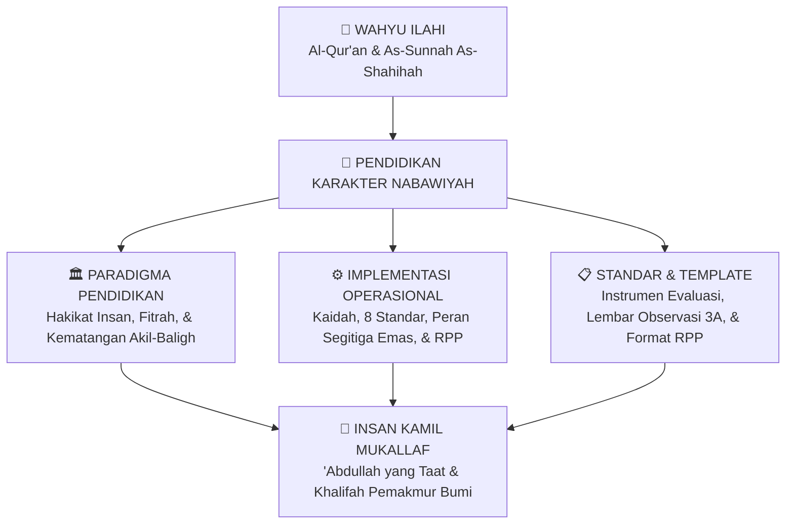
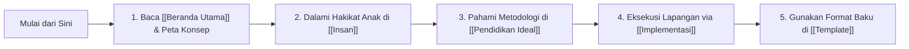

# Paradigma & Implementasi Pendidikan Karakter Nabawiyah (PKN)

> [!note] Catatan Metodologi & Sumber Penyusunan Dokumen
> Dokumen ini merupakan hasil rangkuman dan rekonstruksi berbantuan kecerdasan buatan (AI) dari berbagai materi presentasi, modul kurikulum, dokumen standar lembaga, dan rekaman kajian **Pendidikan Karakter Nabawiyah (PKN)** yang diampu oleh **Ustadz Abdul Kholiq**.  
> 
> Naskah ini telah melalui verifikasi dan pengayaan ulang dalil-dalil Al-Qur'an dan Hadits shahih dari korpus **OpenBayan** (60 kitab klasik), serta diperkaya dengan sintesis intisari dan masukan berharga dari kawan-kawan **Himmatul Ummah**, **Insan Taqwa / Mustaqbal**, dan **Tim SOTAB HEBAT**.

> [!important] Gerbang Utama Seluruh Korpus Dokumen PKN (Master Portal Hub)
> Halaman ini merupakan **Pintu Gerbang Utama (*Master Hub*)** bagi seluruh struktur dokumen, metodologi, standar operasional, dan materi panduan Pendidikan Karakter Nabawiyah (PKN). Disusun secara komprehensif untuk menyatukan visi teologis-filosofis (*Paradigma*) dengan panduan tindakan praktis di rumah, sekolah, dan ma'had (*Implementasi*).

---

## 1. Visi Besar Pendidikan Karakter Nabawiyah

Pendidikan Karakter Nabawiyah lahir dari kegelisahan mendalam atas disorientasi peradaban modern, di mana sistem pendidikan sekuler telah mereduksi hakikat agung manusia menjadi sekadar komponen industri (*human resources*). Anak-anak diseragamkan dengan standar mekanis, dijejali hafalan kognitif tanpa adab, dan dipaksa mengubur keunikan fitrah bawaan lahir demi mengejar angka-angka semu di atas kertas rapor.

PKN merekonstruksi paradigma pendidikan kembali ke jalan kenabian (*manhaj nabawi*) yang bersumber langsung dari wahyu Al-Qur'an dan As-Sunnah:

---

## 2. Struktur Utama Korpus Dokumen

Dalam repositori ini, seluruh materi dikelompokkan ke dalam struktur direktori utama yang terorganisir secara hierarkis:

### 🗺️ Peta Navigasi Direktori Utama

| Direktori / Klaster | Tautan Hub Utama | Lingkup & Cakupan Dokumen | Sasaran Pengguna Utama |
|---|---|---|---|
| **Dokumen Pendidikan Karakter Nabawiyah** | **[[Dokumen Pendidikan Karakter Nabawiyah]]** | Master induk seluruh dokumen formal PKN: memayungi klaster *Paradigma & Implementasi* serta *Insight & Teknis*. | Pendidik, Peneliti, Pengelola Lembaga |
| **Paradigma & Implementasi** | **[[Paradigma & Implementasi]]** | Jantung teoritis dan metodologis PKN: memuat trilogi pilar *[[Insan]]*, *[[Pendidikan Ideal]]*, dan *[[Implementasi]]*. | Orang Tua, Guru, Musyrif Asrama |
| **Pilar Insan & Fitrah** | **[[Insan]]** | Antropologi manusia, arsitektur ruh-jasad-nafs, taksonomi jiwa, 4 pilar fitrah, dan 40 pilar [[Bakat]]. | Semua Kalangan Pembina Karakter |
| **Pendidikan Ideal** | **[[Pendidikan Ideal]]** | Metodologi 3 bahasa tarbiyah, penyembuhan luka pengasuhan, batas toleransi, dan imunitas sosial anak. | Ayah, Bunda, Guru Kelas |
| **Implementasi Lapangan** | **[[Implementasi]]** | Standar operasional 8 pilar, sinergi ayah-bunda-guru, panduan RPP, serta penyucian jiwa internal pendidik. | Kepala Sekolah, Manajemen Kurikulum |
| **Standar & Template** | **[[Template]]** | Kumpulan template RPP, instrumen observasi bakat 3A, dan rubrik asesmen karakter harian. | Praktisi Guru & Orang Tua Home-Schooling |

---

## 3. Ringkasan Eksekutif Tiga Pilar Inti PKN

Sistem Pendidikan Karakter Nabawiyah ditopang oleh tiga pilar utama yang saling menyempurnakan:

### A. Pilar I: [[Insan]] (Siapa yang Kita Didik?)
Membongkar hakikat manusia ciptaan Allah yang terdiri dari pertemuan sakral antara sari pati tanah (*thiin*) dan tiupan ruh Ilahi (*nafkhatur ruh*), melahirkan dinamika **Jiwa (*An-Nafs*)**. Pembahasan meliputi:
* Misi Dwi-Mandat: **[[Tujuan Hidup Manusia]]** sebagai *'Abdullah* dan *Khalifah fil Ardh*.
* Kosmologi diri: **[[Bersatunya Ruh dan Jasad Membentuk Jiwa]]**.
* Taksonomi kesadaran moral: **[[Pembagian Jiwa]]** ([[Ammarah]], [[Lawwamah]], [[Muthmainnah]]).
* Penyingkapan potensi bawaan: **[[Fitrah (Karakter)]]** yang menaungi fitrah [[Iman]], [[Belajar]], [[Bakat]] (40 pilar TB-40), dan 4 etape [[Perkembangan]] usia (Thufulah, Tamyiz, Murahaqah, Syabab).

### B. Pilar II: [[Pendidikan Ideal]] (Bagaimana Cara Mendidiknya?)
Merumuskan metodologi pengasuhan yang meneladani kelembutan dan ketegasan Rasulullah ﷺ:
* **[[Konsep Mendidik Anak]]** dan penanaman **[[Nilai-Nilai Dasar]]** ketauhidan.
* **[[Metode Mendidik]]** berbasis hirarki 3 bahasa tarbiyah: [[Bahasa Hati]] (kehangatan jiwa), [[Bahasa Lisan]] (komunikasi Qur'ani), dan [[Bahasa Tangan]] (ta'dib tegas terukur).
* Pencegahan dan pemulihan: **[[Luka dan Hutang Pengasuhan]]**, terapi **[[Recovery]]**, serta penanganan sindrom **[[Euforia]]**.
* Benteng proteksi pergaulan: **[[Batas Toleransi]]** dan **[[Imunitas Sosial]]**.

### C. Pilar III: [[Implementasi]] (Bagaimana Standar Operasional di Lapangan?)
Membumikan nilai dan paradigma ke dalam tindakan praktis terukur di lembaga pendidikan dan keluarga:
* **[[Kaidah & Elemen]]**: Memuat [[4 Kaidah Implementasi]], [[4 Elemen Implementasi]], [[8 Standar Implementasi PKN]], dan [[Panduan RPP dan Observasi Lapangan]].
* **[[Peran & Tanggung Jawab]]**: Menegakkan fardhu 'ain [[Tanggung Jawab Pendidikan]], membedah sinergi [[Peran Ayah dan Bunda]], serta memadukan [[Peran Guru dan Lembaga Pendidikan]].
* **[[Internal & Eksternal]]**: Hulu spiritual pendidik melalui [[Tazkiyatun Nafs]] serta ketundukan mutlak dalam [[Tawakkal dan Doa]].

---

## 4. Panduan Memulai bagi Pengguna Baru

Bagi Anda yang baru pertama kali mengakses Wiki PKN, kami menyarankan urutan penelusuran berikut:

---

## 5. Hubungan Antar Dokumen & Tautan Strategis

* **Halaman Induk Utama:**
  * [[Beranda Utama]] — Pintu masuk publik repositori Wiki PKN.
  * [[Dokumen Pendidikan Karakter Nabawiyah]] — Indeks katalog resmi dokumen PKN.
  * [[Paradigma & Implementasi]] — Sintesis konseptual dan implementatif.
* **Dokumen Operasional:**
  * [[8 Standar Implementasi PKN]] — Buku standar mutu implementasi di sekolah dan keluarga.
  * [[Panduan RPP dan Observasi Lapangan]] — Petunjuk teknis pembuatan rencana pembelajaran dan asesmen 3A.
  * [[Bakat]] — Katalog lengkap 40 pilar bakat nabawiyah dan pemetaan karir peradaban.
* **Ruang Refleksi:**
  * [[Renungan Pengasuhan Nabawiyah]] — Kumpulan tadabbur dan evaluasi diri orang tua.
