# Wiki Pendidikan Karakter Nabawiyah (PKN)

Selamat datang di basis pengetahuan digital **Pendidikan Karakter Nabawiyah (PKN)**—sebuah ensiklopedia rujukan komprehensif yang merekonstruksi paradigma, kurikulum, metodologi, dan implementasi pengasuhan generasi Islam berdasarkan sunnah Rasulullah ﷺ, atsar para sahabat, serta pandangan para ulama mu'tabar (*Ibnul Qayyim, Al-Ghazali, Ibnu Sahnun, An-Nawawi, Ibnu Khaldun, Asy-Syathibi*).

> [!quote] Dalil & Rujukan Nabawiyah: Fondasi Pohon Karakter
> **Teks Al-Qur'an:**  
> « أَلَمْ تَرَ كَيْفَ ضَرَبَ اللَّهُ مَثَلًا كَلِمَةً طَيِّبَةً كَشَجَرَةٍ طَيِّبَةٍ أَصْلُهَا ثَابِتٌ وَفَرْعُهَا فِي السَّمَاءِ ۝ تُؤْتِي أُكُلَهَا كُلَّ حِينٍ بِإِذْنِ رَبِّهَا »
> 
> *"Tidakkah kamu perhatikan bagaimana Allah telah membuat perumpamaan kalimat yang baik seperti pohon yang baik, akarnya teguh dan cabangnya (menjulang) ke langit, pohon itu menghasilkan buahnya pada setiap waktu dengan seizin Tuhannya..."*  
> — **QS. Ibrahim: 24–25**
> 
> 💡 **Relevansi PKN:** Fondasi metafora arsitektur peradaban: Tauhid dan iman adalah akar yang menghujam ke relung kalbu, adab belajar adalah batang yang kokoh, 40 pilar bakat unik anak adalah cabang yang menjulang, dan buahnya adalah amal peradaban yang bermanfaat bagi semesta.

> [!summary] ⚡ TL;DR: Intisari Aksi Praktek PKN bagi Orang Tua, Pendidik, dan Lembaga
> *"Pendidikan Karakter Nabawiyah bukanlah sekadar wacana teoritis di atas kertas, melainkan sebuah manhaj amali (metode aksi nyata) yang mentransformasi peradaban dari unit terkecil. Berdasarkan sunnah Nabi ﷺ dan konsensus para ulama tarbiyah, berikut adalah ringkasan aksi nyata yang wajib dioperasionalkan:"*
> 
> ---
> 
> #### 👨‍👩‍👧 1. Bagi Orang Tua (Rumah sebagai Madrasah Utama & Benteng Fardhu 'Ain)
> * **Penegakan Visi & Qawwamah (Ayah):** Ayah bertindak sebagai nakhoda visi ukhrawi, penjaga benteng akidah keluarga, penegak [[Batas Toleransi]] terhadap polusi pergaulan/gadget, serta pembimbing adab melalui [[Bahasa Tangan]] dan ketegasan berwibawa tanpa kekerasan fisik maupun verbal.
> * **Limpahan Cinta & Kelekatan Fitrah (Bunda):** Bunda hadir sebagai madrasah pertama yang membasahi kalbu anak dengan kehangatan tanpa syarat, memenuhi [[Tangki Cinta]] pada masa usia dini ([[Thufulah]]), serta membuka pintu hati melalui [[Bahasa Hati]] dan dialog empati [[Bahasa Lisan]].
> * **Amalan Harian di Rumah:** Menghidupkan shalat berjamaah tepat waktu, meja makan peradaban (forum dialog akrab orang tua-anak), penugasan kerja nyata tanpa upah instan untuk memupuk fitrah [[Melayani]] (*Al-Khidmah*), serta muhasabah dan saling memaafkan sebelum tidur ([[Tazkiyatun Nafs]]).
> 
> #### 👨‍🏫 2. Bagi Pendidik (Guru sebagai Qudwah & Fasilitator Fitrah)
> * **Keteladanan Hidup (Qudwah Hasanah):** Mengajar dengan integritas akhlak nyata, bukan sekadar transfer materi; mendahulukan penanaman adab sebelum ilmu dan membangun kecintaan sebelum membebani dengan taklif/aturan kaku.
> * **Metodologi Pembelajaran Alamiah:** Memangkas verbalisme abstrak di dalam sekat kelas; membawa murid berinteraksi langsung dengan alam semesta, memantik akal kritis ([[Lawwamah]]), dan menyelesaikan masalah riil masyarakat ([[Pembelajaran Alamiah]]).
> * **Observasi & Asah Potensi Unik (Formula 3A):** Menghindari penyeragaman standar kecerdasan; mengamati 40 bakat fitrah ([[Bakat]]) murid dengan Rukun 3A: **Alami** (berikan ruang eksplorasi ragam peran), **Acuhkan** kelemahan minor yang bukan fardhu 'ain, dan **Asah** keunikan bakat dominan hingga menjadi karya peradaban.
> 
> #### 🏛️ 3. Bagi Lembaga Pendidikan (Sekolah & Pesantren sebagai Ekosistem Pendukung)
> * **Reposisi Kemitraan Hakiki:** Memosisikan lembaga sebagai **mitra pendukung orang tua**, bukan tempat pemindahan tanggung jawab asuh (*outsourcing parenting*). Mengokohkan sinergi Segitiga Emas: Rumah – Sekolah – Masjid/Masyarakat ([[Tanggung Jawab Pendidikan]]).
> * **Transformasi Budaya & Asesmen Holistik:** Mengganti sistem perankingan komparatif yang melahirkan kesombongan atau keputusasaan dengan asesmen portofolio deskriptif yang memotret kematangan adab, integritas, dan perkembangan bakat unik anak.
> * **Menciptakan Lingkungan Suci (Safe Haven):** Menjamin lingkungan yang steril dari kekerasan fisik, perundungan (*bullying*), dan pornografi/gawai liar; serta merancang kurikulum magang karya yang menyiapkan anak mandiri (*akil-baligh*) sebelum menginjak usia dewasa ([[Syabab]]).

---

## 1. Peta Konsep Arsitektur Pendidikan Karakter Nabawiyah

Pendidikan Karakter Nabawiyah memandang manusia sebagai kesatuan utuh (*insan kamil*) yang bertumbuh secara organik melalui integrasi tiga pilar agung:

```mermaid
graph TD
    subgraph AKAR["🌱 PONDASI INSAN (AKAR TAUHID)"]
        Tujuan["[[Tujuan Hidup Manusia]]<br/>Ibadah & Khilafah"]
        RuhJasad["[[Bersatunya Ruh dan Jasad Membentuk Jiwa]]<br/>Tiupan Ruh & Tanah"]
        Trilogi["[[Pembagian Jiwa]]<br/>Muthmainnah • Lawwamah • Ammarah"]
        Fitrah["[[Fitrah (Karakter)]]<br/>Cetak Biru Suci Lahiriah"]
    end

    subgraph BATANG["🌳 PENDIDIKAN IDEAL (BATANG ADAB & METODOLOGI)"]
        Benang["[[Benang Merah Pendidikan]]<br/>Wasathiyah: Anti-Tafrith & Ifrath"]
        TigaBahasa["[[Metode Mendidik]]<br/>[[Bahasa Hati]] • [[Bahasa Lisan]] • [[Bahasa Tangan]]"]
        Fase["[[Perkembangan]]<br/>[[Thufulah]] (0-7) • [[Tamyiz]] (7-10) • [[Murahaqah]] (10-15) • [[Syabab]] (15+)"]
        Proteksi["[[Batas Toleransi]] • [[Imunitas Sosial]] • [[Recovery]]"]
    end

    subgraph RANTING["🍃 FITRAH BAKAT (40 PILAR TB40)"]
        BakatUmum["[[Bakat]] (Syakilah Unik)"]
        Sub1["[[Bekerja Keras]] (Al-Hammasah)"]
        Sub2["[[Berpikir]] (Al-Fikrah)"]
        Sub3["[[Berperasaan]] (Al-Wijdaniyyah)"]
        Sub4["[[Memerintah]] (At-Ta'tsir)"]
        Sub5["[[Bekerja Sama]] (At-Ta'amul)"]
        Sub6["[[Melayani]] (Al-Khidmah)"]
    end

    subgraph BUAH["🍎 IMPLEMENTASI & KARYA PERADABAN"]
        Kaidah["[[4 Kaidah Implementasi]]<br/>Taisir • Qudwah • Rahmah • Tadarruj"]
        Elemen["[[4 Elemen Implementasi]]<br/>Ghayah • Manhaj • Uslub • Taqyim"]
        Sinergi["[[Tanggung Jawab Pendidikan]]<br/>[[Peran Ayah dan Bunda]] • [[Peran Guru dan Lembaga Pendidikan]] • [[Kaidah Implementasi di Berbagai Lembaga]]"]
        Output["Kematangan Akil-Baligh & Khairu Ummah"]
    end

    AKAR --> BATANG
    BATANG --> RANTING
    RANTING --> BUAH
```

---

## 2. Tiga Jalur Belajar Berdasarkan Peran Pengguna

Untuk memudahkan penelusuran dokumen wiki yang berjumlah 61 halaman, silakan pilih jalur membaca yang paling relevan dengan amanah Anda:

### 🧭 Jalur 1: Untuk Ayah (Nakhoda Visi & Ketegasan Syariat)
Sebagai nakhoda keluarga yang memegang amanah *qawwamah* (QS. An-Nisa: 34), Ayah bertugas menetapkan arah peradaban rumah tangga dan menegakkan batas-batas syariat:
1. Pahami tujuan tertinggi penciptaan dalam [[Tujuan Hidup Manusia]] dan [[Tanggung Jawab Pendidikan]].
2. Tegakkan batas perlindungan keluarga dari pengaruh destruktif melalui [[Batas Toleransi]] dan [[Imunitas Sosial]].
3. Pelajari kaidah ketegasan mendidik tanpa kekerasan dalam [[Bahasa Tangan]] dan pendisiplinan fase [[Murahaqah]].
4. Sinergikan pembagian peran pengasuhan dengan istri melalui [[Peran Ayah dan Bunda]].

### 🌸 Jalur 2: Untuk Bunda (Madrasah Cinta & Pengisian Tangki Jiwa)
Sebagai *rahimah* dan madrasah pertama anak, Bunda bertugas menghidupkan suasana kasih sayang dan mengawal kelekatan fitrah:
1. Mulai dari pemenuhan hak batin anak usia dini dalam [[Tangki Cinta]] dan fase [[Thufulah]] (0–7 tahun).
2. Kuasai seni komunikasi kelembutan batiniah dalam [[Bahasa Hati]] dan dialog empatik [[Bahasa Lisan]].
3. Kenali dinamika batiniah anak agar tidak cemas berlebihan melalui [[Pembagian Jiwa]], [[Muthmainnah]], dan [[Lawwamah]].
4. Temukan ketenangan batin dalam mendampingi anak melalui [[Tazkiyatun Nafs]] serta [[Tawakkal dan Doa]].

### 🎓 Jalur 3: Untuk Guru & Pengelola Lembaga Pendidikan
Sebagai mitra pengembang amanah orang tua (*Waratsatul Anbiya'*), pendidik formal dan non-formal bertugas memfasilitasi fitrah unik setiap murid:
1. Pahami kedudukan institusi dan adab guru dalam [[Peran Guru dan Lembaga Pendidikan]] • [[Kaidah Implementasi di Berbagai Lembaga]].
2. Pelajari kaidah operasional kurikulum berbasis fitrah dalam [[4 Kaidah Implementasi]] dan [[4 Elemen Implementasi]].
3. Terapkan prinsip pembelajaran dunia nyata tanpa sekat kaku kelas melalui [[Pembelajaran Alamiah]].
4. Lakukan pemetaan dan observasi 40 bakat anak menggunakan instrumen Rukun 3A di [[Bakat]], [[Bekerja Keras]], [[Berpikir]], [[Berperasaan]], [[Memerintah]], [[Bekerja Sama]], dan [[Melayani]].

---

## 3. Peta Navigasi Cepat Topik-Topik Kunci

| Kluster Pembahasan | Halaman Kunci yang Wajib Dibaca | Fokus Utama Kajian |
| :--- | :--- | :--- |
| **Pondasi Insan** | [[Insan]], [[Tujuan Hidup Manusia]], [[Bersatunya Ruh dan Jasad Membentuk Jiwa]] | Hakikat penciptaan manusia, pertemuan tanah dan tiupan ruh, serta taksonomi trilogi jiwa. |
| **Trilogi Jiwa (Nafs)** | [[Pembagian Jiwa]], [[Ammarah]], [[Lawwamah]], [[Muthmainnah]] | Memahami pertarungan dorongan fisik (Ammarah), nalar kritis (Lawwamah), dan spiritualitas hati (Muthmainnah). |
| **Fitrah & Belajar** | [[Fitrah (Karakter)]], [[Iman]], [[Tangki Cinta]], [[Belajar]] | Menjaga kesucian fitrah lahiriah, menumbuhkan cinta sebelum hukum, dan fitrah belajar alamiah anak. |
| **Fase Usia Perkembangan** | [[Perkembangan]], [[Thufulah]], [[Tamyiz]], [[Murahaqah]], [[Syabab]] | Panduan mendidik bertahap dari usia 0–7 tahun (bermain), 7–10 tahun (adab shalat), 10–15 tahun (disiplin & karya), hingga 15+ tahun (akil-baligh mandiri). |
| **Metodologi Pengasuhan** | [[Metode Mendidik]], [[Bahasa Hati]], [[Bahasa Lisan]], [[Bahasa Tangan]] | Hirarki tiga bahasa tarbiyah: kehangatan batin, 6 kaidah komunikasi Al-Qur'an, dan ta'dib ketegasan terukur. |
| **Penyembuhan & Proteksi** | [[Luka dan Hutang Pengasuhan]], [[Recovery]], [[Euforia]], [[Batas Toleransi]], [[Imunitas Sosial]] | Memulihkan fitrah anak yang terluka, mengatasi sindrom euforia sesaat, serta benteng proteksi pergaulan. |
| **40 Pilar Bakat (TB40)** | [[Bakat]], [[Bekerja Keras]], [[Berpikir]], [[Berperasaan]], [[Memerintah]], [[Bekerja Sama]], [[Melayani]] | Pemetaan bakat nabawiyah terinspirasi figur sahabat Nabi ﷺ, rubrik observasi 3A, dan pencegahan tafrith-ifrath. |
| **Implementasi Lapangan** | [[Implementasi]], [[4 Kaidah Implementasi]], [[4 Elemen Implementasi]], [[Tanggung Jawab Pendidikan]] | Standar operasional eksekusi kurikulum keluarga, fardhu 'ain orang tua, dan sinergi segitiga emas pendidikan. |

---

## 4. Master Rujukan Dalil & Video Database

Wiki PKN terintegrasi penuh dengan dua basis data ilmiah pelengkap:
* 📖 **[Master Katalog Dalil Al-Qur'an](file:///home/abuhafi/Project/wiki-pkn/QURAN_DALIL_CATALOG.md):** Memuat lebih dari 110 ayat Al-Qur'an berharakat lengkap, terjemahan resmi, takhrij surah/ayat, serta syarah klasik dari **Tafsir Ibnu Katsir** melalui korpus **OpenBayan**.
* 📜 **[Master Katalog Dalil Hadits & Sunnah](file:///home/abuhafi/Project/wiki-pkn/DALIL_MAPPING.md):** Memuat hadits-hadits shahih dari Kutubus Sunnah (*Shahih Bukhari, Shahih Muslim, Riyadush Shalihin, dll.*) yang menjadi pijakan setiap topik.
* 🎥 **[[Referensi Kajian Video]]:** Indeks komprehensif berisi 122 judul rekaman kajian dan 1.159 bab transkrip pembahasan video Ustadz Abdul Kholiq untuk pendalaman materi audio-visual.
* ❓ **[[FAQ Ringkas]]:** Jawaban otoritatif atas pertanyaan-pertanyaan praktis yang sering dihadapi para orang tua dan pendidik.

Gunakan bilah pencarian di bagian atas atau panel navigasi di sebelah kiri untuk mulai menelusuri materi. Semoga Allah Ta'ala menjadikan wiki ini sebagai wasilah kebaikan dalam melahirkan generasi *qurrata a'yun* pembangun peradaban Islam.
