# Wiki Pendidikan Karakter Nabawiyah (PKN)

> [!note] Catatan Metodologi & Sumber Penyusunan Dokumen
> Dokumen ini merupakan hasil rangkuman dan rekonstruksi berbantuan kecerdasan buatan (AI) dari berbagai materi presentasi, modul kurikulum, dokumen standar lembaga, dan rekaman kajian **Pendidikan Karakter Nabawiyah (PKN)** yang diampu oleh **Ustadz Abdul Kholiq**.  
> 
> Naskah ini telah melalui verifikasi dan pengayaan ulang dalil-dalil Al-Qur'an dan Hadits shahih dari korpus **OpenBayan** (60 kitab klasik), serta diperkaya dengan sintesis intisari dan masukan berharga dari kawan-kawan **Himmatul Ummah**, **Insan Taqwa / Mustaqbal**, dan **Tim SOTAB HEBAT**.

Selamat datang di basis pengetahuan digital **Pendidikan Karakter Nabawiyah (PKN)**—sebuah ensiklopedia rujukan komprehensif yang merekonstruksi paradigma, kurikulum, metodologi, dan implementasi pengasuhan generasi Islam berdasarkan sunnah Rasulullah ﷺ, atsar para sahabat, serta pandangan para ulama mu'tabar (*Ibnul Qayyim, Al-Ghazali, Ibnu Sahnun, An-Nawawi, Ibnu Khaldun, Asy-Syathibi*).

> [!quote] Dalil Utama Manhaj PKN: Pentahapan Shalat & Tiga Bahasa Mendidik
> 
> ### 🕌 1. Dalil Perintah Shalat: Barometer Fitrah & Pentahapan Usia (Tadarruj)
> **Naskah Hadits Nabawi:**  
> « مُرُوا أَوْلَادَكُمْ بِالصَّلَاةِ وَهُمْ أَبْنَاءُ سَبْعِ سِنِينَ، وَاضْرِبُوهُمْ عَلَيْهَا وَهُمْ أَبْنَاءُ عَشْرِ سِنِينَ، وَفَرِّقُوا بَيْنَهُمْ فِي الْمَضَاجِعِ »
> 
> *"Perintahkan anak-anak kalian untuk menunaikan shalat ketika mereka berusia tujuh tahun, dan pukullah mereka (dengan pukulan mendidik tanpa mencederai) jika meninggalkannya ketika mereka berusia sepuluh tahun, serta pisahkanlah tempat tidur di antara mereka."*  
> — **HR. Abu Dawud (No. 495), Ahmad (No. 6689), dan Al-Hakim (1/197); Disahihkan oleh Al-Hakim, Adz-Dzahabi, dan Al-Albani.**
> 
> 💡 **Relevansi & Operasionalisasi PKN:** Shalat diposisikan sebagai **kurikulum utama pembentukan adab dan barometer kematangan jiwa**. Hadits ini meletakkan garis batas metodologis tahapan usia:
> * **0–7 Tahun (Fase [[Thufulah]]):** Pengisian penuh [[Tangki Cinta]], teladan shalat orang tua secara visual, tanpa paksaan taklif hukum.
> * **7–10 Tahun (Fase [[Tamyiz]]):** Pembiasaan perintah shalat (*amr*) berulang-ulang (~5.000 kali pengulangan) dengan dialog persuasif [[Bahasa Lisan]], tanpa pukulan fisik.
> * **10–15 Tahun (Fase [[Murahaqah]]):** Penegakan ketegasan disiplin amal (*ta'dib*) melalui [[Bahasa Tangan]] proporsional dan pemisahan tempat tidur untuk menjaga kesucian fitrah seksualitas menjelang akil-baligh ([[Syabab]]).
> 
> ---
> 
> ### 🤲 2. Dalil Tiga Bahasa Mendidik: Mengubah Kemungkaran & Membimbing Fitrah
> **Naskah Hadits Nabawi:**  
> « مَنْ رَأَى مِنْكُمْ مُنْكَرًا فَلْيُغَيِّرْهُ بِيَدِهِ، فَإِنْ لَمْ يَسْتَطِعْ فَبِلِسَانِهِ، فَإِنْ لَمْ يَسْتَطِعْ فَبِقَلْبِهِ، وَذَلِكَ أَضْعَفُ الْإِيمَانِ »
> 
> *"Barang siapa di antara kalian melihat suatu kemungkaran (penyimpangan/keburukan), maka hendaklah ia mengubahnya dengan tangannya (tindakan nyata/otoritas kekuasaan). Jika ia tidak sanggup, maka dengan lisannya (nasihat bijak/dialog). Dan jika ia tidak sanggup juga, maka dengan hatinya (kebencian batin/empati/doa), dan itulah selemah-lemah iman."*  
> — **HR. Muslim (Kitab al-Iman, No. 49).**
> 
> 💡 **Relevansi & Operasionalisasi PKN:** Menjadi fondasi hierarki **Tiga Bahasa Pengasuhan** ([[Metode Mendidik]]) dalam membimbing anak dan merekonstruksi karakter yang menyimpang:
> * **[[Bahasa Hati]] (Fondasi Primer):** Pendidik menautkan hati lewat empati batin, doa di keheningan malam, dan kelembutan jiwa. Tanpa kelekatan hati, nasihat lisan akan memicu penolakan dan trauma.
> * **[[Bahasa Lisan]] (Jalur Dialogis):** Nasihat tepat sasaran (*qaulan sadida*), menyentuh nalar kritis ([[Lawwamah]]), membedah sebab-akibat dengan hikmah, dan menjauhi celaan/labeling negatif.
> * **[[Bahasa Tangan]] (Ketegasan Otoritatif):** Tindakan nyata membentengi anak, menetapkan [[Batas Toleransi]], menjauhkan dari bahaya pergaulan/gadget ([[Imunitas Sosial]]), dan menegakkan konsekuensi logis secara konsisten tanpa kekerasan melukai.

> [!summary] ⚡ TL;DR: Intisari Aksi Praktek PKN bagi Orang Tua, Pendidik, dan Lembaga
> 
> ### 🎯 Tujuan Utama: [[Pendidikan Ideal/Menumbuhkan Kesadaran Beramal|Menumbuhkan Kesadaran Beramal]] (*Bukan Sekadar Kepatuhan Semu*)
> Hakikat tertinggi Pendidikan Karakter Nabawiyah (PKN) bukanlah penundukan fisik atau pembentukan kepatuhan semu lewat ancaman, suap, dan rekayasa perilaku (*behavioral conditioning*). Tujuan utamanya adalah **membangkitkan kesadaran batiniah (*wa'yu / bashirah*)** di dalam jiwa anak, sehingga mereka terdorong beriman, beradab, dan beramal shalih atas panggilan fitrah dan cintanya kepada Allah Ta'ala—menjadi generasi merdeka yang siap memikul mandat 'Abdullah dan Khalifah saat menginjak usia akil-baligh ([[Tujuan Hidup Manusia]]).
> 
> ---
> 
> ### 🪜 Empat Tahapan Praktik Pelaksanaan PKN (Wajib Berurutan):
> 
> #### 1️⃣ Memperbaiki Diri dan Menjadi Teladan dalam Memberikan Persepsi Positif
> * **Titik Tolak Pembenahan (*Ibda' Binafsik*):** Segala proses pendidikan bermula dari pembenahan diri orang tua dan pendidik sendiri ([[Tazkiyatun Nafs]]). Anak menyerap dari apa yang kita tampilkan (*qudwah hasanah*), bukan sekadar apa yang kita khotbahkan.
> * **Membangun Persepsi Positif (*Husnuzhan*):** Hentikan vonis negatif, amarah meledak-ledak, dan cap buruk (*labeling* seperti "nakal", "malas", "bebal") yang melukai jiwa dan fitrah anak ([[Luka dan Hutang Pengasuhan]]). Pandanglah anak dengan kacamata kemuliaan penciptaan ([[Insan]])—yakini bahwa setiap penyimpangan perilaku hanyalah sinyal tangki jiwa yang kosong atau fitrah yang keliru diekspresikan.
> 
> #### 2️⃣ Menyesuaikan Ekspektasi dan Menggunakan Metode Sesuai Fase Perkembangan
> * **Menyelaraskan Ekspektasi (*Wasathiyah*):** Jangan menuntut anak bersikap layaknya orang dewasa sebelum waktunya. Sesuaikan beban syariat dan adab dengan daya tampung akal dan kapasitas kematangan fase usianya ([[Benang Merah Pendidikan]]).
> * **Ketepatan Pendekatan Pentahapan (*Tadarruj* Tiga Bahasa):**
>   * **Usia 0–7 Tahun ([[Thufulah]]):** Utamakan pemenuhan [[Tangki Cinta]] tanpa batas, bermain bersama, dan keteladanan rasa lewat [[Bahasa Hati]]. Jauhkan dari intimidasi hukuman atau beban taklif kaku.
>   * **Usia 7–10 Tahun ([[Tamyiz]]):** Latih perintah shalat berulang-ulang (~5.000 kali pengulangan) melalui dialog persuasif [[Bahasa Lisan]] dan pembiasaan nalar sebab-akibat ([[Lawwamah]]), tanpa pukulan fisik.
>   * **Usia 10–15 Tahun ([[Murahaqah]]):** Tegakkan batas syariat, pendisiplinan berwibawa (*ta'dib*) melalui [[Bahasa Tangan]] tanpa kekerasan, dan pemisahan tempat tidur untuk menyiapkan kemandirian akil-baligh ([[Syabab]]).
> 
> #### 3️⃣ Fokus Menguatkan Kelebihan dalam Bakat, Niscaya Kelemahan akan Membaik Perlahan
> * **Formula Rukun 3A:** Amati keunikan 40 pilar bakat fitrah ([[Bakat]]) setiap anak dengan prinsip: **Alami** (beri keleluasaan mencoba ragam aktivitas), **Acuhkan** kelemahan minor yang bukan fardhu 'ain, dan **Asah** potensi kekuatan dominan hingga melahirkan karya peradaban.
> * 🌐 **Eksplorasi Interaktif:** Jelajahi pemetaan sifat, fitrah, dan 40 pilar bakat secara visual melalui aplikasi web resmi [Peta Bakat & Sifat Manusia (Insan Taqwa)](https://pub.insantaqwa.org/bakat/).
* **Sunnatullah Pengangkatan Kelemahan:** Energi manusia terbatas; menguras energi untuk memaksa memperbaiki kelemahan minor hanya melahirkan stres, rendah diri, dan penolakan belajar. Sebaliknya, ketika anak difasilitasi mengasah bakat terbaiknya hingga berdaya guna bagi sesama ([[Melayani]] / *Al-Khidmah*), rasa percaya diri dan kematangan jiwanya akan bangkit, sehingga kelemahan-kelemahan perilakunya akan membaik dan terangkat secara alami (*Tazkiyah bil 'Amal*).
> 
> #### 4️⃣ Implementasikan Secara Bertahap dari yang Mudah dari Kondisi yang Ada
> * **Kaidah Kemudahan (*Taisir*):** Pegang teguh prinsip *"Maa laa yudraku kulluh, laa yutraku julluh"*—apa yang belum sanggup diterapkan seluruhnya, jangan ditinggalkan semuanya ([[4 Kaidah Implementasi]]).
> * **Mulai dari Kondisi Riil Hari Ini (*Start Where You Are*):** Jangan menunggu kondisi serba ideal, kurikulum sempurna, atau lingkungan steril. Mulai dari kebiasaan-kebiasaan mikro di rumah dan ruang belajar:
>   * 👨‍👩‍👧 **Bagi Orang Tua:** Rutinkan shalat berjamaah tepat waktu, hidupkan forum meja makan peradaban (dialog akrab tanpa gawai), libatkan anak membantu pekerjaan rumah tangga sehari-hari tanpa upah instan, dan saling memaafkan sebelum tidur.
>   * 👨‍🏫 **Bagi Pendidik:** Kurangi verbalisme abstrak di dalam kelas; bawa murid ke pembelajaran alamiah kontekstual ([[Pembelajaran Alamiah]]), hapus budaya ranking komparatif, dan berikan apresiasi tulus pada proses adab mereka.
>   * 🏛️ **Bagi Lembaga:** Kokohkan posisi sebagai mitra pendukung orang tua ([[Tanggung Jawab Pendidikan]]), gantikan sistem perangkingan dengan evaluasi portofolio perkembangan karakter holistik, dan bangun benteng proteksi pergaulan ([[Batas Toleransi]] & [[Imunitas Sosial]]).

---

## 1. Peta Konsep Arsitektur Pendidikan Karakter Nabawiyah

Pendidikan Karakter Nabawiyah memandang manusia sebagai kesatuan utuh (*insan kamil*) yang bertumbuh secara organik melalui integrasi tiga pilar agung:

```mermaid
graph TD
    subgraph AKAR["🌱 PONDASI INSAN (AKAR TAUHID)"]
        Tujuan["[[Tujuan Hidup Manusia]]<br/>Ibadah & Khilafah"]
        RuhJasad["[[Bersatunya Ruh dan Jasad Membentuk Jiwa]]<br/>Tiupan Ruh & Tanah"]
        Trilogi["[[Pembagian Jiwa]]<br/>Muthmainnah • Lawwamah • Ammarah"]
        Fitrah["[[Fitrah (Karakter)]]<br/>Cetak Biru Suci Lahiriah"]
    end

    subgraph BATANG["🌳 PENDIDIKAN IDEAL (BATANG ADAB & METODOLOGI)"]
        Benang["[[Benang Merah Pendidikan]]<br/>Wasathiyah: Anti-Tafrith & Ifrath"]
        TigaBahasa["[[Metode Mendidik]]<br/>[[Bahasa Hati]] • [[Bahasa Lisan]] • [[Bahasa Tangan]]"]
        Fase["[[Perkembangan]]<br/>[[Thufulah]] (0-7) • [[Tamyiz]] (7-10) • [[Murahaqah]] (10-15) • [[Syabab]] (15+)"]
        Proteksi["[[Batas Toleransi]] • [[Imunitas Sosial]] • [[Recovery]]"]
    end

    subgraph RANTING["🍃 FITRAH BAKAT (40 PILAR TB40)"]
        BakatUmum["[[Bakat]] (Syakilah Unik)"]
        Sub1["[[Bekerja Keras]] (Al-Hammasah)"]
        Sub2["[[Berpikir]] (Al-Fikrah)"]
        Sub3["[[Berperasaan]] (Al-Wijdaniyyah)"]
        Sub4["[[Memerintah]] (At-Ta'tsir)"]
        Sub5["[[Bekerja Sama]] (At-Ta'amul)"]
        Sub6["[[Melayani]] (Al-Khidmah)"]
    end

    subgraph BUAH["🍎 IMPLEMENTASI & KARYA PERADABAN"]
        Kaidah["[[4 Kaidah Implementasi]]<br/>Taisir • Qudwah • Rahmah • Tadarruj"]
        Elemen["[[4 Elemen Implementasi]]<br/>Ghayah • Manhaj • Uslub • Taqyim"]
        Sinergi["[[Tanggung Jawab Pendidikan]]<br/>[[Peran Ayah dan Bunda]] • [[Peran Guru dan Lembaga Pendidikan]] • [[Kaidah Implementasi di Berbagai Lembaga]]"]
        Output["Kematangan Akil-Baligh & Khairu Ummah"]
    end

    AKAR --> BATANG
    BATANG --> RANTING
    RANTING --> BUAH
```

---

## 2. Tiga Jalur Belajar Berdasarkan Peran Pengguna

Untuk memudahkan penelusuran dokumen wiki yang berjumlah 61 halaman, silakan pilih jalur membaca yang paling relevan dengan amanah Anda:

### 🧭 Jalur 1: Untuk Ayah (Nakhoda Visi & Ketegasan Syariat)
Sebagai nakhoda keluarga yang memegang amanah *qawwamah* (QS. An-Nisa: 34), Ayah bertugas menetapkan arah peradaban rumah tangga dan menegakkan batas-batas syariat:
1. Pahami tujuan tertinggi penciptaan dalam [[Tujuan Hidup Manusia]] dan [[Tanggung Jawab Pendidikan]].
2. Tegakkan batas perlindungan keluarga dari pengaruh destruktif melalui [[Batas Toleransi]] dan [[Imunitas Sosial]].
3. Pelajari kaidah ketegasan mendidik tanpa kekerasan dalam [[Bahasa Tangan]] dan pendisiplinan fase [[Murahaqah]].
4. Sinergikan pembagian peran pengasuhan dengan istri melalui [[Peran Ayah dan Bunda]].

### 🌸 Jalur 2: Untuk Bunda (Madrasah Cinta & Pengisian Tangki Jiwa)
Sebagai *rahimah* dan madrasah pertama anak, Bunda bertugas menghidupkan suasana kasih sayang dan mengawal kelekatan fitrah:
1. Mulai dari pemenuhan hak batin anak usia dini dalam [[Tangki Cinta]] dan fase [[Thufulah]] (0–7 tahun).
2. Kuasai seni komunikasi kelembutan batiniah dalam [[Bahasa Hati]] dan dialog empatik [[Bahasa Lisan]].
3. Kenali dinamika batiniah anak agar tidak cemas berlebihan melalui [[Pembagian Jiwa]], [[Muthmainnah]], dan [[Lawwamah]].
4. Temukan ketenangan batin dalam mendampingi anak melalui [[Tazkiyatun Nafs]] serta [[Tawakkal dan Doa]].

### 🎓 Jalur 3: Untuk Guru & Pengelola Lembaga Pendidikan
Sebagai mitra pengembang amanah orang tua (*Waratsatul Anbiya'*), pendidik formal dan non-formal bertugas memfasilitasi fitrah unik setiap murid:
1. Pahami kedudukan institusi dan adab guru dalam [[Peran Guru dan Lembaga Pendidikan]] • [[Kaidah Implementasi di Berbagai Lembaga]].
2. Pelajari kaidah operasional kurikulum berbasis fitrah dalam [[4 Kaidah Implementasi]] dan [[4 Elemen Implementasi]].
3. Terapkan prinsip pembelajaran dunia nyata tanpa sekat kaku kelas melalui [[Pembelajaran Alamiah]].
4. Lakukan pemetaan dan observasi 40 bakat anak menggunakan instrumen Rukun 3A di [[Bakat]], [[Bekerja Keras]], [[Berpikir]], [[Berperasaan]], [[Memerintah]], [[Bekerja Sama]], dan [[Melayani]].

---

## 3. Peta Navigasi Cepat Topik-Topik Kunci

| Kluster Pembahasan | Halaman Kunci yang Wajib Dibaca | Fokus Utama Kajian |
| :--- | :--- | :--- |
| **Pondasi Insan** | [[Insan]], [[Tujuan Hidup Manusia]], [[Bersatunya Ruh dan Jasad Membentuk Jiwa]] | Hakikat penciptaan manusia, pertemuan tanah dan tiupan ruh, serta taksonomi trilogi jiwa. |
| **Trilogi Jiwa (Nafs)** | [[Pembagian Jiwa]], [[Ammarah]], [[Lawwamah]], [[Muthmainnah]] | Memahami pertarungan dorongan fisik (Ammarah), nalar kritis (Lawwamah), dan spiritualitas hati (Muthmainnah). |
| **Fitrah & Belajar** | [[Fitrah (Karakter)]], [[Iman]], [[Tangki Cinta]], [[Belajar]] | Menjaga kesucian fitrah lahiriah, menumbuhkan cinta sebelum hukum, dan fitrah belajar alamiah anak. |
| **Fase Usia Perkembangan** | [[Perkembangan]], [[Thufulah]], [[Tamyiz]], [[Murahaqah]], [[Syabab]] | Panduan mendidik bertahap dari usia 0–7 tahun (bermain), 7–10 tahun (adab shalat), 10–15 tahun (disiplin & karya), hingga 15+ tahun (akil-baligh mandiri). |
| **Metodologi Pengasuhan** | [[Metode Mendidik]], [[Bahasa Hati]], [[Bahasa Lisan]], [[Bahasa Tangan]] | Hirarki tiga bahasa tarbiyah: kehangatan batin, 6 kaidah komunikasi Al-Qur'an, dan ta'dib ketegasan terukur. |
| **Penyembuhan & Proteksi** | [[Luka dan Hutang Pengasuhan]], [[Recovery]], [[Euforia]], [[Batas Toleransi]], [[Imunitas Sosial]] | Memulihkan fitrah anak yang terluka, mengatasi sindrom euforia sesaat, serta benteng proteksi pergaulan. |
| **40 Pilar Bakat (TB40)** | [[Bakat]], [[Bekerja Keras]], [[Berpikir]], [[Berperasaan]], [[Memerintah]], [[Bekerja Sama]], [[Melayani]] | Pemetaan bakat nabawiyah terinspirasi figur sahabat Nabi ﷺ, rubrik observasi 3A, dan pencegahan tafrith-ifrath. |
| **Implementasi Lapangan** | [[Implementasi]], [[4 Kaidah Implementasi]], [[4 Elemen Implementasi]], [[Tanggung Jawab Pendidikan]] | Standar operasional eksekusi kurikulum keluarga, fardhu 'ain orang tua, dan sinergi segitiga emas pendidikan. |

---

## 4. Master Rujukan Dalil & Video Database

Wiki PKN terintegrasi penuh dengan dua basis data ilmiah pelengkap:
* 📖 **[[Master Katalog Dalil Al-Quran|Master Katalog Dalil Al-Qur'an]]:** Memuat lebih dari 110 ayat Al-Qur'an berharakat lengkap, terjemahan resmi, takhrij surah/ayat, serta syarah klasik dari **Tafsir Ibnu Katsir** melalui korpus **OpenBayan**.
* 📜 **[[Master Katalog Dalil Hadits dan Sunnah|Master Katalog Dalil Hadits & Sunnah]]:** Memuat hadits-hadits shahih dari Kutubus Sunnah (*Shahih Bukhari, Shahih Muslim, Riyadush Shalihin, dll.*) yang menjadi pijakan setiap topik.
* 🎥 **[[Referensi Kajian Video]]:** Indeks komprehensif berisi 122 judul rekaman kajian dan 1.159 bab transkrip pembahasan video Ustadz Abdul Kholiq untuk pendalaman materi audio-visual.
* 🌐 **[Peta Bakat & Sifat Manusia (Insan Taqwa)](https://pub.insantaqwa.org/bakat/):** Platform web interaktif untuk mengeksplorasi visualisasi spektrum 40 pilar bakat, sifat manusia, dan kluster peradaban secara komprehensif.
* ❓ **[[FAQ Ringkas]]:** Jawaban otoritatif atas pertanyaan-pertanyaan praktis yang sering dihadapi para orang tua dan pendidik.

Gunakan bilah pencarian di bagian atas atau panel navigasi di sebelah kiri untuk mulai menelusuri materi. Semoga Allah Ta'ala menjadikan wiki ini sebagai wasilah kebaikan dalam melahirkan generasi *qurrata a'yun* pembangun peradaban Islam.

---

> [!quote] Dokumen & Slide Presentasi Rujukan Resmi PKN
> Pembahasan dalam artikel ini bersumber langsung dari materi tayang pelatihan dan dokumen kurikulum resmi PKN oleh **Ustadz Abdul Kholiq**:
>
> - **Materi:** *1. Mengembalikan Pendidikan ke Asalnya*
>   - 📖 **Rujukan Slide:** Slide Hal. 12–35 (Pondasi Hakiki Pendidikan, Pemakmur Bumi & 5 Rantai Kausalitas Amal)
>   - 🔗 **Akses Berkas:** [📥 Unduh PDF (16.2 MB)](https://www.dropbox.com/scl/fi/51xv1fqskyyv8pu3i6nyd/1.-Mengembalikan-Pendidikan-ke-asalnya.pdf?rlkey=uxh4fwjnaqloraoxfvsju2dkc&dl=1) • [📊 Unduh PPTX Asli (21.6 MB)](https://www.dropbox.com/scl/fi/7tr7sclrokirbdi53i1k7/1.-Mengembalikan-Pendidikan-ke-asalnya.pptx?rlkey=yvzin1fsnr1uw8chd1v7f6d8h&dl=1) • [👁️ Buka di Dropbox](https://www.dropbox.com/scl/fi/51xv1fqskyyv8pu3i6nyd/1.-Mengembalikan-Pendidikan-ke-asalnya.pdf?rlkey=uxh4fwjnaqloraoxfvsju2dkc&dl=0)
>
> - **Materi:** *5. Menyibak Pondasi Pendidikan Yang Tak Tersentuh*
>   - 📖 **Rujukan Slide:** Slide Hal. 15–30 (Orientasi Fitrah Insan & Rekonstruksi Adab Generasi)
>   - 🔗 **Akses Berkas:** [📥 Unduh PDF (6.5 MB)](https://www.dropbox.com/scl/fi/cnzll0n089p06bv5gj1za/5.-Menyibak-Pondasi-Pendidikan-Yang-Tak-Tersentuh.pdf?rlkey=1infkzxac20yfvzvzxlnl04n0&dl=1) • [📊 Unduh PPTX Asli (8.4 MB)](https://www.dropbox.com/scl/fi/8zck4e9l24cgxs96zl36p/5.-Menyibak-Pondasi-Pendidikan-Yang-Tak-Tersentuh.pptx?rlkey=502weiuge1y4fuqjrgxi71ceg&dl=1) • [👁️ Buka di Dropbox](https://www.dropbox.com/scl/fi/cnzll0n089p06bv5gj1za/5.-Menyibak-Pondasi-Pendidikan-Yang-Tak-Tersentuh.pdf?rlkey=1infkzxac20yfvzvzxlnl04n0&dl=0)

