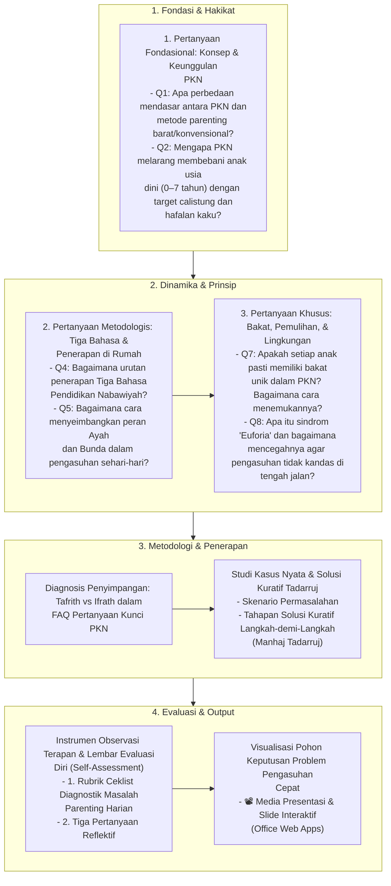

# Alur Materi: FAQ Ringkas

> [!info] Artikel Lengkap
> Berkas materi lengkap: [[content/Paradigma - Implementasi PKN/Dokumen Pendidikan Karakter Nabawiyah/FAQ Ringkas|FAQ Ringkas]]

```mermaid
flowchart TD
    subgraph S1["1. Fondasi & Hakikat"]
        N1_1["1. Pertanyaan Fondasional: Konsep & Keunggulan<br/>PKN<br/>- Q1: Apa perbedaan mendasar antara PKN dan<br/>metode parenting barat/konvensional?<br/>- Q2: Mengapa PKN melarang membebani anak usia<br/>dini (0–7 tahun) dengan target calistung dan<br/>hafalan kaku?"]
    end

    subgraph S2["2. Dinamika & Prinsip"]
        N2_1["2. Pertanyaan Metodologis: Tiga Bahasa &<br/>Penerapan di Rumah<br/>- Q4: Bagaimana urutan penerapan Tiga Bahasa<br/>Pendidikan Nabawiyah?<br/>- Q5: Bagaimana cara menyeimbangkan peran Ayah<br/>dan Bunda dalam pengasuhan sehari-hari?"]
        N2_2["3. Pertanyaan Khusus: Bakat, Pemulihan, &<br/>Lingkungan<br/>- Q7: Apakah setiap anak pasti memiliki bakat<br/>unik dalam PKN? Bagaimana cara menemukannya?<br/>- Q8: Apa itu sindrom 'Euforia' dan bagaimana<br/>mencegahnya agar pengasuhan tidak kandas di<br/>tengah jalan?"]
        N2_1 --> N2_2
    end

    subgraph S3["3. Metodologi & Penerapan"]
        N3_1["Diagnosis Penyimpangan: Tafrith vs Ifrath dalam<br/>FAQ Pertanyaan Kunci PKN"]
        N3_2["Studi Kasus Nyata & Solusi Kuratif Tadarruj<br/>- Skenario Permasalahan<br/>- Tahapan Solusi Kuratif Langkah-demi-Langkah<br/>(Manhaj Tadarruj)"]
        N3_1 --> N3_2
    end

    subgraph S4["4. Evaluasi & Output"]
        N4_1["Instrumen Observasi Terapan & Lembar Evaluasi<br/>Diri (Self-Assessment)<br/>- 1. Rubrik Ceklist Diagnostik Masalah<br/>Parenting Harian<br/>- 2. Tiga Pertanyaan Reflektif"]
        N4_2["Visualisasi Pohon Keputusan Problem Pengasuhan<br/>Cepat<br/>- 📽️ Media Presentasi & Slide Interaktif<br/>(Office Web Apps)"]
        N4_1 --> N4_2
    end

    S1 --> S2
    S2 --> S3
    S3 --> S4
```
