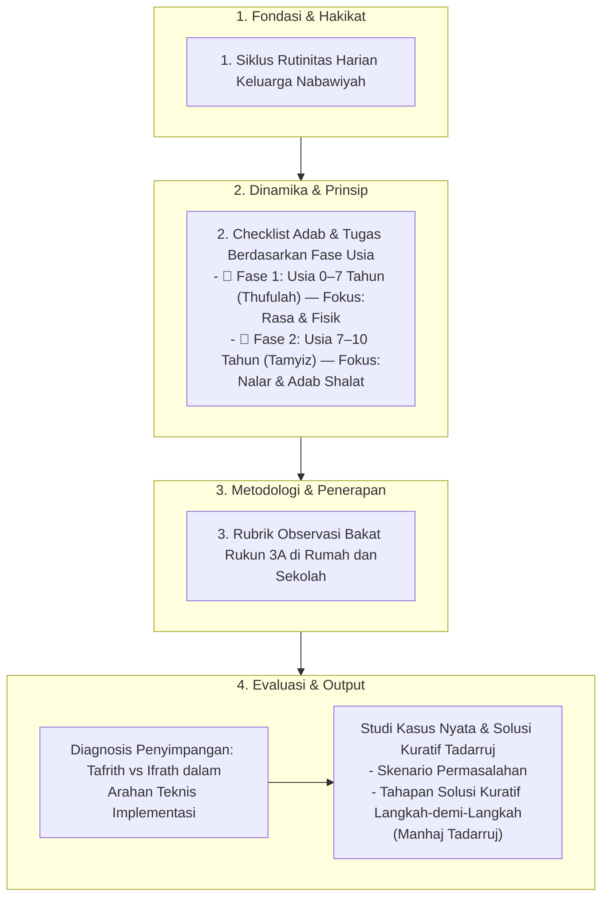

# Alur Materi: Arahan Teknis Implementasi

> [!info] Artikel Lengkap
> Berkas materi lengkap: [[content/Paradigma - Implementasi PKN/Dokumen Pendidikan Karakter Nabawiyah/Insight & Teknis/Arahan Teknis Implementasi|Arahan Teknis Implementasi]]

