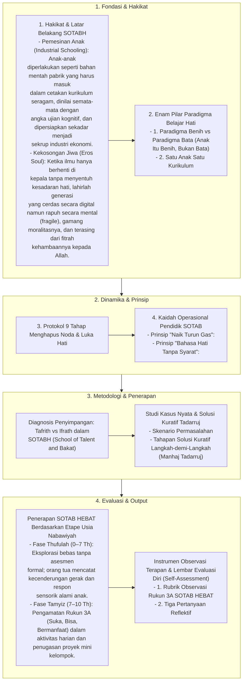

# Alur Materi: SOTABH

> [!info] Artikel Lengkap
> Berkas materi lengkap: [[content/Paradigma - Implementasi PKN/Dokumen Pendidikan Karakter Nabawiyah/Insight & Teknis/Insight/SOTABH|SOTABH]]

```mermaid
flowchart TD
    subgraph S1["1. Fondasi & Hakikat"]
        N1_1["1. Hakikat & Latar Belakang SOTABH<br/>- Pemesinan Anak (Industrial Schooling): Anak-anak<br/>diperlakukan seperti bahan mentah pabrik yang harus masuk<br/>dalam cetakan kurikulum seragam, dinilai semata-mata dengan<br/>angka ujian kognitif, dan dipersiapkan sekadar menjadi<br/>sekrup industri ekonomi.<br/>- Kekosongan Jiwa (Eros Soul): Ketika ilmu hanya berhenti di<br/>kepala tanpa menyentuh kesadaran hati, lahirlah generasi<br/>yang cerdas secara digital namun rapuh secara mental<br/>(fragile), gamang moralitasnya, dan terasing dari fitrah<br/>kehambaannya kepada Allah."]
        N1_2["2. Enam Pilar Paradigma Belajar Hati<br/>- 1. Paradigma Benih vs Paradigma Bata (Anak<br/>Itu Benih, Bukan Bata)<br/>- 2. Satu Anak Satu Kurikulum"]
        N1_1 --> N1_2
    end

    subgraph S2["2. Dinamika & Prinsip"]
        N2_1["3. Protokol 9 Tahap Menghapus Noda & Luka Hati"]
        N2_2["4. Kaidah Operasional Pendidik SOTAB<br/>- Prinsip &quot;Naik Turun Gas&quot;:<br/>- Prinsip &quot;Bahasa Hati Tanpa Syarat&quot;:"]
        N2_1 --> N2_2
    end

    subgraph S3["3. Metodologi & Penerapan"]
        N3_1["Diagnosis Penyimpangan: Tafrith vs Ifrath dalam<br/>SOTABH (School of Talent and Bakat)"]
        N3_2["Studi Kasus Nyata & Solusi Kuratif Tadarruj<br/>- Skenario Permasalahan<br/>- Tahapan Solusi Kuratif Langkah-demi-Langkah<br/>(Manhaj Tadarruj)"]
        N3_1 --> N3_2
    end

    subgraph S4["4. Evaluasi & Output"]
        N4_1["Penerapan SOTAB HEBAT Berdasarkan Etape Usia<br/>Nabawiyah<br/>- Fase Thufulah (0–7 Th): Eksplorasi bebas tanpa asesmen<br/>formal; orang tua mencatat kecenderungan gerak dan respon<br/>sensorik alami anak.<br/>- Fase Tamyiz (7–10 Th): Pengamatan Rukun 3A (Suka, Bisa,<br/>Bermanfaat) dalam aktivitas harian dan penugasan proyek mini<br/>kelompok."]
        N4_2["Instrumen Observasi Terapan & Lembar Evaluasi<br/>Diri (Self-Assessment)<br/>- 1. Rubrik Observasi Rukun 3A SOTAB HEBAT<br/>- 2. Tiga Pertanyaan Reflektif"]
        N4_1 --> N4_2
    end

    S1 --> S2
    S2 --> S3
    S3 --> S4
```
