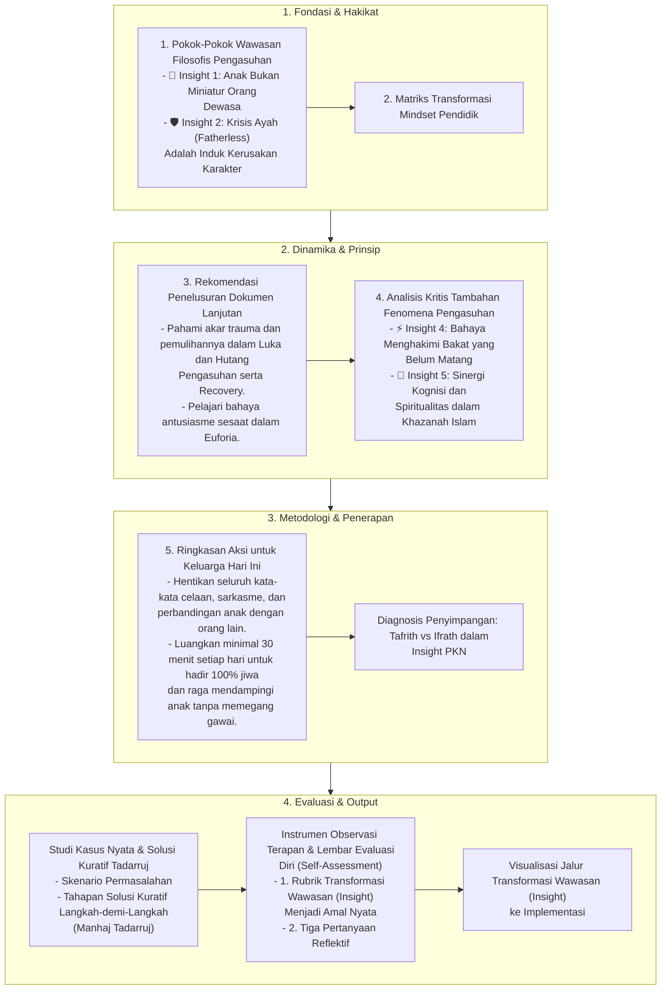

# Alur Materi: Insight Wawasan PKN

> [!info] Artikel Lengkap
> Berkas materi lengkap: [[content/Paradigma - Implementasi PKN/Dokumen Pendidikan Karakter Nabawiyah/Insight & Teknis/Insight/index|Insight Wawasan PKN]]

