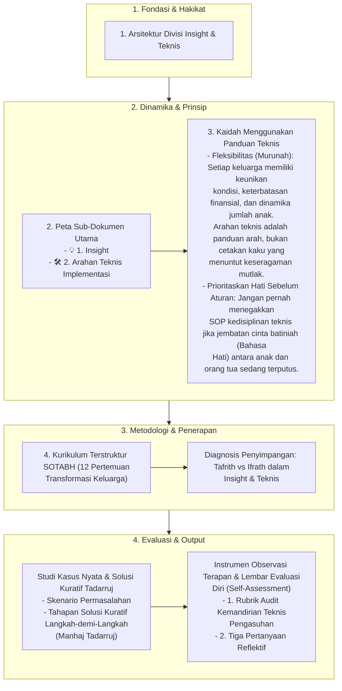

# Alur Materi: Insight & Teknis

> [!info] Artikel Lengkap
> Berkas materi lengkap: [[content/Paradigma - Implementasi PKN/Dokumen Pendidikan Karakter Nabawiyah/Insight & Teknis/index|Insight & Teknis]]

