# Alur Materi: Tawakkal dan Doa

> [!info] Artikel Lengkap
> Berkas materi lengkap: [[content/Paradigma - Implementasi PKN/Dokumen Pendidikan Karakter Nabawiyah/Paradigma & Implementasi/Implementasi/Internal & Eksternal/Tawakkal dan Doa|Tawakkal dan Doa]]

```mermaid
flowchart TD
    subgraph S1["1. Fondasi & Hakikat"]
        N1_1["1. Memahami Teologi Hidayah: Irsyad vs Taufiq<br/>- Hidayatul Irsyad wal Bayan: Tugas orang tua dan pendidik.<br/>Meliputi mengajarkan tauhid, mendialogkan adab, menyediakan<br/>lingkungan yang steril dari maksiat, dan mengasah bakat. Di<br/>wilayah inilah orang tua akan dihisab atas kesungguhan<br/>ikhtiarnya.<br/>- Hidayatut Taufiq wal Ilham: Wilayah Allah semata. Allah<br/>menegaskan kepada Nabi terbaik-Nya ﷺ:"]
        N1_2["2. Peta Doa-Doa Nabawiyah untuk Perlindungan Anak"]
        N1_1 --> N1_2
    end

    subgraph S2["2. Dinamika & Prinsip"]
        N2_1["3. Waktu-Waktu Emas Mustajab Mengetuk Pintu<br/>Langit<br/>- Sepertiga Malam Terakhir: Tatkala seisi rumah terlelap<br/>tidur, bangunlah mengambil wudhu, sebut nama masing-masing<br/>anak satu per satu di dalam sujud tahajjud.<br/>- Saat Bersujud dalam Shalat Wajib: Rasulullah ﷺ bersabda:<br/>“Keadaan terdekat seorang hamba dengan Tuhannya adalah<br/>tatkala ia bersujud, maka perbanyaklah doa padanya” (HR.<br/>Muslim)."]
        N2_2["4. Panduan Aplikatif bagi Ayah dan Bunda<br/>- Jaga Lisan dari Sumpah Serapah: Rasulullah ﷺ memperingatkan<br/>keras: “Janganlah kalian mendoakan keburukan bagi diri<br/>kalian, jangan mendoakan keburukan bagi anak-anak kalian,<br/>dan jangan mendoakan keburukan bagi harta-harta kalian;<br/>jangan sampai kalian bertepatan dengan saat pengabulan doa<br/>dari Allah lalu Dia mengabulkannya bagi kalian” (HR. Muslim<br/>No. 3009). Sekesal apa pun kepada anak, ganti kemarahan<br/>lisan dengan doa: &quot;Semoga Allah memberimu petunjuk dan<br/>menjadikkanmu ulama besar!&quot;<br/>- Doakan Anak Secara Terang-terangan di Depannya: Tatkala<br/>anak berangkat sekolah atau hendak tidur, peluk keningnya<br/>dan ucapkan doa dengan suara yang terdengar oleh telinganya:<br/>&quot;Ya Allah, berkahilah umur anak hamba ini, jadikan<br/>hatinya cinta kepada-Mu.&quot; Mendengar doa tulus orang<br/>tuanya akan melunakkan jiwa anak yang keras."]
        N2_1 --> N2_2
    end

    subgraph S3["3. Metodologi & Penerapan"]
        N3_1["Diagnosis Penyimpangan: Tafrith vs Ifrath dalam<br/>Tawakkal dan Doa"]
        N3_2["Studi Kasus Nyata & Solusi Kuratif Tadarruj<br/>- Skenario Permasalahan<br/>- Tahapan Solusi Kuratif Langkah-demi-Langkah<br/>(Manhaj Tadarruj)"]
        N3_1 --> N3_2
    end

    subgraph S4["4. Evaluasi & Output"]
        N4_1["Orientasi Doa dan Tawakkal Sesuai Etape<br/>Perkembangan Anak<br/>- Doa Etape Thufulah: Memohon perlindungan fitrah dari<br/>gangguan setan (U'idzukuma bi kalimaatillaahit taammah) dan<br/>kesehatan jasad.<br/>- Doa Etape Tamyiz: Memohon agar anak dicintai keimanan dan<br/>dihiasi keindahan shalat (Rabbij'alni muqiimash shalaati wa<br/>min dzurriyyati)."]
        N4_2["Instrumen Observasi Terapan & Lembar Evaluasi<br/>Diri (Self-Assessment)<br/>- 1. Rubrik Keseimbangan Ikhtiar dan Tawakkal<br/>Pengasuhan<br/>- 2. Tiga Pertanyaan Reflektif"]
        N4_1 --> N4_2
    end

    S1 --> S2
    S2 --> S3
    S3 --> S4
```

