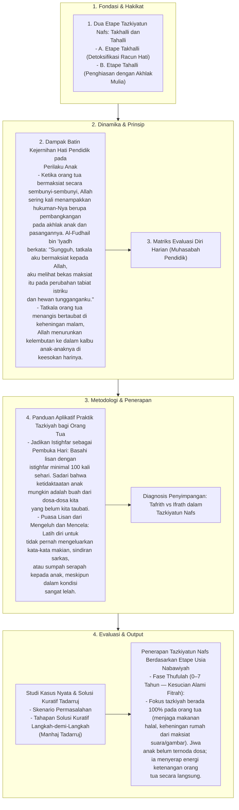

# Alur Materi: Tazkiyatun Nafs

> [!info] Artikel Lengkap
> Berkas materi lengkap: [[content/Paradigma - Implementasi PKN/Dokumen Pendidikan Karakter Nabawiyah/Paradigma & Implementasi/Implementasi/Internal & Eksternal/Tazkiyatun Nafs|Tazkiyatun Nafs]]

