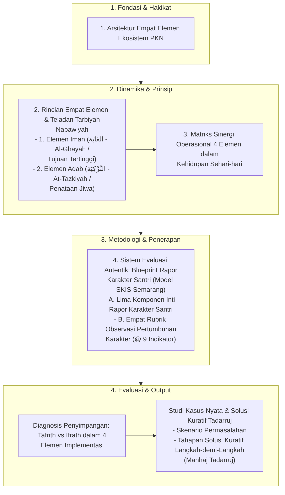

# Alur Materi: 4 Elemen Implementasi

> [!info] Artikel Lengkap
> Berkas materi lengkap: [[content/Paradigma - Implementasi PKN/Dokumen Pendidikan Karakter Nabawiyah/Paradigma & Implementasi/Implementasi/Kaidah & Elemen/4 Elemen Implementasi|4 Elemen Implementasi]]

