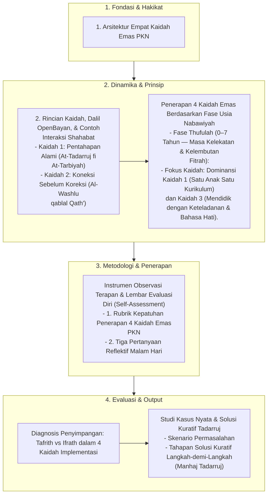

# Alur Materi: 4 Kaidah Implementasi

> [!info] Artikel Lengkap
> Berkas materi lengkap: [[content/Paradigma - Implementasi PKN/Dokumen Pendidikan Karakter Nabawiyah/Paradigma & Implementasi/Implementasi/Kaidah & Elemen/4 Kaidah Implementasi|4 Kaidah Implementasi]]

