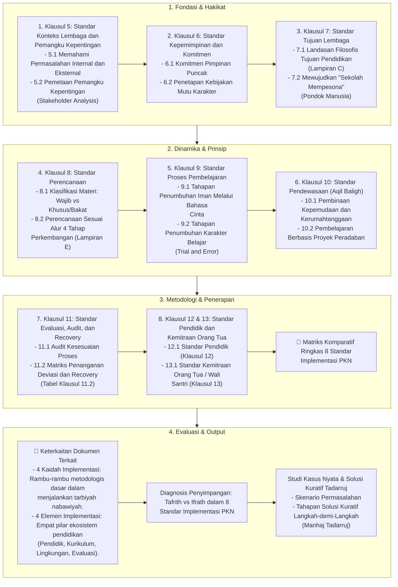

# Alur Materi: 8 Standar Implementasi Pendidikan Karakter Nabawiyah

> [!info] Artikel Lengkap
> Berkas materi lengkap: [[content/Paradigma - Implementasi PKN/Dokumen Pendidikan Karakter Nabawiyah/Paradigma & Implementasi/Implementasi/Kaidah & Elemen/8 Standar Implementasi PKN|8 Standar Implementasi Pendidikan Karakter Nabawiyah]]

