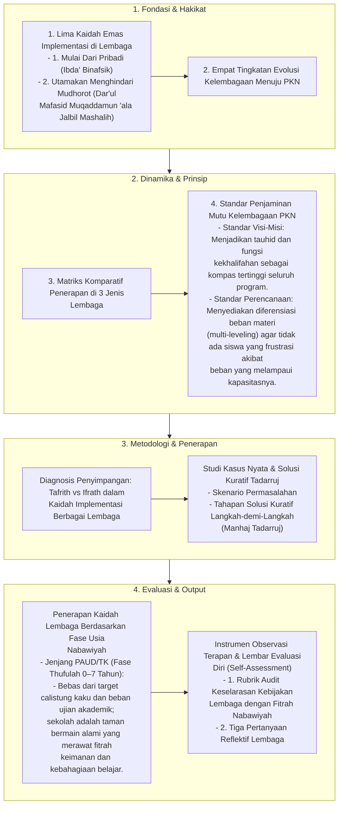

# Alur Materi: Kaidah Implementasi PKN dalam Berbagai Lembaga

> [!info] Artikel Lengkap
> Berkas materi lengkap: [[content/Paradigma - Implementasi PKN/Dokumen Pendidikan Karakter Nabawiyah/Paradigma & Implementasi/Implementasi/Kaidah & Elemen/Kaidah Implementasi di Berbagai Lembaga|Kaidah Implementasi PKN dalam Berbagai Lembaga]]

