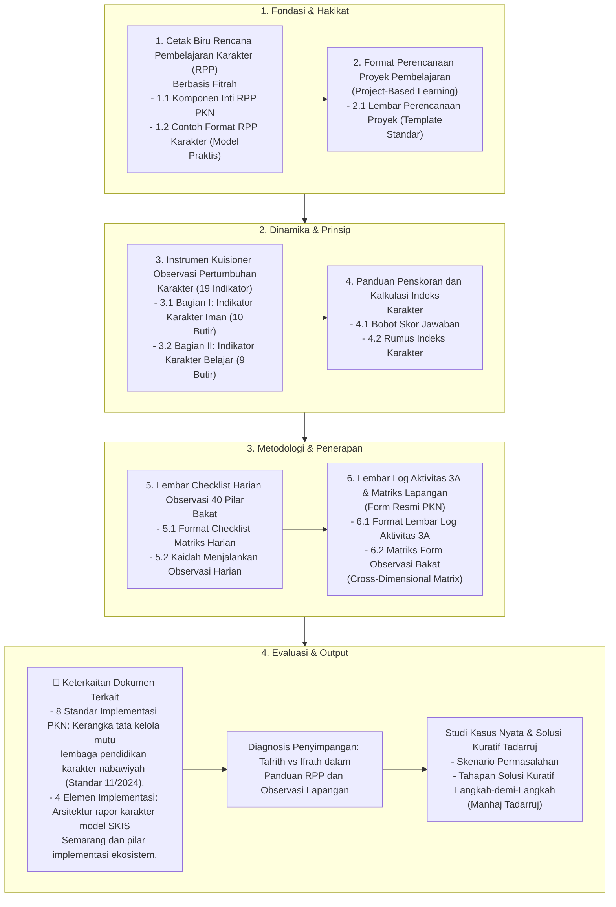

# Alur Materi: Panduan RPP dan Observasi Lapangan Karakter Nabawiyah

> [!info] Artikel Lengkap
> Berkas materi lengkap: [[content/Paradigma - Implementasi PKN/Dokumen Pendidikan Karakter Nabawiyah/Paradigma & Implementasi/Implementasi/Kaidah & Elemen/Panduan RPP dan Observasi Lapangan|Panduan RPP dan Observasi Lapangan Karakter Nabawiyah]]

