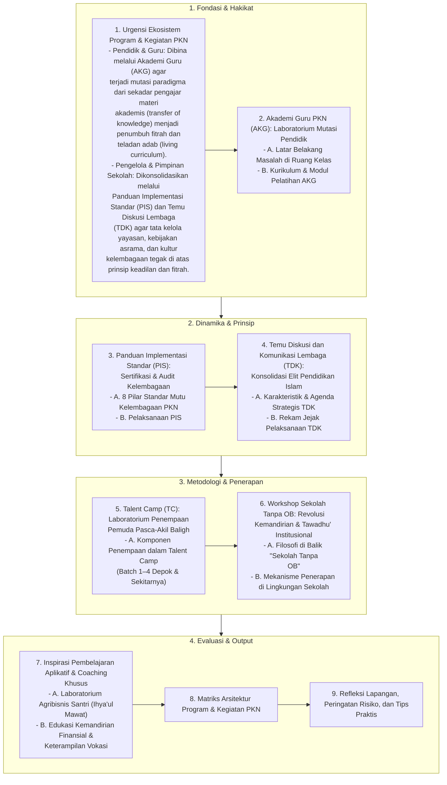

# Alur Materi: Program dan Kegiatan Pendidikan Karakter Nabawiyah

> [!info] Artikel Lengkap
> Berkas materi lengkap: [[content/Paradigma - Implementasi PKN/Dokumen Pendidikan Karakter Nabawiyah/Paradigma & Implementasi/Implementasi/Kaidah & Elemen/Program dan Kegiatan Pendidikan Karakter Nabawiyah|Program dan Kegiatan Pendidikan Karakter Nabawiyah]]

