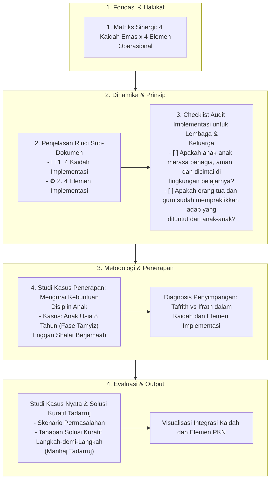

# Alur Materi: Kaidah & Elemen Implementasi

> [!info] Artikel Lengkap
> Berkas materi lengkap: [[content/Paradigma - Implementasi PKN/Dokumen Pendidikan Karakter Nabawiyah/Paradigma & Implementasi/Implementasi/Kaidah & Elemen/index|Kaidah & Elemen Implementasi]]

