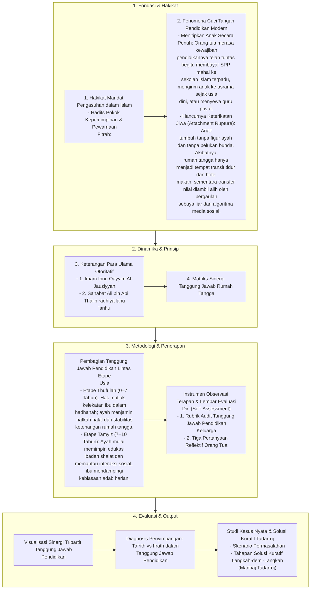

# Alur Materi: Tanggung Jawab Pendidikan

> [!info] Artikel Lengkap
> Berkas materi lengkap: [[content/Paradigma - Implementasi PKN/Dokumen Pendidikan Karakter Nabawiyah/Paradigma & Implementasi/Implementasi/Peran & Tanggung Jawab/Tanggung Jawab Pendidikan|Tanggung Jawab Pendidikan]]

