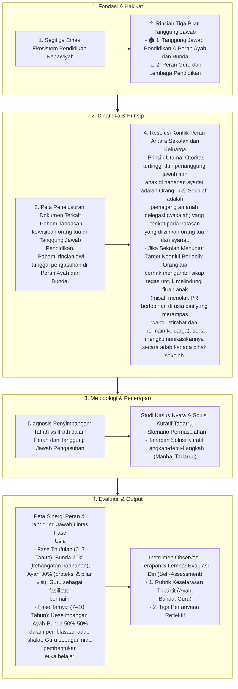

# Alur Materi: Peran & Tanggung Jawab

> [!info] Artikel Lengkap
> Berkas materi lengkap: [[content/Paradigma - Implementasi PKN/Dokumen Pendidikan Karakter Nabawiyah/Paradigma & Implementasi/Implementasi/Peran & Tanggung Jawab/index|Peran & Tanggung Jawab]]

