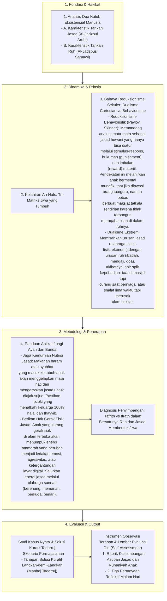

# Alur Materi: Bersatunya Ruh dan Jasad Membentuk Jiwa

> [!info] Artikel Lengkap
> Berkas materi lengkap: [[content/Paradigma - Implementasi PKN/Dokumen Pendidikan Karakter Nabawiyah/Paradigma & Implementasi/Insan/Bersatunya Ruh dan Jasad Membentuk Jiwa|Bersatunya Ruh dan Jasad Membentuk Jiwa]]

