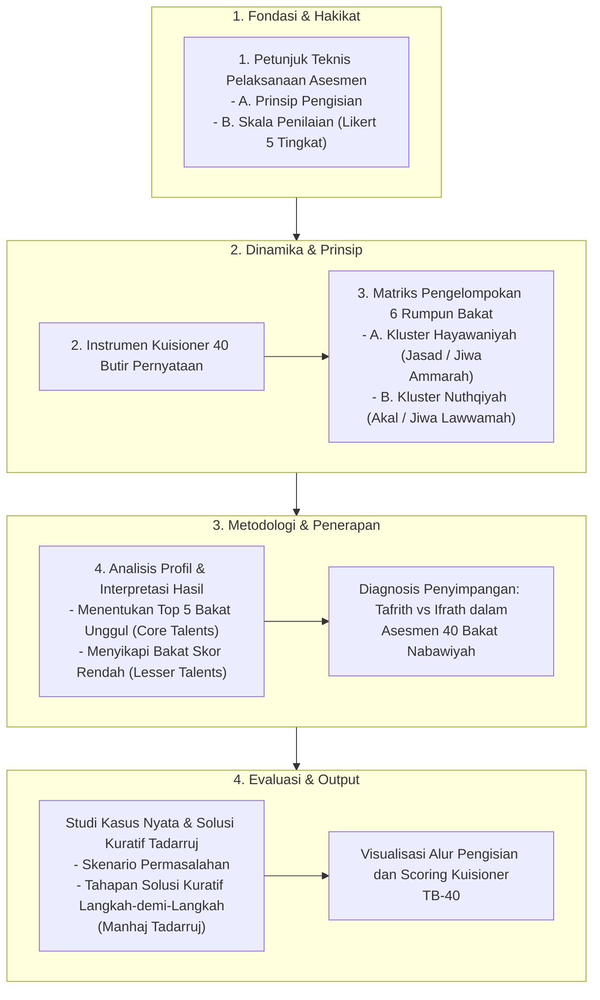

# Alur Materi: Kuisioner Asesmen 40 Bakat Nabawiyah

> [!info] Artikel Lengkap
> Berkas materi lengkap: [[content/Paradigma - Implementasi PKN/Dokumen Pendidikan Karakter Nabawiyah/Paradigma & Implementasi/Insan/Fitrah (Karakter)/Bakat/Kuisioner Asesmen 40 Bakat Nabawiyah|Kuisioner Asesmen 40 Bakat Nabawiyah]]

