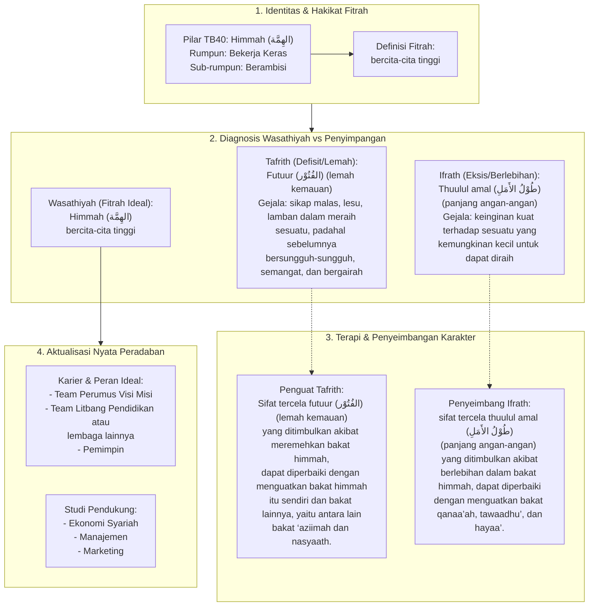

# Alur Materi: Himmah (الهِمَّة) - Bercita-Cita Tinggi

> [!info] Artikel Lengkap
> Berkas materi lengkap: [[content/Paradigma - Implementasi PKN/Dokumen Pendidikan Karakter Nabawiyah/Paradigma & Implementasi/Insan/Fitrah (Karakter)/Bakat/TB40/01-himmah|Himmah (الهِمَّة) - Bercita-Cita Tinggi]]

