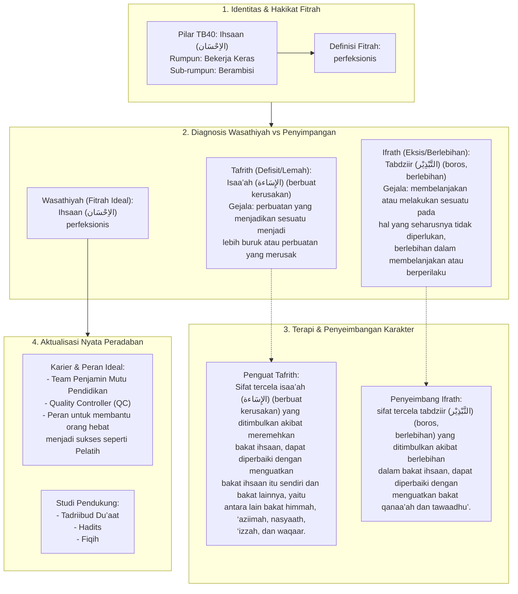

# Alur Materi: Ihsaan (الاِحْسَان) - Perfeksionis

> [!info] Artikel Lengkap
> Berkas materi lengkap: [[content/Paradigma - Implementasi PKN/Dokumen Pendidikan Karakter Nabawiyah/Paradigma & Implementasi/Insan/Fitrah (Karakter)/Bakat/TB40/02-ihsaan|Ihsaan (الاِحْسَان) - Perfeksionis]]

