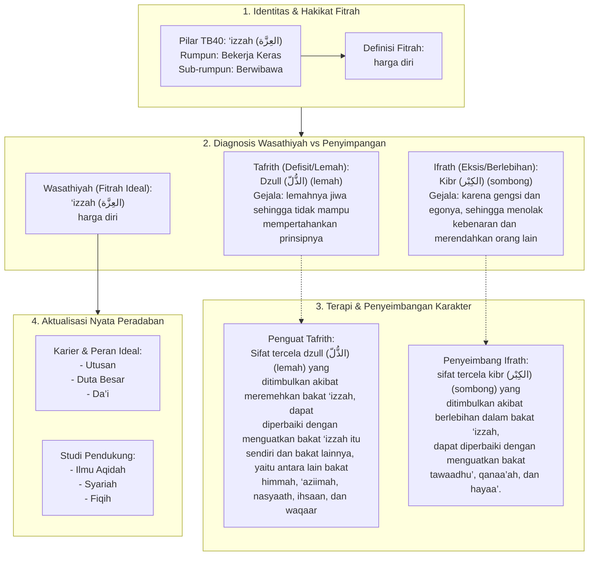

# Alur Materi: ‘Izzah (العِزَّة) - Harga Diri

> [!info] Artikel Lengkap
> Berkas materi lengkap: [[content/Paradigma - Implementasi PKN/Dokumen Pendidikan Karakter Nabawiyah/Paradigma & Implementasi/Insan/Fitrah (Karakter)/Bakat/TB40/03-izzah|‘Izzah (العِزَّة) - Harga Diri]]

