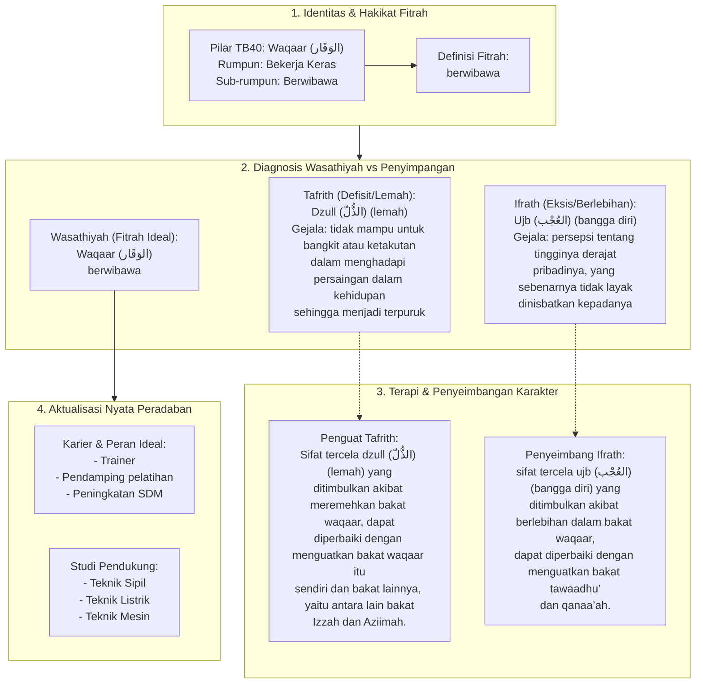

# Alur Materi: Waqaar (الوَقَار) - Berwibawa

> [!info] Artikel Lengkap
> Berkas materi lengkap: [[content/Paradigma - Implementasi PKN/Dokumen Pendidikan Karakter Nabawiyah/Paradigma & Implementasi/Insan/Fitrah (Karakter)/Bakat/TB40/04-waqaar|Waqaar (الوَقَار) - Berwibawa]]

